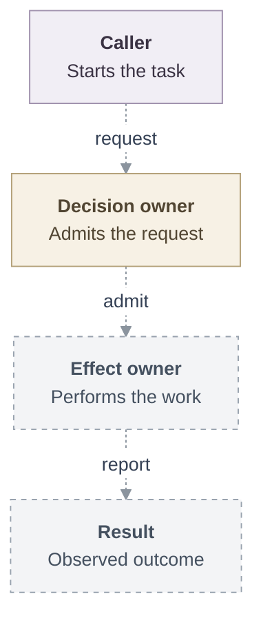
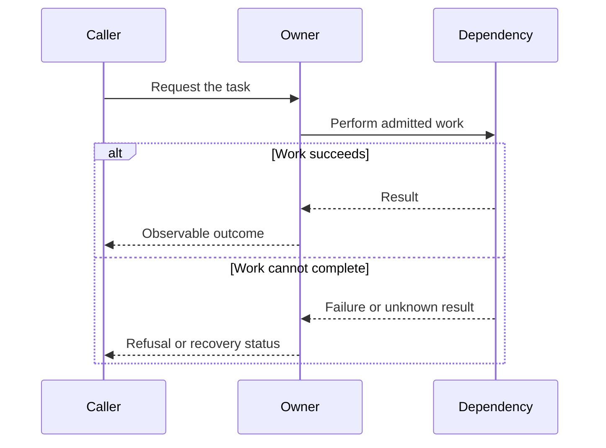

# RFC template

Start `specs/rfcs/<number>-<topic>.md` with the YAML frontmatter below, without
the code fences, followed by the proposal scaffold. Replace the prompts with
the actual decision. Allocate the number using the
[specification process](specifications.md#files-and-numbering).
If the RFC needs companion files, use `<number>-<topic>/index.md` instead.
Replace `github-login` with the original RFC PR author's GitHub login (without `@`).
The author is required and is treated as the RFC owner. The index uses this
frontmatter value; do not repeat it in the body or add a separate owner field.
Describe team responsibilities in the proposal where relevant.
Adapt the headings to the change and remove sections that do not apply. See the
[RFC process](rfcs.md) for review, length, and diagram guidance.

Adapted from the [OpenClaw RFC template](https://github.com/openclaw/rfcs/blob/main/rfcs/0000-template.md).
Use OCE's numbering, decision statuses, and separate implementation plans as
defined in the specification process.

---

```yaml
---
status: Proposed
implementation_status: Not implemented
author: github-login
---
```

# Proposal: [Decision or capability]

- **ID:** RFC-[number]
- **Created:** [YYYY-MM-DD]
- **Last updated:** [YYYY-MM-DD]
- **RFC PR:** [Review URL when available]
- **Implementation plan:** [Relative link when a separate plan exists]
- **Related:** [Relevant issue, implementation PR, and existing contracts]

<a id="problem-and-decision"></a>

## Summary

[Explain the proposed decision and the result a caller can observe in one
paragraph.]

## Motivation

[Who needs to do what? Describe the current behavior, the gap, and the proposed
change's value. Link evidence from current source or contracts.]

<a id="scope"></a>

## Goals

[List the outcomes this proposal must achieve and how a reviewer can recognize
success. Identify material dependencies and assumptions.]

## Non-goals

[Name adjacent work intentionally excluded from this decision. Omit this
section if there are no meaningful scope boundaries to clarify.]

<a id="design"></a>

## Proposal

[Name the owners of decisions, state, effects, and cleanup. Describe the actual
entry point, the changed interfaces, what is reused, and the request through its
result. State relevant permissions, defaults, trust boundaries, failure behavior,
and recovery where they constrain an operation. Link existing contracts.]

### Architecture

The diagram below is an illustrative shape, not a platform architecture. Replace
every node and edge with the actual design. Dashed arrows represent proposed or
unconnected paths; use solid arrows only for implemented connections.



### Request lifecycle

Replace this illustrative sequence with the actual owners, request, result, and
material failure or recovery. Sequence arrows show request and reply direction;
state whether the illustrated flow is implemented or proposed in the caption.



## Delivery and verification

[For a bigger feature, link its implementation plan and keep only delivery
boundaries and required outcomes here. Put detailed steps, progress, and results
in the plan. A small change may keep delivery here with a separate delivery
status. Planning or implementing the RFC does not change its decision status.]

1. [Describe a small step and its real prerequisite.]
2. [Connect the capability to its supported caller.]
3. [Name any remaining selected work and qualification.]

[Pair each required outcome with evidence for success and consequential denial,
failure, or recovery. State what has run and what remains unverified.]

<a id="alternatives-and-open-decisions"></a>

## Rationale and alternatives

[Explain why this approach is preferred. Compare meaningful alternatives,
including retaining current behavior when relevant, and their tradeoffs.]

## Unresolved questions

[For each open decision, name the deciding owner, consequence, and any invariant
that remains binding. Omit this section when no material questions remain.]

## References

[Link current behavior, contracts, related proposals, and implementation.]
