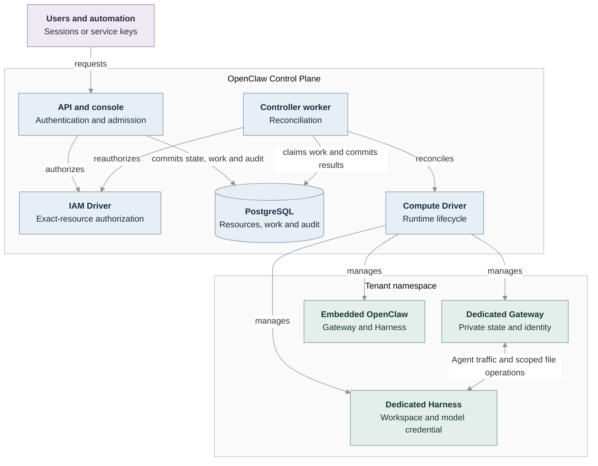

# OpenClaw Enterprise architecture

OpenClaw Enterprise (OCE) provides a multi-tenant control plane for configuring,
deploying, and operating Agents. OpenClaw Control Plane (OCC) owns desired state,
authorization, and resource lifecycles. Installation-selected Drivers turn that
state into infrastructure and runtime operations.

## Implementation status

This is the authoritative architecture overview. It describes the implemented
system and identifies [remaining design work](#remaining-design-work) separately.
The [design chapters](#design-chapters) retain approved requirements; each chapter
states where those requirements exceed current support. Feature references own
supported behavior and limits. Source implementation is not proof that a
particular deployment enforces its networking, storage, or placement requirements.

The API, console, durable worker, PostgreSQL persistence, and Kubernetes packaging
are implemented. Single-cluster Kubernetes execution places Gateway and Harness in one tenant
namespace with separate Pods, identities and storage. External access-gateway admission, workload
token authentication to OCC, and general credential-free model inference remain
planned. The two-cluster profile is experimental. Human Gateway entry now uses exact OCE person/Agent assignments and native role enforcement through the Kubernetes Driver and patched runtime; broader checkpoint 3 permission mediation remains planned. See [Agent OpenClaw access](reference/agent-native-admin.md).

## System model

Each deployment owns exactly one server-selected Installation containing isolated
Namespaces. A Namespace is a logical tenant boundary; it can span more than one
physical Kubernetes namespace. Each deployed Agent owns its gateway and revision
history. OCC manages multiple single-Agent runtimes rather than making one
OpenClaw gateway multi-tenant.

OCC owns platform resources and immutable deployment snapshots. External systems
retain ownership of infrastructure, provider accounts, credentials, and model
sources. Drivers operate those systems through bounded contracts; they cannot
grant themselves authorization or change platform-resource ownership.

The platform does not support multiple Installations in one deployment or
cross-Namespace resource references. An Agent inheriting its creator's identity
is not yet supported. Gateways and workloads are runtime components, not an extra execution
resource between an Agent and its deployment. Detailed APIs, storage schemas,
and integration protocols belong to their feature references.

## System overview

The API serves the console and authorized resource operations. An independent
worker claims durable work and invokes selected Drivers. PostgreSQL stores
platform state, IAM policy, controller work, and audit evidence.

The diagram shows implemented single-cluster Kubernetes relationships. Each Agent chooses
embedded or dedicated execution. Optional and experimental integrations are
described below rather than implied by the diagram.

## Platform resources

Namespaces contain Configurations, ServiceAccounts, Secrets, CredentialSources,
Presets, and Agents. Each Agent owns immutable AgentRevisions. References must
stay within their admitted scope. Optional Agent-owned plugin selections are
snapshotted in revisions and resolved by the selected PluginDriver at startup.

[Concepts](guides/concepts.md) explains these resources.
[Resources and tenant boundaries](design/resources.md) records their design
requirements, including planned resources that are not public API capabilities.
[Topics](guides/topics/README.md) links to current feature contracts.

## Control plane

The API authenticates human sessions and non-Agent service keys, resolves an
explicitly provisioned identity, and authorizes exact resource operations.
The console at `/console/` uses these same APIs. GitHub and Google sign-in require
administrator-enrolled identities; neither sign-in nor Namespace membership
grants permissions. See [authentication](reference/authentication.md) and
[authorization](reference/authorization.md).

Resource mutations, queued work, and audit records commit together. The worker
reauthorizes the original actor and protected references before infrastructure
effects, and commits results under its live work claim.
[Platform repositories](reference/platform-repositories.md) defines transaction
ownership and read-only views; the [worker flow](flows/controller-worker.md)
traces dispatch and persistence.

Compose and Helm initialize the Installation after database migration and before
starting the API and worker. Only the initializer mounts bootstrap credential
output. See [startup](flows/platform-startup.md) and
[bootstrap recovery](guides/deploy/service-keys.md#recover-an-incomplete-bootstrap).

| Component            | Responsibility                                                |
| -------------------- | ------------------------------------------------------------- |
| `apps/controller`    | API, console, admission, composition, and worker entrypoints. |
| `packages/contracts` | Resource models, Driver interfaces, and API schemas.          |
| `packages/occ`       | Resource ownership, lifecycle, persistence, and work queue.   |
| `packages/iam`       | Identity lookup and authorization.                            |
| `packages/audit`     | Audit events and sensitive-value sanitization.                |

[Repository layout](layout.md) owns directory placement and package boundaries.

## Drivers

Installation configuration selects compute, configuration, IAM, and Secret
implementations, plus channel and optional service-account, plugin, repository, Sandbox, and
Credential Gateway integrations. [Driver development](contributing/driver-development.md)
links to contracts; [selection](reference/drivers/selection.md) defines trusted
package loading. [Backends](reference/backends.md) supply authenticated clients
to related Drivers within their documented experimental scope.

Compute owns Namespace infrastructure and each Agent's gateway and workload
lifecycle: preparation, readiness, activation, stop, retirement, and deletion.
An optional SandboxDriver participates through Compute and can provision a
dedicated Harness. Its revision and Namespace cleanup must complete before
Compute releases the corresponding infrastructure.

A CredentialGatewayDriver holds registered model credentials and supplies
revision attachments to its paired Sandbox; activation waits for applied
attachments. The OpenShell development profile implements a plugin-free
dedicated Codex path through experimental provider files and bearer passthrough.
Real activation remains conditional on the documented identity, storage,
admission, and gateway-authentication preconditions. See
[Sandbox](reference/drivers/sandbox.md) and
[OpenShell limits](reference/drivers/openshell-sandbox.md).
Other Drivers participate through bounded
[Compute lifecycle hooks](flows/compute-driver-lifecycle-hooks.md).

## Agent execution

Embedded OpenClaw runs its gateway and Harness together in the data plane.
Dedicated Kubernetes execution uses separate Gateway and Harness Pods, identities
and storage within one tenant namespace in a single cluster. The Gateway uses scoped remote file operations rather than
mounting the Harness workspace. Only the model-executing consumer receives its
model credential; a dedicated Gateway does not.

Operators must configure disjoint trusted Gateway and untrusted Harness node
pools. Sharing a namespace trusts its workload managers with both roles; credential
mounts and NetworkPolicies do not restrict a namespace administrator. The default
placement uses one Kubernetes cluster; a second execution cluster is an
[experimental profile](testing/two-cluster-local.md), with incomplete runtime
acceptance. See [Harness execution](reference/harness-execution.md) and
[Kubernetes Compute](reference/drivers/kubernetes-compute.md).

### Agent provisioning sequence

Creating an Agent records a definition. Deploying it admits an immutable
AgentRevision for asynchronous provisioning. The successful path is:

1. Authorize and create the Namespace; queue its infrastructure work.
2. The worker reauthorizes the caller, ensures backing infrastructure through
   Compute, and records readiness.
3. Authorize deployment and each protected reference; snapshot admitted inputs
   in a revision and queue its work.
4. The worker reauthorizes, prepares the exact Agent runtime, and checks readiness.
5. Activate through the Driver's commit ordering, record the active revision
   under the live work claim, and retire the predecessor.

Editing a draft does not change the running revision. Admission does not prove
runtime readiness. Replacement may interrupt service; embedded replacement can
stop the predecessor before replacement credentials are validated. See
[authentication during replacement](reference/harness-execution.md#harness-authentication),
[reconciliation](reference/controller/reconciliation.md), and the
[detailed sequence](design/workloads.md#current-provisioning-sequence).

## Security boundaries

IAM checks exact resources and protected references. Agent-scoped identities,
Namespace isolation, and explicit Secret bindings constrain access. Secret
values stay out of OCC resource responses, revisions, and audit records.
Required authorization or audit failures block mutations.

Kubernetes uses restricted Pod security, scoped ServiceAccounts, and
NetworkPolicies. Controller credentials remain trusted within their granted
tenant namespaces: workload-write authority can expose Secrets indirectly.
Model credentials currently reach the executing Harness, and same-cluster
Codex transport uses capability-token `ws://`, not mutually authenticated TLS.
[Security](reference/security.md) and
[runtime isolation](reference/security/runtime-isolation.md) own these limits.

### Native admin pilot exception

Trusted human operators with exact-Agent `administer` permission can enter the
[stock OpenClaw admin UI](reference/agent-native-admin.md) through an opt-in pilot.
OCC checks admission and session retention, but does not authorize or audit each
native command. Operators share the selected gateway's exposed conversations
and credentials; this grants no access to another Agent or platform IAM.

Configuration and immutable AgentRevision records remain authoritative for
managed deployments. Native edits may diverge; OCC neither imports them nor
promises to reset persistent gateway state on redeployment.

## Deployment modes

- **Local Kubernetes:** API, worker, PostgreSQL, and Agent workloads run in an
  owned k3d cluster hosted by Docker or Podman. Start with [Local Setup](guides/quickstart.md).
- **Production Kubernetes:** separate API and worker services manage tenant
  infrastructure and runtimes. Follow [Deploy](guides/deploy.md) for internal
  service exposure, authenticated ingress, and operator prerequisites.
- **Docker or Podman preview:** Compose runs the control plane on loopback.
  [Docker Compute](reference/drivers/docker-compute.md) cannot provide the Harness
  authentication required to deploy Agents through OCC.
- **SSH execution:** embedded OpenClaw runs on preprovisioned Linux hosts.
  Host networking and runtime credentials remain the operator's responsibility;
  see [SSH Compute](reference/drivers/ssh-compute.md).

## Remaining design work

These approved requirements are not established by the implemented architecture:

| Area                         | Current boundary and remaining work                                                                                                                                                                                                                                                                   |
| ---------------------------- | ----------------------------------------------------------------------------------------------------------------------------------------------------------------------------------------------------------------------------------------------------------------------------------------------------- |
| External admission           | Sessions and service keys authenticate to OCC. The separate OpenClaw Access Gateway (OAG) and trusted-ingress admission protocol remain planned. See [access design](design/access.md).                                                                                                               |
| Workload identity            | Agents own ServicePrincipals and may receive projected Kubernetes tokens. OCC token verification, identity exchange, and workload API authentication remain deferred. See [authorization](reference/authorization.md#principals).                                                                     |
| Model mediation              | Harnesses receive scoped model credentials. General `InferenceDriver` mediation, restricted model egress, and credential-free execution remain planned; OpenShell credential substitution is not a supported deployment substitute. See [runtime isolation](reference/security/runtime-isolation.md). |
| Runtime trust                | Separate placement is implemented; general mutually authenticated, workload-bound transport and complete two-cluster runtime acceptance remain pending. See [Kubernetes Compute](reference/drivers/kubernetes-compute.md).                                                                            |
| Resource and policy coverage | The design's `SandboxPolicy`, published Harness and Channel resource model, and Restrictions across every integration exceed the current API and Driver contracts. See [resource requirements](design/resources.md) and [Sandbox contract](reference/drivers/sandbox.md).                             |

Agent and Plugin Directories, plugin invocation approval workflows, broader audit
export and retention, Budgets, and Routers remain future work. Existing logging
and metrics integrations have their own [operational contracts](guides/observability.md).

## Design chapters

These chapters preserve the approved ownership and security requirements, with
explicit implementation limits. They do not turn planned contracts into
supported capabilities:

- [Resources and tenant boundaries](design/resources.md)
- [Access and authorization](design/access.md)
- [Agent gateways and deployment](design/workloads.md)
- [Drivers and Backends](design/drivers.md)
- [Platform safeguards](design/safeguards.md)

## Related documentation

- [Documentation map](README.md)
- [Feature topics](guides/topics/README.md)
- [Runtime flows](contributing/runtime-flows.md)
- [Testing](testing/README.md)
