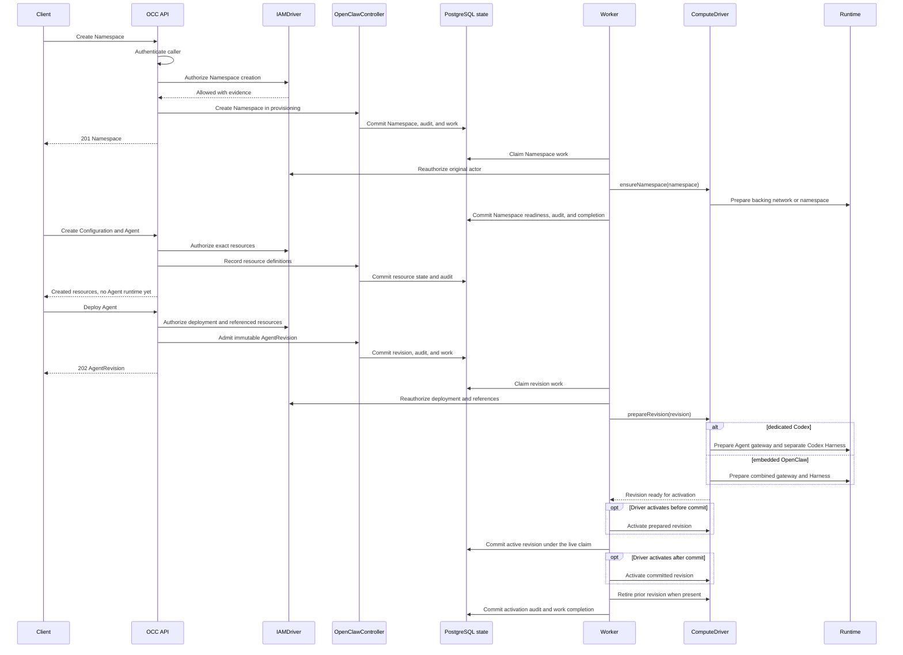

# Agent gateways and deployment

This chapter defines requirements within the authoritative
[platform architecture](../design.md). The implementation status below separates
current behavior from remaining design work.

## Implementation status

Kubernetes implements separate dedicated Gateway and Harness namespaces,
identities, and storage; its two-cluster execution profile remains experimental.
The deployment requirements below include planned OAG admission, full
SandboxPolicy enforcement, and workload-bound transport identity. They do not
establish uninterrupted replacement: embedded replacement can stop the
predecessor before validating the replacement credential. See
[Harness execution](../reference/harness-execution.md),
[Kubernetes Compute](../reference/drivers/kubernetes-compute.md), and the
[current provisioning sequence](#current-provisioning-sequence).

## OpenClaw gateways

OCC manages exactly one OpenClaw gateway for each deployed Agent. A Namespace
may contain multiple gateways, each belonging to a different Agent. Every
gateway is an Agent-owned, Namespace-isolated runtime component that routes
only its owner's Channel traffic and runtime requests. It is distinct from the
Ingress Gateway, OAG, and OpenShell gateway.

OCC establishes an Agent's gateway through the selected `ComputeDriver`'s
revision-scoped `prepareRevision` operation in the runtime targets for the
selected execution topology. Namespace and Agent ownership remain exact even
when gateway and Harness have different physical locations.
The admitted Agent configuration configures both the gateway and workload and
exists before the gateway starts. Gateway ownership remains stable
across that Agent's revisions; deploying or deleting one Agent cannot recreate,
delete, reconfigure, or route through another Agent's gateway. Agent deletion
removes only its gateway and revision-owned Harness resources across their
targets. Namespace deletion uses `deleteNamespace` to remove remaining
Namespace-owned infrastructure after the Namespace is empty; it does not remove
shared control-plane infrastructure or another tenant's resources.

OCC prepares a nonserving route for the candidate Agent workload and enables
it only after the candidate's revision is the sole active revision and its
Harness is ready. Gateway routing binds the exact Namespace, Agent, and active
revision, including when a route crosses runtime targets.
A gateway, configuration, or route failure leaves the previously active
revision and its credentials inaccessible to any other revision; failed
replacement requires exact-owner rollback or fail-closed traffic denial.

The gateway is not a platform primitive, authorization authority, or additional
OCC `WorkloadIdentity`. OCC owns the Namespace, Agent, gateway lifecycle, route
bindings, active AgentRevision, and activation decisions; `ComputeDriver`
realizes the admitted gateway infrastructure. The gateway accepts only its
owner's authorized Channels and workload. It cannot admit a tenant, authorize a
platform operation, grant a Permission, or substitute one Agent's identity for
another.

Each Agent explicitly selects one Harness execution topology:

- `embedded`: one Agent-owned OpenClaw gateway process also runs the built-in
  Harness in the selected tenant data-plane runtime target. The combined
  workload remains untrusted tenant execution and cannot be relocated
  independently. It necessarily shares the exact
  Agent's ServiceAccount and projected `WorkloadIdentity`; there is no separate
  Harness process. The current direct-credential exception also delivers the
  Agent-specific model credential to that combined workload.
- `dedicated`: the Agent-owned gateway belongs to the OCC control-plane runtime
  target and connects to its revision-scoped Harness in the selected tenant
  data-plane runtime target. Dedicated Codex uses a separate workload. Gateway
  and Harness use separate Kubernetes ServiceAccounts and network access;
  only Codex receives the exact Agent's projected identity. The current
  direct-credential exception also delivers either its bound Secret-backed model
  API key or its bound account-owned access token to Codex.
  The gateway never assumes that identity or receives the model credential.

The [model-credential boundary](safeguards.md#secret-access) distinguishes these
current delivery exceptions from target mediation outside Harness execution.

The default runtime targets use one Kubernetes cluster, with distinct namespace
placements for dedicated gateway and Harness. The experimental `executionCluster`
profile selects a second cluster for Harness resources; complete runtime
acceptance remains pending. See [Kubernetes Compute](../reference/drivers/kubernetes-compute.md).
Other Compute-backed locations remain design scope. The same-cluster split uses a managed Gateway runtime namespace per logical Namespace,
separate from its Harness namespace and from OCC's own API/worker namespace.
This per-tenant namespace allocation is a Kubernetes isolation choice, not a
required mapping for every Compute implementation. It preserves namespace-scoped
RBAC, quotas and tenant cleanup boundaries. Control-plane Gateway placement and
its acceptance scope cover dedicated execution only; embedded OpenClaw is excluded.
An explicit Gateway node selector places dedicated Gateways on the operator's
trusted node pool; Harnesses retain their data-plane selector. Operators must
keep those pools disjoint. Namespace separation alone does not provide node
isolation. [Current Harness execution](../reference/harness-execution.md)
describes supported runtimes. One selected `ComputeDriver` owns preparation,
activation, stop, retirement, and deletion in both targets under the
[Driver ownership contract](drivers.md#computedriver).

The selected Harness comes from the Agent's native provider/model configuration;
OCC snapshots its server-approved identity, version, and explicit execution
mode in each immutable revision. A native model catalog may offer multiple
models when every selectable entry explicitly resolves to the same approved
Harness and provider. The provider name alone does not determine the Harness:
an `openai/*` model explicitly routed through an enabled Codex websocket plugin
uses dedicated Codex execution. Sharing a runtime target or Kubernetes namespace
never grants another Agent access to gateway credentials, Channel credentials,
workload identity, provider configuration, or runtime traffic.

Gateway/Harness connectivity and file/config exchange must not depend on
same-namespace DNS, a shared PVC, or shared Kubernetes Secret references.
Realization must preserve the exact owner and admitted revision across target
boundaries. The [runtime trust boundary](access.md#runtime-trust-across-targets)
applies even when both targets share a cluster. Detailed file ownership and
transfer mechanisms remain outside this placement design.

Canonical configuration, policy and credentials belong to trusted control-plane
storage. Dedicated Gateways consume admitted channel credentials and their own
password there. Compute delivers only revision-scoped execution material to the
data plane: selected model authorization, app-server transport, node enrollment
and execution configuration. Harnesses cannot write canonical CP sources, routes
or active-revision state. Current raw model-token delivery and bearer app-server
transport remain explicit limitations, not brokered or mutually authenticated
workload identity. See the [implementation follow-ups](../../specs/plans/36-control-plane-gateways-plan.md#open-work-and-release-boundaries).

## Agent deployment

An `Agent` is the stable, user-configured platform resource. Its explicit
`executionMode` is either `embedded` or `dedicated`. Its `Configuration`,
`ServiceAccount`, `Channel`, `Secret`, and `SandboxPolicy` references belong to
its Namespace; its native Configuration selects a Harness approved for the same
Installation. Its optional `backendId` references Installation-owned Backend
configuration; null preserves Agents without a Backend. It can also own desired
plugin selections independently of its reusable Configuration. One
Installation-selected PluginDriver validates and renders those selections during
revision startup.

Editing an Agent or one of its referenced resources changes only
the inputs available to a future deployment; it does not change an existing
`AgentRevision` or running Agent workload.

Deploying an Agent follows one path.

1. OAG verifies the caller's externally authenticated identity and admits the
   caller to the exact Installation and Namespace.
2. OCC authorizes deployment of the exact Agent and enforces applicable
   Restrictions through the authoritative `IAMDriver` for Agents.
3. OCC resolves the Agent's referenced `Configuration`, `ServiceAccount`,
   `Channel`, `Secret`, `CredentialSource`, and `SandboxPolicy` resources,
   selects the approved Harness from native provider/model policy, and checks
   its explicit execution mode.
4. Each separately protected reference receives its own allow decision from
   the authoritative `IAMDriver` for that exact resource.
5. OCC validates Namespace and Installation scope for every reference. It resolves
   the optional Backend and required related Drivers; a managed access token
   requires the exact private Backend, Driver, workspace, account, and issued
   credential binding.
6. OCC verifies that the exact backing tenant infrastructure is ready in the
   selected runtime targets and that the selected `SandboxDriver` supports the
   entire `SandboxPolicy`. Gateway readiness remains part of the exact Agent's
   revision preparation.
7. OCC creates an immutable `AgentRevision` from the admitted Agent,
   configuration, references including nullable `backendId`, requested plugin
   selections, server-approved Harness identity/version and explicit mode,
   sandbox policy, and selected compute, sandbox, and plugin implementations.
8. OCC gives selected Drivers the same revision, exact Namespace, and
   stable Agent `WorkloadIdentity`. The worker rechecks Backend metadata and
   managed credential ownership after current IAM authorization and before effects.
9. The selected Compute Driver invokes revision-scoped `prepareRevision` to
   provision the exact Agent's configured gateway and requested topology in
   their respective runtime targets. Embedded OpenClaw runs inside its gateway;
   a dedicated Harness starts as a separate, nonserving candidate. The
   gateway configuration exists before its process starts. A dedicated
   candidate app-server may start idle alongside the previous revision, but
   cannot receive traffic or execute Agent turns before activation.
10. `SandboxDriver` establishes and verifies the exact admitted policy before
    the candidate Agent workload can execute Agent turns.
11. OCC configures a nonserving route through the exact Agent-owned gateway for
    the candidate workload and verifies owner-bound connectivity across the
    selected targets.
12. OCC records the ready candidate as the sole active revision and enables its
    exact Agent-owned route. Only that active revision can receive traffic or
    execute Agent turns.
13. Once the new route is active, OCC retires the previous revision's owned
    runtime resources while preserving the stable Agent gateway and resources
    needed by the active revision. If activation or routing fails in either
    target, it does not irreversibly delete the previous workload before recovery.

The active AgentRevision is the immutable record of the Agent's deployed
version. OCC serializes activation for each Agent and uses its single active
revision as the source of truth for Agent workload authorization and gateway
routing. A candidate app-server can start idle, but a candidate or retired
revision cannot receive traffic or execute Agent turns.
Failures before activation leave the previously active revision and Agent
workload unchanged. Failures after activation require fail-closed rollback.

## Current provisioning sequence

The following sequence describes the implemented API and worker success path.
It does not imply the OAG admission, SandboxPolicy enforcement, or workload-token
authentication required by the broader design above. Failed and interrupted
replacement follows the [controller contract](../reference/controller/reconciliation.md)
and [Harness limits](../reference/harness-execution.md#harness-authentication).

