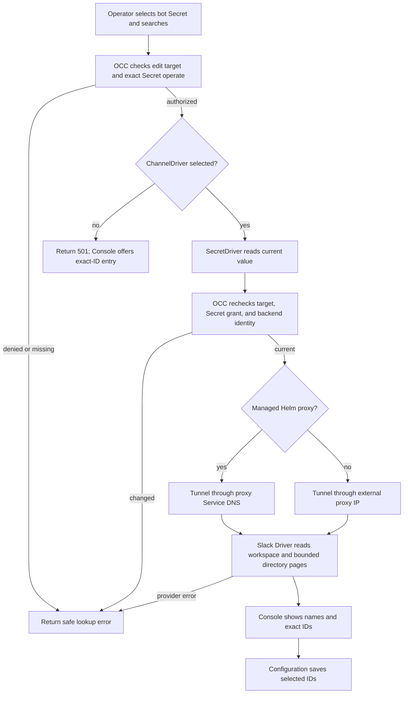

# Agent Channel Directory Lookup Flow

## Overview

An operator searches Slack users or channels while creating or editing an
Agent. The Console uses the selected bot Secret to show names and workspace
identity, then saves only the selected IDs in channel Configuration. OpenClaw
Control Plane (OCC) authorizes and reads the Secret; the selected ChannelDriver
owns provider calls. This flow ends when the Console displays candidates or an
actionable error.

## Entry Points

- Trigger: the Console Slack editor searches or resolves saved IDs, or an
  authorized caller posts to the Namespace channel directory route.
- Assumptions: the caller can create an Agent or update the exact Agent or
  Configuration, and can operate the selected same-Namespace Secret.
- Source: `apps/controller/src/console/agents/slack-directory.mjs:createSlackDirectoryField`,
  `packages/occ/src/index.ts:OpenClawController.lookupChannelDirectory`,
  and `apps/controller/src/drivers/channel/slack.ts:SlackChannelDriver.lookupDirectory`.

## Flow

## Execution Trace

### 1. Authorize the selected Secret

`packages/occ/src/index.ts:OpenClawController.channelDirectorySecret`

The request names a same-Namespace Secret and optionally an Agent or
Configuration being edited. OCC checks the matching create or exact update
permission and Secret `operate`, then reads the resource and Secret from
platform state. A missing or foreign target is rejected before provider I/O.

### 2. Read and use the current value

`packages/occ/src/index.ts:OpenClawController.lookupChannelDirectory`

Production composition selects the bundled Slack ChannelDriver only when the
API has an approved `OCC_CHANNEL_DIRECTORY_PROXY_URL`. Without it, an authorized
lookup returns `501` before the Secret value is read. Development selects the
Driver directly. In production the Driver tunnels requests to `slack.com:443`
through the configured proxy. With the managed proxy enabled, Helm points the
API at the `openclaw-enterprise-slack-proxy.<namespace>.svc` Service, sets that
exact host in `OCC_CHANNEL_DIRECTORY_MANAGED_PROXY_HOST`, and limits API egress
to the proxy Pod selector. With an external literal IPv4 proxy, Helm limits API
egress to that IP and port. The managed proxy accepts CONNECT only for Slack
hostnames on port 443, while its NetworkPolicy allows upstream egress to public
IPv4 addresses on TCP 443, excluding private and reserved ranges.
The selected SecretDriver invokes `withValue` and verifies backend ownership.
OCC rechecks grants and Secret backend identity after the read. It passes the
token only in process to the ChannelDriver. The bundled Slack implementation
requires a bot identity from `auth.test` and pages through `users.list` or
`conversations.list`. Exact-ID searches and saved IDs use `users.info` or `conversations.info`.
The response contains bounded candidates and pagination state, never the token.
An incomplete page cannot establish that a name is absent or unique.

`apps/controller/src/drivers/channel/slack.ts:SlackChannelDriver.call`
cancels an unused response body on a non-success HTTP status before returning
the safe rate-limit or unavailable error. This releases occupied transport
capacity even when the error body has not finished. The same request owner
serves credential validation; no automatic retry is added.

### 3. Display names and save IDs

`apps/controller/src/console/channels/slack.mjs:appendFields`,
`apps/controller/src/console/agents/slack-directory.mjs:createSlackDirectoryField`

The Console presents bot-token selection before channel access and explains that
name lookup needs that token. It debounces typing and shows each candidate's name,
exact ID, and workspace. The directory result panel overlays the form, following
the Secret picker pattern in `apps/controller/src/console/console.css`. Closing
results on focus loss cancels pending searches without moving the clicked control;
name-status hints retain their layout space while results are open. It buffers the provider's complete returned batch and divides it into
[display pages](../reference/drivers/slack-channel.md). Previous and Next reuse
those pages before Next follows the provider cursor. An empty provider page with
a continuation still offers Next. New input, dismissal, or a changed Secret
cancels the queued search and its browser request; generation checks also discard
obsolete responses. Browser cancellation does not guarantee cancellation of
provider work already started by the API.

Selecting a result or confirming pasted IDs adds removable chips to the field;
search text remains separate from committed IDs. Plugin approver fields accept
raw Slack user IDs when lookup is unavailable; directory-selected approvers
remain workspace-qualified. Arrow keys and Enter select results, and Escape
closes the list. It resolves saved IDs again when the editor opens or the
selected Secret changes. A denied or failed lookup leaves manual exact-ID entry
available; no directory result changes the saved Configuration until the
operator saves the channel edit.

When Agent detail performs a browser-refocus access check, it keeps the mounted
view. The picker keeps its open query and results while controls are temporarily
inert; moving focus to another Console control closes the list. Read-only
directory lookups do not invalidate tab retention, so a completed search can
keep its picker when switching Agent tabs and returning.
Those results are from the last authorized lookup. A new search rechecks the
exact edit target and Secret `operate` grant, and denied Agent access removes the
view.

## Debugging and Verification

- A denied lookup requires checking the exact edit permission and Secret
  `operate` grant. A token, scope, rate limit, or provider error returns a
  safe code without the token or upstream payload.
- A `501` lookup in production means the API has no directory proxy configured.
  Enable Helm `slackProxy.enabled` or set the approved
  external proxy IP and port in `api.channelDirectoryProxyUrl`, then verify that
  the proxy permits CONNECT to `slack.com:443`.
- Directory conformance tests cover provider pagination, safe errors, and native
  HTTP connection recovery after unfinished 429 and 503 response bodies. The
  OCC API integration test covers both authorization checks and response
  projection. Browser checks cover name display and exact-ID saving.
- The Agent plugin approver browser check holds the refocus access read and
  verifies that an open directory search remains available without a second lookup.
- Fixture and simulated provider tests do not prove a live Slack token, bot
  visibility, or channel message delivery.

## Related docs

- [ChannelDriver contract](../reference/drivers/channel.md)
- [Bundled Slack Channel Driver](../reference/drivers/slack-channel.md)
- [SecretDriver contract](../reference/drivers/secret.md)
- [Agent plugin deployment flow](agent-plugins.md)

## Manual Notes

[keep this for the user to add notes. do not change between edits]

## Changelog

- 2026-10-05 19:32: Describe failed HTTP response cleanup and native connection recovery. (authoring-run/eb95c719-31db-483c-9db3-c9573329209d - 5a2dd43d2e524637e7173457def040fa79d42a93)

- 2026-09-28 15:37: Document the managed Helm Slack proxy path and selector-scoped API egress. (authoring-run/5b79ed06-59ff-4a5d-9cf4-0479d7c8d717 - 6c56149f1f2b7290d8526d87c3624c9b7db09fbf)

- 2026-09-28 01:19: Document raw Slack user ID entry for plugin approver fields. (01a0e579-79b9-7a22-b707-d5bc1e024e31 - f90ca58bf4085a6075faa1c46e75ee96d2fbdafb)

- 2026-09-27 23:35: Put credentials first and prevent result dismissal from moving form controls during a click. (01a0e4d2-4f51-7780-b0fc-2352cb99078f - bb11b3974bc7ec80db1dd4cfab4e1a166e386de3)

- 2026-09-27 22:07: Preserve open Slack directory results through Console refocus checks. (01a0e4c7-ee1f-79a1-a8dd-9e423c47d564 - f56e99c912e9c77a23b7d5f02e765a35dc1f5fce)

- 2026-09-27 21:52: Buffer directory results for compact pages and cancel superseded browser searches. (01a0e4d2-4f51-7780-b0fc-2352cb99078f - 1e1628335710f7bcb66e0c3d0d6bdc35b6a0baaf)

- 2026-09-27 21:03: Replace modal lookup with inline search and selected chips. (01a0e49c-a051-7df2-9689-3bc1e0ac51c8 - ab70527a70201544d29b72c60ced7b9133910e92)

- 2026-09-27 08:51: Document production Slack directory proxy selection and egress. (01a0df20-f340-7810-bb59-b1df6c0bbbd3 - 1a2764952c421bfee00ed6892714366292c2741a)
- 2026-09-27 06:41: Describe authorized Slack directory lookup. (01a0df20-f340-7810-bb59-b1df6c0bbbd3 - 1d7b0b3b4e419cb8e085996be873ec233eeabf6d)
