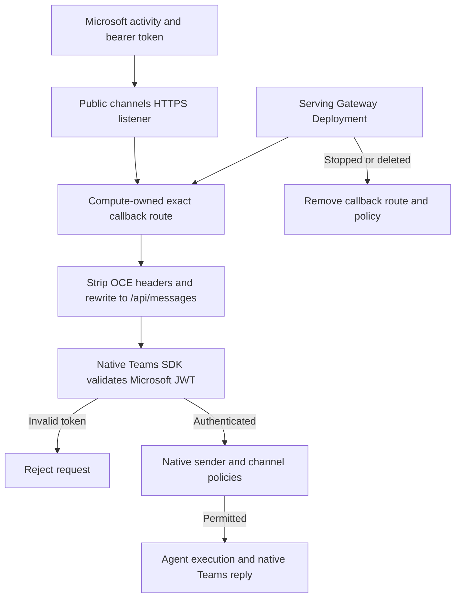

# Agent channel callback flow

## Overview

Microsoft Teams delivers an authenticated activity to an Agent-specific public
callback. The Kubernetes Compute Driver exposes the serving Gateway's native
Teams handler through a separate listener; the SDK validates the Microsoft token
and the native channel policy decides whether the sender may invoke the Agent.
Slack Socket Mode uses an outbound connection and does not enter this flow.

## Entry Points

- Deployment reconciliation: `apps/controller/src/drivers/compute/kubernetes/index.ts:reconcileGatewayRoute`.
- Public request: POST `/namespaces/<namespace-id>/agents/<agent-id>/channels/msteams`.
- Native handler: pinned OpenClaw `extensions/msteams/src/monitor.ts:monitorMSTeamsProvider`.
- Prerequisites: Dedicated runtime, admitted Secret bindings, reviewed proxy,
  separate channel hostname/listener, and an installed Microsoft bot app.

## Flow

## Execution Trace

### 1. Admit runtime prerequisites and credentials

`apps/controller/src/drivers/compute/kubernetes/index.ts:enabledChannels`
requires a Dedicated workload, channel proxy, and channel routing for enabled
Teams. Custom webhook paths, legacy listeners, and sovereign clouds are refused.
`validateChannelSecretBindings` requires matching admitted bindings.
`deployment` projects channel Secrets only into the Gateway and records whether
that serving Deployment owns a Teams callback.

### 2. Reconcile the serving revision's callback

`apps/controller/src/drivers/compute/kubernetes/index.ts:reconcileGatewayRoute` reads the serving Deployment's revision annotations.
`reconcileTeamsRoute` uses its Teams marker rather than a candidate's settings.
It creates an exact POST HTTPRoute on the **channels** listener, rewriting only
that path to `/api/messages`. A route-specific SecurityPolicy replaces inherited
OCE API-key authentication. `gatewayRouteHeaderFilter("channel")` preserves the
Microsoft Authorization header and removes OCE identity, scopes, cookies, and
API keys. Other paths have no callback route.

### 3. Authenticate and process the activity

The [pinned native monitor](https://github.com/openclaw/openclaw/blob/11d3d04a1279781a770f6a6aa09e6322b064b80a/extensions/msteams/src/monitor.ts)
`extensions/msteams/src/monitor.ts:monitorMSTeamsProvider` registers
`/api/messages` with plugin authentication. Its Express adapter and
Microsoft Teams SDK reject unauthenticated activities before Agent execution.
Native personal/group policies and mention rules then gate execution. The plugin
sends the response using its admitted app credentials through provider egress.

### 4. Revoke the endpoint

`apps/controller/src/drivers/compute/kubernetes/index.ts:reconcileTeamsRoute` removes stale callback resources when the serving Gateway
disables Teams. `deleteGatewayUnauthenticatedRoutes` removes the HTTPRoute before
its SecurityPolicy during stop/delete, using observed revision, UID, and resource
version preconditions. Retiring a failed candidate cannot delete a route owned
by the serving revision.

## Debugging and Verification

- Inspect the Agent's `gateway-<agent-hash>-msteams` HTTPRoute and SecurityPolicy,
  serving revision annotations, and Envoy listener acceptance.
- [Teams verification](../testing/teams.md) distinguishes native SDK rejection,
  console persistence, simulated UI evidence, and pending live-provider proof.
- Check Gateway logs for native channel initialization and policy refusals.
  Saved Secret bindings alone do not establish working Microsoft credentials.

## Related docs

- [Teams setup](../guides/integrations/teams.md)
- [Kubernetes networking](../reference/drivers/kubernetes-compute/networking-and-isolation.md)
- [Secret configuration](../reference/configuration/secrets.md)
- [Agent channel directory](agent-channel-directory.md)

## Manual Notes

[keep this for the user to add notes. do not change between edits]

## Changelog

- 2026-10-06 16:42: Documented the source-backed Teams callback path (codex/authoring-run/5ef92e66-9d7a-4101-a43a-59a23d70ef72 - 447c387b63c1)
