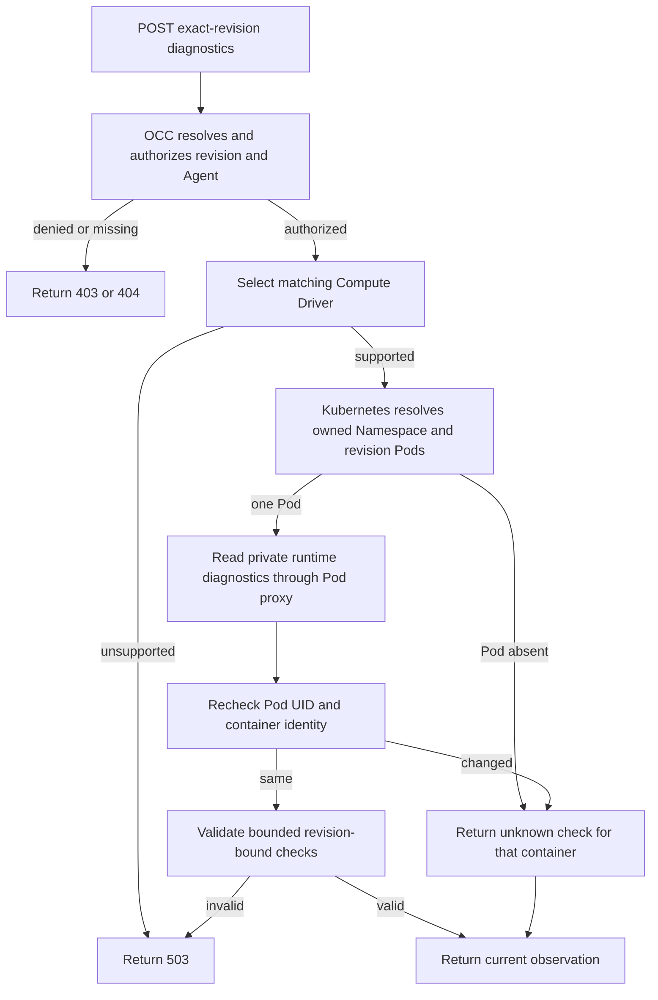

# Agent deployment diagnostics flow

## Overview

An admin requests fresh runtime checks for one admitted Agent revision through a
bodyless API call. OpenClaw Control Plane (OCC) authorizes the exact target,
asks the selected Compute Driver for bounded evidence, and returns that
observation. The call ends at the API response; it does not change deployment
work or select a live revision.

## Entry Points

- Trigger: `POST /namespaces/:namespaceId/agents/:agentId/deployments/:deploymentId/diagnostics`.
- Source: `apps/controller/src/index.ts:createFastifyApp`,
  `packages/occ/src/index.ts:OpenClawController.diagnoseAgentDeployment`, and
  `apps/controller/src/drivers/compute/kubernetes/index.ts:KubernetesComputeDriver.diagnoseAgentDeployment`.
- Assumptions: `deploymentId` is an admitted AgentRevision ID. The caller needs
  exact Agent `read` and `operate` and AgentRevision `read` permissions.

## Flow

## Execution Trace

### 1. Authorize the exact deployment

`packages/contracts/src/api/routes.ts:occApiRoutes` declares a bodyless POST.
`apps/controller/src/index.ts:requiredPermissions` requires exact Agent
`operate` and `read` plus AgentRevision `read`.
`packages/occ/src/index.ts:OpenClawController.diagnoseAgentDeployment`
resolves the revision under the supplied Namespace and Agent, authorizes the
same resources, and selects the Compute Driver recorded in that revision.

### 2. Read the current runtime

`apps/controller/src/drivers/compute/kubernetes/index.ts:KubernetesComputeDriver.diagnoseAgentDeployment`
checks the binding and owned Namespace, then reads each revision Pod through
the Kubernetes Pod proxy. Dedicated Gateways use their managed Gateway
namespace; dedicated Harnesses use the tenant namespace. The Driver reads a
private endpoint, then checks the Pod name, UID, and container ID again. Missing
or replaced Pods produce `unknown` checks. Invalid endpoint data fails the
request. Collection has a ten-second deadline and a 64 KiB response limit.

`apps/controller/src/drivers/compute/kubernetes/runtime-entrypoints.ts:PLUGIN_RUNTIME_HELPERS`
calls `channels.status` through OpenClaw's public Gateway SDK on demand in the
Gateway container. It maps live configuration, authentication, and connectivity
to safe codes without sending a message. The call cancels after six seconds or
when the HTTP caller disconnects. OpenClaw loads the Slack plugin only for a
Configuration with a Slack channel, so for an Agent without one the Gateway
refuses the call as an unknown channel; that refusal maps to configuration
`failed` with `NOT_CONFIGURED`. The probe code is part of the Gateway Pod
specification, so a revision deployed by an earlier controller keeps the
earlier mapping (three unknown `PROBE_FAILED` checks) until the Agent is
redeployed. Transport failures return `UNAVAILABLE`; other RPC failures return
`PROBE_FAILED`. Both produce unknown checks; local configuration is not
substituted for the live response. The Agent container
currently returns no channel checks.

### 3. Return validated evidence

`packages/occ/src/deployment-diagnostics.ts:deploymentDiagnostics` requires
the requested revision ID, valid timestamps, and at most 32 bounded checks.
OCC converts native Driver errors to `DEPENDENCY_UNAVAILABLE` without returning
their messages. The API returns the observation and leaves persisted deployment
status, startup evidence, plugin warnings, and Agent state unchanged.

## Debugging and Verification

- `403` indicates missing exact permission; `404` indicates the path does not
  identify that Agent revision. `503 DEPENDENCY_UNAVAILABLE` indicates missing
  Driver support, collection failure, or invalid evidence.
- Checks that are all `unknown` with code `UNAVAILABLE` mean the runtime did
  not answer, usually because the Gateway is stopped, starting, or failed to
  start. The console says so and names a failed deployment's recorded error
  code, because these checks do not test model credentials.
- The focused API test covers exact permissions and sanitized Driver failures.
  The Kubernetes conformance test covers Pod proxy placement, revision and Pod
  identity, and missing-Pod behavior. These tests do not prove a live Slack
  connection, message delivery, or a model response.

## Related docs

- [Agent deployment status and diagnostics](../reference/agents.md#deployment-status)
- [Compute Driver diagnostics](../reference/drivers/compute.md#optional-runtime-diagnostics)
- [Kubernetes networking](../reference/drivers/kubernetes-compute/networking-and-isolation.md#networking)

## Manual Notes

[keep this for the user to add notes. do not change between edits]

## Changelog

- 2026-10-07 12:00: Say that a revision deployed by an older controller keeps its diagnostics mapping until the Agent is redeployed. (dogfood-r43)

- 2026-10-07 11:30: An Agent without a Slack channel reports `NOT_CONFIGURED` instead of three `PROBE_FAILED` checks. (fix-member-1007/d531)

- 2026-10-01 15:14: Use bounded SDK queries for live channel diagnostics. (authoring-run/24df37c6-7eef-483a-a31c-d2c14a51ca6c - 521549df)

- 2026-10-01 15:22: Point validation to its private deployment diagnostics module. (authoring-run/089c3e66-9284-44a0-9e60-285ac7f50ab9 - 28debe57)

- 2026-09-27 06:34: Document the exact-revision diagnostics request and its Compute observation boundary. (authoring-run/d4a7cf04-5ef8-46a6-8a29-814f0292bf66 - ab37f9b)
