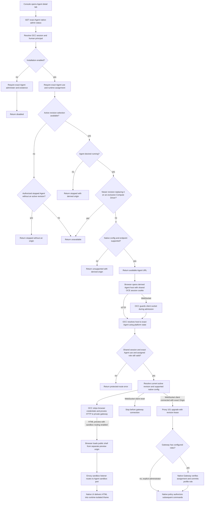

# Agent Native Admin UI Flow

## Overview

OCC checks a Console user's exact Agent `use` grant and runtime assignment,
then returns the active Gateway's stable per-Agent URL. That host authenticates
the shared OCE session cookie, resolves the exact Agent, rechecks authorization,
and proxies native HTTP and WebSocket traffic.

## Entry Points

- Trigger: Console renders an Agent detail tab, calls the native admin availability API, and opens the returned Agent URL.
- Source: `apps/controller/src/console/agents/runtime-access.mjs:renderRuntimeAccess`
- Source: `apps/controller/src/http/native-admin.ts:resolveNativeAdminAvailability`
- Source: `apps/controller/src/http/native-admin.ts:handleNativeAdminUpgrade`
- Assumptions: The API has a valid controller session, `agentNativeAdmin.enabled` is true, `agentNativeAdmin.domain` and `agentNativeAdmin.sharedCookieDomain` are configured, Better Auth emits the shared session cookie at that parent domain, and private Agent gateway routing can return a `ComputeDriver.getAgentRuntimeAccess` value.

## Flow

## Execution Trace

### 1. Console renders native admin availability

`apps/controller/src/console/agents/runtime-access.mjs:renderRuntimeAccess`

Agent detail requests `${path}/native-admin` with the panel hidden. Disabled
responses and ordinary-user denials keep it hidden. Denied Installation
administrators see a self-assignment hint and **Refresh access**. Stopped,
unavailable and unsupported responses show feedback; read failures retain the
error and Refresh button. Only `available` with an Agent URL exposes **Open
OpenClaw**, opening a new tab with `noopener noreferrer`.

Tab `sessionStorage` caches audited `403` paths per session owner.
**Refresh access** forgets only this path and retries, allowing a new assignment
to take effect. Logout, sign-in or a new tab asks afresh. The [shared page
cache](platform-console.md#2-resolve-the-session-before-private-reads) owns Back
revalidation. `updateCurrentAgent` refreshes when polling or **Refresh
deployment** observes changed `activeRevisionId` or `desiredRuntimeState`; a
pending read queues one further read. The panel warns that native edits do not
update durable OCE Configuration.

### 2. OCC protects the availability route

`apps/controller/src/http/native-admin.ts:nativeAdminStatusOperation`

`createNativeAdminAccess` owns the host interceptor, upgrade listener and socket shutdown hook. It reads the current controller through a getter so an app created before bootstrap uses the initialized controller on later requests. Shared route admission remains in `apps/controller/src/index.ts`.

`GET /namespaces/:namespaceId/agents/:agentId/native-admin` admits a human session through the ordinary `admit` and `resolveIdentity` middleware. When enabled, it requires exact Agent `use` and a runtime assignment; `read` or `operate` alone cannot admit the caller. When disabled, it requires exact Agent `administer` and existence before returning `disabled`, without requiring a runtime assignment.

### 3. Shared availability resolver checks feature and active revision state

`apps/controller/src/http/native-admin.ts:getNativeAdminStatus`
`apps/controller/src/http/native-admin.ts:resolveNativeAdminAvailability`
`packages/occ/src/index.ts:getUsableActiveAgentRevision`

Enabled access requires a public origin and native domain.
`getUsableActiveAgentRevision` selects the active revision and successor. A
stopped Agent without an active revision raises `ResourceStateConflictError`
and returns `stopped`, including before first deployment.
`NoActiveAgentRevisionError` returns `unavailable` while a desired-running Agent
awaits activation. Other dependency failures return `503`; authorization denial
returns `403` with human IAM audit evidence. The panel reports the active revision.

A newer successor on a Compute Driver requiring stopped predecessors also produces `unavailable`: the worker removes the old workload before starting its replacement. A failed replacement leaves the old revision recorded as active without a serving workload. Both status and proxy admission check this boundary.

OCC derives the target from the active revision; desired state other than
`running` returns `stopped`. Compute qualifies trusted-proxy identity, role
headers and device approval covering the selected role.
`nativeAdminConfigurationSupported` checks `controlUi.enabled`, exact
`allowedOrigins` and host-header/device-auth settings. Rejection returns
`unsupported` with the target and a reason: UI configuration, missing role,
insufficient device approval or unsupported transport. Missing endpoints and
unclean private `wss:` URLs also return `unsupported`. Only `available` carries
private `gatewayBase`, omitted from browser responses.

### 4. OCC derives the isolated Agent host

`apps/controller/src/gateway/native-admin.ts:nativeAdminTarget`

`deriveNativeAdminHost` hashes Installation, Namespace and Agent IDs into an opaque label under the configured domain. `nativeAdminTarget` replaces the `publicOrigin` hostname with that Agent host and returns `/` as its browser entrypoint.

Native-host admission resolves the irreversible hash against existing platform state. Unknown hosts, wrong suffixes, deleted Agents and non-unique matches fail closed. No persistent host registry is added.

`nativeAdminGatewayHttpBase` accepts a `wss:` endpoint without credentials, query or hash, then converts it to `https:` while preserving authority and Agent base path. Workspace-file WSS routing remains unchanged.

### 5. Shared cookie admits the Agent host

`apps/controller/src/auth/index.ts:createControllerAuth`

Startup passes `nativeAdmin.sharedCookieDomain` to Better Auth as `OCC_AUTH_COOKIE_DOMAIN`. The session cookie uses that explicit parent; startup rejects public suffixes, malformed domains and hosts outside its DNS-label boundary. Disabled native access keeps the host-only `openclaw_occ` cookie and ignores leftover shared-domain configuration.

Shared-domain cookies cannot use a `__Host-` prefix. One canonical cookie name and scope avoids ambiguous session selection.

### 6. OCC intercepts native-host HTTP requests

`apps/controller/src/http/native-admin.ts:interceptNativeAdminHttp`

`onRequest` intercepts native Agent hosts before OCC routing, preventing those origins from exposing console/API routes. OCC authenticates the shared session, resolves the exact Agent and IAM principal, revalidates `use` and the assignment, then checks the active revision and native configuration. Denials retain attributable human IAM audit evidence.

Admission reads Better Auth once and returns identity and session metadata for expiry checks and attribution. Each WebSocket lease repeats admission against current session state.

`apps/controller/src/gateway/native-admin-proxy.ts:proxyNativeAdminHttp`

The HTTP proxy bounds the path suffix, rejects missing or nonmatching `Origin` on non-GET/HEAD requests, strips browser cookies, service keys, forwarding headers, native identity, native scopes, and upstream `Set-Cookie`, rejects service-worker script requests, rewrites same-upstream `Location` values to the Agent origin, appends `worker-src 'none'` to proxied Content Security Policy, and forwards to the private `https:` gateway base. A `502` from the gateway's user-photo route (`/api/users/<id>/avatar`) becomes an empty `404`: it means OpenClaw could not fetch a Gravatar fallback, which a dedicated Gateway without internet egress never can, and the UI shows initials for both. The native gateway never receives the OCE session cookie.

### 7. OCC proxies native WebSocket upgrades

`apps/controller/src/http/native-admin.ts:handleNativeAdminUpgrade`

The API intercepts `upgrade` before Fastify routing, accepts only derived Agent
hosts and tracks sockets for `preClose` shutdown. It handles socket errors before
awaiting admission, preventing uncaught TCP-reset errors. Authorization denial
still audits after a reset. Allowed admission checks for client destruction
before and after resolving private transport, preventing upstream connections
for disconnected clients. Connected clients use the selected active revision.

`apps/controller/src/gateway/native-admin-proxy.ts:proxyNativeAdminWebSocket`

The proxy requires an exact, non-null Agent `Origin`, sanitizes the request and connects the browser only after upstream `101`. `onConnect` and `onClose` audit `websocket.connect` and `websocket.close` with a shared `connectionId`. Close reasons distinguish lifecycle, revocation, dependency, client, upstream and shutdown. Admission repeats every 25 seconds with a 5-second deadline. Denials retain human IAM audit evidence; failed, timed-out or changed-revision leases close both sockets. Authorized reconnects use the current revision. Native chat does not renew the OCE session.

### 8. Runtime commits the verified role before admission

`apps/controller/src/drivers/compute/kubernetes/runtime-access.ts:humanRuntimeAccess`
`deploy/runtime/openclaw-trusted-proxy-role.patch`

Kubernetes offers `platform-administrator` alongside configured roles. Migration
converts effective human Agent `administer` grants into explicit `use` assignments,
with one entry Role per Namespace visible in Sharing. Removal never falls back
to old grants. Without Gateway roles, only explicit administrator assignments use
the existing service transport and shared profile. Configured roles select the
human route; malformed values never fall back to the administrator profile.

The Driver supplies the reserved administrator or configured policy over
`/people/namespaces/<namespaceId>/agents/<agentId>`, with `oce:<Principal ID>` and
a policy digest. Preparation retains the serving revision's route ownership,
protecting access from failed-candidate retirement. A role-free replacement leaves
that route for predecessor retirement. Service traffic uses disjoint `/namespaces`;
OCC replaces browser authority headers.

Trusted-proxy configuration declares the managed `oce:` prefix and exact
`occ-workspace-files` identity. The Gateway verifies authentication and the role
digest, rejects undeclared identities and profiles with multiple managed
identities, then commits the role through native identity authority before
admission. HTTP checks the same policy. Role publication retires earlier authority
with `401`; new requests use the committed role without OCC replay. OpenClaw
enforces permissions. Backend connections retain `oce-service`; independently
authenticated local owners retain access.

WebSocket admission intersects client-requested operator scopes with the proxy ceiling using OpenClaw's native scope semantics. A broad UI request can therefore receive narrower session scopes without gaining general configuration or administrator access. Non-operator connections retain exact scope matching.

The same lease closes changed assignments or descriptors within 30 seconds. New HTTP requests and upgrades resolve current policy immediately; native profiles update at reconnect.

### 9. Runtime renders HTML on a separate origin

`apps/controller/src/drivers/compute/kubernetes/index.ts:gatewaySandboxConfiguration`
`apps/controller/src/drivers/compute/kubernetes/index.ts:reconcileGatewayRoute`

With operator sandbox routing configured, preparation and activation render the
Agent's stable preview origin and adjacent sandbox port in its native document.
The worker reconciles its GET/HEAD route, public-shell SecurityPolicy and
Agent-scoped backend ingress policy under the serving revision. A separate Helm listener admits only configured ingress
peers, and the backend targets the sandbox port instead of the admin port.
The preview domain is outside the shared session cookie scope. Native UI still
reads private file content through its authenticated connection, then delivers
it to the runtime's isolated iframe. The sandbox listener serves public shell
and registered renderer assets; runtime CSP and nested frame isolation remain
responsible for executing generated content. See the [routing contract](../reference/gateway-routing.md#public-preview-routing).

For opted-in Kubernetes gateways, `KubernetesComputeDriver.privateStateInitContainer`
copies the admitted configuration from `/etc/openclaw-managed/openclaw.json` to
`/runtime-state/home/.openclaw/openclaw.json` on the init container's writable
volume. The gateway mounts that same home subdirectory at `/home/node`, so native
edits remain Pod-local and the next Pod starts from the admitted configuration.
The init container cannot write through the gateway's later mount path.

## Debugging and Verification

- `AGENT_NATIVE_ADMIN_INVALID` at startup points to native admin enablement, the Agent domain, or a missing shared cookie domain. A bad shared cookie domain or public origin reports `AUTH_BASE_URL_INVALID`, short auth secret material `AUTH_SECRET_INVALID`, and a missing gateway API key path `GATEWAY_API_KEY_UNAVAILABLE`.
- `disabled` means the Installation has not enabled the feature.
- `stopped` means the exact Agent is not desired running. Its response has no origin or revision after stop reconciliation clears the active revision, or before the first deployment.
- `unavailable` means a desired-running Agent has no active revision or an exclusive Compute Driver is replacing the active workload. Check Deployment activity, including failed replacements, then refresh access. Other dependency outages return `503`.
- `unsupported` means the selected Compute Driver, gateway endpoint, or native trusted-proxy/control UI configuration cannot support the active revision.
- Wrong or unknown Agent hosts fail before gateway proxying. Check the derived host calculation, Agent lifecycle state, and `agentNativeAdmin.domain`.
- Browser requests should not contain native-admin exchange, bootstrap, callback, launch-code, state, verifier, or Agent-specific session-cookie traffic.
- The native gateway should never observe the OCE session cookie; inspect sanitized proxy inputs when testing this boundary.
- IAM denial audits should appear for attributable denied status checks, proxy admission, and WebSocket lease renewal, with the human principal and exact Agent target preserved.
- A TCP reset during admission must not crash the API, suppress a denial audit or open an upstream connection for the disconnected client.
- `openclaw.agents.native_admin.websocket.connect` audits should include `connectionId`; matching `openclaw.agents.native_admin.websocket.close` audits should reuse `connectionId` and include `closeReason` with one of the expected categories: lifecycle, revocation, dependency, client, upstream, or shutdown.
- Service-worker registration failure is expected: the HTTP proxy rejects `Service-Worker: script` requests and adds `worker-src 'none'` to proxied responses.
- Browser tests cover visibility, warnings and launch. Integration covers shared-cookie admission, service-key and unknown-host denial, assets, WebSocket reconnect, lease renewal (PostgreSQL shortens the 25-second interval), revision-change closure and a reversible native edit on a disposable Agent.

## Related docs

- [Agent native admin UI](../reference/agent-native-admin.md)
- [Platform console](../reference/console.md#open-the-native-admin-ui)
- [Gateway routing with Envoy](../reference/gateway-routing.md#native-admin-ui-routing)
- [Deploy native admin UI access](../guides/deploy/native-admin.md)
- [Workspace files flow](workspace-files.md)

## Manual Notes

[keep this for the user to add notes. do not change between edits]

## Changelog

- 2026-10-08 14:03: Return disabled status without a runtime assignment; keep administrator assignment guidance visible and retry remembered denial on explicit Refresh. (authoring-run/3bee1cb2-aeb2-4700-8ff4-3da9ac7f098c - 346b1fe14)

- 2026-10-08 03:40: Documented client reset handling during native-admin WebSocket admission and the denial-audit and upstream-connection ordering at inspected revision `002d0f796`. (authoring-run/1e4aaf85-2e38-434d-99c0-75881fe9991c - 002d0f79639a9c814eb1fa2799530516a6c90cde)
- 2026-10-05 17:34: Trace Namespace-scoped entry Roles and consistent human-route selection for runtime assignments. (authoring-run/593fb00e-b94d-46a0-a339-f3a8973764cb - aecffb24a16b5252c55ddf47bed2c66e622f1813)

- 2026-10-05: Preserve explicit administrator entry during upgrade explain access configuration failures, and retain serving-route ownership during preparation. (authoring-run/fabe27b6-d360-4a29-8a8c-17547858f84a - 379dc56084c92d7847849f2b3f96ddc0eccc17d8)

- 2026-10-04 07:30: Only a missing active revision reports `unavailable`; IAM and other dependency outages return `503`, and close or refuse proxied requests as `dependency_failure`. (bh11-native-status)

- 2026-10-03 08:54: Preserve access refresh, visible read failures, service-key feedback and cached pages after optional access denial. (authoring-run/59d7541c-66d2-414c-8139-174fca84fe33 - b6f9185159f14399905bf495b3cdef3ce2d14e30)

- 2026-10-02 14:32: Trace per-person roles, configured managed identities, disjoint routing, verified admission, scope intersection and revocation. (authoring-run/32e6f4fe-d1a7-4d1a-96f4-282e75750412 - 3b2369155e55b0e9bed49de9e46d68a958dc5278)
- 2026-10-03 12:00: Reread availability once when deployment polling observes a new active revision or runtime state.

- 2026-10-01 17:20: Move native-admin admission, availability, sockets and shutdown ownership into the HTTP module. (authoring-run/bef09bf6-deaa-4189-9568-5f13beb451e7 - 7a6cc931d)

- 2026-10-01 21:00: Reported `unavailable` while a newer exclusive revision replaces the active workload, including after that replacement fails.
- 2026-10-01 18:20: Answered unreachable user-photo fallbacks with `404` instead of `502`.

- 2026-09-30 19:00: Remembered a denied availability read per tab and session owner so reloads do not add an audited denial per view.

- 2026-09-29 21:35: Corrected native configuration initialization to write through the init volume mount. (89a4ccd7-3974-43c6-b08a-be02269a8d01 - cc96e34f33868555d4a89cb44bc022859d76c815)

- 2026-09-28 16:20: Added the accompanying optional sandbox routing implementation and separate-origin preview flow. (01a0cf72-6985-7712-ba92-d8cc32470f24 - 33a2528163d5bbff311bb685345e60aadb24a70a)

- 2026-09-21 21:20: Distinguished authorized stopped Agents with no active revision from unavailable running deployments. (01a0c750-0c10-7492-97eb-f4124cded820 - 156dd67b7bd280a380d96b5c34a64e402fe3b96b)
- 2026-09-21 21:17: Clarified the console's active-revision dependency message and its independence from the viewed configuration snapshot. (01a0c750-0c10-7492-97eb-f4124cded820 - f3dbdd41c8f3b49573d1353a4b06ce510ee43a56)
- 2026-09-20 09:45: Reused session metadata from admission and replaced launch bookkeeping with a direct browser link; socket lifecycle state remains owned by the proxy. (01a0b7fd-13fa-7dc2-8653-5c5814b59305 - bbb864aadc709dcc4f7b95d4b42b74823c18363a)
- 2026-09-20 08:53: Replaced the native-admin exchange flow with shared OCE session cookie admission, host-to-Agent resolution, credential stripping, and current-revision reconnect behavior. (cody/01a0b7fd-13fa-7dc2-8653-5c5814b59305 - 5e5f12f37842ae7239d73432e00609547627ded8)
- 2026-09-19 22:27: Documented exact-Agent disabled-status gating, IAM denial audit preservation, and WebSocket `connectionId`/`closeReason` audit fields. (01a0b7fd-13fa-7dc2-8653-5c5814b59305 - 9621ce4e)
- 2026-09-19 21:14: Updated the flow for the shared availability resolver names and service-worker blocking behavior. (01a0b7fd-13fa-7dc2-8653-5c5814b59305 - 06c23b9c)
- 2026-09-19 21:07: Added the `DependencyUnavailableError` to `unavailable` status branch and clarified derived-origin status payloads. (01a0b7fd-13fa-7dc2-8653-5c5814b59305 - 06c23b9c)
- 2026-09-19 20:19: Added the source-backed native admin UI availability, launch, cookie redemption, HTTP proxy, and WebSocket proxy flow. (01a0b7fd-13fa-7dc2-8653-5c5814b59305 - 06c23b9c)
