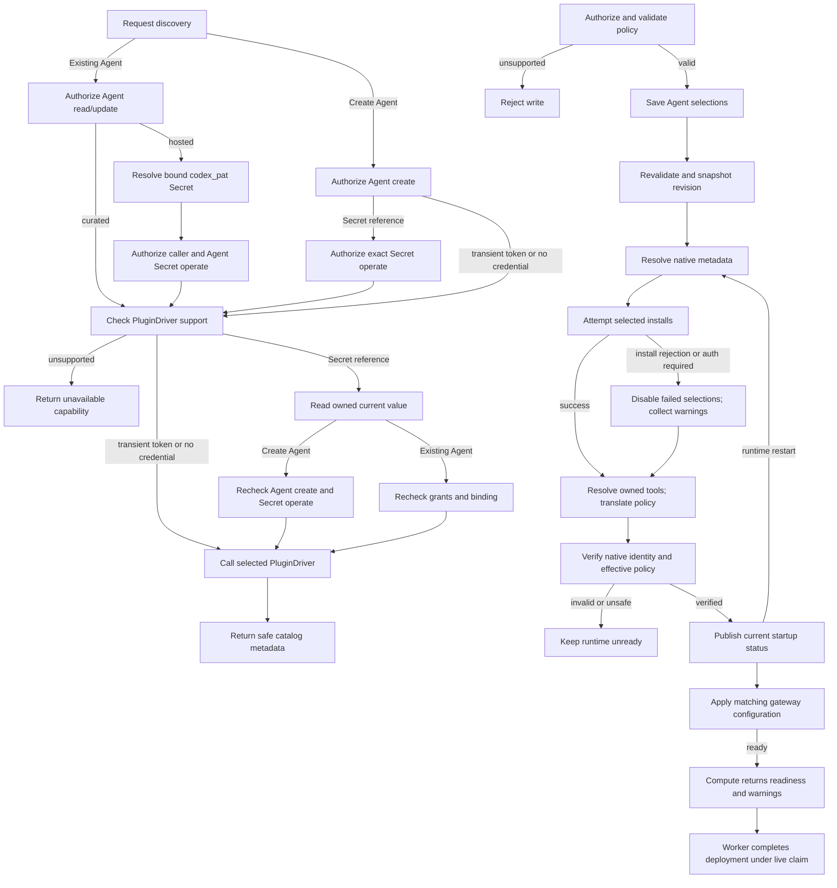

# Agent Plugin Deployment Flow

## Overview

An authorized caller saves plugin selections, then deploys. OCC validates and
snapshots policy, selections, and Driver. Startup resolves metadata, translates
policy, and prepares the revision. Revision selection may precede cutover; the
Harness owns tools and approvals.

## Entry Points

`apps/controller/src/index.ts:createFastifyApp`

- Trigger: Agent create/update with `plugins`, including a Console new-revision
  plugin save, followed by Agent deployment.
- Assumptions: exact Agent permission, valid selections, compatible trusted
  PluginDriver, and deployment prerequisites.
- Source: [HTTP handlers](../../apps/controller/src/index.ts),
  [OpenClawController](../../packages/occ/src/index.ts), and
  [bundled PluginDrivers](../../apps/controller/src/drivers/plugin/index.ts).

## Flow

## Execution Trace

### Credential-scoped discovery

[Create discovery](../reference/drivers/plugin.md#selection-and-catalogs) accepts
transient PATs, same-Namespace Secrets, or supported credential-free access.
OCC checks Namespace Agent `create` and caller Secret `operate` before Driver
support, and again after the Secret read, before the Driver call; unsupported
discovery reads no Secret. A `secretRef` or `oauthLogin` in
another Namespace, here or in existing-Agent discovery, fails with
`400 INVALID_REQUEST` before any Secret check; a Secret the Namespace does not
hold is `404`.

Existing-Agent discovery requires active Agent `read`/`update`; inputs are queries,
cursors, or plugin IDs. Hosted discovery resolves bound `codex_pat` and rechecks
binding and caller/Agent Secret `operate` inside
[`SecretDriver.withValue`](../reference/drivers/secret.md). Curated discovery needs
no Secret. Missing, denied, or unavailable Secrets fail before discovery.
Nontransactional reads may precede rotation; discovery persists neither state nor
credentials.

The [Codex Driver](../../apps/controller/src/drivers/plugin/index.ts) hydrates
hosted identity, searches `q`, and pages GLOBAL entries with opaque cursors.
[Console discovery](../../apps/controller/src/console/agents/plugin-discovery.mjs)
preloads page one for Create Agent PATs and bound PATs in editable Agent Plugins
tabs. The picker reuses prefetch; credential changes clear discovery, preserving
selections. Search marks loading and invalidates old responses before the
[delay](../reference/drivers/plugin-bundled.md#selection-and-catalogs);
Enter/paging bypass it. Closing, configured view, credential changes, and view
cancellation abort requests. Tools (`null`: unknown) load on demand; supported
entries then become selectable. Unsupported releases remain unavailable.
Curated catalogs filter bundled entries without verifying tools/account access.

Bounded hosted reads forbid redirects. OCC returns `no-store` metadata, rejects
credential echoes, and suppresses upstream errors/artifacts. Selections exclude
Driver links/setup guidance. Connections remain unverified; HTTPS logos omit
referrers and default to initials.

### 1. Validate desired state under exact-Agent authority

`apps/controller/src/index.ts:createFastifyApp`

HTTP contracts validate input before [OpenClawController](../../packages/occ/src/index.ts)
checks the exact Namespace and Agent. Reads require Agent `read`; create/PATCH
stores the `plugins` map. Shared validators check the nested selection shape.
`OpenClawController.validatePluginPolicies` calls the selected Driver's
`validatePolicies` before Agent create/update and provisioning writes. Unsupported
controls, reviewer scopes, and combinations return `400 INVALID_REQUEST`;
a missing selected Driver returns `501 NOT_IMPLEMENTED`. Validation is static: native app mapping,
authentication, and release/tool metadata remain startup checks. Agent mutations store desired state and audit evidence atomically without changing
the reusable Configuration or active runtime. On update, omission preserves the
map, `{}` clears it, and a nonempty map replaces it.

Installation readers use `GET /installation`; Agent editors use
`GET .../plugins/capabilities` with Agent read/update. Both return policy capabilities.

### 2. Admit an immutable plugin deployment

`packages/occ/src/index.ts:OpenClawController.deployAgent`

Deployment revalidates selections and Configuration, records the Driver and
policy-only plugin map in AgentRevision, and queues it. Native app mapping,
release metadata, and configuration resolve later.

### 3. Deliver requested state through Compute preparation

`apps/controller/src/drivers/compute/plugin-runtime.ts:pluginRuntimeSpecForRevision`

Compute validates admitted state, Driver, and Harness. Kubernetes projects the
nonsecret request; Docker uses bounded environment delivery.

SSH Compute rejects nonempty plugin maps and Agent default plugin approver
policies before host effects.

Initial embedded Kubernetes gateway preparation applies exact-Agent HTTPS
egress before installation. For existing gateways, `prepareRevision` avoids
duplicate Agent database access. `activateRevision` uses `Recreate`, stopping
the old gateway before installation. Revision files stay private and the native
registry stays in the Agent-owned database. Docker keeps native state in the
container's private temporary home.

### 4. Prepare native runtime state and hand off readiness

`apps/controller/src/drivers/compute/kubernetes/runtime-entrypoints.ts:installOpenClawPlugins`

Embedded OpenClaw validates selections against its bundled catalog and policy.
Grants enter nonempty `tools.allow`, otherwise `tools.alsoAllow`, preserving denies and profiles. A tool's `enabled`
override precedes `toolDefaults.enabled`; disabled tools emit native denies.
Master disable and operator denies prevail; `provider_default` and `none` add no
Diffs review step. Revision-private configuration uses `--pin --force --no-enable`,
preserving enablement and allow/deny lists. Preparation refreshes the registry
and verifies admitted configuration; the pinned runtime release lacks this flag.
Native inspection verifies plugin ID, package name, runtime/install version,
recorded integrity, and the runtime source's containment in the install path.
Failure prevents gateway readiness. Confirmed install rejection disables the
optional selection and removes its managed tool allowance before startup.

Selected Codex plugins enable apps/plugins/remote_plugin in isolated `CODEX_HOME`
and configure the bridge with
`codexPlugins.enabled:true`, `allow_all_plugins:false`, and an entry per selection.
`apps._default.enabled:false` applies; disabled selections cannot execute app tools.

After `plugin/list`, `runtime-entrypoints.ts:readCodexPluginDetails` reads up to
four selections concurrently, preserving selection order; batches drain before retries. Install
and configuration writes stay sequential; post-install reads use the same
batching before final policy verification.
`codexRuntimeArtifact` uses concrete `detail.apps`, excluding `appTemplates`.
`codexInstallPlan` validates [component support](../reference/drivers/plugin-bundled.md)
and policy before installation. Account-wide skill restrictions remain unsupported.
Install rejections or missing app authentication warn. Explicit tool policies
require `mcpServerStatus/list`'s `codex_apps` inventory; `codexAppToolSettings`
binds catalog action IDs through `_meta._codex_apps.resource_uri`. Native IDs
work. Unknown, unowned, ambiguous, or duplicate IDs fail startup.

`codexRuntimeArtifact` applies the [native policy mappings](../reference/drivers/plugin-bundled.md).

`writeCodexAppConfiguration` reads merged workspace settings, disables unselected apps,
and writes inherited tool/account approvals; table replacement leaves lower-layer
descendants. Unspecified tool enablement stays unset; native requirements
remain enforced. `config/batchWrite` replaces local app subtrees. Readback checks
identity/version/app mapping; failed apps are disabled and disabled selections skip
installation/status.

Workspace-aware readback rejects policy conflicts before readiness. Disabled apps may
retain inherited fields. Categories resolve app → global → native `true`; equivalent
values/nulls pass. Tool enablement cannot bypass categories.

`runtime-entrypoints.ts:startAuthenticatedCodex` passes the admitted Harness model,
without its provider prefix, to the app-server after the authentication probe
succeeds. Native configuration readback therefore exposes the model used for
startup policy validation.

`runtime-entrypoints.ts:verifyCodexReviewerConfiguration` checks explicit app/link
reviewers and `configRequirements/read`, rejecting forbidden reviewers, incompatible
automatic-review settings, or conflicting model requirements. Startup checks do not
cover later workspace/session/model changes or strict review. Codex 0.156 readback
omits managed app/tool requirements applied during execution; native effective-policy
introspection remains required. See [remaining proof](../testing/plugins.md#current-proof-notes).

For Compute-owned Kubernetes workloads, only an admitted `{pluginId, code}`
warning results from a selected OpenClaw install's normal nonzero exit, a
matching Codex `plugin/install` error, or a successful Codex install needing app
authentication. Transport loss, timeouts, signals, malformed responses,
discovery failures, and policy failures retain ordinary startup failure
behavior. Provider-owned Harnesses keep their existing startup path.

After verification, runtime exposes private startup status. Kubernetes Compute
validates workload, revision, startup instance, selection keys, and warning
codes for readiness; restart recomputes status.

Dedicated Codex runs separately and receives runtime-binary reads even without
plugins. Startup symlinks
`/home/node/.openclaw/plugin-skills` to
`/home/node/openclaw-runtime-assets/plugin-skills`, preserving relative files
without gateway state/credentials.

Gateway blocks failed bridge selections before serving and prevents retry during
turns. It refreshes effective configuration when Agent startup changes; untrusted
status cannot establish readiness. Requested revision selections remain unchanged.

Compute installs status NetworkPolicies before the first dedicated gateway and
creates it only when the Agent and plugin status are ready and its Service selects
the revision. Existing gateways and full runtime policies retain their activation
boundary.

The Agent and gateway derive an app-server credential from the transport Secret,
revision ID, and Agent startup ID. The gateway receives it after matching status
and rendering exclusions. After a Harness restart, the old credential cannot open
a new authenticated app-server WebSocket to the replacement Harness. It does not
revoke access to a still-running old Harness or an established connection. For a
changed peer, the supervisor publishes non-ready, restarts only OpenClaw and
rechecks peer startup, Pod, successes and failures after it serves. Changed or
unavailable peers trigger container restart.
During an outage, the supervisor reports unready. Kubernetes propagates that
state asynchronously, so the signal alone is not a per-request traffic fence.
If OpenClaw exits while the supervisor waits for its peer, the wrapper exits
for container recovery.

### 5. Complete revision reconciliation

`apps/controller/src/worker.ts:finalizeRevision`

Before the worker commits `activeRevisionId`, preparation failure leaves the
prior pointer unchanged. After commit, activation/finalization failure retains
the candidate pointer and records `REVISION_FINALIZATION_INCOMPLETE` for retry.
Embedded Kubernetes replacement runs after commit; the old gateway may already
be stopped. The previous revision remains stored, without pointer rollback or
an availability guarantee during cutover. See the [controller worker flow](controller-worker.md).

Successful completion reports `REVISION_ACTIVATED` or `REVISION_ALREADY_ACTIVE`.
A candidate pointer alone is not readiness evidence. Agent turns use native
policy; the workspace and gateway database remain Agent-owned.

The worker saves plugin warnings with successful work under its live claim; the
[worker flow](controller-worker.md#7-defer-retry-or-stop-and-hand-off-the-next-iteration)
covers persistence and deployment status. Claim loss blocks stale completion;
later workers recheck readiness. No receipt acknowledgment, failed-plugin
shutdown, or permanent failure latch exists. Warnings describe deployment completion, not ongoing health.

## Debugging and Verification

The bounded OpenClaw model probe samples one cumulative CPU-wait counter: PSI
when initially available, otherwise throttled time. Missing, nonfinite or reset
samples leave wait unavailable, without establishing starvation or changing the
deadline.

- Compare `Agent.plugins` with the active revision snapshot and deployment status.
  A successful Agent write alone is not runtime installation evidence.
- Invalid or unsupported policy leaves Agent desired state unchanged. Catalog
  membership, authenticated metadata, ownership, and effective native configuration
  are checked during startup; failure keeps the candidate unready.
- Check missing native packages, release drift, connector authentication, and
  effective policy when readiness fails; preserve credential values in protected
  runtime state rather than copying them into logs.
- Before host effects, SSH Compute rejects nonempty requested Agent plugin maps or
  default plugin approver policies. Clear both or use compatible Kubernetes.
- For plugin warnings, check deployment status for `PLUGIN_INSTALL_FAILED` or
  `PLUGIN_AUTH_REQUIRED` and the admitted `pluginId`. Confirm the corresponding
  runtime and gateway entries are disabled. Do not infer plugin attribution
  from arbitrary native logs.
- Prove behavior with a model-chosen plugin call in a normal Agent turn, then
  disable or remove the plugin and verify another Agent is unchanged. Source or
  fixture tests are not native runtime proof.
- The opt-in [Agent plugin testing](../testing/plugins.md) real-runtime lane covers
  Kubernetes, database, credential, native-runtime, and historical proof. Skipped
  native tests are not proof.

## Related docs

- [Agent plugin reference](../reference/agent-plugins.md).
- [Agent plugin approvals and channel directory flow](agent-plugin-approvals.md).
- [PluginDriver selection and limits](../reference/drivers/plugin-bundled.md).
- [Controller worker](controller-worker.md).
- [Harness execution topology](harness-execution-topology.md).
- [Deployment guide](../guides/deploy.md).
- [Agent plugin testing](../testing/plugins.md).

## Manual Notes

[keep this for the user to add notes. do not change between edits]

## Changelog

- 2026-10-07 19:30: Pass the admitted model to native Codex before reviewer validation. (authoring-run/bc793557-585a-4c1a-9463-b2c55682ea02 - b1be0e0602b9db1035a689ca2a4ac4982f6d0b3b)

- 2026-10-04 05:00: Recheck Create Agent discovery grants after the Secret read. (bughunt-11)

- 2026-10-01 00:57: Reconcile peer recovery with current runtime. (codex/01a0b0e4-839a-71b3-9ec1-3b1000b5d06a - e57e777238104b1de0d3bee5c6c631722c4af575)

- 2026-09-30 13:32: Clarify readiness and routing propagation. (codex/01a0b0e4-839a-71b3-9ec1-3b1000b5d06a - a0ca6376)

- 2026-09-30 02:10: Recheck the peer before replacement readiness. (authoring-run/fc09b5f8-3fc8-4144-ac80-8bfd8ef24f52 - ed69e6eee87ca004d2970069e8e18cf4cce29a32)

- 2026-09-30 00:33: Propagate Gateway exits while awaiting peer recovery. (authoring-run/bf3b8146-9d72-42a4-84e5-2293581c890c - 0d72f6a4e4e3003d457c4498e81e7de414f85649)

- 2026-09-28 21:26: Batch Codex metadata reads; preserve ordered writes and verification. (authoring-run/7c8bff1b-a2d1-48f6-a996-1be6a06719fa - 8352c0932bcbde43e88b44c6975496ca5431ff55)

- 2026-09-28 10:46: Materialize inherited app policy; native proof pending. (codex/01a0cf72-6985-7712-ba92-d8cc32470f24 - 44ed2405)

[Agent plugin deployment documentation history](agent-plugins/history.md) preserves the older dated entries.
