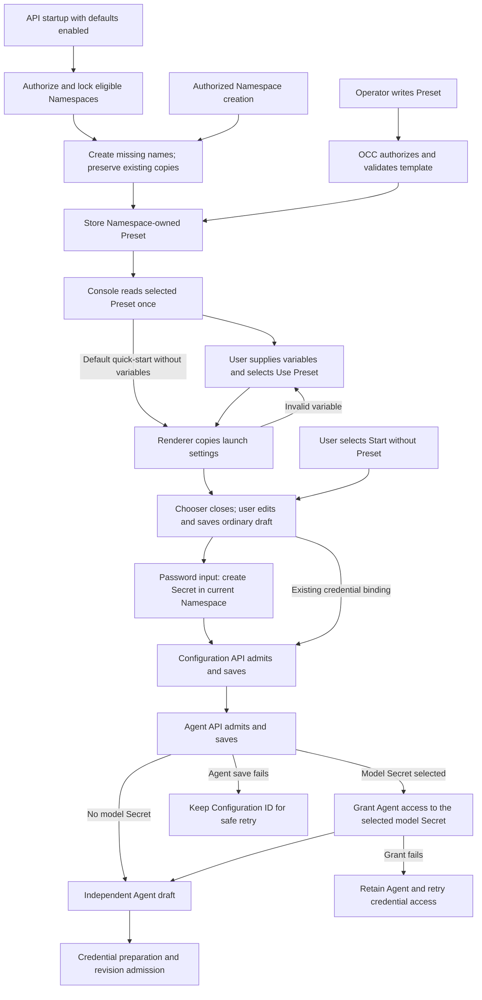

# Agent Presets flow

## Overview

The console reads a Namespace-owned Preset, renders its variables, and saves an
independent Configuration and Agent through the existing APIs. This flow starts
with Preset CRUD or selection and stops at a saved Agent draft. Deployment
continues through [revision admission](configuration-driver/persistence-and-revisions.md).

## Entry Points

- [Preset file loader](../../apps/controller/src/composition/installation-presets.ts):
  `loadInstallationPresets` reads `presets.includeDefaults` and `presets.files` before Driver composition.
  Bundled defaults are `default-codex`, **Standard Codex**, and **Standard OpenClaw**; the custom SWE Agent
  file is loaded only when explicitly listed.

- Source: `packages/contracts/src/api/routes.ts:occApiRoutes`.
- [Preset routes](../../packages/contracts/src/api/routes.ts): authenticated
  collection and exact-resource operations in a Namespace.
- [OCC Preset methods](../../packages/occ/src/index.ts): `createPreset`,
  `updatePreset`, `listPresets`, `getPreset`, and `deletePreset` own lifecycle.
- [CLI](../../internal/occcli/cli.go): `presetCommand` provides `occ preset list`,
  `get`, and `delete` over the same routes; create and update stay HTTP-only.
- [Console selector](../../apps/controller/src/console/agents/presets.mjs):
  `createPresetFields` requires a selected Namespace and an authenticated user.
  Saving also needs the existing Configuration, Agent, and credential grants.

## Flow

## Execution Trace

Before serving requests, [migration 0024](../../migrations/0024_agent_presets.sql)
creates Preset storage and adds Preset CRUD grants to the unchanged built-in
administrator Role. Its guarded update preserves customized Roles; the exact
[eligibility rules](../reference/presets.md#crud-and-permissions) belong to the Preset contract.

### 1. Include configured defaults

`apps/controller/src/composition/installation-presets.ts:loadInstallationPresets`

The loader validates the opt-in boolean and file list, reads bundled JSON, and
resolves explicit paths beside the startup YAML. It validates names/templates and rejects missing,
malformed, invalid, or duplicate-name files; a file named like a bundled default
replaces it, and API composition warns `presets.bundled-default-shadowed`. API and worker share the startup
snapshot and source path (files are not watched), but only the API applies
defaults and logs Preset warnings. [Production composition](../../apps/controller/src/composition/production.ts)
and [development composition](../../apps/controller/src/composition/development-postgres.ts)
pass generic definitions into `ControllerOptions.defaultPresets` and initialize
defaults after selecting Configuration and IAM Drivers. They try each persisted
Installation administrator in turn, moving on when one cannot create a
Namespace's Presets (say, its grant stops at the Installation); startup fails
only when none can seed. Native template contents
remain in the application bundle; OCC owns generic Preset lifecycle. Seeding and
rendering copy the native policy of the [standard Codex artifact](../../deploy/presets/standard-codex.json)
([build hosts](../guides/topics/standard-codex-preset.md#build-network-allowlist));
the deployed Codex plugin enforces it. `loadBundledPresetVersions` also loads every shipped version
listed in `deploy/presets/archive/versions.json`, whether or not defaults are
enabled, into `ControllerOptions.bundledPresetVersions`. A conformance test in
`tests/conformance/presets.test.mjs` fails when a bundled file changes without
its previous version archived there.

`packages/occ/src/index.ts:OpenClawController.initializeDefaultPresets`

Initialization authorizes Installation administration, locks Namespaces in ID
order in one transaction, and skips failed/deleting Namespaces. Missing names
require Preset create permission and ordinary template/Driver validation before
storage and mutation audit. A deny Restriction on a creation leaves the name
missing with one `presets.default-create-skipped` warning; a missing grant
still needs another administrator. While `includeDefaults` is enabled, an
existing copy of a bundled default that still equals a superseded shipped version requires
Preset update permission; its
template is replaced in place and audited with `source: installation-defaults-refresh`.
A refresh the policy refuses keeps the copy and logs one
`presets.default-refresh-skipped` warning naming it and the reason. Startup
first skips only refusals from a deny Restriction, which binds every
administrator; only when no single administrator can then complete
initialization does it skip every refused refresh. Removing the Restriction, or
granting `preset:update` to an Installation administrator, lets the next startup
refresh the copy.
Other existing copies are untouched. Any other failure rolls back
the transaction and prevents API startup. Namespace creation uses the same
helper before queuing provisioning, so denied or invalid defaults also roll back
the new Namespace. Disabling defaults leaves persisted copies alone.

### 2. Admit and store a template

`packages/occ/src/index.ts:OpenClawController.createPreset`

[`OpenClawController.createPreset` and `admitPresetTemplate`](../../packages/occ/src/index.ts)
lock the Namespace, check the exact collection grant and ready state, then call
[`normalizePresetTemplate`](../../packages/contracts/src/presets.ts).
The normalizer copies the template and fills omitted `namespaceId` fields in
Harness authentication and Configuration Secret binding sources from the locked
Namespace. Explicit scopes remain unchanged for same-Namespace validation.
Template structure, variable declarations, default types, and credential
references are checked without requiring unfilled variables. Password definitions
have no defaults and can appear only as whole tokens at `agent.harnessAuth.secret`;
literal credentials and substitution into ordinary settings are rejected. Ordinary Agent
field validation is deferred to the creation APIs. When native values exist,
the selected Configuration Driver's
`validateValues` checks their native credential rules; missing capability fails
closed. Core owns no native configuration interpretation.

The [repository](../../packages/occ/src/state/postgres-state.ts) stores the whole
template in `occ.presets`. PATCH locks the resource and replaces an included
template atomically. DELETE removes its exact IAM bindings in the transaction.
Presets prevent Namespace deletion while present. The controller's normal audit
path records mutations and denials without template or variable contents.

### 3. Read and render the selected copy

`apps/controller/src/console/agents/presets.mjs:createPresetFields`

[`createPresetFields`](../../apps/controller/src/console/agents/presets.mjs)
lists readable Presets with Namespace read, then reads the selected resource once
with `revalidate: false` for an independent draft.
**Start with default Preset** reads the listed `default-codex`, applying
variable-free templates immediately. Variables use the chooser; restoration
retains the shortcut origin. Missing defaults or
failed list/read requests cannot open a hidden hardcoded starter. Other readable
Presets remain selectable. The separate **Start without Preset** action opens
the ordinary form without reading a Namespace Preset; it does not automatically
replace a denied selection. Normal creation authorization still applies.

The shipped `deploy/presets/default-codex.json` also supplies the public
`/console/default-codex-preset.mjs` module through
`apps/controller/src/console-assets.ts:readConsoleAsset`. The form's
`configurationTemplate` reads that base for empty templates, explicit reset, and
Harness transitions, then adds model routing. The module contains only the public
bundled definition; it does not expose installed Namespace templates.

The user
reviews prefilled scalar defaults and fills typed inputs. Inputs for referenced
variables without defaults are required, so the browser flags an empty one
before rendering; defaulted or unreferenced variables stay optional. The bound password
variable offers a new masked token or an existing same-Namespace Secret. The
chooser fetches only Secret metadata, validates the original template, and replaces
the password token with the selected reference in a temporary copy. Mode changes
clear discarded tokens; stale catalog responses cannot replace a later selection.
The user then selects **Use Preset**. The shared
[`renderPresetTemplate`](../../packages/contracts/src/preset-variables.mjs)
walks JSON once, rejects missing or mistyped inputs and duplicate rendered native
keys, and preserves runtime placeholders and unresolved SecretRefs.

Rendering makes no requests and fetches no credentials. On success, the chooser
is replaced by the ordinary Agent form; the form keeps only the rendered
settings and, when selected, ephemeral existing-Secret metadata for access grants.
The chooser lists Presets alphabetically by display name.
Password values move into the ordinary masked credential input; the
chooser clears its detached password controls. Preset updates or deletion cannot alter them. Before saving,
**Start over** discards the unsaved draft after confirmation and opens a fresh
chooser. After a save succeeds or its outcome becomes uncertain, restart is
disabled so the user follows ordinary creation recovery.

`apps/controller/src/console/console.mjs:loadPage`

Before resetting the view, Console captures the unsaved form's raw editor text,
model controls, workspace files, repository selections, and staged Secret
references. The in-memory map is scoped to the signed-in user and Namespace.
Returning to an explicitly selected Preset form through navigation or browser history reconstructs it
from that copy; capability and repository discovery run again against current
access. A form started through the default Preset shortcut or without a Preset
registers for discard on exit. After
flushing captures, `loadPage` removes its creation and channel snapshots and its
retained view when navigation leaves creation or changes Namespace. Re-entry
opens the initial choices; resources already saved through the API remain.
Invalid JSON survives as text. Password controls and plugin discovery results
are excluded. Start over removes the copy; session loss, logout, a different
signed-in user, and page exit clear the map. Starting a save removes its capture
before any mutation, so a later route return cannot replay a pre-save copy as a
new Agent. Existing partial-save recovery remains local to its form.

### 4. Save an independent draft

`apps/controller/src/console/agents/create.mjs:renderCreateAgent`

[The creation form](../../apps/controller/src/console/agents/create.mjs) copies
rendered settings into editable fields and checks their form representation.
A method-only Preset authentication default selects API key or Service Accounts
without binding a Secret. The shared Secret picker requires a same-Namespace
selection. **Create new Secret...** saves immediately and stages the reference;
the browser never reads existing Secret bytes. Final Agent admission still
requires a complete authentication binding.
Rendered `agent.pluginApprovers` remains ordinary Agent draft data. Omission
inherits the form default, an empty array keeps the explicit no-approver default,
and selected channel identities are submitted through the normal Agent create
body. The Agent API and selected Plugin Driver validate the concrete approvers
after variable rendering.
Preset `agent.initialWorkspaceFiles` override matching workspace defaults,
including explicit empty strings. The shared Preset validator checks supported
filenames, Unicode, NUL, and byte limits before and after expansion; password
variables remain confined to the credential field. User-edited workspace bytes
follow the existing private workspace setup path in both regular and provisioning
creation. The form keeps Secret bindings internally and exposes channel-specific
Secret controls rather than a raw bindings editor.
Selected model Secret metadata and references survive draft navigation; raw
passwords do not. Provider or authentication-method changes clear the selection.
For an existing selection or a Secret reference already bound in the Preset,
Save uses the reference without creating another Secret. Ordinary creation grants
the new Agent's service principal exact Secret `operate` access and retains the
reference through Agent-conflict and grant retries. The caller needs permission to
manage the grant; if it fails, the saved Agent remains and the form offers a retry.
Provisioning derives the grant from `harnessAuth.source`.
For a password input, Save first creates a same-Namespace Secret, clears the
credential input, and retains the returned reference. It then creates a
Configuration and an Agent that refers to the Configuration and Secret, and
grants the Agent access. Dedicated provisioning uses the existing provisioning
flow after Secret creation. Password bytes are sent only to the Secret creation
endpoint, never as Agent or Configuration fields. Each server
request owns full schema, native credential, and authorization admission before
its persistence boundary; browser validation is not that boundary.

If Secret creation fails, the masked input remains for correction or retry.
If a later save fails, its saved Secret reference is reused.
If Configuration creation succeeds but Agent creation fails, the form retains
the Configuration ID and locks Configuration-affecting controls. A safe retry
reuses the saved Configuration. An uncertain response requires inspection before
another creation attempt. See [creation recovery](../reference/console/create-and-deploy.md#create-an-agent).

### 5. Hand off to deployment

`packages/occ/src/index.ts:OpenClawController.deployAgent`

The saved Agent has a new identity and no Preset reference. Variable inputs are
not stored as a separate map. Rendered values are ordinary Agent/Configuration
settings. Credential preparation and [revision admission](configuration-driver/persistence-and-revisions.md)
read those resources, not the Preset. Later Preset changes cannot change a draft
or an immutable admitted revision.

## Debugging and Verification

- A missing selector entry can mean missing exact Preset `read` permission;
  compare the Namespace and the authenticated list response.
- Chooser errors identify variable or form-field problems before any save. Save errors
  come from existing Configuration or Agent admission; retain request and saved
  Configuration IDs when investigating partial or uncertain outcomes.
- [Controller integration coverage](../../tests/integration/presets-controller.test.mjs)
  exercises the HTTP workflow, admission, isolation, and copy independence.
  [PostgreSQL coverage](../../tests/integration/postgres-presets.test.mjs) exercises
  persistence; [browser coverage](../../tests/browser/console-agent-presets.test.mjs)
  exercises the real selection form. Coverage names are not proof of a live model response.
- The standard Preset's [clean-build network trace](../guides/topics/standard-codex-preset.md#build-network-allowlist)
  covers source builds with cold dependency caches behind an enforcing HTTPS
  proxy. It establishes required destinations for those targets, not native
  Codex enforcement or cached-search model behavior.
- The local cluster attempt for this implementation stopped at a cgroup v2
  startup failure. A Kubernetes deployment and real model response remain
  unverified; use the [Kubernetes testing guide](../testing/kubernetes.md) on a
  supported host for that proof.

## Related docs

- [Preset contract](../reference/presets.md) and [usage guide](../guides/topics/agent-presets.md)
- [Configuration Driver](../reference/drivers/configuration.md)
- [Console creation and recovery](../reference/console/create-and-deploy.md)

## Manual Notes

## Changelog

- 2026-10-06 22:22: Locate Preset file loading in its adjacent composition module; initialization remains unchanged. (authoring-run/a45c48cd-bde3-41b1-8e3d-57bf774df237 - 17e10b6d34cc2c805b3910fddfef191d3dd1b3f8)
- 2026-10-05 05:30: Only the API logs Preset warnings.
- 2026-10-05 03:30: A file named like a bundled default replaces it and warns.
- 2026-10-05 02:30: Skip and warn on a default creation a deny Restriction refuses.
- 2026-10-04 23:40: The bundled Collector exports the skipped-refresh warning with only its Namespace and Preset IDs. (bh13-fu2-collector - e54a08048)
- 2026-10-04 23:30: A refused default refresh, such as one a Namespace deny Restriction on Preset update forbids, keeps the copy and logs a warning instead of stopping API startup.
- 2026-10-04 22:00: Refresh superseded copies only when `includeDefaults` seeded them; a `presets.files` copy of a bundled file stays.
- 2026-10-04 14:00: Refresh untouched copies of superseded bundled defaults at startup, and let any shipped version pass the Namespace deletion check.
- 2026-10-03 20:30: Seed default Presets with the next Installation administrator when one cannot create them, so an upgrade that adds a default no longer stops API startup.
- 2026-10-03 09:53: Exclude the selected Preset snapshot from replay after its values become an independent draft. (authoring-run/59d7541c-66d2-414c-8139-174fca84fe33 - f7af67dd9a7b6e5571e7d4d7c384966ba7fb31fd)

- 2026-09-28 10:36: Restore explicit creation without a Preset. (authoring-run/c140c47a-799b-48c8-929a-5d1a37eb31d1 - 9f7ae3cfb749a58394f8446f3a429db6ffa6f129)

- 2026-09-27 01:09: Preserve exit discard for the default Preset shortcut and retain explicitly selected Preset drafts. (authoring-run/048d8546-acd0-4d1a-8231-61c9d9ccb9dc - 7d0da53a8f092b0e2533464424dcb9c7fe15b139)

- 2026-09-27 00:28: Discard no-Preset creation state when leaving the flow. (authoring-run/c1812a3c-f760-4167-80ca-f4a66d8572e4 - ea187c93468f399b00ebb504fcbbed5ab21ddd8e)

- 2026-09-26 18:52: Load the plain console starter from the installed default-codex Preset and share its shipped configuration base (codex/01a0df07-06ad-7ef3-8cb9-3e4cbf7beac6 - e4a807e785e1a242e27200c8e8396f58136cbbc6)

- 2026-09-26 13:34: Trace main-form Secret selection, immediate creation, and metadata-only draft restoration. (authoring-run/33370d63-d3f8-4d66-8ad2-02dab55954e2 - 5b9fa853a23c47d410e3b7338a20ee0509041493)

- 2026-09-26 00:31: Grant ordinary drafts access to model Secrets already bound in Presets. (authoring-run/27646efe-b5bb-44a4-8d76-0506bd266237 - e387b38cc259ee4a55936ecb848bbce8210bcd68)

- 2026-09-24 21:39: Retain unsaved Console draft edits across navigation in memory, clearing credentials and preserving explicit discard (codex/01a0d557-f6e3-7da2-af52-993d05735554 - 12fc35b9c358c7992c09f7f23ffb5d4df349a19c)

- 2026-09-24 12:03: Default SWE Agent to GPT-6-Astra with Codex service-account authentication; allow existing or new model Secrets in the Preset chooser (codex/01a0d172-2f0a-7ec3-91ff-323d532464c7 - a4733ed0759840ff65907be03b49cf8979256ecf)

- 2026-09-24: Seed both standard harness presets and keep named DevDay copies opt-in.

- 2026-09-24 11:03: Load installation-linked JSON Presets and carry rendered workspace contents through Agent creation (codex/01a0d172-2f0a-7ec3-91ff-323d532464c7 - 935f91072adee63fc569e63db5fb2a5e64c77c5b)

- 2026-09-24 03:19: Grant observed clean-build hosts in the standard Codex Preset while retaining cached search and limited native networking (codex/01a0cfbd-e4cc-7d62-8542-c1358ab1bc5b - 63a70947fed440a875b2e6338d0a22500f9a9f5e)

- 2026-09-24 02:30: Add opt-in Installation default Presets with authorized, atomic seeding and preservation of existing copies (codex/01a0cfbd-e4cc-7d62-8542-c1358ab1bc5b - 451a35dbd713be383f93cd50407fc9b880b2561e)

- 2026-09-24: Add password variables and reuse the ordinary Secret creation and recovery flow (codex/01a0cfbd-e4cc-7d62-8542-c1358ab1bc5b - b682ffad80e92a9cdee1d265f0b51c735847d503)

- 2026-09-24 00:28: Bind omitted Preset SecretRef scopes to the request Namespace before admission and storage (codex/01a0cfbd-e4cc-7d62-8542-c1358ab1bc5b - 3ca1ead02d47b84fb2c4f13b305cbf263c0612a6)

- 2026-09-21 22:00: Simplify Preset selection to one-time prefill and defer ordinary launch-field validation to creation (codex/01a0b1f2-e696-7232-a439-5b668154bcd9 - f997fca7e7f739a460274c74396afbcfda63f53a)

- 2026-09-21 19:58: Link the guarded administrator grant upgrade and its eligibility contract (codex/01a0b1f2-e696-7232-a439-5b668154bcd9 - aa6dd7415d65ffba5fa40098b2142eb2a7d73df4)

- 2026-09-21 19:48: Document Preset storage, rendering, and independent Agent creation (codex/01a0b1f2-e696-7232-a439-5b668154bcd9 - aa6dd7415d65ffba5fa40098b2142eb2a7d73df4)
