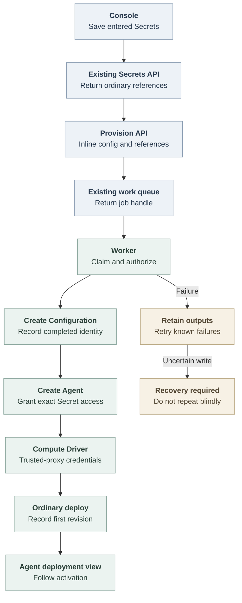

# Agent provisioning flow

## Overview

Console saves new Slack token Secrets from the channel setup modal through the existing Secrets API, then sends inline Configuration and ordinary Secret references to the provisioning API. Model authentication discovers models from an entered API key or service account token, then saves the credential as a Secret before provisioning. Presets retain their existing Secret binding. OCC queues setup work without creating placeholder resources. A worker creates the Configuration and Agent, grants the Agent access to accepted Secrets, provisions trusted-proxy runtime credentials, and admits the first deployment.

This flow ends at deployment submission. The [controller worker](controller-worker.md) and [Harness execution topology](harness-execution-topology.md) own activation, runtime failures and later deployments.

## Entry Points

- Console: `apps/controller/src/console/agents/create.mjs`, with the shared Slack Secret select/create modal in `apps/controller/src/console/channels/slack.mjs`.
- API: `packages/contracts/src/api/routes.ts:provisionAgent`, `apps/controller/src/http/agents.ts:createAgentHandlers`, and `packages/occ/src/index.ts:OpenClawController.provisionAgent`.
- Preconditions: a ready Namespace, supported Dedicated runtime and selected Drivers, PostgreSQL-backed work storage, required Agent/Configuration/deploy permissions, exact Secret access and existing transactional IAM authority. No provisioning-input keyring is required.

## Flow

## Execution Trace

### 1. Console saves credentials and freezes a provisioning request

`apps/controller/src/console/agents/create.mjs:renderCreateAgent`

Console keeps the configured Harness separate from execution mode: dedicated
OpenClaw retains its native provider/model and uses the same provisioning,
retry, and deployment navigation as dedicated Codex. Selecting OpenClaw starts
in Embedded mode; Dedicated is an explicit choice when the Installation reports
native worker support. Preset restoration and
Credentials read native model runtime policy through
`apps/controller/src/console/agents/harness-auth.mjs:configuredHarnessId`.
Service Accounts and Codex plugin browsing remain specific to Codex.

The Slack channel setup modal sends each new token to ordinary `POST /namespaces/:namespaceId/secrets` immediately, before an Agent exists. It clears entered values after the save attempt. Applying channel settings stages the returned references and environment bindings in the form. Cancelling the drawer discards its selections but retains created namespace Secrets. Model discovery uses the entered API key or service account token without saving it. Create Agent saves that credential as an ordinary Namespace Secret, clears the input, and reuses its returned reference for provisioning retries. Bound Presets retain their credential and provider. A lost Secret-save response needs recovery rather than automatic repetition.

Create Agent sends the parsed inline Configuration, ordinary Secret bindings, model-auth references, supported Agent options, selected repository bindings with an explicit access profile, and a stable request ID. The provisioning worker owns exact Secret grants; Slack has no special worker path. After an uncertain admission response, the Console resends the same request ID and accepted inputs, without resaving acknowledged Secrets.

On ordinary draft creation paths, Console creates the Configuration and Agent, then grants access to the selected Slack Secrets. A grant failure retains the saved Agent and offers Retry credential access on that Agent, without repeating creation.

### 2. OCC admits one job

`packages/occ/src/index.ts:OpenClawController.provisionAgent`

`apps/controller/src/http/agents.ts:createAgentHandlers` receives schema-validated inputs after shared admission. It supplies the Namespace from the route and creates the audit event inside the controller transaction.

OCC validates the accepted Configuration, references, workspace inputs, supported execution mode and current authority. Before a new API request enters the write transaction, the selected ChannelDriver checks configured credentials through authorized Secret callbacks. The Slack Driver checks token roles and bot authentication; this does not pin Secret versions or add worker revalidation. The repository Driver validates current Namespace selections before job admission and again when the worker creates the Agent; deployment checks the exact Harness topology through the Compute Driver. It stores the accepted request and its deduplication fingerprint in `agent_provisioning_work`, then enqueues `controller_work` with `work_kind = 'provisioning'`. Agent and Configuration creation happen later. Identical actor/Namespace/request IDs return the same work; changed input conflicts.

The `202` response contains `data.provisioning`, with the work ID and status URL. Public progress exposes result IDs and safe errors without input values or backend credentials.

### 3. The worker creates resources and credentials

`packages/occ/src/index.ts:OpenClawController.processAgentProvisioning`

The existing worker dispatches the job under its queue claim. Before effects and result commits, OCC verifies current ownership, Namespace readiness and exact authority. Completed outputs are reused on retry. Configuration creation uses the accepted inline values and existing bindings. Once that Configuration exists, OCC creates a stopped Agent, persists its auth/provider/plugin/repository/workspace selections and grants its service principal exact Secret permissions.

The Compute Driver prepares runtime credentials through the existing credential path, without a loopback HTTP call. The Kubernetes Driver owns trusted-proxy configuration and generated credential protection; provisioning carries no gateway token or trust override.

### 4. Deployment becomes the lifecycle owner

`packages/occ/src/index.ts:OpenClawController.deployAgent`

The job admits one first revision and records its ID. Provisioning reports success at this handoff. `apps/controller/src/console/agents/create.mjs:waitForProvisioning` returns those IDs immediately; the submit handler opens Agent details for that revision without waiting for activation. The detail page's Deployment activity panel reads the recorded startup result and exposes Refresh deployment. Ordinary revision reconciliation owns startup, activation and runtime failure. Later deployments use the regular Deploy API.

Dedicated OpenClaw admission requires native worker support and a Sandbox Driver
with all required containment facets. The pinned runtime lacks that support;
an operator must declare a compatible custom image in
[Installation startup configuration](../reference/configuration.md#installation-startup-configuration).
`packages/occ/src/index.ts:requireDedicatedNativeSupport` enforces both requirements.
Admission does not prove that the
Driver can deliver every workload requirement. The current Sandbox handoff
rejects workspace initialization, and stock OpenShell rejects Secret-backed
environment projection. These requirements remain enforced; the
[OpenShell flow](openshell-sandbox-provisioning.md#3-validate-and-serialize-the-sandbox)
describes the upstream delivery limits and verification-only path.

### 5. Failures preserve useful outputs

`packages/occ/src/state/postgres-state.ts:provisioning`

Safe failed steps can retry under a fresh claim and authorization check. Completed resources are retained and reused. An unresolved external write keeps its exact target and ownership evidence; lease expiry or a not-found response alone does not justify dispatching it again. No provisioning rollback or Secret deletion runs.

While initialization owns an Agent, conflicting edits and manual deployment are guarded. Stop/Delete invalidate provisioning, and stale workers cannot hand off a deployment afterward. Ordinary deletion retains its lifecycle and in-flight credential safety. Because a cancelled provisioning never runs again, Agent deletion resolves an effect it left unsettled: it waits one worker lease after the cancellation, removes runtime credentials, and records the effect receipt in the same transaction as the finalizer. The wait is deferred and does not use deletion attempts. Namespace deletion waits for queued or running work and for any effect without a matching receipt; a settled effect on failed or cancelled work does not keep the Namespace occupied. Namespace Secrets and completed Configurations remain available through their existing resource APIs.

## Debugging and Verification

- Follow the returned `data.provisioning.url` or read `GET /namespaces/:namespaceId/agents/provision/:workId`. Failed work reports a safe error. Explicit retry uses the same URL plus `/retry` and an empty body.
- Inspect `worker.completed`, `worker.error` and the `agent_provisioning` work metric. PostgreSQL job state lives in `occ.controller_work` and `occ.agent_provisioning_work`.
- Use `tests/integration/postgres-agent-provisioning.test.mjs` for persisted admission, deduplication, safe retry, retained outputs and authorization behavior.
- Use Console browser coverage for channel Secret creation before provisioning, reference reuse after failure and job-to-deployment navigation. The disposable Kubernetes fixture proves actual Driver handoff, not native enrollment, model execution or Slack replies.

## Related docs

- [Console creation and API example](../reference/console/create-and-deploy.md)
- [Controller worker and durable reconciliation](controller-worker.md)
- [Configuration Driver flow](configuration-driver.md)
- [Secret storage and delivery](secret-storage-and-delivery.md)
- [Workspace files](workspace-files.md)
- [Asynchronous Agent provisioning spec](../../specs/plans/35-agent-provisioning.md)

## Manual Notes

[keep this for the user to add notes. do not change between edits]

## Changelog

- 2026-10-03 05:30: Namespace deletion no longer waits on failed provisioning whose effect is already settled. (fix-d354/namespace-settled-provisioning)

- 2026-10-01 17:20: Point provisioning admission at the extracted Agent HTTP handlers. (authoring-run/bef09bf6-deaa-4189-9568-5f13beb451e7 - 7a6cc931d)

- 2026-09-30 17:31: Reconcile Console Harness selection with Embedded defaults, native-worker admission, and current provisioning navigation. (Codex/01a0e8ec-d02f-7b93-a59b-5b7fccf2ebaa - a0970577)

- 2026-09-29 17:30: Agent deletion settles an effect left by cancelled provisioning instead of waiting for it forever. (fix-1/agent-deletion-unsettled-effect)

- 2026-09-29 05:00: Document request-time channel credential validation. (authoring-run/bb89c55f-8771-46c9-801d-e5bc028d7e5c - 756b02ce)

- 2026-09-29 02:33: Open Agent details after provisioning hands off the first deployment, and show pending or failed deployment status there. (Codex/01a0eaf9-6dcf-76b1-a376-d2a2fbfd6c60 - a14435c8)

- 2026-09-28 17:30: Separate Console Harness selection from Dedicated placement and document retained Sandbox delivery requirements. (Codex/01a0e8ec-d02f-7b93-a59b-5b7fccf2ebaa - e2b739f5)

- 2026-09-23 21:00: Integrate provider model discovery and saved API-key/PAT references with canonical Dedicated provisioning and deployment activation. (Codex/01a0cf27-71c6-7042-8357-74d1811a2ef8 - fb711b49)

- 2026-09-23 20:21: Integrate repository selections with asynchronous provisioning and preserve draft-only discovery recovery. (public-pr/295 - 8bd367636aff766d484b4e684d42f6b4419c9e4e)

- 2026-09-23 11:20: Reused the channel setup Secret modal and preserved ordinary-create grant recovery when rebasing onto PR #323. (Codex/01a0cc7f-028b-7803-acf5-803c3d799d75 - f2dd1d3f)

- 2026-09-23 08:37: Simplified Secret saving, delayed resource creation, retry ownership and deployment handoff. (Codex/01a0cc7f-028b-7803-acf5-803c3d799d75 - 01331ac4)

- 2026-09-23 02:43: Restored existing repository-session deletion safeguards alongside the provisioning cleanup guard. (Codex/01a0cc7f-028b-7803-acf5-803c3d799d75 - 1e4936f0)
- 2026-09-23 02:20: Clarified pre-handoff mutation reservations, retained failed-work receipts, and cancellation-owned cleanup. (Codex/01a0cc7f-028b-7803-acf5-803c3d799d75 - a20f0b07)
- 2026-09-23 01:25: Corrected provisioning effect recovery to use inspect-first recovery and clarified terminal cleanup ownership. (cody/01a0cd23-4e0e-7a92-ab33-32a667859782 - 5886094b)
- 2026-09-23 00:51: Restored concrete status, exact-create recovery, generation, external-effect, retry, and cleanup details from the accepted spec. (cody/01a0cd23-4e0e-7a92-ab33-32a667859782 - 79ca801d)
- 2026-09-23 00:45: Clarified Console first-time provisioning, ordinary create separation, and versioned provisioning keyring prerequisites. (cody/01a0cd23-4e0e-7a92-ab33-32a667859782 - 79ca801d)
- 2026-09-23 00:22: Added the source-backed Agent provisioning flow. (cody/01a0cd23-4e0e-7a92-ab33-32a667859782 - 79ca801d)
