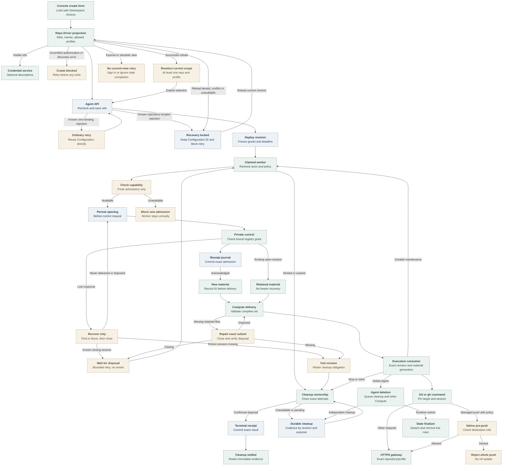

# Agent repository credential flow

## Overview

The Console lists approved repositories; admission saves selections and deployment
freezes grants. Sessions reach embedded OpenClaw or dedicated Codex with compatible
Harness authentication and no Sandbox Driver.
See [service forwarding and retirement](repository-credentials.md) and
[runtime qualification](../testing/repository-credentials.md).

## Entry Points

- `apps/controller/src/index.ts:createFastifyApp` registers repository-option and
  Agent lifecycle routes. Discovery requires Agent-create or exact-Agent update.
- `apps/controller/src/console/agents/repositories.mjs:createRepositoryFields`
  renders discovery and inherited or custom access.
- `apps/controller/src/worker.ts:ControllerWorker.prepareRevision` prepares
  repository sessions before invoking Compute.

The Installation selects a repository Driver and Backend. API, worker and service
share an immutable registry; the Namespace is ready. Unbound Agents bypass this.

## Flow

## Execution Trace

### 1. Project choices and resolve Namespace policy during Agent admission

`OpenClawController.listRepositoryOptions` authorizes Namespace Agent creation
or exact-Agent update, checks Compute-owned availability, then projects opaque references,
names and profiles through `GitHubRepoDriver.listOptions`. Exact Harness validation
remains at deployment. No approvals yields `[]`; closed Namespaces conflict.
Classified optional discovery failures map to `503 REPOSITORY_OPTIONS_UNAVAILABLE`.

`createRepositoryFields` searches up to 1,000 choices with 16 attachments;
`repositorySettings` resolves inheritance intent through RepoDriver and the
database checks concrete bindings. Only fresh, empty drafts permit the classified
outage. For up to 20 visible refs,
`apps/controller/src/drivers/repo/github/credentials/descriptions.ts:createGitHubRepositoryDescriptions`
fetches descriptions with repository-scoped, metadata-only tokens, sharing the
provider queue and cleanup lifecycle. Missing metadata never blocks selection.

The form saves Configuration first and preserves it after known Agent rejections.
Retries reuse it; repository retries require successful reload and nonempty
reselection. Failed reloads block creation; obsolete completions cannot mutate the view.
Unknown outcomes require stored Agent and Configuration reads.

`packages/occ/src/index.ts:OpenClawController.repositoryBindingSelections`
uses `resolveRepositoryBindings` after existing authorization. Inputs contain distinct opaque references and optional profiles, never provider tokens
or caller-selected grant identities; selections keep request order. The concrete
`apps/controller/src/drivers/repo/github/driver.ts:GitHubRepoDriver.resolve`
uses local registry policy, defaults omitted legacy profiles to `git-write`, and
makes no control-socket or GitHub calls.

`apps/controller/src/drivers/repo/github/credentials/registry.ts:resolveGitHubRepositoryBinding`
requires the exact Namespace/reference/profile combination. Its fingerprint
binds provider/App/installation/repository identity, duration policy and complete
Namespace profile policy, exact permissions and optional normalized
push-ref allowlist. Each binding has one grant; installations can supply several
repositories. OCC stores normalized Agent selections; an omitted update array
preserves them and an empty array clears them.

### 2. Freeze a deployable revision

`packages/occ/src/index.ts:OpenClawController.admitRepositoryCredentials`
re-resolves the draft, validates Compute topology and freezes Driver identity,
grants and an absolute deadline unaffected by renewal or recovery. Duration
`86400` allows 24 hours. `apps/controller/src/http/agents.ts:clientRevision` returns
only Driver identity, references, profiles and deadline.

`apps/controller/src/composition/repository-credentials/platform.ts:composeRepoDriver`
constructs `GitHubRepoDriver` for capability `repo` from a Backend-owned Unix
client, validated registry and public CA. Installation and Backend membership
must select the same Driver ID. The API and worker never load the token engine or
App key. The [production startup flow](production-startup.md) owns composition and
sidecar launch; the service validates protected inputs before listening.

### 3. Record ownership before opening a session

`apps/controller/src/worker/repository-credentials.ts:RepositoryCredentialLifecycle.prepare`
rechecks actor, Namespace, Agent, revision, Driver, grant and deadline. Before a
fresh attempt, `GitHubRepoDriver.checkAdmissionReady` checks the broker capability
with a bounded request. The worker also checks it before refreshing readiness.
An unavailable capability blocks fresh admission, but not recovery or cleanup.
Under the live claim and Namespace/Agent locks, State records the attempt and
immutable cleanup context before the Driver call. It rejects stopped or deleting
owners and stores identifiers and phases, never bearers or client files.

`apps/controller/src/backends/repository-credentials/control-client.ts:UnixRepositoryCredentialControlClient`
sends the bound request over the private socket. The service independently
resolves and compares the grant through
`apps/controller/src/drivers/repo/github/credentials/registry-factory.ts:createGitHubRegistryDriverFactory`.
The client validates each status before projection. `DISPOSED` permits historical
revoked or expired counts, but no active, pending or uncertain obligations.

Only a created response contains the bearer. The Driver encodes transient files with
`apps/controller/src/drivers/repo/github/credentials/client/config.ts:encodeRepositoryCredentialSessionFiles`,
returning status with that closed file map. The worker
records the session ID before passing files to
`ComputeRevisionContext.repositoryCredentials`.

A confirmed open session yields a `retained` binding without files. `recoverOnly`
finds or fences unfinished admissions and closes recovered sessions.
Fresh material requires confirmed disposal or a missing opening without a recorded
session ID; invalidated known sessions block automatic same-revision replacement.
Closing sessions raise `REPOSITORY_CLEANUP_PENDING` until disposal, subject to Work
bounds and the revision deadline. Validated `DISPOSED` observations survive service pruning.
`apps/controller/src/drivers/repo/credentials/control.ts:createControlAdmission`
reserves before releasing material. The worker's
`apps/controller/src/backends/repository-credentials/receipt-store.ts:RepositoryReceiptStore`
commits exact admission fences and original-broker terminal observations. Failure
before terminal commit remains unknown; transport failure cannot establish absence.

### 4. Deliver and retain one complete runtime generation

`apps/controller/src/drivers/compute/kubernetes/repository-material.ts:repositoryMaterialSpec`
validates `new | retained` bindings against the revision and hashes sorted
reference/session pairs.
`apps/controller/src/drivers/compute/kubernetes/repository-material-store.ts:RepositoryMaterialStore.prepare`
validates ownership, contents and deadlines before creating immutable Agent/revision-owned
Secrets. It rechecks deadlines after requests and before creation or return;
expiry leaves Secrets for owned cleanup. For missing retained
bindings, `RepositoryCredentialLifecycle.repair` closes that subset, requires
disposal, then retries Compute once. Missing inventory fails;
pending closure blocks replacement until bounded retry or continuation confirms
disposal.

`apps/controller/src/drivers/compute/kubernetes/repository-material.ts:repositoryMaterialDeployment`
mounts Secrets only in the first initializer. Sorted projections prevent key-order rollouts; session replacement still rolls.
`apps/controller/src/drivers/compute/kubernetes/repository-material-init.ts:REPOSITORY_MATERIAL_INIT_ENTRYPOINT`
validates the complete projection, then writes mode-0700 directories and
mode-0600 files in memory. `REPOSITORY_NATIVE_GIT_INIT_ENTRYPOINT` mounts the
private subPath at `/run/oce/repository-credentials`, avoiding the fsGroup-writable
root. It calls
`apps/controller/src/drivers/repo/github/credentials/client/native-git.ts:prepareNativeGitConfiguration`
with private-file checks. Retry removes only a validated private `gitconfig`.
Both gate startup; the consumer mount is read-only. Metadata and gateway
bearers remain separate.

`apps/controller/src/drivers/compute/kubernetes/index.ts:KubernetesComputeDriver.activateRevision`
replaces consumers on material changes, even within one revision.
Readiness requires role, revision, generation and current deadlines.
Dedicated replacement preserves enrollment and revision-private storage.
`KubernetesComputeDriver.prepareRevision` rechecks material after plugin,
gateway and node observations; changed generation, lost readiness or expiry
returns incomplete. Activation rechecks deadlines after final observations.
Dedicated gateways lack repository material and repository-gateway egress.
Both consumers trust CAs through `SSL_CERT_FILE`, `GIT_SSL_CAINFO` and
`NODE_EXTRA_CA_CERTS`; overrides fail.
Compute grants consumer egress; Helm admits consumers through
[credential-sidecar ingress selectors](../reference/drivers/kubernetes-compute/networking-and-isolation.md#networking). Native preparation
writes aggregate `gitconfig` without reading bearers. System Git includes
`/run/oce/repository-credentials/gitconfig`, preserving HOME/global configuration.
Embedded `repositoryNativeConfiguration` keeps the `gh` router first in
`tools.exec.pathPrepend`. `AGENT_RUNTIME_ENTRYPOINT` sets Codex's
`allow_login_shell=false` and `shell_environment_policy.set.PATH`. Model authentication remains intact. App keys, JWTs, installation tokens and the
control socket never enter consumer material. Selected Codex plugins can read `/app/node_modules/openclaw`,
`/home/node/.openclaw/plugin-skills` and `/home/node/openclaw-runtime-assets/plugin-skills`
for the stock app-server and published skills inside sandboxed Codex tools. Repository-bound Codex consumers additionally receive stock Codex
`allow_local_binding = true`, `mode = "full"`, and the exact broker hostname
allowance; explicit denies prevail. That repository profile also grants
read-only access to `/opt/oce/repository-credentials` and
`/run/oce/repository-credentials` so the native binary, Git helper, and generated
session material remain reachable. The
[networking contract](../reference/drivers/kubernetes-compute/networking-and-isolation.md#networking)
defines dedicated/embedded eligibility. Unbound policy, broker authorization and TLS verification remain unchanged.

### 5. Authenticate native Git and route GitHub CLI commands

Stock Git owns commands, remotes, push URLs, worktrees and settings. Configuration
rewrites canonical HTTPS hosts to their gateway origin. The scoped helper checks
host/path, generation and deadline before supplying the bearer. `OCE_REPOSITORY_REF`
disambiguates bindings, not destinations. Local identity, hooks, aliases, overrides
and other helpers remain available; there is no whole-command preflight or egress
confinement.
See the [routing limits](../reference/repository-credentials.md#client-routing-and-limits).
`pushRefAllowlist` selects image-owned hooks.
`apps/controller/src/drivers/repo/github/credentials/client/hook-dispatch.ts:checkPush`
matches the destination, normalizing trailing slashes and validating
usernames after binding selection; duplicate grants remain ambiguous. It checks
every destination ref and rejects the whole push before updates, though discovery
may contact the service. It delegates original arguments and input to
common-directory hooks. `commonDirectory` uses Git-supplied directories before
initial `HEAD`; linked worktrees resolve their shared directory through Git.
Custom hook paths and
API writes remain outside this [best-effort guardrail](../reference/repository-credentials/push-ref-guardrail.md).

`apps/controller/src/drivers/repo/github/credentials/client/router.ts:routeRepositoryClient`
routes supported `gh` commands using explicit targets or effective Git remotes.
It pins generation, reference and session, selects private `gh` configuration
and preserves HOME without mutating shared selection.

`apps/controller/src/drivers/repo/github/credentials/profiles.ts` owns the exact
Reader, Contributor and Collaborator permission maps. The GitHub route classifier
admits profile-selected REST operations and token-bounded GraphQL for
all three. Every GraphQL POST remains a possible write; Reader's token, not a
query parser, enforces its read-only grant. See
[access levels](../reference/repository-credentials/access-levels.md).

The [service exchange flow](repository-credentials.md#4-reserve-acquire-and-dispatch)
enforces bearer, immutable repository/profile, capacity and deadlines, acquiring
fresh installation tokens under the same grant until the revision deadline.

### 6. Maintain, recover and retire ownership

`apps/controller/src/worker.ts:ControllerWorker.completeActivatedRevision`
commits completion and maintenance together, preserving the original actor.
Repository revisions use the Driver's 30-second interval or a shorter Compute
interval. Restart resumes queued work without inventing actors. A committed terminal
receipt survives broker restart; a missing known session remains invalidated.
`REPOSITORY_SESSION_RECOVERY_UNSAFE` permanently fails observation and queues
runtime retirement; later workers cannot remint for that revision. An authorized user can
deploy a new revision without settling old cleanup.

`apps/controller/src/worker.ts:ControllerWorker.finalizeActiveRevision`
atomically fails bounded observations and enqueues successors while the active revision remains authorized. Stop, policy drift, expiry and revoked authority
cannot use this continuation to reopen sessions.

`packages/occ/src/state/postgres-work-queue.ts:PostgresWorkQueue.enqueueRepositoryCleanup`
and terminal queue transitions persist exact revision-owned obligations. Registration checks claim and owner; recovery transfers eligible failures.
Work coalesces by revision and purpose, retaining its creating actor and source failure evidence. Queued or claimed Work keeps its
schedule and claim; later obligations requeue succeeded Work. Previously queued
cleanup remains eligible.
`RepositoryCredentialLifecycle.closeRevision` records session-only cleanup with
the attempts it marks closing. Cleanup retries at the Driver interval without consuming Work retries.

`ControllerWorker.processRepositoryCleanup` consumes validated owner-bound Work
without policy resolution, admission or material delivery, even after the actor
loses ordinary permissions. Terminal-runtime Work fences attempts, closes sessions
and calls Compute's `stopRevision` for that revision. Compute mismatch or stop
failure remains retryable beyond foreground limits. Completion requires settled
sessions and runtime retirement. Session-only repair/rotation never stops healthy
workloads. `CLOSED` denies local use but awaits disposal; missing inventory or
invalidation does not prove provider settlement. Retained attempts support
cleanup after revision deletion.

`ControllerWorker.processAgentDeletion` queues cleanup and retires Compute without
waiting for sessions. After owner detachment, cleanup Work uses its revision key
for dispatch and audits. Under the current claim,
`PostgresWorkQueue.completeAgentDeletion` calls `occ.finalize_agent_deletion` to
detach attempts, delete live rows and audit deletion atomically. Attempts and cleanup Work survive without fabricated disposal. Sessions block
neither admission nor completion. Unresolved provisioning effects
still defer completion without consuming retries.

Compute retirement waits for owned Pods to stop before removing their material.
It preserves Secrets referenced by actual Pods and current Deployments, and
limits deletion to exact ownership with UID preconditions. Stop removes only
the stopped revision's route and preserves newer shared resources. Route and
Deployment deletion require the observed resourceVersion. Shared cleanup remains
retryable after partial failure. Service restart cannot prove remote token revocation.

## Debugging and Verification

Compare `occ agent get AGENT_ID --output json` with the admitted `activeRevisionId`.
Inspect worker events for
`REPOSITORY_BINDING_CHANGED`, `REPOSITORY_CREDENTIAL_DEADLINE_EXCEEDED`,
`REPOSITORY_SESSION_RECOVERY_UNSAFE`, `REPOSITORY_CLEANUP_PENDING` or
`REPOSITORY_CLEANUP_COMPLETE`. Check registry identity and deadline before retry.

`repository-not-admitted` means an unselected target; `name-one-repository-target`
or `name-one-repository-ref` requires explicit selection. Inspect metadata
and Pod generation without printing credentials.

The [test guide](../testing/repository-credentials.md) distinguishes lifecycle,
installed-runtime and live-provider proof. The
[image volume case](../testing/images.md#repository-runtime-volume-test-environment)
checks Docker mounts; Helm checks rendered ingress. Neither proves CNI enforcement.
Console recordings cover fixture/API behavior, not model, Slack or GitHub execution.
Ready Pods and commands do not prove live writes.

## Related docs

- [Repository credential reference](../reference/repository-credentials.md)
- [Install repository access](../guides/repository-credentials/installation.md)
- [Create and use a repository Agent](../guides/repository-credentials.md)
- [Controller worker lifecycle](controller-worker.md)
- [Credential service execution](repository-credentials.md)

## Manual Notes

[keep this for the user to add notes. do not change between edits]

## Changelog

- 2026-10-01 17:20: Point the safe revision response projection at its Agent HTTP owner. (authoring-run/bef09bf6-deaa-4189-9568-5f13beb451e7 - 7a6cc931d)

- 2026-09-30 05:21: Deliver broker CA settings to both repository consumers. (01a0ed9e-6c22-7671-9ee1-a58e1df39acd - ab0a1838)

- 2026-09-30 03:57: Recheck material deadlines. (authoring-run/00e5c01e-b8c9-46df-a8ac-45aa0e6932da - 5334a55faf3ced4bf9e0971daad6fd34ad2fe982)

- 2026-09-29 20:00: Trace repository descriptions, inheritance and overrides. (public-pr/374)

[Agent repository credential documentation history](agent-repository-credentials/history.md) preserves the older dated entries.
