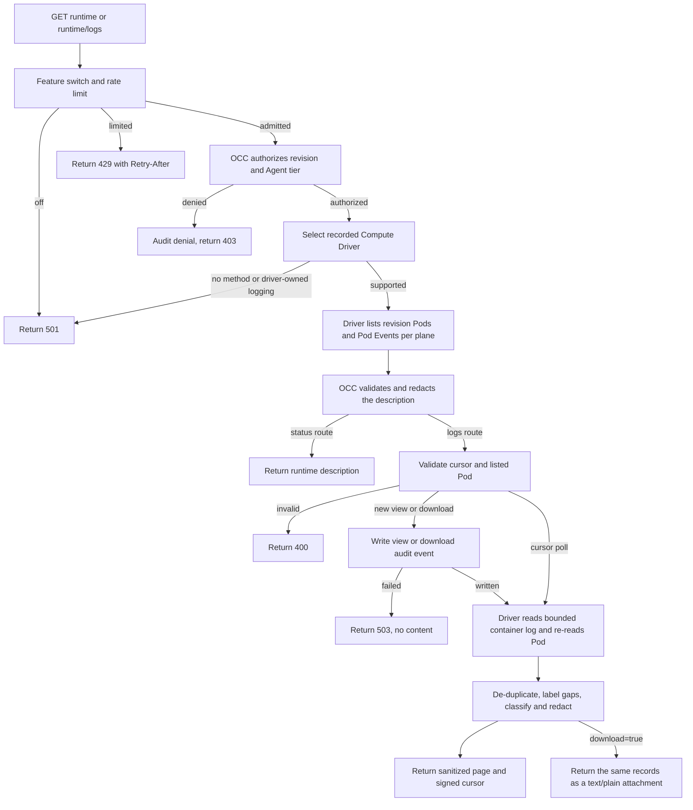

# Agent runtime logs flow

## Overview

An authorized reader requests Pod status or one page of container output for an
admitted Agent revision. OpenClaw Control Plane (OCC) authorizes the exact target,
asks the selected Compute Driver for raw Kubernetes data, and returns only
classified, redacted, bounded records. Nothing is stored on the server; a
download is a local file on the reader's device.

## Entry Points

- Trigger: `GET /namespaces/:namespaceId/agents/:agentId/deployments/:deploymentId/runtime`
  and `GET .../runtime/logs` (optionally `download=true`) from the console Logs
  tab, `occ agent runtime|logs` (`internal/occcli/cli.go`) or the API. The CLI
  defaults to the active revision, else the latest revision
  (`agentRevision`, `latestRevisionID`).
- Source: `apps/controller/src/index.ts:createFastifyApp`,
  `packages/occ/src/index.ts:OpenClawController.describeAgentRuntime` and
  `readAgentRuntimeLogs`, `packages/occ/src/runtime-logs/`, and
  `apps/controller/src/drivers/compute/kubernetes/index.ts:KubernetesComputeDriver.describeAgentRuntime`
  and `readAgentRuntimeLogs`.
- Assumptions: `deploymentId` is an admitted AgentRevision ID. Status needs exact
  Agent `operate` and `read` plus AgentRevision `read`; log text needs Agent
  `read_logs` or `administer` instead of `operate`, and no AgentRevision grant
  (`OpenClawController.authorizeRuntimeLogRead` tries `read_logs` first and
  falls back to `administer` unless a Restriction denied `read_logs`). The
  revision must still belong to the exact Agent, so an Agent grant covers every
  revision that Agent deploys.

## Flow

## Execution Trace

### 1. Admit and authorize

`packages/contracts/src/api/routes.ts:occApiRoutes` declares both GET routes with
a closed query schema. `apps/controller/src/index.ts:perform` answers `501` when
`agentRuntimeLogs` is disabled and applies the replica-local
`apps/controller/src/http/runtime-logs.ts:RuntimeLogLimiter`.
`OpenClawController.runtimeLogTarget` authorizes the tier action and Agent `read`
(plus revision `read` for status only), resolves the revision within the exact
Agent, then rejects a Driver without `describeAgentRuntime` or with
`runtimeLogging: "driver"`.

### 2. Describe the runtime

`KubernetesComputeDriver.describeAgentRuntime` resolves the owned Namespace, then
lists Pods by the exact Agent, revision and workload-role labels: dedicated
Gateways in the control-plane Gateway namespace, Harnesses and embedded Gateways
in the tenant namespace on the execution plane. It lists Events by
`involvedObject.uid`, keeps only that Pod's Events, caps them at 100 and takes each
Event's `container` from `involvedObject.fieldPath` (`spec.containers{name}` or
the init or ephemeral form; `null` for Pod-level Events such as `Scheduled`). A log
read passes `{ source, events: false }`, so it lists only that source's Pods and
no Events. Each
Kubernetes call has a five-second deadline; a `403` becomes
`RuntimeLogsForbiddenByClusterError`. `runtime-logs/description.ts:validRuntimeDescription`
checks names, UIDs and counts, masks node, image and Secret names in Event
messages (`runtime-logs/redact.ts:maskRuntimeEventText`) and redacts reasons and
Event messages.

### 3. Read one page

`runtime-logs/read.ts:readRuntimeLogPage` verifies the HMAC cursor
(`runtime-logs/cursor.ts`) against the principal, Agent, revision and source,
and accepts only a Pod the description listed. A request without a cursor, or
with one older than an hour, or a cursor whose Pod is gone, starts a view: the controller appends
`openclaw.agents.runtime_logs.view`, an `access` audit event naming the admitting
action, before any log read. The Driver re-checks
Pod ownership, calls `readNamespacedPodLog` with `tailLines`, `sinceSeconds`,
`previous`, a 1 MiB `limitBytes` and timestamps, and re-reads the Pod. A cursor
poll derives `sinceSeconds` from the cursor: from its newest delivered line, or,
when the view has delivered nothing yet, from the previous read (a full or
byte-cut tail then emits `window_exceeded`). OCC
drops lines already delivered at the cursor time, emits `stream_replaced`,
`window_exceeded`, `cursor_expired` or `truncated` gaps, and passes the rest to
`runtime-logs/sanitize.ts:sanitizeRuntimeLogChunk`, the only producer of
`SanitizedRuntimeLogRecord`. It classifies the whole page first, so
`runtime-logs/redact.ts:maskPemBlockLines` can mask a PEM block whose BEGIN,
body and END lines arrive as separate plain-text lines.

For container follow polls, the signed cursor also carries optional `pemOpen`
and `pemAfterTime` state. It describes the delivered boundary, not the start of
the fetched overlap. The reader validates timestamp order in the consumed prefix
through the last delivered line, without replaying older content through that
state. Each delivered line is compared with the reliable `pemAfterTime` from the
prior cursor, not with an earlier line on the same page. Only a line strictly
newer than that prior frontier can close a carried open block. Thus an ordered
same-page BEGIN and END at the same newer timestamp can close it. Times at or
before the prior frontier and evicted line hashes do not establish forward
progress; replayed overlap cannot erase a carried later BEGIN. Ordinary non-PEM
text remains visible while ambiguous context stays open.

Missing, invalid or reordered times make the frontier uncertain (`null`); later
timestamped pages alone cannot repair that uncertainty. Empty polls preserve it,
and lines beyond the page or byte cut do not advance it. A new view, expiry,
instance/Pod change or replacement during the read discards the old context.
The paired fields are validated together under the existing cursor MAC; malformed
or inconsistent pairs fail as `cursor_invalid` before a Driver read. Legacy
cursors and initial tails without observed PEM boundaries remain unknown and
best-effort. This does not recover missing log history or change JSON withholding,
short-token patterns, bracket-tag classification or sandbox pagination.

`source=sandbox` skips the Compute description. `OpenClawController.readSandboxLogs`
lists the source only when the selected Sandbox Driver provisioned the revision
and implements `readSandboxLogs`, resolves Compute's placement with
`resolveSandboxNamespace`, and runs `runtime-logs/sandbox.ts:readSandboxLogPage`.
`OpenShellSandboxDriver.readSandboxLogs` derives the Sandbox name from the
revision and calls `GetSandboxLogs` through `openShellSandboxLogReader`, which
exposes nothing else. OpenShell stamps supervisor lines when recorded but
batches them, and filters `since_time` by that stamp, so a resume sends a time
`SANDBOX_LOG_OVERLAP_MS` (5 s) behind the newest delivered line; the cursor
keeps one hash per line delivered since then (up to 48), and each re-read line
consumes one. A view's first page floors its resume time at the requested window
start. If no remembered line came back and nothing older did, OCC emits
`buffer_lost` or, when the window was full, `window_exceeded`; more than 48
lines in one millisecond also emit `window_exceeded`. gRPC `NOT_FOUND` (absent
Sandbox, or concealed from a non-member) maps to
`RUNTIME_LOGS_SANDBOX_NOT_FOUND`, never to an empty page. Lines naming two
Sandbox IDs are refused; a new Sandbox ID emits `stream_replaced`.
`sanitizeSandboxLogLines` parses the OCSF shorthand into allowlisted fields.

A download (`download=true`) forces `tailLines` to 1000, rejects a `cursor` with
`400`, and always starts a new view; `apps/controller/src/index.ts:auditAction`
names its audit event, and any denial, `openclaw.agents.runtime_logs.download`.

### 4. Return

`apps/controller/src/http/runtime-logs.ts:runtimeLogPageBody` accepts only
sanitized records and fails on the reserved `content` class.
`runtimeLogDownloadBody` serializes the same branded records as text lines with
the same check, and `runtimeLogDownloadFileName` names the attachment
`<agent>-<revision>-<source>-<pod>.log`. A `minLevel` query
(`runtime-logs/read.ts:runtimeLogPageAtLevel`) removes sanitized lines below that
level after the cursor is signed, so polls resume after hidden lines; unknown-level
lines, gaps and withheld counts stay. The console asks for `minLevel=info` unless
**Include debug** is selected; its level chips and text filter
(`apps/controller/src/console/agents/logs.mjs`) run only over loaded rows. The
console remembers a `403` from either route for the signed-in operator for the
page session, so reopening the Logs tab adds no audited denial, and another
operator signing in on the tab asks again. Its status message names the
log-text grants too. On the Gateway source it points to the Harness source while
no Harness Pod is ready, or to Deployment activity while none exists. The
CLI's `--follow` loop re-sends the cursor every 2 seconds. Driver errors map to
fixed `RUNTIME_LOGS_*` codes; the whole request has a ten-second deadline.

## Debugging and Verification

- `503 RUNTIME_LOGS_CLUSTER_RBAC` means the API ServiceAccount lacks
  `pods/log`, `events` or, on an execution cluster, `pods` reads in that
  namespace. `503 RUNTIME_LOGS_AUDIT_UNAVAILABLE` means no output was read.
- `tests/conformance/runtime-logs-content.test.mjs` plants credentials, prompts
  and protocol lines through the real handler; `occ-api-security.test.mjs` covers
  tiers, cursors and failures; `kubernetes-compute.test.mjs` covers plane
  selection, Event filtering and the typed `403`. These use in-memory Kubernetes
  responses; `agent-runtime-logs-k3d-real.test.mjs` reads a real cluster.
  The same content suite exercises the real reader, cursor and sanitizer with
  synthetic Driver pages: cross-poll masking, replay/eviction, uncertain times,
  cuts, paired-field validation and stream/view resets. A separate handler case
  checks the serialized cursor through the supported controller fixture. These
  controls do not establish real-cluster behavior.
  `runtime-logs-sandbox.test.mjs` drives the sandbox source through the real
  handler and OpenShell Driver with a gateway client that answers only
  `GetSandboxLogs`; `openshell-gateway-wire.test.mjs` checks the wire shape.

## Related docs

- [Agent logs guide](../guides/topics/agent-logs.md)
- [Console and API runtime log reads](../reference/security.md#console-and-api-runtime-log-reads)
- [Compute Driver runtime status and logs](../reference/drivers/compute.md#optional-runtime-status-and-logs)

## Manual Notes

[keep this for the user to add notes. do not change between edits]

## Changelog

- 2026-10-03 03:00: A cursor from a page that delivered no line resumes from that page, not the whole tail. (bughunt-1/fix-runtime-logs-quiet-follow)

- 2026-10-01 14:00: Add the server-side `minLevel` floor and the console's **Include debug** control. (fix-d79 - 3d6ce1fdb)

- 2026-09-30 23:44: Clarify the prior cursor frontier and ordered same-page PEM boundaries without changing masking behavior. (authoring-run/2c8a089c-ec67-402d-8cfd-ec8b29c5e3fe - a4cddf26bc462744bfff912b1e1cdb9f1ee60cd2)

- 2026-09-30 20:37: Receive cursor-context masking with current runtime-log guidance and preserve the current view behavior. (authoring-run/e2da7c2d-8080-4dd4-9ce9-d494b890234c - fb22aa07c1613218280cff25d6b62bfb4cff6b5d)

- 2026-09-30 19:43: Carry authenticated PEM context across bounded container polls without closing on ambiguous overlap. (authoring-run/b5fcaf0e-328a-4fe2-b53f-e72268ef70af - affac2bfc1370e590e6da570bcaaad4a207c9f09)

- 2026-09-30 08:30: Document runtime status and container log reads for Kubernetes Compute. (build-1/agent-logs-slice-1 - 0918be781)
- 2026-09-30 11:40: Add downloads, console filters and the `occ agent runtime|logs` callers. (build-2/agent-logs-slice-2)
- 2026-09-30 13:00: Add the OpenShell sandbox source. (build-logs-3/agent-logs-slice-3)
- 2026-09-30 15:30: Overlapping sandbox resume with counted de-duplication; NOT_FOUND is a 503. (fix-3/agent-logs-slice-3)
- 2026-09-30 18:10: Console remembers a runtime status denial per page and points unready-Harness Gateway views to the Harness source. (dogfood3-fix-7)
- 2026-09-30 18:30: Without an active revision the CLI reads the latest revision; a failed deployment links to its version's Logs tab. (fix/dogfood3-5)
- 2026-09-30 20:00: Key remembered denials by operator; the Harness hint ignores a rollout's old Pod and covers a missing Pod. (dogfood3-refix-7)
