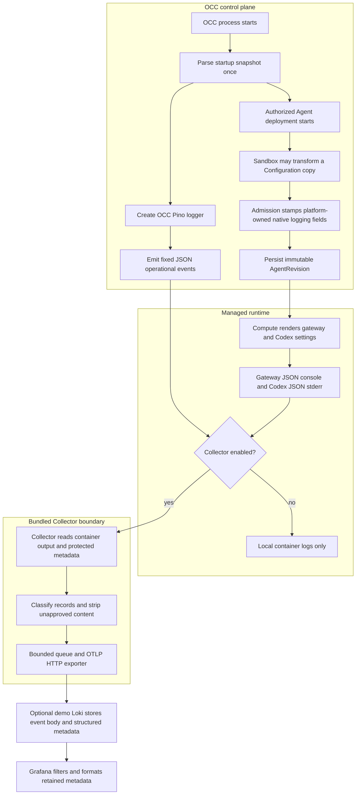

# Common Operational Logging Flow

## Overview

Trusted startup configuration selects the OCC logging level. Authorized Agent
deployment freezes runtime logging in an immutable AgentRevision. Optional
Collectors export reviewed operational records; PostgreSQL audit remains separate
durable evidence.

## Entry Points

- Trigger: start the API, worker, migration, or bootstrap process; deploy an
  Agent; enable the optional Docker Compose or Helm logging Collector.
- Source: `apps/controller/src/composition/installation-config.ts:loadStartupConfigurationSnapshot`
- Source: `packages/occ/src/index.ts:OpenClawController.deployAgent`
- Source: `deploy/helm/openclaw-enterprise/templates/collector.yaml:logging.collector.enabled`
- Assumptions: trusted startup YAML, an authorized deployment request, selected
  Compute Driver support, and operator-owned Collector configuration when remote
  export is enabled.

## Flow

## Execution Trace

### 1. Startup parses one configuration snapshot

`apps/controller/src/composition/installation-config.ts:loadStartupConfigurationSnapshot`

API and worker parse trusted YAML once and pass `startupConfiguration.logging`
to driver composition. Invalid settings fail startup before requests or work.
Bootstrap, maintenance, and the worker's fallback read only the logging section
through `apps/controller/src/composition/startup-file.ts:loadOperationalLoggingConfiguration`,
which shares the snapshot's file reader and checks. The migration command imports
that module directly, so it never loads Drivers.
See the [settings reference](../reference/settings.md) for YAML shape and values.

### 2. Processes log fixed sanitized events

`apps/controller/src/server.mjs:start`

Worker (`apps/controller/src/worker.mjs`), bootstrap
(`scripts/bootstrap-installation.mjs`), and migration (`scripts/migrate-production.mjs`)
also create Pino loggers at the selected level. The API disables Fastify request
logging. Bootstrap and migration separate success protocol output from structured
failure diagnostics. Before Pino writes, `apps/controller/src/logging.ts:emitOccLogEvent`
keeps reviewed scalar fields and drops unapproved fields, credentials, provider
payloads, request/reply objects, and unsafe strings. This source boundary precedes
the separate Collector filter in step 7. For worker records, the Collector retains
allowlisted `work.operation` values and bounded `work.id` shapes. Agent stop keys
and credential withdrawal keys include the operation UUID; deletion keys have no
operation suffix. Unsupported values and key shapes are excluded.

Compute preparation failures may include a Driver-reviewed stage, classification,
status, and bounded message. The worker never serializes the raw exception, and
the sanitizer drops secret-shaped messages before local output.

### 3. Admission freezes runtime logging

`packages/occ/src/index.ts:OpenClawController.deployAgent`

If the trusted ComputeDriver declares `runtimeLogging: "driver"`, admission
validates and freezes the native document without rewriting logging fields. The
[Compute contract](../reference/drivers/compute.md#runtime-logging-ownership)
owns that pipeline; OCC logging and audit remain unchanged.

Otherwise, the SandboxDriver may transform a frozen copy of the Namespace-owned
Configuration. Deployment stamps native fields before validation: matching
`logging.level` and `logging.consoleLevel`, JSON console style, and
`diagnostics.otel.logs=false`. It drops the retired `logging.redactSensitive` key.
Runtime code owns console and tool redaction. The source Configuration is unchanged;
the immutable AgentRevision retains the admitted policy across restarts and later edits.

### 4. Compute renders settings from the revision

`apps/controller/src/drivers/compute/docker/index.ts:DockerComputeDriver.prepareRevision`

Kubernetes uses
`apps/controller/src/drivers/compute/kubernetes/index.ts:KubernetesComputeDriver.deployment`.
Both Drivers require consistent admitted logging fields. Kubernetes mounts the
document read-only at `/etc/openclaw/openclaw.json`. Gateway logs JSON to console;
dedicated Codex app-servers use JSON stderr and host-owned arguments that disable
OTLP export and prompt logging. Lifecycle hooks and SecretBindings cannot override
those destinations.

### 5. Docker collection is an explicit development override

`apps/controller/src/drivers/compute/docker/index.ts:DockerComputeDriver.prepareRevision`

The optional `compose.logging.yaml` routes OCC, gateway, and Codex containers
through Docker's nonblocking `fluentd` driver to a pinned Collector. Docker
Compute sets runtime `LogConfig` from `OCC_DOCKER_LOGGING_ADDRESS`, which must be
reachable from the Engine. See the [Docker procedure](../guides/observability.md#docker-compose).

### 6. Kubernetes collection is bundled or equivalent

`deploy/helm/openclaw-enterprise/templates/collector.yaml:logging.collector.enabled`

The Helm Collector DaemonSet reads node CRI files and uses Pod metadata to
associate records with managed workloads. See the
[Kubernetes observability procedure](../guides/observability.md#kubernetes-and-helm)
for enablement and existing-Collector reuse, and the
[security reference](../reference/security.md#operational-log-collection-boundary)
for isolation limits.

`k8sattributes` maps identity before `transform/kubernetes-resource` removes
internal Pod labels; removing shared labels per record would lose identity for
later records in the batch. It also blocks pipeline start until its Pod cache
syncs: `filelog` reads existing CRI files immediately, and a record processed
without Pod identity is filtered out while its offset is still committed, so
startup events such as `worker.started` would otherwise be lost for good.

Before emitting the DaemonSet,
`deploy/helm/openclaw-enterprise/templates/_helpers.tpl:openclaw.quantity`
checks the Collector resource and volume quantities for obvious syntax errors.
Malformed values stop rendering with the setting name; absent optional limits
pass through. Kubernetes performs complete validation after rendering. See the
[production settings](../reference/settings/production.md#production-operational-logging-collection)
for the supported scope.

The chart validates one exporter destination: an IPv4 `/32` or paired namespace/Pod
selectors, with a bounded TCP port. It renders exporter egress alongside DNS/API
access. Empty Collector metrics selectors grant no ingress; paired selectors admit
port 8888. Policies are additive. The demo can export privately to Loki using
the bundled Collector or an external Collector with its own filtering policy.
Driver-owned pipelines also have separate guarantees.

### 7. Collector exports only operational classes

`deploy/logging/collector.yaml:transform/operational`

The bundled Collector keeps transport-derived identity before parsing untrusted
JSON. It classifies fixed OCC event names, `gateway` subsystem records, Codex
stderr records from `codex_app_server` plus Codex warnings and errors (not
`codex_otel`), `codex.turn` and `codex.tool_call`, and the Gateway and Harness wrappers'
stderr diagnostics: `runtime.startup_phase` keeps `occ.startup.phase` (and a
failed phase's cause as `occ.code`, such as `PLUGIN_NOT_IN_CATALOG`), and
`runtime.workspace_node` and the model probes keep `occ.code`. A failed phase or
non-`READY` probe is WARN, so a startup failure's cause reaches the backend.
`runtime.gateway_settings_overridden` is WARN with no attributes: the names of
the replaced owner settings stay in `occ agent logs`.
Kubernetes resources drop the `latest` image tag that metadata extraction reports
for a digest-only image. For retained records it keeps allowlisted
attributes and replaces the body with the event name, stripping arbitrary content;
Codex turn and tool-call bodies are fixed text, and a `codex.operational` body
keeps a short plain-text Codex message only from `codex_app_server` or the fixed
`codex_core::responses_retry` retry messages; a Codex warning without such a
message is dropped (as are span lifecycle records).
OCC `compute.preflight-warning` records retain WARN severity and bounded `occ.code`;
the local diagnostic message is excluded from remote export.
`authentication.sign-in-limit-warning` keeps `occ.code`, and
`authentication.sign-in-limited` keeps only `occ.sign_in.lane`; its local key
hash is not exported. `authentication.provider-unavailable-warning` keeps
`occ.sign_in.provider`, `.step` (`authorization`, `token`, `jwks`, `profile` or
`membership`), `.cause` and `.status`, plus a transport code as `occ.code`; the provider
instance ID stays local.
`worker.repository-cleanup-warning` keeps `occ.code` and its bounded cause as
`occ.worker.cause`.
`worker.compute-prepare-failed` (a Compute Driver could not prepare a revision) is
ERROR and keeps `occ.code` plus the Namespace, Agent and revision IDs and work identity
other worker events keep; the stage, error class, status and message stay local.
API lifecycle and dependency warnings are exported too. `shutdown.started`,
`shutdown.completed` and `shutdown.failed` (ERROR, `occ.code`) carry the drain's
`duration_ms` once it ends; the signal stays local. `database.idle-client-error`
keeps its SQLSTATE or transport code as `occ.code`. `device_authorization.start_failed`
keeps `request.id`, `occ.device_authorization.reason` (`unreachable` or `unavailable`)
and its bounded failure (such as `TimeoutError`) as `occ.device_authorization.failure`.
`agent_runtime_credentials.cluster_denied` keeps only `request.id`; the denied verb,
resource and Kubernetes namespace stay local. `agent_provisioning.compute_refused` (the
Compute Driver refused a provisioning plan for a reason the caller cannot fix) keeps only
`request.id`; the Driver's reason stays local. `native_admin.websocket_audit_failed`
keeps the Namespace, Agent and revision IDs, and `native_admin.websocket_denial_audit_failed`
carries none. `authentication.activation-warning`, `authentication.password-sign-in-warning`
and `authentication.recovery-seed-warning` keep at most `occ.code`; account IDs and
messages stay local.
`presets.default-refresh-skipped` (a default Preset copy kept because policy refused
its refresh) is WARN and keeps `occ.namespace.id` and `occ.preset.id`; the Preset
name, refusal text and Restriction IDs stay local. `presets.default-create-skipped`
(a missing default left uncreated because a deny Restriction refused it) is WARN and
keeps only `occ.namespace.id`. `presets.bundled-default-shadowed` (a bundled
default replaced by a same-named `presets.files` entry) is WARN and carries no IDs;
the Preset name and file path stay local. These three Preset events come only from
`occ-api`: the worker never applies default Presets. The Collector drops malformed,
oversized, unclassified, unspecified-severity, and Codex protocol stdout records.
OpenClaw's Gateway startup failure (an `error` record with no subsystem whose
message starts `Gateway failed to start:`) is exported as
`gateway.startup_failed`, so a crash-looping Gateway's cause reaches the backend;
its body keeps the message under the same plain-text rules as `codex.operational`.
Those rules also reject a message with an argv credential flag (`-u`, `--password`)
or a `user:password` pair.
Collector-only configuration holds exporter credentials and TLS settings. Finite
queues and retries make logs best-effort; outage or overflow cannot block API
service, worker reconciliation, or PostgreSQL audit persistence.

### 8. The demo dashboard presents existing metadata

`deploy/helm/openclaw-observability-demo/templates/grafana.yaml:logs.json`

For the bundled Collector path, Loki retains event names and normalizes attributes
as structured metadata. Grafana formats metadata at query time without changing
records. External and Driver-owned pipelines require separate operator review.
See the [demo guide](../guides/observability/demo.md#read-and-narrow-operational-logs)
for panels, correlation, and authorization limits.

## Debugging and Verification

- For unexpected process levels, check the startup snapshot; for runtime levels,
  compare the admitted AgentRevision with rendered container settings.
- Use the [observability guide](../guides/observability.md#tests) for delivery,
  Collector metrics, and deployment troubleshooting.
- Packaging and Collector tests prove configuration, filtering, bounded queues,
  and startup boundaries. Select real runtime suites separately for gateway,
  Codex, model-turn, or OpenShell deployment proof.
- If a runtime Pod enters `CrashLoopBackOff` before a model turn with a config
  lock failure under `/etc/openclaw`, inspect the admitted Configuration for
  retired fields before treating the run as a completed case.

## Related docs

- [Settings reference](../reference/settings.md)
- [Security controls](../reference/security.md)
- [Observability guide](../guides/observability.md)
- [Deployment guide](../guides/deploy.md)
- [Common OpenTelemetry logging spec](../../specs/plans/20-common-otel-logging/index.md)

## Manual Notes

[keep this for the user to add notes. do not change between edits]

## Changelog

- 2026-10-08 10:17: Document Collector quantity syntax checks in the accompanying chart change. (authoring-run/95ed7983-818c-4af2-8875-1330333f5e41 - 1fce0eef361dd584212cc3f2ac4d75ab92eb8ff7)

- 2026-10-06 13:30: Export `agent_provisioning.compute_refused`, the API warning that names a Compute provisioning refusal by request ID.
- 2026-10-06 06:30: Export the API shutdown, idle database connection, device login, cluster credential denial, native admin audit failure and authentication startup warnings that other pages tell operators to look for.
- 2026-10-05 05:30: Note that the Preset startup warnings come only from the API.
- 2026-10-05 03:30: Export `presets.bundled-default-shadowed` as WARN with only its event name.
- 2026-10-05 02:30: Export `presets.default-create-skipped` as WARN with only the Namespace ID.
- 2026-10-04 23:10: Export `presets.default-refresh-skipped` as WARN with only the Namespace and Preset IDs. (bh13-fu2-collector - e54a08048)

- 2026-10-01 16:37: Added the sanitized Compute preparation diagnostic boundary. (authoring-run/dda71266-f9f6-404c-aaba-b0c03f010ae2 - 987c8c2b4ace1e152262ef6920b6d0f9ff26a086)

- 2026-10-01 14:45: Export sign-in provider outage warnings with bounded provider, step, cause and status attributes. (collector-auth-warning - 769c8cd88)

- 2026-09-25 11:31: Documented query-time operational summaries and filtering in the accompanying demo dashboard change. (redacted - 1a458b227585c572ec0ac70fd10efc3834165075)

- 2026-09-25 09:56: Documented worker teardown correlation with the accompanying Collector allowlist repair. (redacted - 939ae63ac2be06d424cdbd5c626cfa675561d127)

- 2026-09-25 09:53: Documented preflight warning export and message exclusion with the accompanying Collector allowlist repair. (redacted - 939ae63ac2be06d424cdbd5c626cfa675561d127)

- 2026-09-23 17:40: Documented private Collector scraping and selected in-cluster export in the accompanying observability change. (redacted - faf0b0ae467a3bebfd5b5ed0a92f259248e5da74)

- 2026-09-04 21:04: Documented that native logging admission drops the retired redaction key while preserving JSON levels, disabled OTLP logs, runtime redaction ownership and read-only Kubernetes config mounting. (redacted - 87234e1766e5802b45424523246a52a4b2d45590)

- 2026-09-02 10:42: Added the source-backed common logging flow for startup policy, revision admission, runtime rendering, and Collector export. (redacted - 1242406b6863c8953abe4827c601c2173129ee50)
- 2026-09-03 17:56: Simplified repeated settings and guide detail while preserving the logging lifecycle, admission, Collector filtering, and audit boundaries. (redacted - 61ef68bc61129c90130bb65b0fc48373f0c70866)
