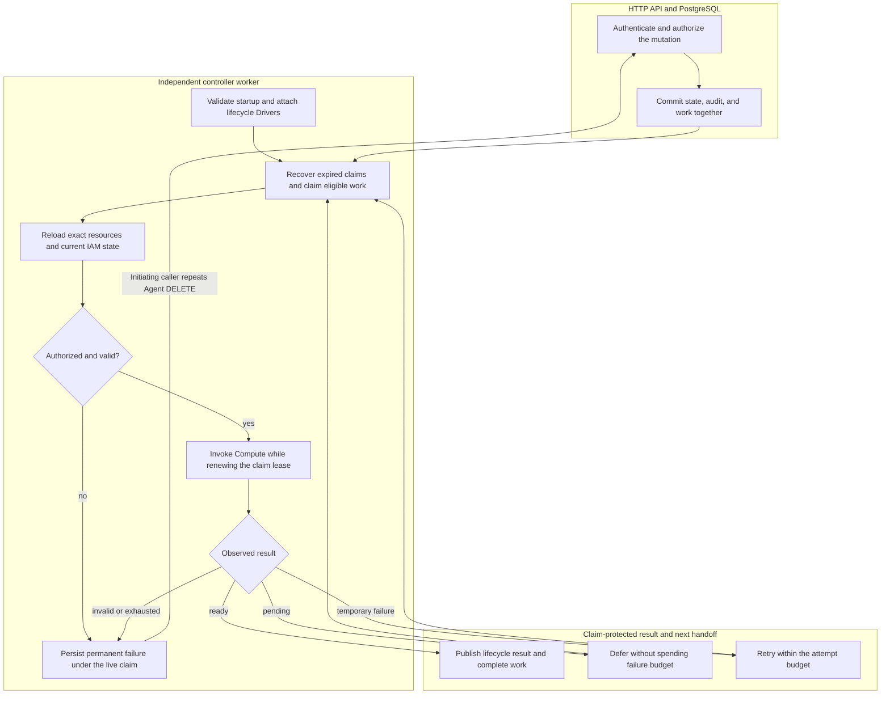

# Controller Worker Flow

## Overview

The worker claims API-admitted PostgreSQL work, rechecks authorization, invokes
Compute, and persists results under its live claim. This trace follows Namespace,
Agent stop/deletion, and AgentRevision work. The
[controller reference](../reference/controller.md) owns the contract and the
[deployment guide](../guides/deploy.md) owns process setup.

## Entry Points

- Trigger: Compose or Helm starts `apps/controller/src/worker.mjs`; an
  authenticated API mutation commits Namespace, Agent lifecycle, or AgentRevision work.
- Source: `apps/controller/src/worker.mjs:configuration`,
  `apps/controller/src/worker.ts:ControllerWorker.start`, and
  `packages/occ/src/state/postgres-state.ts:operations.append`.
- Assumptions: The initialized database contains the singleton Installation; the
  API and worker share its application role and selected Drivers. Production
  supplies trusted Installation YAML. Work records carry the original actor and
  exact resource ownership.

## Flow

## Execution Trace

### 1. Initialize the independent worker process

`apps/controller/src/worker.mjs:configuration`,
`apps/controller/src/worker.ts:ControllerWorker.start`

The [entrypoint](../../apps/controller/src/worker.mjs) validates configuration,
removes stale readiness, and constructs `ControllerWorker` with an
application-role pool. Development without `OCC_CONFIG_PATH` preflights Docker;
production requires explicit configuration.

`start()` loads the bootstrapped Installation, validates native IAM, and attaches
selected Configuration, Sandbox, and IAM hooks to Compute. Shared composition
supplies Kubernetes Compute's optional Sandbox Driver. Selected hooks require
`setLifecycleDrivers`; unsupported capabilities stop startup. Production runs
Compute preflight before emitting `worker.started` and entering `run()`.

Metrics scrapes use one read-only connection through
`packages/occ/src/state/postgres-metrics.ts:PostgresMetricsSnapshot.collect`
for lifecycle and backlog observations without runtime probes. The collector owns
transport errors through query settlement and pool handoff. Query failure or
transport loss observed before release requests client disposal instead of reuse.
Transport loss observed during release also rejects an otherwise successful
snapshot. The listener is removed only after release returns; if release throws,
transfer remains unknown and the listener stays attached. Metrics follow
finalization independently of logging; see the [metrics contract](../reference/metrics.md).

### 2. Commit API admission and the durable work record

`apps/controller/src/http/agents.ts:createAgentHandlers`,
`packages/occ/src/index.ts:OpenClawController`,
`packages/occ/src/state/postgres-state.ts:operations.append`

After authentication and authorization, controller operations call
`operations.append`, which verifies exact ownership and invokes
`PostgresWorkQueue.enqueue`. State, admission audit and work commit or roll back
together.

Agent deployment keeps the validated `deploy` authorization request and decision
with the admitted revision until the API appends its audit event. The event uses
that decision's IAM Driver, principal, exact Agent target and evidence even if
Driver selection changes before the append. The API does not reauthorize the deploy decision to construct the event or
relabel it from current selection. Audit failure rolls the revision,
desired runtime state and queued work back with the transaction. An unknown
PostgreSQL commit outcome remains unknown and is not retried.

The queue freezes actor, Namespace owner, lifecycle target, and exact Agent and
immutable AgentRevision for revision work. Agent lifecycle work identifies its
Agent and `stopped` or `deleted` target without a revision. Reusing an idempotency
key with a different actor, owner, or target is rejected. The API returns accepted
state before Compute; the worker takes over.

For an already-deleting Agent, `OpenClawController.deleteAgent` leaves active
work unchanged. The initiator can retry terminal failure; once it lost
permission, another permitted caller takes over as the work's actor, audited as
`takeover`. After checking delete permission, `operations.retryFailedAgentDeletion`
resets only the stopped, deleting Agent's terminal work, keeping prior audits.
The worker reauthorizes normally.
`deleteNamespace` recovers Namespace teardown the same way via
`retryFailedNamespaceDeletion`, including takeover.

### 3. Recover expired claims and claim one eligible operation

`apps/controller/src/worker.ts:ControllerWorker.run`,
`packages/occ/src/state/postgres-work-queue.ts:PostgresWorkQueue.claim`

Each loop first calls `recoverStale()`, then `claim()`. The
[PostgreSQL queue](../../packages/occ/src/state/postgres-work-queue.ts) selects
eligible queued work with `FOR UPDATE SKIP LOCKED`, assigns a fresh claim token
and lease deadline, and increments the attempt count. Another live claim for
the same Agent, or the Namespace for Namespace work, prevents concurrent
ownership of that target.

An empty queue waits within a bound. After work or idle, `health()` queries
work, calls `onHealthy`, and emits `worker.health`. Both must succeed for readiness. Serialized failures emit `HEALTH_UNAVAILABLE` without
consuming retries.

### 4. Reload ownership and reauthorize before infrastructure effects

`apps/controller/src/worker.ts:ControllerWorker.process`,
`apps/controller/src/worker.ts:ControllerWorker.processRevision`,
`apps/controller/src/worker.ts:ControllerWorker.authorizeRevision`

Namespace work reloads its exact resource and expected `provisioning` or
`deleting` status. Work whose target has already changed completes as
`SUPERSEDED_TARGET`. Otherwise `authorize()` reloads IAM state and checks the
original actor. Provisioning also checks restrictions on the exact Namespace;
placement into an existing Kubernetes namespace requires Installation
administration permission again.

Revision work reloads its Namespace, Agent, admitted revision, and active revision.
`processRevision()` rejects mismatched owners, an unready Namespace, an invalid
Agent Principal, a changed Harness descriptor, or a different Compute Driver.
`authorizeRevision()` rechecks current `deploy` and, for a ServiceAccount
snapshot, `read` on that exact ServiceAccount. Before Compute effects, the worker resolves
frozen Backend metadata and rechecks each managed credential's exact Backend, Driver, workspace, and issued
account binding. This read-only path has no Backend client or admin key. The
[Backend-managed credential delivery flow](service-account-driver-credential-delivery.md) owns these checks.

Revocation and denial fail permanently before runtime creation. Older revisions
complete as superseded; active revisions enter finalization or maintenance.
When Compute requires stopped predecessors, a newer admission supersedes older
active maintenance before Compute effects, even after candidate failure.
Recovery uses a new revision.

Agent-stop work rechecks current exact-Agent `operate`. Superseded desired state
completes without shutdown. An absent active pointer does not prove candidates
have no runtime resources, so stop still checks the captured revision history.

Agent-deletion work requires the Agent to remain `deleting` and stopped, then
rechecks the original actor's exact-Agent `delete`. It loads every owned revision
and rejects ownership or Compute-Driver mismatches before teardown.

### 5. Invoke Compute while renewing the live claim

`apps/controller/src/worker.ts:ControllerWorker.observe`,
`apps/controller/src/worker.ts:ControllerWorker.observeRevision`,
`apps/controller/src/worker.ts:ControllerWorker.withClaimHeartbeat`

Namespace dispatch calls `ensureNamespace` or `deleteNamespace`. Revision
dispatch optionally binds the exact Agent, then calls `prepareRevision` with its
immutable snapshot. A wrong owner or invalid observation fails permanently;
a pending observation defers convergence.

`apps/controller/src/worker.ts:ControllerWorker.prepareRevision` checks Compute's
`requiresStoppedPredecessors` capability. When selected, it loads earlier
snapshots, including failed candidates, closes their credential sessions, and
calls `stopRevision` under the claim heartbeat before preparing the candidate; a
release failure prevents preparation. Later passes re-stop after failures and
doubling lease intervals. The per-Agent queue serializes work, and the dispatch
guard keeps maintenance from recreating a predecessor. This path accepts
downtime; recovery needs a higher revision.

The worker validates Compute's startup plugin warning codes and selection keys
against the immutable revision. Compute must verify failed selections are disabled
before warnings permit deployment; missing or malformed evidence cannot establish
success.

Agent-stop dispatch captures and validates the Agent's revisions owned by the
current Compute. It stops the active revision first, then the rest, including
terminal candidates and predecessors whose retirement failed. Historical
revisions pinned to another Compute are excluded; an active revision pinned
elsewhere fails closed.
Before each shutdown, the worker rechecks the Agent owner and stopped desired
state. Later admissions are not added to this cleanup set. Partial failure retries
the idempotent shutdowns without clearing the active pointer or deleting retained
workspace data.

Before shutdown or retirement, including stopped-revision recovery, the worker
binds the server-owned Namespace and Agent after IAM and exact-resource checks.
Preparation and maintenance recheck `desiredRuntimeState`; a candidate that
overlaps stop is shut down instead of activated.

Agent-deletion dispatch binds the server-owned Namespace and Agent, retires every
owned revision, then invokes the optional Agent credential-deletion capability.
This rebuilds Driver-local ownership after restart. A Driver that can provision
runtime credentials but cannot delete them fails permanently before binding or
retirement. Compute retirement owns workload termination and Sandbox cleanup;
the worker invokes neither independently.

`withClaimHeartbeat()` renews before each effect and every third of the lease
duration, protecting sequences of short effects too. Lease loss, heartbeat failure,
or shutdown aborts Compute and raises `WorkClaimLostError`. Expired or replaced
claim tokens cannot publish results.

Successful renewals request throttled health updates without delaying effects or
renewal. Health failure does not imply lease loss; heartbeat failure aborts Compute.

Compute owns infrastructure and Sandbox dispatch. See the
[Kubernetes implementation](../../apps/controller/src/drivers/compute/kubernetes/index.ts)
and [Docker execution flow](docker-compose-development.md).

### 6. Persist the result and finish revision activation

`apps/controller/src/worker.ts:ControllerWorker.finalize`,
`apps/controller/src/worker.ts:ControllerWorker.finalizeRevision`,
`apps/controller/src/worker.ts:ControllerWorker.completeActivatedRevision`

`transactWithQueue()` renews the exact claim before atomically publishing
Namespace readiness or completed deletion, lifecycle evidence and queue completion.
Failed provisioning can transition to failed; incomplete deletion cannot publish
successful deletion.

After preparation, `activationOrder: beforeCommit` activates before the database
pointer changes. Otherwise, an implemented activation stage runs in development
and production after the claim-protected compare-and-set of `Agent.activeRevisionId`;
the first dedicated revision stays inactive until commit. A changed pointer causes
`ACTIVE_REVISION_CHANGED` and retry.

After the pointer commit, the worker finishes activation and retires the
predecessor. In a second transaction, `completeActivatedRevision()` rechecks the
active revision and claim, appends evidence, and completes work. Infrastructure
effects and database state are not atomic. Retried finalization rechecks the
active candidate before effects, so a retained plugin failure cannot become
success after claim loss.

Stop finalization rechecks the live claim, Agent owner, and stopped desired state.
After captured cleanup, it clears `activeRevisionId` only if it still identifies
the stopped revision. A later deployment supersedes the stop even if it retains
that pointer while preparing. Finalization appends lifecycle-stop evidence and
completes the work item without deleting revision rows or persistent runtime state.

After commit, `completeActivatedRevision()` and `finalizeAgentStop()` record
admission-to-completion duration through `apps/controller/src/metrics/index.ts:createOccMetrics`.
Queue waits and retries count; maintenance and superseded work do not. Process
death before observation can lose a sample.

Deletion finalization uses a restricted database function rather than the
generic queue completion path. In one transaction it validates the live claim,
removes the Agent's revisions, service principal, API keys, and exact IAM
references, records lifecycle-delete success, deletes the Agent, and removes its
work rows. An expired or replaced claim removes nothing; `occ_app` has no direct
table-level delete privilege for these records.
`finalizeAgentDeletion()` records committed `agent_delete` outcomes. Snapshots
count deleting Agents as `stopping`, permanent cleanup failures as `failed`,
and remove completed deletions from inventory.

### 7. Defer, retry, or stop and hand off the next iteration

`apps/controller/src/worker.ts:ControllerWorker.finalizeActiveRevision`,
`packages/occ/src/state/postgres-work-queue.ts:PostgresWorkQueue.defer`,
`packages/occ/src/state/postgres-work-queue.ts:PostgresWorkQueue.retry`

Pending convergence refunds the attempt, requeuing unready revisions after 500 ms,
growing with the deployment's age to 5 s at 200 s, and others with backoff. An
unready observation's Compute `pendingReason` selects the pending code:
`REVISION_UNSCHEDULABLE` for Pods the scheduler cannot place,
`WORKSPACE_NODE_PENDING` for ready workloads whose workspace node has not
connected, and `REVISION_INCOMPLETE` otherwise. `PostgresWorkQueue.defer` appends `reconcile` evidence
only when its outcome and code differ from that work item's latest evidence. Dependency failures consume attempts; permanent failure,
exhaustion, deadline, or `AUTHENTICATION_FAILED` terminates work. See
[outcomes](../reference/controller.md) and
[timing controls](../reference/settings/operations.md#controller-worker-environment).

`ControllerWorker.processRepositoryCleanup` defers every incomplete pass at the
Driver interval, including closing sessions and failed runtime retirement,
releasing the claim without consuming retries. Obligations survive; lease loss
aborts the pass.

Terminal rows store `reason_code` and optional `result_data`: success
`{ warnings: [...] }`; convergence-deadline failure `timeoutMs` and optional
`runtimeFailure`. Compute reads cached startup results from its private status
path, including unready Harnesses without plugins, and verifies runtime incarnation
without repeating the model probe. Missing or invalid evidence leaves cause unspecified.

`packages/occ/src/state/controller-work.ts:validateFailureData` validates reads
and writes; the PostgreSQL constraint enforces the persisted shape.
Other failure reasons reject data.
`PostgresWorkQueue.complete` and `PostgresWorkQueue.fail` publish only under the
live claim; deployment status derives `error` and `warnings` from that result.
Completion needs no acknowledgment or post-commit cleanup; maintenance
cannot rewrite deployment warnings.

See [deployment status](../reference/agents.md#deployment-status) for result semantics.

Indexed `workId` scopes progress to work; maintenance and unbound history cannot
supply it. `getDeploymentStatus` reads
`findWorkAttempt` with the work row in one State snapshot and projects fixed
public explanations. Memory State has no attempt.

Legacy terminal rows derive `reason_code` from matching activation or terminal
reconcile audit evidence, otherwise `LEGACY_OUTCOME_UNKNOWN`. Their
`result_data` remains `NULL`; pending rows have no terminal outcome.

If Compute declares maintenance, activation schedules exact-revision observations.
Incomplete observations, Compute bindings, and dependency retries or expired claims
exhausting attempts close the item and schedule another while the revision stays
active and running within its credential deadline; outages never retire it. Each
claim reauthorizes its actor. Successor keys use strictly later time buckets despite clock skew.

`worker.completed` reports the target, outcome, and code; polling continues.
A Namespace lifecycle pass that observes the same pending state as the last one
this worker audited (for example, Kubernetes namespaces still terminating) writes
no new lifecycle audit row; a changed pending state and the terminal pass do.
Lease loss reports `worker.error` `CLAIM_LOST` instead of stale lifecycle state.
On `SIGTERM` or `SIGINT`, shutdown removes readiness, aborts in-flight work, waits for the loop, closes PostgreSQL, and emits
`worker.stopped`. Each `PostgresWorkQueue.recoverStale()` statement atomically publishes exhausted
work, failure of a still-provisioning Namespace targeted for `ready`, and audit
evidence for expired claims and exhausted queued work, so final-attempt crashes
cannot strand provisioning.

## Debugging and Verification

- `worker.started` names `computeDriverId` and optional `sandboxDriverId`.
  Ready `worker.health` confirms a pending-work query; neither proves a model turn.
- `worker.startup-error` reports invalid mode, database, Installation, Driver
  selection, or preflight before processing. Probes inspect a private readiness
  marker; the worker has no HTTP endpoint.
- For queued operations, compare API and worker database and Installation
  configuration, then inspect `worker.completed` and `worker.error`. Check current
  IAM state for `ACTOR_REVOKED` or `AUTHORIZATION_DENIED`; `DEPENDENCY_UNAVAILABLE`
  is retryable within `OCC_WORKER_MAX_ATTEMPTS`; `CLAIM_LOST` ends publication ownership.
  A revision pass that fails on a dependency logs it: `AGENT_GATEWAY_UNAVAILABLE`
  or `KUBERNETES_API_UNAVAILABLE` with `dependency` and `cause` (`unreachable`,
  `timeout` or `unavailable`) is deferred until the convergence deadline without
  spending an attempt; any other failure logs its error class in `cause` and, for
  an HTTP error, `status`.
- [Revision](../../tests/integration/postgres-worker-agent-revision.test.mjs) and
  [stale-claim](../../tests/integration/postgres-worker-stale-claim.test.mjs) tests
  require PostgreSQL; neither proves real model execution.
- [OCC API](../../tests/integration/occ-api.test.mjs) checks deploy audit attribution
  and append-failure rollback on the authenticated route after changing IAM Drivers.
- [Sandbox startup](../../tests/integration/sandbox-driver-startup.test.mjs) verifies
  composition; [k3d integration](../../tests/integration/sandbox-driver-openshell-k3d-real.test.mjs)
  verifies infrastructure.

## Related docs

- [Agent repository session preparation and durable cleanup](agent-repository-credentials.md)
- [Backend-managed credential delivery](service-account-driver-credential-delivery.md)

- [Controller reference](../reference/controller.md)
- [Deployment guide: development and production](../guides/deploy.md)
- [Controller settings](../reference/settings.md)
- [IAM authorization](../reference/authorization.md)
- [Production startup flow](production-startup.md)
- [Docker Compose development flow](docker-compose-development.md)
- [Harness execution topology](harness-execution-topology.md)
- [Compute Driver contract](../reference/drivers/compute.md)
- [Sandbox Driver contract](../reference/drivers/sandbox.md)

## Manual Notes

[keep this for the user to add notes. do not change between edits]

## Changelog

- 2026-10-02 06:30: Name Compute's pending reason in deployment progress and slow rechecks for long-pending revisions. (fix-deploy-pending-reasons)

- 2026-10-01 17:20: Point Agent lifecycle admission at its HTTP owner; deployment audit keeps the admitted authorization. (authoring-run/bef09bf6-deaa-4189-9568-5f13beb451e7 - 7a6cc931d)

- 2026-10-01 04:06: Document metrics client error ownership through release. (authoring-run/d0545dc8-f524-4ce5-a3ce-918838dddd92 - 97dfb6b9)

- 2026-09-29 18:40: Continue maintenance past expired exhausted claims.

- 2026-09-29 12:00: Continue maintenance after dependency exhaustion.

- 2026-09-28 22:10: Expose exact-work pending reconciliation results through deployment status and the Console. (01a0eb85-73a8-7572-92a9-a6a06fbdf0a5 - 0aedecfd)

[Controller worker documentation history](controller-worker/history.md) preserves the older dated entries.
