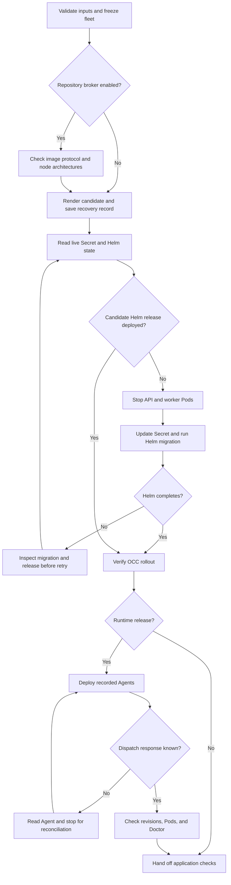

# Production image upgrade flow

## Overview

`scripts/upgrade-production-images` updates the OpenClaw Control Plane (OCC),
Agent runtimes, or both. The controller-only command ends after the OCC API and
worker recover; it does not request Agent deployments. A runtime release deploys
a new revision for every Agent that was running when the command began and ends
after the selected Pods are ready and each replacement gateway passes read-only
Doctor lint. Model and external integration checks remain operator tasks.

## Entry Points

- Trigger: an operator runs `scripts/upgrade-production-images` with one or both
  image options and explicit cluster, release, source, and protected-file inputs.
- Required state: a healthy production Helm release and matching OCC and
  Kubernetes Installation identity. Runtime releases additionally require a
  complete authorized fleet inventory with no deployment in progress.
- Source: `scripts/upgrade-production-images`,
  `packages/occ/src/index.ts:OpenClawController.getInstallationDeploymentInventory`,
  and `packages/occ/src/index.ts:OpenClawController.deployAgent`.

## Flow

## Execution Trace

### 1. Prepare and freeze the target

`scripts/upgrade-production-images:245`

The script verifies the protected files, cluster, deployed Helm release, and
matching OCC and Secret Installation IDs. It compares protected and live
configuration in full, including selected image fields. It captures separate
reviewed candidate files and accepts changes only to the Slack directory proxy
and the curated Codex PluginDriver selection. All other Helm and Installation
settings remain protected, including new fields. The guard compares broker
resource references, not the contents of referenced ConfigMaps or Secrets.
Image flags select images after this comparison.
A runtime release also reads complete authorized inventory and records every running Agent's baseline
revision. Nonterminal deployment work, a missing active revision, or an unready
Namespace stops preparation. Stopped and deleting Agents are excluded.

For repository-enabled releases, the helper requires explicit immutable
controller and broker images. It inventories every node matching the control
plane selector, including unready and cordoned nodes, and requires a single
native architecture. `scripts/upgrade-image-identity.py:read_platform` first
reads Docker's native OCI export and resolves the selected manifest's
configuration. It retains JSON objects within the 2 MiB per-blob and 32 MiB
total metadata limits, checks their hashes, and verifies the configuration's
platform. Compressed filesystem layers are outside that metadata budget.
Then `scripts/upgrade-repository-image-probe.mjs` runs both selected images
with synthetic inputs and a private receipt listener. It checks recovery and
refused reservation through the actual Driver and broker, and records the
selected digest, platform manifest, configuration, requests, and responses.
The check proves wire compatibility, not Kubernetes image availability, receipt
durability, or disposal. The
helper also preserves the live broker hostname; broker restart recovery remains
an operator task in the [broker procedure](../guides/repository-credentials/installation.md#install-and-verify).

The script renders the chart and performs a server-side Helm dry run. Then
[`scripts/upgrade-startup-preflight.mjs`](../../scripts/upgrade-startup-preflight.mjs)
copies each rendered API and worker Pod template (selected controller image, env,
mounts, service account) into a one-shot Pod whose Installation volume reads a
temporary Secret holding the candidate. The Pod runs `loadStartupConfigurationSnapshot`
and `loadInstallationConfiguration`, which resolve Drivers and Preset files
without the database. With the bundled Kubernetes Compute Driver it then runs
`KubernetesComputeDriver.preflight` with the Pod's Kubernetes credentials (its
service account in `inCluster` mode), as API and worker startup do; that check refuses, for example, single-cluster
[split-layout Gateway storage](../reference/drivers/kubernetes-compute.md#existing-split-layout-installations).
Each Pod then checks the stored Installation name from the helper's
`occ installation get` with the image's `isName`, the check the controller
applies after it reads the name from the database (`INSTALLATION_NAME_INVALID`);
an image without the rule skips it.
On the experimental two-cluster profile, each Pod also runs
`KubernetesComputeDriver.verifyExecutionTenantGrants` for its component, which
startup does not run. In each execution tenant Namespace where its identity holds
the release-era tenant grant, SelfSubjectAccessReviews ask for the newer
`openclaw-execution` rules (API: Pod and `pods/proxy` reads, plus `pods/log` and
Event reads with runtime logs; worker: Pod `patch`). A missing rule refuses the
candidate and points to
[upgrading the execution chart](../testing/two-cluster-local.md#upgrade-the-execution-chart).
Because the chart's default-deny NetworkPolicy also selects these Pods, the
helper first creates a temporary NetworkPolicy carrying the rendered
`openclaw-enterprise-dependency-egress` (and execution-cluster API) egress rules.
A failure, a stuck image pull, or the timeout stops
preparation before any writer stops. The script first reads both Pods and saves
each status and log, so every failing component is reported; then the exit trap
deletes the Pods, Secret and NetworkPolicy.
It saves
candidate inputs, inventory, target identity, and parameter hashes in the
private evidence directory before marking preparation complete. A per-directory
lock prevents two helpers from using that record at once. The operator must
freeze other writers, autoscalers, Helm changes, and runtime draft edits as
specified in the [production guide](../guides/deploy/production-upgrade.md).

### 2. Reconcile a prior attempt

`scripts/upgrade-production-images:506`

On every attempt the script rereads Helm status and values and the Installation
Secret. Only the recorded baseline or candidate values are accepted; the
Secret's UID, Installation annotation, and other data must match the baseline.
Resume also binds the original kubeconfig contents, inputs, OCC URL, scripts,
flow, chart, and pair evidence. It requalifies the pair and rejects a changed
eligible-node set. Candidate files must still match the saved reviewed inputs; the
helper applies the saved candidate. Unexpected drift or an in-progress Helm
release stops the command.

If a previously started Helm release is deployed at a newer revision with the
candidate values, the script continues without repeating Helm. Otherwise it
requires the operator's migration-history check and refuses a retry while an
initialization Job or Pod remains active. A failed or disconnected migration may have
committed; the check and Job inspection are operator-owned and are not a
rollback. The guide describes the required attestation and recovery.

### 3. Quiesce writers and run the candidate release

`scripts/upgrade-production-images:624`

Before changing the Secret or invoking Helm, the script scales the selected API
and worker Deployments to zero, waits until their Pods disappear, and confirms
both desired replica counts remain zero. Kubernetes requests in this phase share
a bounded quiescence deadline. This covers the selected Helm release;
it does not detect independent database writers, autoscalers, or partitioned
nodes. The operator must stop those writers and keep nodes reachable.

The protected files are atomically replaced with the saved candidate. When the
Installation changes, including a controller-only settings release, the script
reads the Secret before updating its Installation key, preserving other data
and metadata with a resource-version precondition.
If the candidate is already present after a lost response, it does not write it
again. The candidate Installation checksum is included in both OCC Pod
templates.

A durable marker precedes `helm upgrade`. The candidate migrator and bootstrap
run in the Helm initialization hook before API and worker rollout. If Helm
fails, resumption reads its current status and migration state before a retry;
it does not start the old image to undo a committed schema change.

### 4. Verify control-plane recovery

`scripts/upgrade-production-images:694`

The script waits for both OCC Deployments, checks their controller image and
replica count, and checks the Installation checksum when its configuration
changed. It requires exactly one named container for each component. For a
broker-enabled worker it also accepts a restartable init container, provided
no worker exists in the ordinary container list. It rejects a non-restartable
init worker or ambiguous placement. It retries authenticated OCC access and verifies the same Installation ID. A
controller-only release then ends without requesting Agent deployments.
Existing revisions keep the Pod specification of the controller that deployed
them, so controller fixes to Gateway and Agent Pods, such as
[diagnostics](agent-deployment-diagnostics.md) mappings, reach an Agent only at
its next deployment.

For a repository-enabled release, it also verifies the ready API and worker
Pods, their owning ReplicaSets, node architecture, and runtime controller and
broker image IDs against the qualified pair. The deployed Driver checks the real
broker's admission capability without opening a session. Pod identities must
remain stable across that check and before dispatch and completion.

### 5. Deploy and verify the recorded fleet

`scripts/upgrade-production-images:797`

Before sending each ordinary exact-Agent deployment request, the script records
an intent. Successful responses are saved atomically. On resume, existing
responses are reused; an intent without a response triggers an Agent readback
and stops for operator reconciliation. The helper does not infer rejection from
an unchanged active revision or replay an unknown request. An operator can
record a verified accepted response and resume.

The script polls each returned deployment through its authorized status
operation, confirms active revision selection, and waits for all revision Pods
to be `Running` and `Ready` on the candidate runtime digest. Embedded execution
requires one runtime container; dedicated execution requires both gateway and
Agent containers. Each replacement gateway then runs read-only
`openclaw doctor --lint --json --severity-min error`. Failures retain dispatch,
status, Pod, and Doctor evidence for inspection.

### 6. Hand off application verification

`docs/guides/deploy/production-upgrade.md:Verify the release`

Successful script completion proves the selected Helm rollout and OCC access.
For a runtime release it also proves the recorded deployments and Pods reached
the checked states and Doctor reported no error. The operator next verifies
model responses, providers, channels, credentials, workspace continuity, native
access, and required restore behavior.

## Debugging and Verification

- Inspect `server-dry-run.txt` for chart or admission failures before mutation,
  and `preflight-<api|worker>.log` and `-status.json` for a rejected candidate.
- For OCC rollout failures, inspect `helm-upgrade.txt`, initialization Job logs,
  and API and worker rollout status.
- For runtime failures, inspect `dispatch/*.error`, revision history, and
  `status/*.json` before retrying anything. Doctor failures are recorded in
  `status/*.doctor.json` and `status/*.doctor.error`.
- Compare `before-workloads.json` and `after-workloads.json` for unexpected
  workload changes. The controller-only helper requests no Agent deployments;
  separately check repository-bound revisions affected by broker restart.
  Runtime proof should show the intended replacements.
- Use the credentialed production Kubernetes integration with distinct baseline
  and candidate images for end-to-end proof. Mocked commands prove only script
  control flow.

## Related docs

- [Production upgrade guide](../guides/deploy/production-upgrade.md)
- [Production installation](../guides/deploy/production-installation.md)
- [Production Agent verification](../guides/deploy/production-agents.md)
- [Agent deployment reference](../reference/agents/deployment.md)
- [Production startup flow](production-startup.md)
- [Controller worker flow](controller-worker.md)
- [Authoritative platform design](../design.md)

## Manual Notes

[keep this for the user to add notes. do not change between edits]

## Changelog

- 2026-10-07 21:20: Refuse a two-cluster upgrade before quiescence when the execution chart lacks this release's tenant grants. (fix-758)

- 2026-10-07 12:00: Say that a controller-only release leaves existing revisions on their old Pod specification until the next deployment. (dogfood-r43)

- 2026-10-05 15:01: Keep filesystem layers outside the image identity metadata budget. (authoring-run/0b8bd46b-85c0-4664-8dbd-2ee77cd7b602 - 08248f8dbf227dfb7b73162056b6afd1c33cee0d)

- 2026-10-05 06:00: Save and report every preflight Pod's result before cleanup, not only the first failure.

- 2026-10-05 04:00: Load the candidate Installation with the selected controller image in one-shot Pods before quiescence.

- 2026-09-28 12:36: Qualify the selected repository image pair and verify deployed identities and capability. (01a0e6ca-95a4-7e80-aab8-38c5e92a53da - 374dfd4c58587f64d859d4aa4fdaf446b158402a)

- 2026-09-28 11:36: Restrict candidate changes to the reviewed proxy and curated catalog settings. (authoring-run/829b465b-4176-428a-a748-59968ab63b04 - e3bcdb9b3a82d16016c023a8a77d683bf0079ce7)

- 2026-09-28 08:49: Verify the named controller image across ordinary and restartable worker placement. (authoring-run/4c22438e-4a96-4125-bdbb-47a3547a1232 - dcf7c58ef3fe7f6ec6ffc33c1062fee93c9bdeb2)

- 2026-09-28 07:58: Guard repository Backend, Driver, network, and cluster trust settings during candidate preparation. (authoring-run/1d4977e8-b5e5-4b20-9909-bedc3c5b3900 - 2fd914a7273bb09e9d91543c806a4091772191f6)

- 2026-09-28 07:39: Record reviewed configuration candidates and strict live baseline checks. (authoring-run/3c681647-a494-4613-809e-11113e5ed11c - ec51e917954207b49d66f3cb28a7d4887fcd9ea1)

- 2026-09-28 07:02: Record quiesced migrations and resumable release and dispatch recovery. (authoring-run/ef0e4dd2-3f52-48b4-a742-60dfbb85864a - e06ff9625e72ff5ab3483a504a2f02a69a370cbb)

- 2026-09-26 22:28: Preserve the selected repository broker hostname before image upgrades. (authoring-run/1495f489-e298-44e9-b75d-6a49445d35e3 - 7caf53332219db12fed62180c3c6d270baa8ea63)

- 2026-09-25 13:40: Document Helm migration ordering and add post-readiness OpenClaw Doctor lint for replacement gateways. (authoring-run/d35fd05b-5bbd-4f21-a747-820c2df23b2c - 077e26ba0c0babe033569105e3a7e89abf06f40d)
- 2026-09-25 12:29: Split controller and runtime releases while retaining an optional combined path. (authoring-run/ab700e2e-1baf-400c-ab18-0aa9a351f351 - 5e747ac1722f757d7949746e9ff9982142c8536b)
- 2026-09-24 21:21: Separate operator instructions from the runtime trace; require revision-read admission, HTTPS, bounded Kubernetes reads, and the complete execution-mode workload set. (authoring-run/613d1e94-a661-4781-bae5-e28613aa3cf9 - c799988036f43ce1bb828373233f03cc77bb0ea9)
- 2026-09-24: Record cluster/OCC identity binding, live/protected input equivalence, the supported empty-fleet path, and runtime Pod readiness discovered by the production rehearsal.
- 2026-09-24 13:43: Trace fail-closed inventory admission, nonterminal deployment rejection, and the one-time controller-only bootstrap for older OCC versions. (authoring-run/0fc7c19b-0e15-498c-8328-e436bc702f37 - a7a609d5867398dd0dfd3bb77cfebf91b2cad116)
- 2026-09-23 12:32: Trace matched image replacement and concurrent exact-Agent deployment through durable status convergence. (authoring-run/d29bdbc5-2a6a-46fa-a8e5-6ad78ea2e486 - 78cf9fd25f08e91158617fbd0ae3e42a22e54361)
