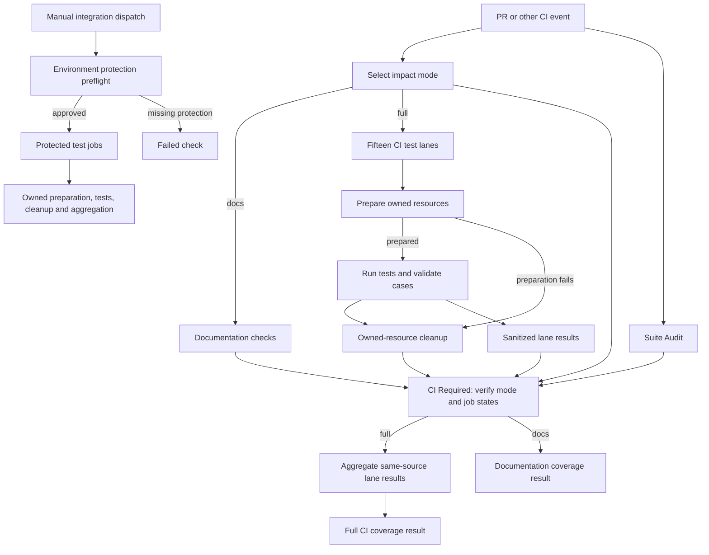

# GitHub Actions testing flow

## Overview

GitHub Actions selects coverage for each event and ends at `CI Required` and resource cleanup. Full CI runs fifteen noncredentialed test lanes, prepares disposable resources, and rejects missing or skipped required coverage. A verified documentation-only PR runs Suite Audit and documentation checks without product tests. Neither route establishes protected model or service integrations.

## Entry Points

- `.github/workflows/ci.yml:jobs`: PR, main push, merge-group and manual checks on ephemeral runners.
- `.github/workflows/full-integration.yml:jobs`: manual integration from main or an explicitly approved Kubernetes model branch, bound to the dispatched commit.
- `scripts/ci/run-tests.mjs:main`: local or workflow `audit`, `run` and `aggregate` commands; the suite map is the coverage owner.

## Flow

## Execution Trace

### 1. Select one source revision and coverage group

`.github/workflows/ci.yml:jobs`, `.github/workflows/full-integration.yml:jobs`,
`scripts/ci/full-integration-preflight.mjs:validateFullIntegrationPreflight`, and
`scripts/ci/test-suites.mjs:loadTestSuites`

The suite index, `scripts/ci/test-suites.json`, orders lane references and
coverage groups. `loadTestSuites` assembles their `scripts/ci/test-suites/<lane>.json`
files into a map consumed by the runner and preparation tools. Each lane owns its
test inventory, environment, required inputs, and preparation settings.

CI uses the event checkout without external service credentials. Impact and Suite Audit start independently. In docs mode, `docs-checks` verifies checkout identity and formatting, then installs, checks, and builds documentation; it runs no conformance, integration, browser, Go, or other product tests. Full mode runs `checks-baseline`, the thirteen-lane matrix, and `runtime-image-fixture`. Kubernetes fixture and observability lanes use `ubuntu-22.04` for bridge netfilter support; `runtime-image-fixture` also uses it. The repository credential platform lane uses `blacksmith-16vcpu-ubuntu-2404`; remaining lanes and audit use `blacksmith-8vcpu-ubuntu-2404`.

For a PR, the selector verifies the tested checkout and merge parents against the event base and head, then compares the base and tested trees. Git path decoding preserves a leading UTF-8 BOM as filename data; paths outside the allowlist select full. API reference outputs and Markdown under `docs/reference/api/` select full for `openapi:check`. Only nonempty changes to allowlisted regular Markdown files select docs mode; code, configuration, workflow, mixed or unknown changes and non-PR events select full. Missing or unverifiable policy or source evidence selects full or fails closed. Policy comes from the verified PR base; a base without it selects full. `CI Required` independently verifies mode and job outcomes: docs requires successful impact, audit and documentation jobs and skipped full test jobs; full requires successful impact, audit and all fifteen lanes and a skipped documentation job. Missing, failed, cancelled, or unexpectedly skipped selected jobs fail the gate. Full mode aggregates same-source test results; docs mode does not aggregate or invent test artifacts.

The impact job adds an advisory run summary with the selected mode and a fixed reason category. Categories distinguish non-PR events, unavailable event inspection, malformed event JSON, invalid base, head or tested commit identities, checkout or parent mismatch, unavailable base policy, Git inspection failure, empty or malformed diffs, unsupported type changes, non-UTF-8 filenames, ineligible changes and verified documentation selection. Bootstrap guard categories identify their source; selector execution failures fail the impact job. If selection fails or its reason is missing, malformed, or from an older base selector, the summary reports the affected information as unavailable. It includes no changed paths or arbitrary selector output.

The PR can change the `pull_request` workflow definition loaded from its merge checkout, bypassing or replacing these steps despite base-loaded policy. A separately trusted required workflow or equivalent external enforcement is a deployment decision, not an established source property. Hosted behavior, including fork and required-check enforcement, remains unverified.

Full Integration checks environment protection and checks out the immutable event SHA. Every lane admits `refs/heads/main`; only `k3d-model` may use another branch, with an exact `integration-model` branch rule and GitHub reviewer approval with self-review prevention. Wildcards, tags, and other non-main lanes are rejected; the administrator removes the temporary rule after verification. Manual dispatch selects a lane or `all`; pushes, merges, and PR events do not start this credentialed workflow. Manual runs share one concurrency group without cancelling in-progress runs. The provider environment must allow exactly `main` and needs no per-run review; other credentialed environments require reviewers with self-review prevention. A targeted run proves less than a full inventory run.

PostgreSQL migration and application suites own separate servers; each of three Kubernetes fixture files owns a separate cluster and PostgreSQL server. Before creating k3d nodes that share the runner kernel, the shared action enables bridge netfilter; missing filtering fails setup rather than leaving Pod network policies unenforced. The repository credential platform lane uses Blacksmith for full-image HTTP, PostgreSQL, Unix-control and credential-material proof; NetworkPolicy enforcement remains the fixture lanes' responsibility. State and cleanup stay on each runner, and files run sequentially within a lane.

The application lane's per-file preparer gives the native IAM barrier test its own migrated PostgreSQL database. Only that test receives its application and migrator connection details; the CLI refuses to write them to `GITHUB_ENV`. The test installs its unregistered supplier only in that disposable database. This fixture does not establish production writer participation in the barrier.

After checkout, full CI and Full Integration call the shared [run-ci-lane action](../../.github/actions/run-ci-lane/action.yml) for tool and dependency setup, selected baseline checks, preparation, execution, unconditional cleanup, and sanitized result upload. Callers own the revision, timeout, protected environment and explicit credentials.

Ordinary PR dependency caches may be restored and saved within GitHub's PR merge-ref scope. Main jobs use main-scoped caches. Test results and credential-bearing state are not dependency caches, and protected jobs do not promote PR build artifacts.

The provider job uses the shared `blacksmith-8vcpu-ubuntu-2404` runner for image-build and k3d-import disk headroom; standard Ubuntu reached `DiskPressure` and evicted the seccomp probe before startup. Preparation copies the archive to each owned k3d node for node-local `ctr image import`; k3d `tools-node` can report success despite logged per-node failures. Imported manifest and CRI checks remain required before tests.

### 2. Prepare resources under the job owner

`scripts/ci/prepare.mjs:main` and `scripts/ci/prepare.mjs:ensureK3dCluster`

[CI resource preparation](github-actions-testing/preparation.md) traces tool setup, image and cluster preparation, protected credentials, and resource ownership. Continue below when preparation has produced the lane state.

`checks-browser`, `postgres-auth`, and `images-model-probes` use separate runners and required artifacts. `scripts/ci/prepare.mjs:imageBuildArgs` enables scoped BuildKit caches for hosted image jobs: packaging exports and probes restore. Images load into the job's Docker engine; cache credentials stay in preparation.

Kubernetes fixture startup records phase timings and host snapshots. On failure,
bounded reads save `<state-file>.diagnostics.json` outside the cluster directory
before cleanup. These lanes use `--no-rollback` so the workflow owns teardown
after capture; local callers still clean up using the failed run's state file.
Collection preserves the original error even if observation fails or times out.
The [CI guide](../testing/ci.md) describes the retained evidence.

Tests delete Agent namespaces and their events before file exit. While each file
runs, `scripts/ci/run-tests.mjs:runFile` watches Compute-managed Pods and events
in ready k3d clusters; `scripts/ci/k3d-diagnostics.mjs:projectAgentNamespaceActivity`
appends Pod transitions and those namespaces' events to the report under
`agentNamespaces` on pass or failure. Each file retains at most 200 Pod and 200
event records, and the report retains 40 files. Messages are redacted and
truncated, Pod specs dropped, and raw watch streams kept in the cluster directory
for cleanup. Each lane that writes the artifact uploads it.

Dedicated Codex preparation and the operator's offline profile generator share
`scripts/lib/codex-seccomp-profile.mjs:deriveCodexBwrapProfile`. Preparation
requires an actual workspace write and denied write to a container-writable
outside path before publishing the selected Localhost profile to the live suite.
Native runtime-image tests trust a dynamic Codex Docker seccomp profile only when
`OPENCLAW_ENTERPRISE_CI_STATE` records the exact prepared
`cluster.codexDockerSeccompProfile` path and SHA. A self-hashed profile without
that state is not CI proof; the standalone fallback remains the pinned reviewed
manual profile. Production node provisioning remains outside CI ownership; see
[Codex sandbox setup](../guides/deploy/codex-sandbox.md).

### 3. Execute and account for actual cases

`scripts/ci/run-tests.mjs:main`, `scripts/ci/reporter.mjs:jsonLinesReporter` and `scripts/ci/failure-redaction.mjs:redactFailure`

The runner discovers active test files and verifies one lane assignment per file. Different prerequisites require separate files. It invokes whole files with invocation-scoped environment inputs. A custom Node reporter publishes case names, locations and outcomes, excluding arbitrary output. The runner also keeps each failure's error message (at most 600 characters) and top stack frame (240), with the repository path stripped, every nonpublic environment value of eight or more characters (from the job and from the test process) replaced by `[env:NAME]`, and common token, key, URL-password and `password=`-style values replaced by `[redacted]`; the runner prints the same line per failed case to the job log. Values a test generates at run time are redacted only when they match those shapes. Failed provider-test HTTP assertions also retain numeric actual and expected status codes, an allowlisted OCC error code, and the upstream ChatGPT operation and status when available. Denied-traffic failures retain only an allowlisted traffic category, without target addresses or response data. Plugin-status fixture failures retain an allowlisted readiness or rollout stage. Rollout diagnostics include bounded Pod phases, readiness and scheduling flags, container restart counts and exit codes, and allowlisted reasons. These structured diagnostics exclude response bodies, credentials, and identities.

Required named cases must pass; every skip or TODO fails the lane. There are no counterpart-skip lists or CI name filters. Synthetic file-wrapper success, missing output, zero cases, or interruption without final reporter output cannot establish coverage. Lane results retain failure, timeout and cleanup outcomes.

### 4. Clean up and publish the bounded result

`scripts/ci/cleanup.mjs:main` and `scripts/ci/run-tests.mjs:main`

`.github/actions/run-ci-lane/action.yml` uploads one sanitized result artifact
per lane and run. A retry replaces that lane's artifact, preventing aggregation
of a stale result; other lanes retain theirs. Each attempt also uploads the same
file as `attempt-<run attempt>-<artifact-prefix>-<lane>`, which no aggregate
pattern matches, so a failed attempt's cases survive a `--failed` rerun.

For `images-packaging`, `scripts/ci/export-image-reconciliation.mjs` attempts
to retain attempt-specific cleanup records for the two controller and runtime
tags prepared by the lane. A planned record does not prove an image was created.
The run-and-attempt component of each tag name is metadata, not authentication
or permission to delete an image. Missing state is reported as unavailable;
neither that result nor an empty inventory proves cleanup. The separate tag
created by the runtime-images test, other resource kinds, and private environment
values are excluded. Export or upload failure and runner loss can prevent retention.

Fixture bootstrap failures also upload `diagnostics-<artifact-prefix>-<lane>`
separately from test results. Cleanup removes the cluster and private state; the
diagnostic remains available for upload but cannot satisfy required test results.

Per-file cleanup releases its disposable database; job cleanup removes only state-owned resources. A whole owned `k3d-cluster` owns deletion of its Collector Namespace and RBAC through the Kubernetes API. Logging cleanup independently removes the local Docker backend container and JSONL/config directory, even if the Kubernetes API is down. Cleanup failure fails the check; its private state file is usable only while the runner host and path remain available. User databases, contexts, unrelated containers and global images remain outside that ownership.

`CI Required` checks job outcomes even after failures. In full mode, the aggregate checks same-revision lane identity and success, required evidence, and cleanup outcomes; the runner validates cases. Docs mode checks documentation and audit outcomes and skipped test jobs without aggregating results; it proves only those selected checks. Full Integration accounts for its selected `full` group or requested lane. The explicit `ssh-host` lane stays outside automatic groups until an operator prepares its disposable host; see [SSH raw-host testing](../testing/ssh.md#ssh-raw-hosts). Abrupt hosted-runner loss can prevent teardown and loses private `RUNNER_TEMP` state at job end. External resource reconciliation awaits an approved resource ledger.

## Debugging and Verification

- `node scripts/ci/run-tests.mjs audit` checks the actual checkout inventory against the suite map.
- `node --test tests/integration/ci-runner.test.mjs` exercises the runner with real child Node processes and controlled pass/fail/skip cases.
- Use the failing test's file, name and location in the sanitized result to reproduce its exact invocation with approved local prerequisites. Treat the named aggregate as its coverage boundary.
- On local Docker Desktop or equivalent VM-backed Docker hosts, run one Kubernetes lane at a time when disk or network pressure has caused measured instability. GitHub Actions still runs the configured matrix; this local guidance is for reproducible operator runs.
- Missing protected environments, tools, images or credentials are setup failures. Configure the approved resource; do not mark its required test skipped or replace it with a fixture.
- Retain sanitized results for seven days. Keep private cleanup state and credential files outside uploaded artifacts. On local runs, follow the run-owned state when recovering a failed teardown while that host and state path still exist.

## Related docs

- [Testing guide](../testing/README.md)
- [CI suite map](../../scripts/ci/test-suites.json)
- [Integration implementation specification](../../specs/plans/19-github-actions-test-coverage/index.md)
- [Upstream infrastructure report](../../specs/plans/19-github-actions-test-coverage/source-audit.md)

## Manual Notes

[keep this for the user to add notes. do not change between edits]

## Changelog

- 2026-10-01 02:34: Document the advisory impact summary in the accompanying changes. (authoring-run/0f81a0c3-327f-4389-ae2e-89431878a2d7 - c61836797191a0924671eaaec074863fe2d80cfe)

- 2026-10-01 01:06: Preserve Git path byte identity in the selector and document its coverage decision in the accompanying changes. (authoring-run/2403db12-cdf4-4070-aece-2f4b45ff0234 - 5e0906ccd42473596c2006474adf199d42ab74df)

- 2026-09-29 22:55: Split browser, PostgreSQL authentication, and image model-probe lanes; cache hosted controller/runtime builds while retaining required result accounting. (01a0f0d0-002a-7dc3-af73-e7d25dfe92e2 - b8d7e48f5837d11e54e04dce40650f7ccc5100f0)

- 2026-09-30 02:42: Document generated API reference selection in the accompanying changes. (authoring-run/cd1c4c87-0519-4df7-8bf2-abbff0d53424 - a56c027ff8ec22655cca49aa6a912081cb98b593)

- 2026-09-30 02:03: Describe the documentation-only checks and required gate in the accompanying changes. (authoring-run/ac4af003-ce47-4e8d-83af-040e227a7673 - 20c06dffda90748e5ea16348eaa04feb79d551ab)

[GitHub Actions testing documentation history](github-actions-testing/history.md) preserves the older dated entries.
