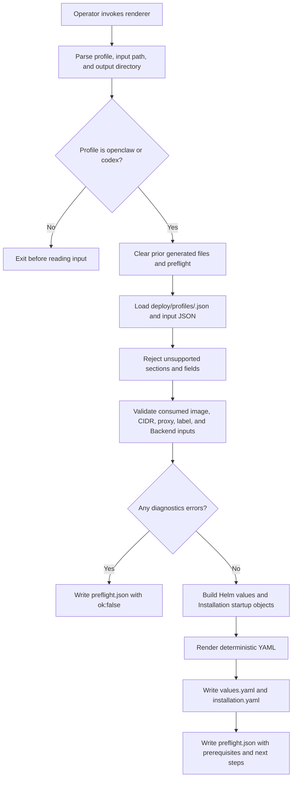

# Installation Profile Rendering Flow

## Overview

An operator runs `scripts/render-installation-profile.mjs` with a profile, a
JSON input file, and an output directory. The renderer checks that every
supplied input belongs to the profile contract, then writes the Helm values
overlay, Installation startup YAML, and a preflight report. This flow stops at
the rendered files. The operator still creates Kubernetes Secrets, applies Helm,
provisions the cluster, sets up hosted plugin and `codex_pat` tokens and the
optional ChatGPT service account, creates the repository registry, and
configures Slack consumers.

## Entry Points

- Trigger: `node scripts/render-installation-profile.mjs --profile openclaw|codex --input <json> --out-dir <dir>`.
- Source: `scripts/render-installation-profile.mjs:parseArgs`,
  `scripts/render-installation-profile.mjs:buildInput`, and
  `scripts/render-installation-profile.mjs:buildRendered`.
- Assumptions: The caller runs from the repository root with installed
  dependencies, a trusted profile under `deploy/profiles/`, and site inputs that
  contain no plaintext credentials.

## Flow

## Execution Trace

### 1. Parse arguments and select the profile

`scripts/render-installation-profile.mjs:parseArgs`

The command accepts exactly three operator inputs: `--profile`, `--input`, and
`--out-dir`. Any other flag fails before a file is rendered. `--profile` must be
`openclaw` or `codex`; there is no `default` profile. The release name and
namespace come only from the JSON input, which feeds both the Helm instructions
and the Installation settings.

Once the arguments are valid, the renderer deletes any prior `values.yaml`,
`installation.yaml`, and `preflight.json` from the output directory and leaves
other files in place. It does this before loading input, so an unreadable or
malformed input cannot leave deployable files or an old success report behind.

### 2. Load profile and site input

`scripts/render-installation-profile.mjs:readProfile`

The renderer reads the profile definition from `deploy/profiles/`. The profile
owns only its identity and PluginDriver selection. The input JSON supplies
environment-specific image names, domains, CIDRs, Secrets, and repository
registry names, so the same profile and input always render the same output.

### 3. Validate every supplied input

`scripts/render-installation-profile.mjs:buildInput`

Every input section is closed: an unknown field is a preflight error, not
ignored, so the renderer never accepts an unused readiness flag. The OpenClaw
profile rejects Codex-only inputs.

The input schema has no field for the hosted discovery and `codex_pat` runtime
token because Installation startup configuration does not consume it.
`preflight.json` tells the operator to add that credential later as a
same-Namespace Secret or through the Console. Managed `chatgpt_service_account`
provisioning is optional and renders only when `codex.managedServiceAccounts` is
supplied.

Preflight applies the downstream contracts for IPv4 CIDRs, native-admin DNS
hostnames and their shared cookie parent domain, and paired metrics scraper
selectors. Invalid values therefore fail before `values.yaml` or
`installation.yaml` is written.

### 4. Build Helm values

`scripts/render-installation-profile.mjs:buildRendered`

The Helm values select the control-plane image, Better Auth base URL,
bootstrap administrator, database and cluster egress CIDRs, API client
selectors, DNS peer, metrics, native admin, private gateway routing, optional
ChatGPT Backend mounting, optional logging collector, and optional repository
credential sidecar. Gateway routing is always enabled. Native admin is enabled
unless `controlPlane.github`, `controlPlane.google` or `controlPlane.oidc` renders external sign-in
with `auth.recoveryUserId`, which Helm requires with native admin off. An
optional `controlPlane.trustedProxy` renders `api.trustedProxy`.

When `channels.managedSlackProxy` is true, the values also enable the
chart-managed Slack proxy Service. The chart allows that proxy public IPv4 HTTPS
egress, excluding private and reserved ranges, and the proxy authorizes Slack
hostnames. Repository values render only when the input explicitly sets
`repository.enabled: true`. Repository provider CIDRs pass through unchanged,
so operators can keep their existing GitHub ranges without DNS snapshots. The
renderer copies `repository.serviceName` only when the input sets it, so the
chart's upgrade guard still requires an explicit current broker Service name.

### 5. Build Installation startup YAML

`scripts/render-installation-profile.mjs:buildRendered`

The Installation output selects Kubernetes Configuration, native IAM,
Kubernetes Compute, Kubernetes Secrets, default Preset seeding, and the profile
PluginDriver. Compute settings consume the runtime image, DNS peer, trusted
proxy CIDRs, plugin-status proxy CIDRs, gateway routing identity, runtime
storage class, node selectors, and transport Secret prefix. The Codex profile
also consumes the reviewed `runtime.codexSeccompProfile` path. When optional
managed ServiceAccount inputs are supplied, it emits the ChatGPT Backend and a
matching ServiceAccount Driver; otherwise Codex Agents use the existing
`codex_pat` token path configured at Agent creation. If the chart-managed Slack
proxy is enabled, Compute receives the generated Service DNS URL and selector
for gateway-to-proxy egress; the chart grants API-to-proxy egress. Repository
opt-in adds the GitHub Backend, Repo Driver,
and worker peer expected by the broker sidecar.

The renderer derives the Compute Gateway name the same way Helm does: it
truncates `<releaseName>-agent-gateways` to 63 characters and removes a trailing
hyphen. HTTPRoute parent references therefore match the Gateway the chart
renders.

Optional `presets.files` adds operator-selected Preset JSON paths and keeps both
standard Presets. The renderer rejects a non-list value and empty or non-string
entries, but it does not read the files; controller startup resolves the paths
and validates their contents. Preset input changes alter the Installation
checksum like any other startup configuration.

### 6. Write outputs and preflight

`scripts/render-installation-profile.mjs:writeYaml`

On success, the renderer serializes a deterministic `installation.yaml`, hashes
those exact bytes with SHA-256, and sets `controlPlane.installationChecksum` in
`values.yaml` to that digest. It then writes `values.yaml`, `installation.yaml`,
and `preflight.json`. Helm reads values with YAML 1.1 rules, so the writer
quotes any string key or value that could resolve to a boolean, null, number, or
timestamp (for example a `no`, `on`, `1e3`, or `0x1f` label value) or that starts
with a YAML indicator such as `@`. On validation failure, it writes only `preflight.json`
with `ok:false`, lists only that report in `outputs`, and exits nonzero.
Input-loading failures exit without a preflight report.

The preflight report lists warnings, external prerequisites, and the next
operator steps. It tells the operator to update the Installation startup Secret
before the Helm upgrade, so API and worker pod-template annotations roll when
startup-only configuration changes. The report does not claim live readiness:
Helm rendering, Secret creation, runtime proof, hosted discovery, Slack consumer
activation, and repository registry creation need separate evidence.

## Debugging and Verification

- Run `node --test tests/integration/profile-renderer.test.mjs` to exercise the
  CLI and inspect generated profile output.
- Inspect `<out-dir>/preflight.json` first. `ok:false` means required input is
  missing or unsupported input was supplied; `values.yaml` and
  `installation.yaml` are intentionally absent.
- Run `helm template oce deploy/helm/openclaw-enterprise --namespace <namespace> --values <out-dir>/values.yaml`
  to check chart-level validation before applying the chart.
- Startup-only input changes should change `controlPlane.installationChecksum`
  in `values.yaml` and the API/worker deployment pod-template annotations in
  Helm output.
- For runtime proof, continue through the production installation and Agent
  deployment guides. Rendered files alone do not prove native admin access,
  Codex sandboxing, hosted discovery, Slack connectivity, or repository
  credential recovery.

## Related docs

- [Render installation profiles](../guides/deploy/installation-profiles.md)
- [Production startup flow](production-startup.md)
- [Kubernetes Compute Driver](../reference/drivers/kubernetes-compute.md)
- [Bundled PluginDriver implementations](../reference/drivers/plugin-bundled.md)

## Manual Notes

[keep this for the user to add notes. do not change between edits]

## Changelog

- 2026-09-29 20:30: Stop defaulting the repository broker Service name so the chart upgrade guard applies.

- 2026-09-29 18:00: Carry external sign-in, the recovery user ID, and trusted proxies through profile rerenders.

- 2026-09-28 22:45: Preserve original Slack public HTTPS egress and repository provider ranges in both profiles. (authoring-run/9c2c8f31-7cb0-4359-a7d7-a6f5c3be882a - 1365d9b33eec2de2452bd3142f57a1729cccd559)

- 2026-09-28 21:04: Added optional Preset file inputs to the renderer and paired startup output. (authoring-run/9c2c8f31-7cb0-4359-a7d7-a6f5c3be882a - 1365d9b33eec2de2452bd3142f57a1729cccd559)

- 2026-09-28 19:57: Match Helm Gateway names and invalidate prior generated files before rerendering. (authoring-run/c35ba3ae-a801-46fc-af68-f8f7a27d56ed - 15bab9571fa12a2192a4d5dbff70f3e263468ee7)

- 2026-09-28 15:36: Documented installation profile rendering flow. (authoring-run/6f2a325a-cf1c-4277-9ce3-7623626f68c6 - 6c56149f1f2b7290d8526d87c3624c9b7db09fbf)

- 2026-09-28 16:43: Updated the output step after removing the runtime YAML-loader dependency. (authoring-run/6f2a325a-cf1c-4277-9ce3-7623626f68c6 - 6c56149f1f2b7290d8526d87c3624c9b7db09fbf)

- 2026-09-28 17:04: Clarified that Codex defaults to existing `codex_pat` token credentials and renders managed ServiceAccount wiring only when explicitly supplied. (authoring-run/6f2a325a-cf1c-4277-9ce3-7623626f68c6 - 6c56149f1f2b7290d8526d87c3624c9b7db09fbf)

- 2026-09-28 17:31: Documented stricter profile preflight checks for IPv4 CIDRs, native-admin DNS domains, and paired metrics selectors. (authoring-run/6f2a325a-cf1c-4277-9ce3-7623626f68c6 - 6c56149f1f2b7290d8526d87c3624c9b7db09fbf)

- 2026-09-28 18:02: Documented rendered Installation checksum injection into Helm values and the Secret-before-Helm apply order. (authoring-run/6f2a325a-cf1c-4277-9ce3-7623626f68c6 - 6c56149f1f2b7290d8526d87c3624c9b7db09fbf)
