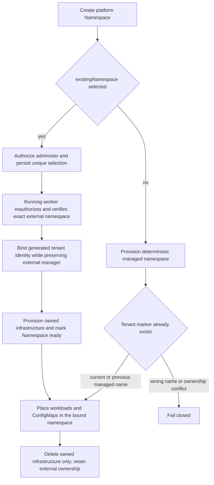

# Existing Kubernetes Namespace Placement Flow

## Overview

An Installation administrator explicitly selects an operator-owned Kubernetes
namespace while creating its platform Namespace. The running worker verifies
authorization and isolation, binds exact tenant identity, and preserves the
namespace after deletion. Other tenants retain deterministic managed placement;
existing managed namespaces created with the previous deterministic name remain
in place when their tenant markers and OpenClaw manager label are exact.

## Entry Points

- Trigger: `POST /namespaces` with optional `existingNamespace`, subsequent
  worker provisioning or deletion, and Configuration CRUD.
- `packages/occ/src/index.ts:OpenClawController.createNamespace`
- `apps/controller/src/worker.ts:ControllerWorker.authorize`
- `apps/controller/src/drivers/compute/kubernetes/index.ts:KubernetesComputeDriver.ensureNamespace`
- Assumptions: the operator exclusively dedicates an existing, `Active`
  namespace to its tenant and prepares its external-lifecycle annotation,
  restricted Pod Security labels, and tenant-local RoleBindings before the API
  request. The worker cannot verify foreign-Pod absence. The caller holds both
  Namespace-create and Installation-`administer` authorization.

## Flow

## Execution Trace

### 1. Authorize and persist explicit external selection

`packages/occ/src/index.ts:OpenClawController.createNamespace`

`POST /namespaces` accepts `{ "name": "support", "existingNamespace":
"customer-support-prod" }`. Omitting `existingNamespace` keeps ordinary managed
placement and creates the current `oce-<hash15>` namespace name when no tenant
namespace already exists. Existing-namespace selection requires ordinary
Namespace-create permission plus Installation-level `administer` and the
selected bundled Kubernetes Compute Driver; Docker or external
Compute selections reject it with `409`. OCC persists the exact physical name
with its generated platform Namespace ID before queuing worker provisioning.
Partial database uniqueness prevents simultaneous active claims for the same name.

### 2. Reauthorize and bind the exact external namespace

`apps/controller/src/drivers/compute/kubernetes/index.ts:KubernetesComputeDriver.ensureNamespace`

The running worker rechecks Installation `administer` immediately before
adoption. Compute reads the exact selected Kubernetes namespace and requires
`Active` status, `openclaw.dev/namespace-lifecycle: external`, all three
restricted Pod Security labels, and no foreign tenant markers or NetworkPolicies.
It binds its full Namespace-ID label and matching Namespace-ID annotation
together through a `resourceVersion`-guarded, non-forced patch; concurrent
ownership changes fail safely while preserving the manager and unrelated
metadata. Missing targets, termination, foreign ownership or additive policies,
ambiguous identity, and revoked authorization fail closed without managed
fallback. A missing worker RoleBinding keeps provisioning pending; a missing
API RoleBinding instead makes subsequent Configuration operations return `503`.
Compute reconciles its owned quota, limit range, and isolation policies; no
worker pause, restart, or Installation setting is needed.

`apps/controller/src/drivers/compute/kubernetes/index.ts:KubernetesComputeDriver.networkPolicies`
renders `allow-dns` with UDP and TCP ports `53` and `5353`, scoped to the
[configured DNS peer](../reference/drivers/kubernetes-compute/networking-and-isolation.md#networking).

### 3. Colocate Configuration and workload resources

`apps/controller/src/drivers/compute/kubernetes/index.ts:KubernetesComputeDriver.reconcileDnsPorts`

When preparing an Agent in a ready Namespace, Compute extends the installed
tenant and dedicated Gateway DNS policies with missing ports. It verifies exact
ownership and the configured DNS peer, then patches with the observed UID and
resource version. The patch preserves the installed Pod selector, existing
ports, peers, and other rules; policies from before network profiles continue
to admit other Agents' unprofiled Pods. Conflicts fail the preparation pass
without overwriting concurrent changes. A complete DNS grant causes no write.

`apps/controller/src/drivers/configuration/kubernetes/index.ts:KubernetesConfigurationDriver`

Configuration discovers the bound backing namespace by tenant label for each
ConfigMap operation. Managed discovery fails closed when multiple Kubernetes
Namespaces claim the tenant, when the claiming object lacks the full
`openclaw.dev/namespace` label and `openclaw.dev/namespace-id` annotation, or
when a managed namespace name is neither the current `oce-<hash15>` form nor the
previous `oce-<slug>-<hash12>` form. The previous form is accepted only for an
already discovered namespace with `app.kubernetes.io/managed-by=openclaw-enterprise`;
new managed namespaces still use the current name. Explicitly external Namespace
provisioning rejects Configuration creation with `409` until the worker marks
the Namespace `ready`. Compute uses the same resolved namespace for workloads,
dedicated Agent-owned shared PersistentVolumeClaims, private gateway state
claims, credentials, and deletion cleanup. Existing exact Namespace, Agent,
revision, service-account, and child-resource ownership checks remain unchanged.
Revision retirement preserves the current gateway and its owned claims; final
gateway teardown removes the exact-owned private and shared claims by UID.

### 4. Preserve externally owned namespaces during deletion

`apps/controller/src/drivers/compute/kubernetes/index.ts:KubernetesComputeDriver.deleteNamespace`

OCC first rejects deletion while Agents, Configurations, or service accounts
remain. Compute therefore removes only its owned `openclaw-quota`,
`openclaw-limits`, `allow-dns`, `allow-gateway-ingress`, and `default-deny`
objects, preserving default-deny until last. External namespace objects, their
tenant markers, RoleBindings, Secrets, and unrelated resources remain untouched.
Deleting a failed selection that was never bound to either tenant marker also
leaves the external namespace untouched; partial or foreign markers fail
closed. An already-missing namespace counts as deleted. After deleting an
unclaimed failed tenant, an administrator can correct preparation and retry.
Previously claimed namespaces cannot be readopted until an operator deliberately
clears both old tenant markers. Managed namespaces retain their existing
complete-deletion lifecycle.

## Debugging and Verification

- Before creating the platform Namespace, inspect external lifecycle,
  restricted Pod Security labels, tenant-local RoleBindings, NetworkPolicies,
  and Installation `administer` authorization. After provisioning, verify exact
  `openclaw.dev/namespace` identity and the `namespace-id` annotation.
- Run `node --test tests/conformance/kubernetes-compute.test.mjs` for driver
  contract coverage, including current managed placement, previous managed-name
  discovery, duplicate-claim rejection, foreign ownership rejection, and cleanup
  through the resolved namespace.
- Run `node --test tests/integration/kubernetes-compute-real.test.mjs` against
  the explicitly selected disposable cluster documented in `AGENTS.md`.
  Missing cluster infrastructure is an explicit verification gap.

## Related docs

- [Existing namespace specification](../../specs/.archive/12-kubernetes-existing-namespaces.md)
- [Platform design](../design.md)
- [Kubernetes Compute Driver](../reference/drivers/kubernetes-compute.md)
- [Production Kubernetes deployment](../guides/deploy.md)
- [Configuration Driver flow](configuration-driver.md)

## Manual Notes

[keep this for the user to add notes. do not change between edits]

## Changelog

- 2026-10-01 16:45: Trace additive DNS port updates during Agent preparation in already-ready Namespaces. (authoring-run/0cfc470c-ba88-4a95-86e0-35123f0de703 - d419e4e49513233c39f8975328902141a52d0a96)
- 2026-10-01 15:40: Documented the accompanying allow-dns change to permit UDP and TCP port 5353 alongside port 53. (authoring-run/a4c4fa72-fa88-4660-a8ef-25b347c15dcc - 4cab4887b863904bb7190599fc27cd93ecdef246)
- 2026-09-25 01:58: Documented managed namespace-name upgrade compatibility and resolved-namespace cleanup. (authoring-run/e9e7299c-b7ba-46de-9e24-fd8bb4b76388 - 8d256c22f13a0c79f1b7b9db617e895a503f1305)
- 2026-09-01 19:09: Corrected existing-namespace storage cleanup to final gateway teardown and removed the PR-number prefix from the title. (01a05f95-dd80-7011-990f-d1c46b5bb3cc - aa366c49c44834d59f74994c5fd37fb8096f169f)
- 2026-08-28 21:20: Removed the retired local-test Compute Driver from current selection boundaries. (01a036f4-cf1d-7cc1-bbc1-000879038ac8 - 3ec166eb5fae39ed0f51ffb5ebd93338c4a2db94)
- 2026-08-28 17:58: Updated moved feature-reference links for the documentation organization. (01a036f4-cf1d-7cc1-bbc1-000879038ac8 - 4270aa29b7015562049f46c6027962fd85b584a9)
- 2026-08-26 00:44: Traced explicit administrator-selected placement, persisted ownership, running-worker adoption, and fail-closed tenant cleanup. (01a03a24-5bf5-73f0-bc5c-21830985a7c2 - bcf21fb1bc6b)
- 2026-08-25 20:46: Simplified placement to tenant-label discovery and externally owned infrastructure cleanup. (01a03a24-5bf5-73f0-bc5c-21830985a7c2 - 05f06c051bf4)
