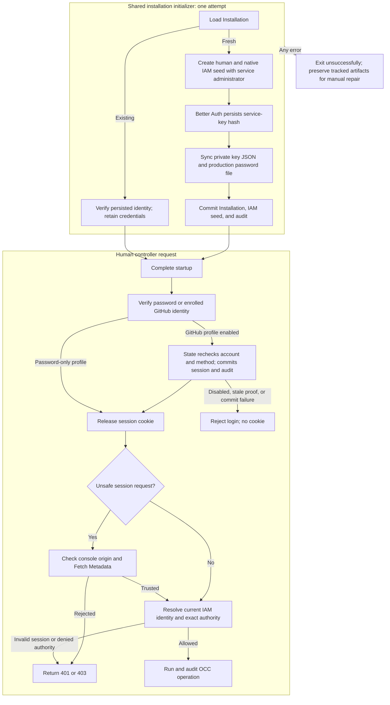

# Bootstrap and human authentication flow

## Overview

Fresh native-IAM bootstrap creates human and service administrators, binds both
to one shared Role, and commits them with the Installation. It writes
the initial service key, and in production a generated human password, to
protected storage; development uses its configured password. Human sign-in
then reaches exact IAM authorization. The
[service API key flow](service-api-keys.md) covers key verification, rotation, and revocation.

## Entry Points

- Trigger: `node scripts/bootstrap-installation.mjs` with `NODE_ENV=development`
  or `production`, `POST /api/auth/sign-in/email`, `POST /api/auth/providers/github/start`,
  `GET /api/auth/providers/github/callback`, the matching `google` routes, or a protected
  controller request.
- Source: [`scripts/bootstrap-installation.mjs`](../../scripts/bootstrap-installation.mjs),
  [`apps/controller/src/auth/index.ts:createControllerAuth`](../../apps/controller/src/auth/index.ts),
  and [`apps/controller/src/index.ts:createFastifyApp`](../../apps/controller/src/index.ts).
- Assumptions: Migrated PostgreSQL, configured Better Auth, native IAM bootstrap,
  protected output storage, disabled public signup, and exact IAM authorization.
  Production receives a private password path and sibling service-key path;
  development receives only the service-key output path.

## Flow

## Execution Trace

### 1. Load state and create the fresh administrator identities

[`scripts/bootstrap-installation.mjs`](../../scripts/bootstrap-installation.mjs)
loads the singleton Installation. Existing Installations only verify the
configured administrator's immutable account/IAM identity: no key issuance,
output changes, or identity/grant repair, including Installations predating service-administrator bootstrap.
`verifiedWithoutAuth` first runs the same check before loading Better Auth: plain
SQL for the administrator's `occ."user"` row, then the same IAM state and
administrator Principal check. Success logs `installation.already-bootstrapped`
with `step: "fast-path"`. Any miss or error runs the full Better Auth check, which
succeeds or fails exactly as before. The base URL is checked first on both paths.

For fresh setup, production creates a Better Auth account with a random password;
development creates the configured `OPENCLAW_DEV_EMAIL`/`OPENCLAW_DEV_PASSWORD`
account. `packages/iam/src/index.ts:createBootstrapAdministratorSeed` adds a
non-Agent `spn_<uuid>` without a Namespace and a separate unrestricted binding to
the human's administrator Role. The [authorization reference](../reference/authorization.md#supported-policy-surface)
defines exact actions. Additional-account provisioning creates no service administrator.

### 2. Issue private output, then commit the Installation

[`apps/controller/src/auth/index.ts:createServiceKey`](../../apps/controller/src/auth/index.ts) persists a Better
Auth key named `bootstrap-admin` with the default 30-day expiry, scoped to this
Installation and service principal. This auth write is independent of the OCC
transaction. An uncommitted IAM seed cannot authorize normal OCC operations;
startup does not expose the application until bootstrap succeeds.

[`bootstrap-output.ts:writeProtectedBootstrapFile`](../../apps/controller/src/composition/bootstrap-output.ts)
creates owner-only output exclusively and syncs it before OCC commit. The JSON
contains the key response and attempt Installation ID; production also writes its
password file on the same protected PVC, and development writes to its
bootstrap-only volume or explicit direct-initialization path. No plaintext reaches logs, audit, HTTP
bootstrap responses, or the worker.

Both modes commit Installation/IAM/audit through the same controller
transaction. The initializer owns one attempt scope for account creation, key
issuance, output, and commit. The API then loads committed state without
signing into itself or calling `POST /installation/bootstrap`, which stays
human-session-only and issues no bootstrap credentials.
Singleton database constraints select at most one committed seed; a losing
initializer fails like any other error.

Any error ends the single attempt with `installation.bootstrap-failed`,
available non-secret IDs and paths, and a nonzero exit; the Helm initialization
Job uses `backoffLimit: 0`. Completed tracked accounts, keys, and files,
including partial output, remain for inspection. One pre-return Better
Auth failure is narrower: if password `linkAccount` fails inside
`createAccount`, the helper attempts to delete the just-created user before
rethrowing. That is not a general artifact-recovery path; the initializer never
automatically revokes, retries, repairs, or resets committed or uncertain state.

An uncertain commit can already have persisted the seed. Before manual repair,
the operator confirms the original transaction has finished and compares exact
attempt IDs; file existence or another Installation is insufficient. A
deliberate reset must identify the disposable Installation and its dedicated
storage. The
[recovery procedure](../guides/deploy/service-keys.md#recover-an-incomplete-bootstrap)
owns those operator actions.

After confirmed success, the operator imports the file and retains its
non-secret IDs. Lost output is never regenerated;
[service-key management](service-api-keys.md) owns replacement and revocation.

### 3. Construct session authentication

`apps/controller/src/auth/index.ts:createPostgresControllerAuth` uses OCC's
[public binding](../reference/postgres-auth-binding.md#composition), which owns
the caller-owned pool, full schema, construction failures, and adapter settings.

`apps/controller/src/auth/index.ts:createControllerAuth` configures Better Auth
email/password authentication, protected session cookies, and durable PostgreSQL
storage. Sign-in returns `{ authenticated: true }`; the session token stays
in its HttpOnly cookie and is omitted from session-inspection responses.
`safeSessionResponse` projects `sessionKey`, an HMAC of the session record ID
under the auth secret (`apps/controller/src/auth/session-binding.ts`), alongside
public user identity; a changed key makes the
[Console](platform-console.md#2-resolve-the-session-before-private-reads) clear
retained views and drafts. Sign-out revokes the session.
In both profiles
`auth/admission.ts:passwordFailureAdmission` counts failures; fast success clears
the selected identity, not the address. `onLimited` reports
`authentication.sign-in-limited` once per lane/window. `auth/known-device.ts`
checks the email-bound MAC before controller-bounded password-state reads
(see [known devices](../reference/authentication.md#known-devices)).
Verified bindings select the device lane; completed reads rejecting bindings use
the shared lane. Failed or refused reads keep signed keys as extra email/address
constraints, never exemptions or renewed allowances. Password-only admission captures
issuance state before credentials, preserving reset-race invalidation; success
may reissue it. In the password-only profile with PostgreSQL State,
`passwordSignInAudit` attempts `authentication.login`. A failed success audit
returns `503` without a cookie after the controller attempts session deletion. A failed denial audit (`DenialAuditUnavailable`) counts as a
credential failure against tracked entries. With an external provider,
`/oce/password` marks it `PASSWORD_DENIAL_AUDIT_UNAVAILABLE`, and the controller
applies the same accounting. The
[session lifecycle](../reference/authentication.md#session-lifecycle) owns audit
fields, status codes, and unconfirmed outcomes. Better Auth logs only errors, so
a wrong password writes no unstructured console warning.

`requireSessionKey` applies the optional `x-occ-session-key` header after the
cookie session resolves, in `ControllerAdmissionVerifier.verify` (protected API
and native admin proxy), `session`, `resolveSession`, and `signOut`. An absent
header changes nothing; a malformed, duplicated, or foreign key returns `401`
and makes sign-out revoke or clear nothing, so the header narrows but never selects a
session. The native admin proxy strips the header upstream.

When GitHub is configured, `apps/controller/src/auth/github.ts:createHumanLogin`
wraps the Better Auth adapter and provides curated password, GitHub, and logout
endpoints. `packages/occ/src/state/human-authentication.ts:PostgresHumanAuthentication`
owns persisted account/method checks and the original State transaction.
Password verification captures the credential and account version before the
session transaction rechecks them. Both methods pass a controller-private proof
to the same guarded session creation path; the session and required audit commit
before Better Auth releases its cookie. Session reads check the current account,
method, version, and Principal, with an eight-hour absolute lifetime and no refresh.
HTTPS uses a `__Host-` session cookie, which sibling hosts cannot plant; session
readers and logout reject duplicate active-session cookies.

For GitHub, the Console reads `GET /api/auth/providers` and sends a same-origin
`POST /api/auth/providers/github/start`. The server stores a five-minute attempt with state and browser
secret digests, provider instance, callback, and PKCE verifier. A host-only
HttpOnly cookie binds the browser; this profile rejects shared-domain sessions.
Callback consumption commits before exchange; a losing, expired, or invalid
attempt does not exchange a code.
`apps/controller/src/auth/github.ts:exchangeGithubSubject` exchanges the code
with the GitHub App client ID and secret, uses the user access token only for
`/user`, and returns the numeric subject, which selects an exact existing
enrollment; email, login name, and tokens never become identity or policy. The
[GitHub reference](../reference/authentication/external-sign-in.md#github-sign-in-for-existing-accounts)
owns OAuth scopes, token disposal, App private-key custody, and fixed
redirects.

`attemptId` authenticates the attempt-state digest with HMAC. Success sets a signed, two-minute
`SameSite=Strict` v2 receipt binding provider instance, session and attempt. The
same-origin result handler verifies signature, expiry and configured provider
before State lookup; unfinished legacy sign-ins must restart. Wrong-provider refusals
neither consume nor clear the receipt. Matching attempt and current cookie session
permit one exchange per process-local ledger: record consumption until expiry,
clear the receipt; return the session key without issuing or extending sessions. Password sign-in returns
it. A malformed, unbound, replayed, or expired callback is refused by
`refuseUnmatched`, which writes no audit event and increments
[`occ_sign_in_unmatched_callbacks_total`](../reference/metrics.md#application-families).
Denials after `consumeAttempt` matches are audited as
[`PROVIDER_UNAVAILABLE`](../reference/authentication/external-sign-in.md#github-sign-in-for-existing-accounts),
`EXTERNAL_IDENTITY_REJECTED` or `ACCOUNT_DISABLED`; with GitHub's
[allowlist](../reference/authentication/external-sign-in.md#organization-and-team-allowlist),
`apps/controller/src/auth/github.ts:githubMembership` runs between `GET /user` and the account
lookup and adds `MEMBERSHIP_REQUIRED` and `MEMBERSHIP_UNAVAILABLE`, whose response code the
callback route turns into the Console's `authReason`;
State dependency failure or uncertain session completion is not a denial. Neither path retries.

Google (and generic OIDC) reuses `apps/controller/src/auth/github.ts:externalProviderEndpoints` for
start, callback, and result, with provider instance `google:<sha256(client ID)>`.
Authorization adds scope `openid email` and an auth-secret HMAC of attempt state
as nonce, without extra storage.
`apps/controller/src/auth/google.ts:exchangeGoogleSubject` exchanges the code, fetches
Google's signing keys through the same bounded transport, verifies the RS256 ID token's
signature, issuer, audience, expiry, and nonce (plus `hd` and `email_verified` when
allowed domains are set), and returns only `sub`. Tokens and email are discarded.

`apps/controller/src/auth/client-address.ts:clientAddressConfiguration` canonicalizes
IPv4-mapped addresses before prefix validation, refusing entries covering every
IPv4 or IPv6 address. `resolveClientAddress` uses dotted IPv4 for mapped peers and
header hops.

Password sign-in enters controller admission before `/oce/password`, with the
recovery email reserved like an administrator's. GitHub, Google and OIDC share bounded
process-local start, callback and result admission (`keyedAdmission`), keyed on
client addresses behind trusted proxies and browser cookies otherwise. Provider
HTTP shares a deadline and response-byte cap; State bounds pending attempts and expired cleanup.
State persists attempt and session deadlines; cookie Max-Age subtracts monotonic
elapsed work. Expired completion releases no cookie.

`scripts/auth-maintain.mjs` parses arguments with
`scripts/lib/auth-maintain-arguments.mjs:parseAuthMaintainArguments` before
configuration or database access. Undeclared commands, including inherited object
properties, exit `64` with usage. The
[maintenance procedure](../guides/deploy/auth-maintenance.md) lists supported operations
and exit codes.

Activation is a stopped-maintenance contract: admission stopped, requests
drained or terminated, and every old controller stopped; startup does not fence
an old live reader. Both PostgreSQL compositions reject
GitHub with enabled native administration, even when its cookie domain is missing.
`apps/controller/src/auth/index.ts:createPostgresControllerAuth` constructs and
initializes authentication before activation, checking the secret, canonical HTTP
origin, and supported profile. Invalid static configuration leaves legacy sessions,
account enrollment, and the recovery designation unchanged.
`PostgresHumanAuthentication.activateRecovery` then validates and enrolls the complete existing password-user/Principal population,
fixes the usable recovery administrator, and removes unbound historical sessions
in one State transaction before serving resumes. Unsupported or incomplete
populations fail activation. See the
[deployment procedure](../guides/deploy/production-installation.md#enable-github-browser-sign-in).

Account routes enforce the
[session and recovery controls](../reference/authentication/external-sign-in.md#session-and-recovery-controls):
State locks actor and target, rechecks the actor session, and applies the
caller's `expectedVersion`. Attachment, disablement, and account-wide revocation advance
that version and invalidate target sessions and proofs without changing IAM.
A guarded read returns current account and method state, not a prior operation
receipt. Unknown completion returns an explicit dependency failure without
replay or compensation; operators must resolve uncertainty before a new action.
Without GitHub or Google, the composition supplies no account operations; the routes
still authorize the caller, then return `409 RESOURCE_CONFLICT`.
Logout commits deletion and audit before clearing the cookie. The [authentication reference](../reference/authentication/external-sign-in.md#github-sign-in-for-existing-accounts)
owns configuration, recovery limits, and operator-visible behavior.

### 4. Admit and authorize protected API calls

`ControllerAdmissionVerifier.verifyControllerRequest` applies the
[browser origin rules](../reference/authentication.md#browser-request-origin) to
unsafe session requests before admission, including sign-out before revocation
and the GitHub result exchange, which shares the GitHub admission lane, before
reading. Explicit service API keys skip this check and never fall back to a cookie.

`apps/controller/src/index.ts:createFastifyApp` validates the session, resolves
its installation-owned issuer and user ID through the selected IAM Driver, and
authorizes the exact resource through that same Driver. The Driver loads current
policy separately for identity lookup and authorization, so account and
permission changes are visible across controller instances. Missing or invalid
sessions return `401`; denied permissions return `403`; dependency failures fail
closed. Bearer credentials and caller-supplied identity headers are rejected.

### 5. Provision additional accounts

`apps/controller/src/index.ts:createFastifyApp` permits an authorized human
Installation administrator to create another account, with or without GitHub
sign-in. `prepareAccount` validates and hashes the password without writing; the
PostgreSQL composition then calls `provisionPasswordAccount`, which writes the
user, password method, Principal, explicit existing-role binding, enrollment,
and audit in one State transaction, so a failure leaves no partial account.
Nothing is compensated afterward. A lost COMMIT reply returns `503` with an
unknown outcome; the account is complete or absent, so a deliberate retry with
the same email creates it only if the first attempt did not commit, and
otherwise returns `409`.
Account creation issues no session and infers no grants.

## Debugging and Verification

- `node --test tests/integration/native-admin-access.test.mjs` covers trusted and
  untrusted origins on session mutations and sign-out, plus service-key admission.
- `node --test tests/integration/postgres-production-wireup.test.mjs` with
  `OCC_PRODUCTION_WIREUP_DATABASE_URL` proves actual bootstrap, protected random
  password/key delivery, human sign-in, service-key access, and no reissue on rerun.
- `node --test tests/integration/postgres-auth-accounts.test.mjs` with
  `OCC_TEST_DATABASE_URL` covers account provisioning, transactional rollback, and
  a lost provisioning COMMIT reply.
  Its fresh development bootstrap case also verifies the service identity,
  protected output, and key access, skipping when an Installation exists.
- `node --test tests/integration/bootstrap-output.test.mjs` covers exclusive
  output and rejected unsafe paths. Failed writes retain any created file.
  Database cases require the [disposable PostgreSQL setup](../testing/postgresql.md#postgresql-test-environment);
  an unconfigured/skipped suite is not runtime proof.
- `node --test tests/integration/postgres-bootstrap-failures.test.mjs` with
  `OCC_BOOTSTRAP_FAILURE_DATABASE_URL` exercises concurrent production attempts
  and preserves both environment modes' credentials when a test fault discards the
  acknowledgement after a real COMMIT. It also proves that a complete Installation
  takes the fast path and that each missing invariant takes the full path. The
  suite resets a dedicated loopback database.
- Verify copied output is `0600` without printing it; use a key-authenticated
  `GET /installation` and Namespace create/read to check current authority.
  A `401` indicates credential rejection; `403` indicates identity/scope/policy
  denial. For a failed bootstrap, follow
  [operator recovery](../guides/deploy/service-keys.md#recover-an-incomplete-bootstrap).
- `pnpm typecheck`, `pnpm format:check`, and `pnpm check:workspace` validate source
  and workspace structure. Compose/PVC permission checks require real runtime
  execution; chart rendering alone does not prove storage access.

## Related docs

- [Authentication](../reference/authentication.md)
- [Configuration reference](../reference/settings.md)
- [IAM](../reference/authorization.md)
- [Platform startup flow](platform-startup.md)
- [Docker Compose development](docker-compose-development.md) and [production startup](production-startup.md)
- [Service API keys](service-api-keys.md)
- [Bootstrap specification](../../specs/plans/16-bootstrap-admin-service-account/index.md)
- [Feature spec](../../specs/.archive/10-local-password-authentication.md)

## Manual Notes

[keep this for the user to add notes. do not change between edits]

## Changelog

- 2026-10-07 10:10: Treat IPv4-mapped trusted proxies as IPv4; refuse catch-all proxy CIDRs. (fix-678 - bf67a4317)

- 2026-10-06 07:30: Reject undeclared maintenance commands before configuration. (authoring-run/8f5b1566-4538-437c-8e8a-fd2049050c6e - 4bacc7925fcef75ea8715905a0c6c86abb7203d2)

- 2026-10-04 21:00: Verify an existing Installation with SQL before loading Better Auth. (fix/bootstrap-fast-path)

- 2026-10-01 14:36: Bind result receipts to provider instances. (authoring-run/afd78df4-12de-4f41-b2df-7ebb53ed3213 - f22a584e6ce21d505b40a72fdb5ae1c6e74c1c84)

[Bootstrap and human authentication documentation history](local-password-authentication/history.md) preserves the older dated entries.
