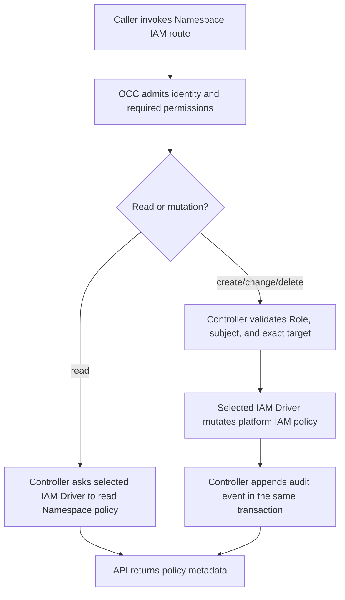

# Namespace IAM Policy Flow

## Overview

Namespace IAM policy management begins when an authenticated caller uses the OCC
API or CLI to list, create, read, or delete a Namespace Role or exact
AccessBinding, or to list, create, or read a Namespace ServicePrincipal. OCC authorizes the administrator, validates that the policy entry
belongs to the requested Namespace, and delegates the policy mutation to the
selected IAM Driver. The flow stops after the policy and audit event commit
together in the platform state transaction.

## Entry Points

- Trigger: `GET`, `POST`, `PATCH`, or `DELETE` under `/namespaces/:namespaceId/iam/*`
- Source: `packages/contracts/src/api/routes.ts:occApiRoutes`
- Source: `apps/controller/src/index.ts:requiredPermissions`
- Source: `apps/controller/src/http/iam.ts:iamHandlers`
- Assumptions: the caller is admitted to the Installation, the selected IAM
  Driver implements Namespace policy management, and the requested Namespace
  already exists.

## Flow

## Execution Trace

### 1. Route admission and permission selection

`apps/controller/src/index.ts:requiredPermissions`

The API route declares IAM operations as Installation administration plus exact
Namespace read. Admission and identity resolution remain in
`apps/controller/src/index.ts`; they resolve the caller before dispatching to
the IAM handler. The OCC controller uses the selected IAM Driver for both
permission checks. Ordinary access to the target resource does not authorize
policy delegation.

### 2. Role and AccessBinding commands reach the controller

`apps/controller/src/http/iam.ts:iamHandlers`

List and read operations call the corresponding `OpenClawController` IAM method
and return policy metadata. Create and delete operations run inside
`controller.transact`, append an attributable mutation audit event, and return
only after the transaction commits. The event's authorization records the
Installation `administer` check. Role events carry the Namespace as resource and
`roleId` plus `permissions` in details. AccessBinding create, runtime-role change and delete events
carry the bound target as resource (the Namespace for a Namespace binding) and
`bindingId`, `subjectKind`, `subjectId`, `roleId` and the optional `runtimeRole` in details. Deletion reads
the removed Role or AccessBinding in the same transaction to record it.
ServicePrincipal creation takes an empty body; its event carries the Namespace
as resource and `servicePrincipalId` in details. The new non-Agent identity is
fixed to the Namespace, holds no grant until an AccessBinding names it, and is
listed only in that Namespace. No route deletes it yet; the [service key flow](service-api-keys.md)
issues and revokes its keys.

### 3. OCC validates policy ownership

`packages/occ/src/index.ts:createIAMAccessBinding`

Role creation accepts only nonempty, duplicate-free permissions for Namespace
resource kinds; `namespace` permissions support only `read`. `iamRolePermissions`
also refuses action/kind pairs outside `SUPPORTED_PERMISSION_ACTIONS` (contracts),
because no operation checks them, and then any `create` Permission, because `create`
is checked on the Namespace and this API binds only exact resources
(`NAMESPACE_POLICY_CREATE_REASON`). AccessBinding creation accepts identity subjects and exact
targets in the same Namespace, including the Namespace itself when the target
ID matches the path Namespace. OCC verifies the target resource exists and that
the caller can read it before asking the IAM Driver to create the binding.
`assertAccessBindingRoleApplies` then refuses, with `400`, a Role that has no
Permission for the target's kind, or a `create` Permission stored before Role
creation refused them, because evaluation would drop those grants.

Runtime assignment creation and changes use the saved Agent Configuration through the Compute catalog, independent of deployment. `runtimeRoleConfiguration` supplies its reviewed ID and generation. After holding IAM authority and the Namespace lock, OCC reads that Configuration through its Driver and rejects a changed ID or generation with `409`, or an unknown role with `400`. The lock serializes this check and binding write against Configuration changes and Agent Configuration replacement. Only `runtimeRole` is persisted on the existing exact human/Agent binding. Native definitions and profile admission are traced in [OpenClaw access](agent-native-admin.md).

### 4. The IAM Driver persists or reads policy

`packages/iam/src/index.ts:NativeIAMDriver`

The native IAM Driver implements Namespace policy methods against the
platform-provided policy repository. It rejects missing Roles, cross-Namespace
targets, unsupported subjects, duplicate IDs, referenced Role deletion, and
unknown exact bindings without weakening authorization. Invalid Role or
binding input (an unsupported Permission, or a subject, Role or target not
usable in the path Namespace) raises `IAMPolicyValidationError`, which HTTP
maps to `400 INVALID_REQUEST` with the offending field as the detail path.
Referenced Role deletion raises `IAMRoleInUseError` (`409 RESOURCE_CONFLICT`).
Existing human Principals can receive bindings without a Namespace service
identity. ServicePrincipal subjects must belong to that exact Namespace.

When the selected native Driver reloads policy during a PostgreSQL State callback,
`PostgresPlatformState.loadNativeIAMState` reads through that State instance's
original transaction. Authorization therefore sees that unit's pending grants
and removals. Outside a callback, the loader opens its ordinary read transaction.
Work that escapes the callback retains its original closed lifetime and fails;
it cannot obtain another client after commit, rollback, or an unknown outcome.
This transaction binding supplies neither authenticated session custody nor a
fence against concurrent policy invalidation.

### 5. Platform state commits policy and audit together

`packages/occ/src/state/postgres-state.ts:PostgresPlatformState`

The PostgreSQL state implementation writes Roles and AccessBindings through the
same unit of work used by the API audit append. A duplicate person/Agent runtime assignment becomes the existing `ResourceConflictError` before the IAM wrapper handles unknown failures. The transaction rolls back without a success audit, and the API returns `409`. If commit outcome is unknown,
State discards the connection without another query. OCC reports dependency
failure; a caller must not infer rollback or replay the mutation from that
result. Later authorization requests read the current policy through the IAM
Driver. Namespace locking serializes grant creation with Namespace deletion;
exact resource targets retain their existing deletion locks, and deleting a
target resource deletes the bindings on it in the same transaction. Identity foreign
keys protect persisted bindings without expanding application-role privileges.
Deletion audit projections and Namespace policy removal live in
`packages/occ/src/iam-policy-cleanup.ts`; callers pass their existing transaction
unit, so cleanup and its audit retain the same commit boundary.
Both adapters apply one subject rule on every AccessBinding write: a human
without a Namespace, a non-Agent ServicePrincipal of the exact Namespace, or the
ServicePrincipal of a live Agent there. PostgreSQL checks the owning Agent in
the same query because its Agent owner key is deferred to commit. The in-memory
adapter resolves subjects live through its `resolveIAMIdentity` lookup, so
humans enrolled after construction can be bound, then falls back to identities
provisioned at construction. Agent-owned ServicePrincipals resolve only through
its current Agent state.

State also provides an opt-in Installation authority and native-IAM barrier
for an original transaction. Its SQL supplier is unregistered, and the
Namespace routes above do not use it. It does not protect these routes until the
selected account, session, and policy writers join the same protocol.

## Debugging and Verification

- `node --test tests/integration/occ-api.test.mjs` checks the HTTP contract and
  API admission behavior for Namespace IAM policy.
- `node --test tests/conformance/occ-api-security.test.mjs` checks that Agent
  responses expose `servicePrincipalId` without accepting caller-supplied values.
- `node --test tests/integration/postgres-namespace-iam-policy.test.mjs` checks
  PostgreSQL persistence, audit atomicity, and deletion behavior with real state.
- `node --test tests/conformance/postgres-transaction-unknown-commit.test.mjs`
  checks that an unknown commit does not wait for a later rollback query.
- A `403` means the caller lacks Installation administration, exact Namespace
  read, or target read for binding creation. A `400` names the invalid
  field in its detail path. A `409` on Role deletion means a binding still
  references the Role.

## Related docs

- [Identity and access management](../reference/authorization.md)
- [Agents](../reference/agents.md)
- [API reference](../reference/api.md)

## Manual Notes

[keep this for the user to add notes. do not change between edits]

## Changelog

- 2026-10-05 13:58: Trace saved Configuration role selection, stale-selection rejection and deployed permission previews. (authoring-run/80db88a0-8bf4-401d-b060-01f34cc3af10 - 76f9307b61ccb1c544257081d95b15a0ee893b92)

- 2026-10-02 11:55: Trace atomic runtime-role updates, assignment audit fields and duplicate-assignment conflicts. (authoring-run/fd458bb6-fbf9-4c93-ad3f-1e6fc793300f - a946032a14cb2f33a5077c3c0340e8f5f54cf4b7)

- 2026-10-01 20:30: Refuse AccessBindings whose Role cannot apply to the target. (fix-d93-d100)
- 2026-09-29 16:40: Record the Installation authorization and the Role or AccessBinding changed in IAM policy audit events. (fix-5)
- 2026-09-29 05:28: Bind selected native policy reloads to the original State transaction and reject escaped reads. (codex/01a0eb4c-5933-7752-bddc-f787e8da79e7 - 2a191c74c0079e329db130d0a81a1f0f87869bb9)
- 2026-09-27 19:15: Clarify unknown commit handling and the unregistered authority barrier. (codex/01a0b3bf-83a8-7392-ae2d-1a369b54ab3f - 181b0472f9a5a9d422035edf5121d3a15c200cb5)
- 2026-09-23 22:56: Update source ownership for extracted IAM HTTP handlers; preserve admission and transaction boundaries. (codex/01a0d075-a358-7620-8c16-fd4290acddf1 - 4df9f9800836dc1c2b57afd5f8af4d91f55088d5)

- 2026-09-23 08:44: Extend the managed grant path to existing humans and exact Namespace targets. (authoring-run/1d5da2d1-e61e-4277-bd91-037d64c10744 - 370570d788725a178a7441f8388a333c47c29798)
- 2026-09-20 09:32: Document Namespace IAM policy management flow. (codex/01a0bce5-9f29-7110-85fd-6b140674d362 - 5f7728e8c5d128bc7067b7035e07f06c3c4da92c)
