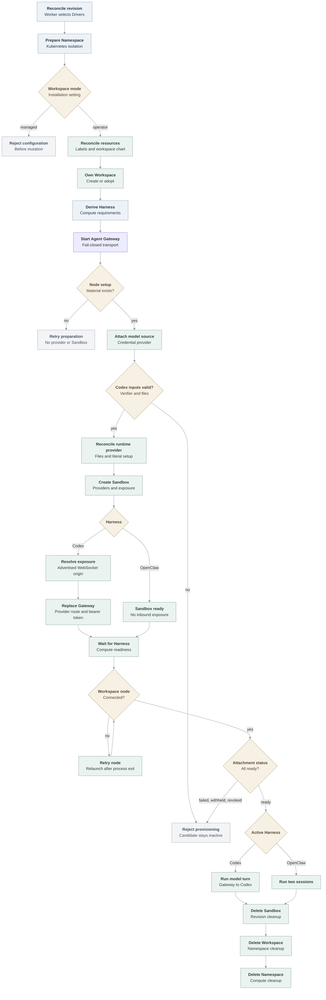

# OpenShell Sandbox provisioning flow

## Overview

The Kubernetes Compute Driver delegates dedicated Codex and native OpenClaw
Harnesses to the selected OpenShell Sandbox Driver. One deployment-paired OpenShell Gateway uses
an explicitly configured workspace mode. Operator mode is implemented: for each
OCC Namespace, the Driver labels the Kubernetes namespace, reconciles rendered
workspace-chart resources, and creates or adopts an OpenShell Workspace with
the same physical name. Managed mode is recognized but fails before mutation.
Sandbox requests are homed in the operator-mode Workspace.

The model credential uses a [credential source](credential-source-lifecycle.md),
so the Agent receives no Secret permission. For dedicated Codex, Compute passes
only the app-server token verifier and admitted runtime-file contents. The
Sandbox Driver realizes the files as a revision-owned OpenShell provider and
enables bearer passthrough on the Codex service exposure. Codex, not OpenShell,
authenticates the Gateway request. Compute detects the Driver's endpoint
capability and configures the Agent Gateway to use the OpenShell-advertised
WebSocket origin. It does not activate the direct Kubernetes Harness Service for
that path. Drivers without the capability retain the existing Service or private
route behavior.

The development Driver puts the expiring workspace-node setup envelope in a
revision-owned provider file. The Harness signs the bootstrap token that the
Gateway receives, while network policy limits its use to the node executable
and Agent Gateway endpoint. This exposes the token to the Sandbox and is not a
production credential-delivery contract.

The local Kubernetes development profile installs the pinned Gateway and
renders the workspace chart into the Installation configuration, in either a
Kubernetes-only or Compose control plane. Neither uses the verification-only
compatibility projection.

## Entry Points

- Trigger: a worker reconciles an Agent revision that selects the OpenShell
  Sandbox Driver and Kubernetes Compute Driver.
- Source: `apps/controller/src/drivers/sandbox/openshell.ts:ensureNamespace`
- Source: `apps/controller/src/drivers/sandbox/openshell.ts:provisionHarness`
- Source: `apps/controller/src/drivers/compute/kubernetes/index.ts:prepareRevision`
- Assumptions: the Installation selected Kubernetes Compute, the OpenShell
  Sandbox, and the OpenShell Credential Gateway through one `openshell` Backend;
  the tenant Namespace and baseline isolation exist; and the Gateway is ready in
  operator workspace mode.

## Flow

## Execution Trace

### 0. Create the development control plane

`scripts/dev-up`, `internal/occdev/openshell_k3d.go:upK3d`,
`internal/occdev/openshell.go:prepareOpenShell`,
`internal/occdev/kubernetes.go:writeInstallation`

The written Installation declares the `openshell` Backend with the Gateway
endpoint, the Sandbox, and a Credential Gateway whose `binaries` list holds the
native Codex executable. Model egress comes from the credential source's
provider profile, not the Sandbox policy.

`scripts/dev-up` validates Kubernetes Compute with OpenShell and delegates to
`occ dev up`. Compose is the default control plane;
`OCC_DEVELOPMENT_CONTROL_PLANE=kubernetes` selects Kubernetes-only. Before
creating state, Kubernetes-only startup rejects API-port collisions and records
the engine, cluster, control-plane Kubernetes namespace, API port, and key destination. Both
profiles verify the pinned source archive, package its charts, and import
digest-pinned Gateway, Sandbox, and supervisor images. Kubernetes-only startup
also builds or selects the OCE controller and Agent runtime, then imports them
with PostgreSQL and resolves every in-cluster digest.

After Helm installs OpenShell, the development launcher reads the exact Gateway
Service ClusterIP. It writes `network.providerHarness` with that address, the
Gateway Pod selector, and TCP/8080. The Agent Gateway Pod uses the address only
as a host alias for the exact hostname in the provider-advertised origin; its
HTTP Host remains the OpenShell routing key. The corresponding NetworkPolicy
allows that Gateway only to the selected OpenShell Gateway Pods and port.

The default Compose profile runs PostgreSQL and OCC in Compose while its worker
targets k3d. Kubernetes-only runs those components in `oce-system` with
in-cluster authentication. Both install private Envoy routing and operator
Workspace resources, and restrict OpenShell Gateway access to the API, worker,
supervisor callbacks, and dedicated Agent Gateways. See
the [local deployment guides](../guides/deploy/local-kubernetes-development.md)
for startup, RBAC, image, and cleanup details.

Cleanup validates the recorded engine and state before deleting the named
cluster and, in Compose mode, the recorded project and volumes. Partial cleanup
retains recovery state.

### 1. Prepare the Namespace and OpenShell Workspace

`apps/controller/src/drivers/compute/kubernetes/index.ts:ensureNamespace`

Compute establishes quota, limits and baseline NetworkPolicies before
`SandboxDriver.ensureNamespace`. Managed mode rejects before Kubernetes or
Gateway use. Operator mode applies namespace labels, workspace-chart resources
and provider NetworkPolicies, then checks health; optional namespace-local
readiness comes first. Development uses the central Gateway endpoint.

`apps/controller/src/backends/openshell.ts:clientForNamespace` supplies the
endpoint to `apps/controller/src/drivers/sandbox/openshell-gateway-client.ts`.
HTTP origins retain port 80 instead of inheriting gRPC's 443; nondefault ports,
HTTPS and raw targets retain their behavior.

The Driver uses Compute's physical namespace name for the Workspace. It reads
it, creates it if missing, or rereads after concurrent `ALREADY_EXISTS`.
Adoption requires its expected name, OCC Namespace ID label, managed-by label
and active phase; conflicts fail Namespace preparation. Compute's `oce-` plus
15-character digest fits OpenShell's 19-character limit.

### 2. Derive the provider-owned Harness request

`apps/controller/src/drivers/compute/kubernetes/index.ts:prepareRevision`

For a dedicated revision with `provisionHarness`, Compute derives Harness image,
command, labels, environment, workspace mounts, optional workload identity, and
resources from the same Deployment shape used by the regular Kubernetes path.
For a first revision, Compute starts the dedicated Agent Gateway with its
existing fail-closed transport target while the direct Agent Service remains
inactive. It returns an incomplete readiness result until that Gateway is ready
and its Agent-owned workspace-node setup Secret exists. No credential attachment,
runtime provider, or Sandbox creation occurs during that wait. Compute then adds
the setup Secret reference to the derived workload before invoking the Sandbox
Driver.
The local OpenShell profile disables projected workload identity. If it is
enabled, OpenShell rejects the revision before Gateway mutation because the
pinned API cannot preserve the exact Agent ServiceAccount and token.
For a `credential_source` revision it renders only `CODEX_LOGIN_MODE=api_key`,
no model Secret, and calls `CredentialGatewayDriver.attachForRevision`. The
attachments, one provider name per source, go into
`requirements.credentialAttachments`. Compute passes those requirements and the
immutable revision to OpenShell instead of creating the Deployment itself.
For Codex, it reads the exact Agent transport Secret in the control plane and
adds only its SHA-256 verifier as `APP_TOKEN_SHA`. It turns the admitted
plugin-runtime snapshot into `runtime.json` and `config.toml` workload-file
requirements and removes their ConfigMap paths from the remaining environment.

### 3. Validate and serialize the Sandbox

`apps/controller/src/drivers/sandbox/openshell.ts:provisionHarness`

OpenShell accepts only dedicated Codex or OpenClaw revisions pinned to the
selected Driver. It serializes Kubernetes, filesystem, process, and
binary-scoped network policy against the exact `v0.1.3-pre.2` wire contract.
Landlock is a hard requirement; unsupported enum spellings, inherited object
keys, the old `passthrough` TLS spelling, or policies without executable paths
fail before launch.

Kubernetes Compute invokes `provisionHarness` only after the workspace-node
setup Secret exists. The Driver creates or adopts the runtime provider with the
final node envelope on first mutation, never an empty placeholder.
If Compute later renews an expired setup, the same call version-fences an
OpenShell `UpdateProvider` that changes only `node_setup_json`.
When configured, a bounded post-create delay keeps Compute from consuming the
exposed route before the canonical process listens. Compute then rolls the
Gateway to that endpoint and waits for the exact Deployment before observing
workspace-node enrollment.

Dedicated Codex requires one lowercase `APP_TOKEN_SHA`, no `APP_SERVER_TOKEN`,
and two bounded plugin-free runtime inputs. Selected plugins, repository broker
configuration, malformed files, and other Secret-backed environment fail before
Gateway mutation.

The Driver creates or adopts a revision-owned provider from the shared
`oce-codex-runtime` profile. It supplies `runtime.json`, `config.toml`, and
`node-setup.json` as read-only files. The Driver validates the Agent-owned setup
Secret and writes its complete expiring envelope, including `bootstrapToken`,
to `node-setup.json`. This development diagnostic deliberately avoids WebSocket
credential rewriting because OpenClaw signs the token value in its device proof.
Before renewal, the Driver requires the same endpoint and TLS fingerprint, an
expired stored envelope, a later live expiry, and unchanged runtime and CA
configuration. The Sandbox network policy limits the connection to the exact
Gateway endpoint and `/usr/local/bin/node`. Foreign ownership or other drift
fails before Sandbox creation.

The Driver mounts a revision-scoped Agent PVC subpath at
`/sandbox/.openclaw-runtime`; persistent subpaths mount below
`/sandbox/.openclaw-mounts`. It rewrites admitted `/home/node` paths beneath the
runtime home. Exact mount paths such as `OPENCLAW_NODE_STATE_DIR` use a
process-created `state` child, so atomic writes cross neither a symlink nor a
root-owned mount. Workspace, node identity, sessions, and generated images
remain separate. `/tmp` stays on the bounded ephemeral image layer.

Credential attachments must use the OCC `oce-cs-` name shape and cannot repeat
a static provider. The profile binds them to the exact native Codex executable;
a changed runtime dependency path fails the startup model probe.

The dedicated native OpenClaw real-runtime case still uses its separate
verification bridge; this delivery does not make that path a supported local
first-Agent option.

### 4. Call the versioned gateway contract

`apps/controller/src/drivers/sandbox/openshell-gateway-client.ts:createSandbox`

The client sends the Sandbox identity, spec, Namespace Workspace scope, and a
`request_id`: the revision UUID first. OpenShell keeps a `request_id` whose create
errored server-side unresolved forever, so when the Gateway refuses one
(`REQUEST_OUTCOME_UNCERTAIN`, `REQUEST_ID_PAYLOAD_MISMATCH`, or
`REQUEST_REPLAY_UNAVAILABLE`) and `getSandbox` finds no Sandbox, the Driver tries
the next of 16 IDs: the revision UUID, then 15 derived from it. Each failing pass
spends one ID; the Workspace-unique Sandbox name prevents duplicates. Unresolved
IDs never expire. Once the controller
identity holds 1000 unresolved or unexpired admission records, OpenShell rejects
every new `request_id` with `RESOURCE_EXHAUSTED`, so repeated server-side create
failures count against that quota. Completed records expire after 24 hours.
`unary` maps that exact refusal to `OpenShellAdmissionLimitError`, a
`TransientDependencyError` (`SANDBOX_ADMISSION_LIMIT_REACHED`): revision
provisioning waits for it until the convergence deadline without spending
attempts; Namespace work retries it as usual. Codex requests one unnamed
bearer-passthrough exposure for `APP_SERVER_PORT` and requires its `service_urls`
entry. Native
OpenClaw connects outbound, so it requests no exposure and rejects any returned
URL. The Driver
calls `getSandbox` first and creates only an absent Sandbox; it adopts an
existing or `ALREADY_EXISTS` Sandbox only when its Workspace, labels,
annotations, and full spec match the request and it is not deleting or stopped.
For Codex, `GetService` must also return the unnamed bearer-passthrough endpoint
on the admitted port. Workspace `sandbox:write` is the trust boundary because a
holder can replace the Sandbox.

The Backend shares one client per endpoint but does not cache failed setup.
Cancellation is checked after setup and before dispatch; after dispatch it
cancels the local gRPC call without proving the remote mutation stopped. The
lifecycle therefore recovers uncertain effects through adoption and cleanup.

`GetService` retains two forms of the URL. The normalized form preserves the
existing control-endpoint behavior used by local clients. The advertised form
preserves OpenShell's hostname and port for workload transport. The Sandbox
Driver accepts only the unnamed exposure on the admitted app-server port with
bearer passthrough and returns its WebSocket origin plus the provider-local
`/sandbox/enterprise` workspace root through `harnessEndpoint`. Missing,
malformed, or changed exposure state fails closed.

The revision provider survives an uncertain create; revision cleanup deletes
the Sandbox first.

The runtime opens provider files through their reported absolute paths. Any
Gateway failure prevents readiness.

OpenShell's supervisor opens the node connection. Kubernetes-only uses the
in-cluster WSS route; Compose uses the Agent Gateway Service URL. In both cases,
policy binds the node executable and supervisor to the exact destination. The
supervisor relaunches an exited node and falls back to direct signaling when
process-group signaling returns `EPERM`.

### 5. Observe readiness or clean up

`apps/controller/src/drivers/compute/kubernetes/index.ts:prepareRevision`

After a successful create, Compute verifies that the returned reference belongs
to the revision. When the selected provisioning Sandbox Driver also implements
`harnessEndpoint`, Compute resolves the endpoint and replaces the first
Gateway's fail-closed template. The resulting Deployment receives that exact
origin as `APP_SERVER_URL`, the provider-local root as
`OPENCLAW_REMOTE_WORKSPACE_ROOT`, and, in the owned k3d profile, an exact host
alias to the provider address. Compute grants Gateway egress only to the
configured provider peer and port, leaves the direct Agent Service on its
inactive selector, and omits the Compute-owned Harness route. A serving
predecessor is not rewritten during successor preparation; activation resolves
the candidate endpoint again before cutover. A provisioning Driver without
`harnessEndpoint` keeps the Kubernetes Service or private-route path and the
canonical `/home/node/workspace` root.

Compute then waits for the provider-owned Harness Pod and exact workspace node.
Missing enrollment keeps the revision inactive. The dedicated Harness wrapper
rereads the provider setup before every node retry and retains the latest valid
value while the projection is unavailable. It relaunches the workspace-node
process one second after every exit without capping attempts, so Gateway rollout
does not strand the Sandbox. Shutdown stops the retry loop.

For bound sources
Compute calls `attachmentStatus`, which reads
`GetSandboxProviderStatus`. `pending` or a missing status retries; `failed`,
`withheld`, `revoked`, or `absent` fails the revision; only `ready` for every
attachment completes preparation. On revision
shutdown, `shutdownRevisionRuntime` calls `cleanup` with the revision. The
Gateway client sends `DeleteSandbox` with the same `workspace_scope`; a missing
Sandbox is an idempotent success. Codex cleanup then verifies and deletes the
revision provider. Namespace cleanup removes the shared profile after its
runtime providers are gone.

The current unified `cleanup` contract receives the immutable revision during
revision shutdown and no revision during Namespace deletion. Namespace deletion
runs it after revision resources are gone. OpenShell verifies exact Workspace
ownership, deletes remaining owned runtime providers and the shared profile,
sends idempotent `DeleteWorkspace`, and then removes configured workspace-chart
resources and NetworkPolicies in reverse order. A terminating Workspace remains
eligible for retry after a lost response. Only after Sandbox cleanup succeeds
does Kubernetes Compute delete the Kubernetes namespace.

## Debugging and verification

The [OpenShell testing guide](../testing/openshell.md) owns commands and
prerequisites. In the Compose profile, confirm `network.providerHarness.address`
matches the `openshell-gateway` ClusterIP, the Agent Gateway uses the advertised
`ws://*.openshell.localhost:8080/` origin, and its direct Agent Service stays
inactive. The protected k3d case must still prove provider files, verifier-only
authorization, node enrollment, model turns, cleanup, containment, and
networking. Native OpenClaw remains a separate verification-only path.

## Related docs

- [OpenShell Sandbox Driver](../reference/drivers/openshell-sandbox.md) and [OpenShell Credential Gateway](../reference/drivers/openshell-credential-gateway.md)
- [Credential source lifecycle](credential-source-lifecycle.md)
- [OpenShell tests](../testing/openshell.md)
- [Kubernetes Compute Driver](../reference/drivers/kubernetes-compute.md)
- [Harness execution topology](harness-execution-topology.md)

## Manual Notes

[keep this for the user to add notes. do not change between edits]

## Changelog

- 2026-10-06 22:10: Preserve HTTP port 80 when creating the OpenShell gRPC target. (authoring-run/88f2e095-3f3a-4d9b-a878-663034cdde6e - 2fc8320cf8bfbf9d7ea20757ef3fe32d7157e6aa)

- 2026-10-05 16:17: Documented version-fenced workspace-node setup renewal through the revision provider and supervisor refresh. (authoring-run/4f3e6ccd-a967-48c8-9d5d-f29a6d338d7d - fd9a082e2587432bde6282748a82e3025a64fd1a)

- 2026-10-05 12:50: Removed repeated setup and wire-contract detail while preserving the current OpenShell provisioning sequence and moved older entries to the history page. (authoring-run/fd7f6cdb-1d1d-40d5-8d4a-d6d80cd946e7 - 4b5afe0cb653f7dd99fccdb2e3432cbf60e6a03e)

- 2026-10-02 16:26: Passed OpenShell's provider-local workspace root to the dedicated Gateway while preserving the canonical Kubernetes Harness root. (authoring-run/3bf937d5-c422-419e-af2d-754abe024ca4 - 987c8c2b4ace1e152262ef6920b6d0f9ff26a086)

[OpenShell Sandbox provisioning documentation history](openshell-sandbox-provisioning/history.md) preserves the older dated entries.
