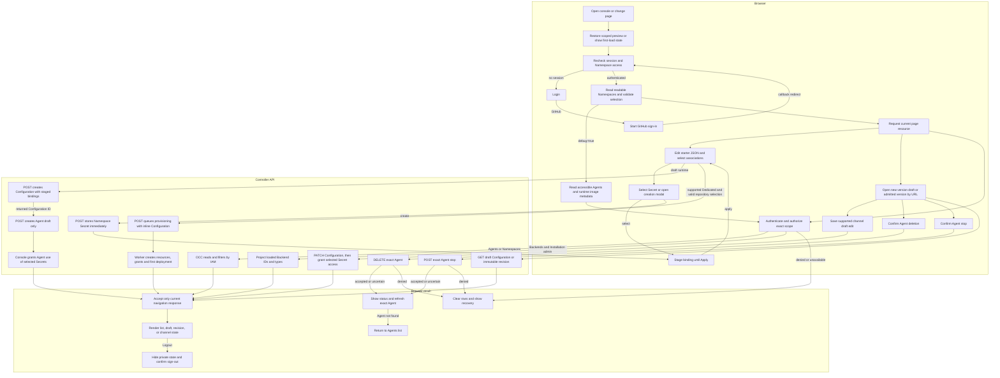

# Platform console request flow

## Overview

`/console/` renders session-authorized resources.
The [console reference](../reference/console.md) owns user-visible behavior;
API and IAM authorize access.

## Entry Points

- Browser entry: `apps/controller/src/console/console.mjs` composes the session,
  request client, view lifetime, navigation, and shell.
- `api-client.mjs` owns cancellation and session expiry; `view-lifetime.mjs`
  owns generation and abort state; `navigation.mjs` owns return paths and history;
  `shell.mjs` owns navigation and collections.
- `agents/{list,create,detail}.mjs` own Agent views;
  `channels/{slack,shared-ui}.mjs` own Slack editing. `agents.mjs` and
  `channels.mjs` compose them.
- HTTP: `apps/controller/src/index.ts:createFastifyApp`.
- Startup: `apps/controller/src/composition/production.ts:composeProduction`
  and `development-postgres.ts:composePostgresDevelopment`.
- Requires a bootstrapped Installation, provisioned account, selected IAM Driver,
  same-origin controller, and the [API permissions](../reference/api.md)
  for each read or mutation.

## Flow

## Execution Trace

### 1. Compose discovery metadata and serve public assets

`apps/controller/src/composition/production.ts:composeProduction`

`apps/controller/src/composition/development-postgres.ts:composePostgresDevelopment`

Startup passes safe Backend `{id,type}` summaries to `createFastifyApp`.
[Backend-managed delivery](service-account-driver-credential-delivery.md) owns
Driver activation. Requests do not reread configuration or credentials.

`apps/controller/src/console-assets.ts:readConsoleAsset` serves allowlisted assets
and the shared HTML shell with MIME types and same-origin CSP. Unknown console
paths return the shell with `404`; API routes retain JSON errors.

`scripts/build-console-metadata.mjs` bakes the publisher's checked
`OCC_BUILD_REVISION` into HTML. With `debug=true`, `shell.mjs:renderShell` displays
the full commit; invalid or absent metadata remains unknown.

`runtime-images.mjs:renderRuntimeImages` issues at most three concurrent reads for
readable Agents in the selected Namespace.
`packages/occ/src/index.ts:OpenClawController.getAgentRuntimeImages` authorizes
exact Agent read, resolves its active revision, then calls its Compute Driver.
The [Compute contract](../reference/drivers/compute.md) owns workload inspection
and Enterprise/OpenClaw provenance. Navigation preserves `debug=true`; removing it
stops reads. Missing provenance stays explicit.

### 2. Resolve the session before private reads

`apps/controller/src/console/console.mjs:loadPage`

`loadPage` advances the request generation and requests `GET /api/auth/session`.
First loads show loading. Return navigation and Refresh can restore one of at most
16 document-local views keyed by route, Namespace, and session owner while reads
run. Password fields and their derived discovery state clear before retention.
Controls stay inert until admission succeeds; navigation remains available.

Completed views retain their DOM, handlers, and draft capture callbacks. On return,
`loadPage` rereads their GET dependencies and compares outcomes and user identity.
`readSuccess` records response data; `readFailure` records HTTP error status and
code, excluding per-attempt request IDs. Unchanged outcomes reactivate the view;
recovery or a changed failure rebuilds it. A remembered tab-local `403` remains
denied without another audited request; its owning panel's Retry clears that
memory. Page/session admission still runs before reuse.
Pending reads, transport or malformed-response failures, expired sessions,
password input, and mutations prevent reuse. Live GETs with `revalidate: false`
are excluded from dependency replay. Read-only catalog and diagnostic POSTs do
not invalidate views on success. Refresh always rebuilds.
Debug runtime disclosures follow the same validation and retain expanded state.

A changed user or session key clears retained views and drafts before further
private reads. Missing sessions open login; failed reads offer Retry.
`showLogin` reads `GET /api/auth/providers`; true `github`/`google` flags add their **Continue
with** buttons, and discovery failure keeps password login. A true `oidc` flag adds a button
labelled from `oidcSignIn.label` only when `oidcSignIn.authorizationUrl` is `https:`; its start
URL must use that endpoint's origin and path, as GitHub's and Google's must use their fixed ones. `password: false`
(recovery-only) hides the form behind **Recovery sign-in** and changes the
provider-error advice from "use your password" to asking an administrator. Pending login disables
all; generations reject late redirects. With `sessionBinding`, `loadPage`
exchanges the button's stored `attemptId` once for its key. Tabs then send
their pinned `x-occ-session-key`, so a replaced cookie yields login.
`authError=<provider>` shows a generic, one-time error. The
[authentication flow](local-password-authentication.md#3-construct-session-authentication)
owns the server side.

`apps/controller/src/auth/index.ts:requireTrustedBrowserOrigin` checks Origin
before sign-in/out, even for SDK calls bypassing Better Auth middleware; headerless
CLI requests remain supported. The browser stores no credentials.

After authentication, `loadPage` reads `GET /namespaces`, preserving URL
selection or choosing the first ready/readable Namespace. Unreadable IDs stay
unavailable; selection never becomes an API query selector.

`shell.mjs:namespaceSelector` disables and hides choices through session and
Namespace checks for loads, Refresh, and admission-starting navigation;
retained-view validation can extend this.
Empty lists show access guidance. `navigation.mjs:navigate` returns Agent detail/creation
to Agents; global pages remain open; recovered warnings disappear.

### 3. Authorize the selected page resource

`apps/controller/src/index.ts:perform`, `requireInstallationAdmin`

`packages/occ/src/index.ts:OpenClawController.listNamespaces`, `listAgents`

Agents use the selected Namespace's route. OCC authorizes Namespace reads and
filters Agents by exact read permission; Namespace listing filters its
Installation-wide collection. No readable selection means no Agent request.
`GET /backends` ignores selection and requires Installation `administer` before
returning safe startup summaries. Empty configuration returns an empty list;
missing wiring or failed dependencies return errors.

`apps/controller/src/console/agents/create.mjs:renderCreateAgent` composes Provider,
Harness, Preset, Configuration, and workspace inputs. Provider/Harness changes
reset incompatible credentials and model choices while retaining unrelated JSON. The
[creation reference](../reference/console/create-and-deploy.md) owns combinations,
Preset constraints, token handling, permissions, and recovery.

`agents/plugin-fields.mjs:createPluginFields` edits Agent `plugins` separately
from Configuration. Invalid JSON and untouched fields survive; clearing overrides
restores inheritance. Submission, uncertain outcomes, or invalid JSON lock editing.
`capabilities.pluginPolicies` gates policy edits; unsupported reviewers remain clearable.

`create.mjs:loadPluginCatalog` and `loadPluginTools` implement
[PAT discovery](agent-plugins.md#credential-scoped-discovery): the selected or
Preset Secret takes precedence over an entered token. OCC reads the
Secret server-side. Pagination is upstream; filtering is local. Selecting a plugin loads tools.
Credential, provider, and Harness changes clear results and invalidate pending reads.

`create.mjs:MODEL_CHOICES` supplies unauthenticated static model lists and manual
entry.

`configurationTemplate` enables Control UI with loopback origins on port 18789.
Compute supplies gateway authentication; Presets replace the starter unchanged.
[Native admin access](agent-native-admin.md) owns HTTPS isolation.

`createRepositoryFields` loads `GET /namespaces/:namespaceId/agents/repository-options`,
then requests optional descriptions for visible refs. [Repository admission](agent-repository-credentials.md) resolves the
submitted `repositoryAccess`. Retained drafts keep selections through failed
discovery; retries recheck current policy. Only `503 REPOSITORY_OPTIONS_UNAVAILABLE`
permits creation without bindings, and only without retained selections; other
failures block submission.

Supported Dedicated runtimes submit inline Configuration, optional repository
access, and Secret references to [provisioning](agent-provisioning.md), even after
that outage. The worker reauthorizes, creates resources and exact Secret grants,
and deploys; Console polls, then opens the revision.

Ordinary drafts post `{kind: "agent", values, secretBindings}` to
`POST /namespaces/:namespaceId/configurations`, then submit its ID, plugins,
`initialWorkspaceFiles`, and `workspaceDefaultsId` to
`POST /namespaces/:namespaceId/agents`. Success opens `revision=draft`.
OCC stages all four workspace textareas, including unchanged/empty values, outside
Agent/Configuration for [workspace setup](workspace-files.md).

`create.mjs:grantConfigurationSecretAccess` grants exact Secret `operate` for final
same-Namespace `env` bindings. Failure retains the Agent; **Retry credential access**
rereads grants without duplication. Failed Agent writes retain Configuration ID
and lock JSON/Harness for explicit reuse. Writes never retry automatically; drafts
admit no revision and start no runtime.

`agents/harness-auth.mjs` edits bindings and shows
[Secret identities](platform-console/agent-editing.md#4-render-draft-revision-or-channels),
never values.

### 4–6. Edit the Agent and access runtime files

[Agent editing](platform-console/agent-editing.md) traces revision rendering,
channels, credentials, workspace files, stopping, and deletion;
[Agent sharing](platform-console/agent-sharing.md) traces policy writes.
Responses follow the ordering checks below.

`channels/slack.mjs:supportSlack` rejects shapes the editor cannot preserve;
`updatedSlack` preserves untouched policies and reply overrides. The
[editing flow](platform-console/agent-editing.md#4-render-draft-revision-or-channels)
owns DM policies and channel-only reply defaults. Admission snapshots native values;
Kubernetes `prepareRevision` carries them into `openclaw.json` without adding defaults.

`apps/controller/src/console/agents/detail.mjs:renderAgentDetail` registers tab
navigation with `console.mjs:loadPage`. For the same Agent, Namespace, and
revision, tab clicks/history replace only tab content; shell, native-admin panel,
and revision controls stay mounted. Configuration and revision reads are shared;
direct Workspace URLs start neither. Refresh, revision changes, and successful
channel/authentication edits reload fully. A `403` on the configuration or revision
read is an audited denial, so `console.mjs:deniedReadsFor` remembers that path in tab
`sessionStorage` for the session owner; later views show **Configuration unavailable**
without asking again, and **Retry** forgets the path and rereads. Logout clears it.

Completed tabs retain their DOM and draft capture callbacks within the detail view.
Returning restores loaded controls and expanded disclosures. Pending or failed
reads, password values, and mutations invalidate tab reuse. Each tab checks it
is mounted before applying a response; late reads cannot overwrite another tab.
Password values clear while [draft captures](platform-console/agent-editing.md#4-render-draft-revision-or-channels) retain edits. Channel
Secret saves update the shared draft snapshot used by other tabs and deployment
preflight.

### 7. Commit only the current response, or clear the view

`apps/controller/src/console/console.mjs:loadPage`, `logout`

Navigation, Namespace changes, and logout invalidate reads; generations reject
late responses. Refocus coalesces events. Agent detail rechecks access in place,
preserving controls, input, and saves; failures clear the view. Other pages
revalidate before reuse; forms defer refocus. Drafts keep save baselines and Namespace
scopes separate.

Authorization and dependency failures clear affected content and expose recovery;
a current protected `401` clears all private state. `pagehide` clears
private DOM, previews, and drafts even for BFCache; persisted `pageshow` performs
a fresh load. Failure views show local reasons and bounded request IDs, never
backend error text. Backend authorization denial clears every retained preview,
including other Namespace selections, because the permission is Installation-wide.

The [detail action flow](platform-console/agent-editing.md#stop-agent) traces
confirmed Stop and Delete requests and permissions. Acceptance
is not completed shutdown or deletion. Uncertain outcomes block replay until
readback; only confirmed absence returns to Agents. Deployment resumes
a stopped Agent through a new revision. The [Agent reference](../reference/agents.md#deletion)
owns asynchronous cleanup.

Logout first hides private state, then calls the sign-out endpoint.
Confirmed success or session inspection proving absence replaces history with
login. An unconfirmed logout stays blocked with Retry. The
[authentication flow](local-password-authentication.md) owns server revocation;
this client never infers it from a network error.

## Deploy the new revision

The **Create new version** draft exposes **Deploy new version**.
**Operator-managed credentials** persist `{ "method": "runtime" }` and bypass
managed credential setup in Console; OCC does not validate host credentials.
Deployment checks the Agent, Configuration association, and generation, then sends
bodyless
`POST /namespaces/:namespaceId/agents/:agentId/deploy`. The server authorizes
and admits the revision. Its read-only details open while **Deployment
activity** follows the latest visible deployment. Workspace reads check gateway
startup and file availability. An uncertain response disables replay until
refresh and inspection.

## Debugging and Verification

- Match the displayed request ID to controller logs.
  A Namespace-only user cannot discover Backends; check Installation authority
  before treating that denial as a configuration problem.
- Browser suites use real Fastify, Better Auth, Native IAM, and in-memory storage.
  They verify navigation, isolation, creation, draft/history/channel editing, and
  authentication, not PostgreSQL persistence, Backend health, runtime dispatch,
  worker leases, or Compute effects.
- API tests cover safe discovery, permission boundaries, empty versus missing
  wiring, static MIME/allowlisting, and unchanged API JSON errors. See
  [Testing](../testing/README.md) for commands and the image smoke boundary.

## Related docs

- [Console reference](../reference/console.md)
- [Authentication](../reference/authentication.md)
- [Backend-managed credential delivery](service-account-driver-credential-delivery.md)
- [Configuration and Agent revision](configuration-driver.md)
- [Docker development](docker-compose-development.md)
- [Production startup](production-startup.md)

## Manual Notes

[keep this for the user to add notes. do not change between edits]

## Changelog

- 2026-10-03 09:42: Track completed GET failures centrally and revalidate their outcomes before restoring a view. (authoring-run/59d7541c-66d2-414c-8139-174fca84fe33 - f7af67dd9a7b6e5571e7d4d7c384966ba7fb31fd)

- 2026-09-30 19:00: Remember denied Agent detail snapshot reads per tab so reloads do not add an audited denial per view.
- 2026-09-29 20:00: Trace repository descriptions and inherited access. (public-pr/374)

- 2026-09-29 07:19: Guard recovery until session and Namespace reads finish. (authoring-run/1ca6a40a-a247-465f-9a83-182dbcb6ff4e - 90326e6fab11f84fc11b8990b6c8e197a2752c60)

- 2026-09-28 01:39: Move the sharing trace to its child flow. (authoring-run/462d5207-c3a1-4203-af4a-8db2551ccb9a - 4f32ebbca5d699296a142dfbd34c8ec46844fce7)

[Platform console request documentation history](platform-console/history.md) preserves the older dated entries.
