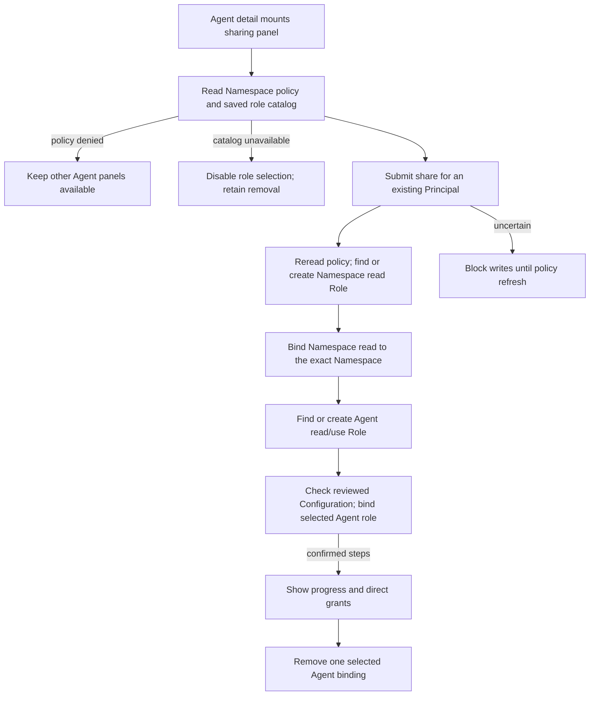

# Console Agent sharing and removal

## Overview

Trace how Agent detail shares one Agent with an existing Principal and removes
one explicit Agent binding. The trace starts when Agent detail mounts the
sharing panel and stops at policy configuration; native gateway admission and
runtime readiness belong to the [native admin flow](../agent-native-admin.md).
See the [parent flow](../platform-console.md) and the
[sharing reference](../../reference/console/agent-sharing.md).

## Entry Points

- `apps/controller/src/console/agents/access.mjs:renderAgentAccess` renders the
  sharing panel inside Agent detail.
- `apps/controller/src/console/agents/detail.mjs:renderAgentDetail` mounts it.
- Assumptions: a signed-in Installation administrator, an existing Principal ID,
  and the Namespace IAM policy endpoints.

## Flow

## Execution Trace

### 1. Mount the panel and read policy

`apps/controller/src/console/agents/access.mjs:renderAgentAccess`

Agent detail mounts sharing independently of revision/configuration reads and
native admission, but not when the console's observability probe already showed
the person lacks Installation administration: the policy endpoints require it and
the API audits each denial. The panel loads `/agents/:agentId/runtime-roles` and the selected Namespace's existing
`/iam/roles` and `/iam/access-bindings` endpoints. A policy `403` hides the
sharing panel and leaves the other panels usable; a current `401` retains global
session expiry. The catalog carries saved Configuration ID/generation, assignable roles, desired runtime state and optional active-revision role summaries. The panel displays configured and deployed permissions independently, including stopped and undeployed states. A failed role-catalog read clears role choices and retains removal.
The [shared page cache](../platform-console.md#2-resolve-the-session-before-private-reads)
compares failed and successful GET outcomes on Back; catalog recovery rebuilds
the panel with current role choices.

### 2. Serialize Role and binding writes

`apps/controller/src/console/agents/access.mjs:matchesRole`

Submission rereads policy, finds or creates an immutable Role by exact Namespace
and permissions, then binds Namespace read to the exact Namespace. Only after
that response does it find or create the exact Agent read/use Role and
bind it to the selected Agent with the chosen runtime role and the reviewed Configuration precondition. Policy readback does not silently refresh that precondition; only explicit catalog refresh replaces the reviewed policy. The panel rejects a subject that is not a `prn_`
Principal ID, such as an email, before any request, and reports a `404` during a
share as an unknown Principal ID. The server validates the supplied subject and
resource on each write. When the person already has a runtime assignment, the panel preserves it and grants exact Agent read separately if missing. Confirmed progress survives later failure; unknown
results disable mutations until an explicit current-policy refresh. Readback is
configuration evidence, not a historical receipt, and never triggers a write.

### 3. Change the selected runtime role

`apps/controller/src/console/agents/access.mjs:writeRuntimeRole`
`packages/occ/src/index.ts:updateIAMRuntimeRole`

The selector PATCHes `runtimeRole` and `runtimeRoleConfiguration` (the reviewed Configuration ID and generation). OCC holds policy-management authority, then checks the saved Configuration under the same Namespace lock used by Configuration and Agent updates. A changed ID or generation rejects the write with `409` before mutating the assignment; a missing role returns `400`. The assignment and audit commit in the existing transaction. Only `runtimeRole` is persisted on the binding. The binding identity, OCE Role and exact resource remain unchanged. An uncertain response blocks further writes until explicit readback. Runtime and proxy admission resolve the new role on subsequent requests.

### 4. Remove one explicit binding

`apps/controller/src/console/agents/access.mjs:renderAgentAccess`

Removal rereads current IAM policy without loading the role catalog and addresses only the selected Agent binding. The request client's existing
success envelope handling also accepts the API's empty `204` deletion response.
The panel retains discovery grants and explains other possible access sources.

## Debugging and Verification

- A `403` on the policy reads hides only the sharing panel; check Installation
  administration before treating a missing panel as a console fault.
- After an uncertain write, select **Refresh sharing** and inspect the direct
  grants before submitting again. A present binding does not prove an earlier
  request's outcome.
- The real-runtime sharing case is described in
  [gateway routing tests](../../testing/gateway-routing.md#native-gateway-sharing).

## Related docs

- [Return to the parent flow](../platform-console.md)
- [Agent editing flow](agent-editing.md)
- [Namespace IAM policy flow](../namespace-iam-policy.md)
- [Sharing procedure](../../guides/console/agent-sharing.md)

## Manual Notes

[keep this for the user to add notes. do not change between edits]

## Changelog

- 2026-10-05 13:58: Trace saved Configuration role selection, stale-selection rejection and deployed permission previews. (authoring-run/80db88a0-8bf4-401d-b060-01f34cc3af10 - 76f9307b61ccb1c544257081d95b15a0ee893b92)

- 2026-10-03 09:11: Preserve cached Agent pages when the deployed role catalog is unavailable. (authoring-run/59d7541c-66d2-414c-8139-174fca84fe33 - b6f9185159f14399905bf495b3cdef3ce2d14e30)

- 2026-10-02 11:55: Trace configured role selection, atomic assignment changes, read grants on reused assignments and removal when the role catalog is unavailable. (authoring-run/fd458bb6-fbf9-4c93-ad3f-1e6fc793300f - a946032a14cb2f33a5077c3c0340e8f5f54cf4b7)

- 2026-09-28 01:39: Move the sharing trace out of the parent and editing flows to keep them within the length limit. (authoring-run/462d5207-c3a1-4203-af4a-8db2551ccb9a - 4f32ebbca5d699296a142dfbd34c8ec46844fce7)

- 2026-09-23 22:29: Receive main; consolidate the sharing trace. (01a0b0e4-839a-71b3-9ec1-3b1000b5d06a - 3bf606bfda107ada7e32a941c161aa0fdcbafd92)

- 2026-09-23 10:11: Trace sharing, removal and uncertain outcomes. (authoring-run/2dbd0778-19ef-4616-a799-abcfcba888e4 - ba03f19e950577141837c02dda37112fd3377dc5)
