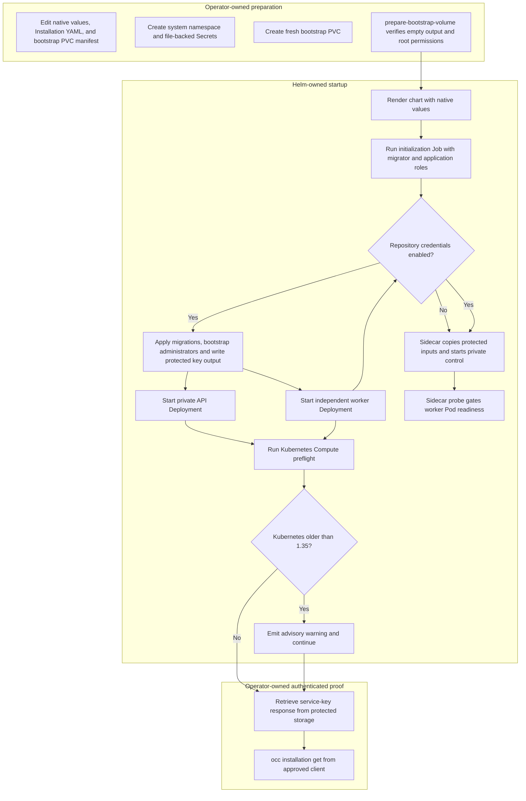

# Production Startup Flow

## Overview

Production startup begins after an operator supplies approved images,
PostgreSQL credentials, authentication material, trusted Installation startup
YAML, network policy inputs, and protected bootstrap storage. The supported path
prepares a fresh bootstrap PVC, installs the Helm chart, waits for the private
API and worker, then proves authenticated `/installation` access with the
retrieved bootstrap service key. This flow ends at control-plane access; tenant
Agent deployment and model-backed TUI proof are later flows.

For the operator commands, use the [deployment guide](../guides/deploy.md). The
chart owns migration/bootstrap ordering and controller readiness. It does not
provision cloud infrastructure, publish images, create TLS, retrieve keys, or
prepare application Secrets automatically.

## Entry Points

- Trigger: Run `scripts/prepare-bootstrap-volume`, then
  `helm upgrade --install oce deploy/helm/openclaw-enterprise`.
- Source: `scripts/prepare-bootstrap-volume:53`,
  `deploy/helm/openclaw-enterprise/templates/jobs.yaml:8`, and
  `apps/controller/src/composition/production.ts:28`.
- Assumptions: Explicit kubeconfig/context, enforcing NetworkPolicies, external
  PostgreSQL, approved immutable images, protected operator files, fresh
  bootstrap PVC, exact API/client selectors, explicit `/32` egress hosts,
  reviewed control-plane node labels, and an approved private OCC URL.

## Flow

## Execution Trace

The migration, shared bootstrap, API, and worker entrypoints use
[`createPostgresPool`](../../packages/occ/src/state/postgres-pool.ts).
See [connection authentication settings](../reference/settings/operations.md#postgresql-connection-authentication)
for password and Azure workload-identity configuration. When PostgreSQL ends
an idle pooled connection (failover, maintenance restart, `idle_session_timeout`
or a proxy reset), the pool discards that client and writes one
`database.idle-client-error` warning with only the error code to stderr; the
process keeps running and the next query opens a new connection.

### 1. Prepare native production inputs

`deploy/helm/openclaw-enterprise/values.yaml:1`

The operator copies and edits the production example values, Installation YAML,
and bootstrap PVC manifest outside the checkout. Helm values select the
controller image, API endpoint, Secret names, bootstrap claim, API-client
selectors, control-plane node selector, and egress destinations. The
Installation YAML selects IAM, Configuration, Compute, optional Backend,
gateway/Agent images, projected workload identity, and runtime
networking/storage.

The operator creates file-backed Kubernetes Secrets for Installation startup,
database URLs, optional database CA bundles, Better Auth signing material, and
optional ChatGPT Backend administrator credentials. These are prepared inputs,
not recurring synchronization targets. The chart does not infer gateway/Agent
images from Helm values or rewrite Driver configuration.

### 2. Prepare the fresh bootstrap volume

`scripts/prepare-bootstrap-volume:124`

Before the first install, the operator creates the bootstrap PVC named by
`bootstrap.password.claimName` and runs the helper with explicit kubeconfig,
context, namespace, claim, approved Node-capable image, and optional repeated
`--node-selector KEY=VALUE` labels. The helper launches a bounded preparation
Pod, applies the selectors before WaitForFirstConsumer storage binds, verifies
the mounted root is fresh except for filesystem-owned `lost+found`, sets UID/GID
`1000` with mode `0700`, and refuses to continue on any other entry.

If cluster policy forbids the helper Pod, storage administration owns the same
state transition through an approved storage workflow. A preprepared claim goes
directly to Helm. The helper does not create the PVC, repair a used claim,
retrieve generated credentials, or change controller configuration.

### 3. Run Helm initialization

`deploy/helm/openclaw-enterprise/templates/jobs.yaml:8`

`deploy/helm/openclaw-enterprise/templates/bootstrap-networkpolicies.yaml:1`
installs initialization isolation before the Job starts. Its scoped DNS grant
and the later dependency, collector, Slack proxy, and Envoy policies allow
UDP/TCP ports `53` and `5353` to the configured DNS peer; see the
[Helm DNS contract](../reference/settings/production.md#required-production-controller-environment).

`helm upgrade --install --wait --timeout 5m` renders the chart with native
values. If `database.caSecretName` is set, the Pod mounts that CA Secret
read-only into both containers before they connect. The initialization hook first
runs migrations with the dedicated migrator credential, then runs bootstrap with
the lower-privilege application credential, Better Auth settings, first
administrator email, Installation name, and protected output paths.

`scripts/migrate-production.mjs:1`, `scripts/migration-history.mjs:migrateWithHistory`

The migration command verifies the complete SQL source manifest, checks the
dedicated role and canonical receipt/catalog state, and holds one advisory lock
on the connection used by Drizzle's normal transaction. It accepts a fresh
database, canonical history through migration 0023, or the completed history
through 0025. Unsupported or mixed development histories fail before migration
DDL, preventing bootstrap from running. The same preflight serves development
and production; see [migration history and recovery](../reference/settings/operations.md#migration-history)
for the read-only check and developer-selected recreation procedure.

`scripts/bootstrap-installation.mjs` creates or verifies the singleton
Installation, human administrator, service administrator, IAM seed, audit
evidence, and initial service key. On fresh bootstrap, it creates the initial
`default` Namespace through `OpenClawController.createNamespace`, authorized
as the bootstrap Principal. The Namespace and its queued reconciliation commit
with Installation/IAM state and bootstrap audit; existing Installations receive
no new Namespace. The worker later provisions normal Driver-owned infrastructure;
operators still provide the tenant RoleBindings described in the deployment
guide. The platform name does not select Kubernetes' `default` namespace.
It writes password and service-key files only
from the bootstrap container to the protected PVC. Existing output, unsafe
storage permissions, inconsistent accounts, or mismatched IAM identity fail the
Job; Helm failure does not imply the database hook was rolled back.

### 4. Start private API and worker Deployments

`apps/controller/src/server.mjs:138`, `apps/controller/src/worker.ts:312`

`apps/controller/src/drivers/compute/kubernetes/index.ts:KubernetesComputeDriver.preflight`

After successful initialization, Kubernetes starts separate API and worker
Deployments. The API validates production listener settings, Better Auth,
database access, trusted Installation YAML, selected Drivers, Backend
membership, and Kubernetes Compute preflight before readiness. It serves private
controller routes, `/healthz`, and database-backed `/readyz` behind the
operator-managed endpoint.

When `controlPlane.nodeSelector` is non-empty, the chart places the API and
worker Pods with that selector. The same selector applies to the initialization
Job that runs the migration init container and bootstrap container, so production
operators can keep migration, bootstrap, API, and worker Pods on a reviewed
control-plane node pool.
`deploy/helm/openclaw-enterprise/templates/gateway-routing.yaml` also projects
that selector into `EnvoyProxy.spec.provider.kubernetes.envoyDeployment.pod`,
so the credential-checking private proxy stays on the trusted pool.
Empty chart defaults omit the field for clusters that do
not label a dedicated control-plane pool. When `database.caSecretName` is set,
API and worker also mount the CA Secret read-only at `database.caMountPath`.
Tenant gateway and Agent placement remain in the selected Compute Driver
configuration.

The [shared egress policy](../../deploy/helm/openclaw-enterprise/templates/networkpolicies.yaml)
selects only `api`, `worker`, and `initialization` Pods with the release identity.
It allows DNS, database egress to every `database.cidrs` host, and
Kubernetes API egress to every `cluster.cidrs` host. Collectors use their separate
DNS, API, and exporter policy; unknown or missing component labels retain
default-deny. Pre-install initialization has only its hook DNS/database grants.
Each configured database or API destination must be an explicit IPv4 `/32`; operators must refresh the values when a managed database
or API endpoint resolves to a different address set.

`deploy/helm/openclaw-enterprise/templates/networkpolicies.yaml` also renders
an API-only TCP 443 egress policy when `api.modelDiscoveryCidrs` contains
provider IPv4 `/32` hosts. Empty defaults grant no provider egress. Operators
maintain those addresses for the optional
[model-discovery API](../reference/console/create-and-deploy.md#create-an-agent);
Console model selection and Harness egress do not depend on this policy.

When `api.channelDirectoryProxyUrl` names an approved HTTP(S) proxy at a
literal IPv4 address and port, the chart passes it to the API and grants only
that Pod egress to the proxy's exact `/32` and TCP port. The proxy must permit
CONNECT to `slack.com:443`. The empty default renders no rule and leaves
production Slack directory lookup unavailable with manual exact-ID entry.

The Kubernetes Compute Driver queries the API server version and verifies
authenticated Namespace access. Kubernetes 1.35 or later is the supported
baseline. An older server returns a structured preflight warning instead of
blocking startup; the API logs `compute.preflight-warning` with the observed and
minimum versions in its message and continues. An invalid version response,
unreachable API, or failed Namespace access still fails preflight.

The worker independently validates production settings, opens the same
application-role database, loads the selected Driver bundle, validates IAM, runs
Compute preflight, emits the same advisory warning for an older Kubernetes
server, emits `worker.started`, and polls durable Namespace and AgentRevision
work. Worker readiness depends on fresh queue-health observations. Neither
process mounts the bootstrap PVC.

`apps/controller/src/composition/repository-credentials/platform.ts:composeRepoDriver`

When selected, both processes load the same canonical registry and public CA,
construct the GitHub Backend with a lazy Unix client, and register
`GitHubRepoDriver` under the optional `repo` capability. The configured Backend
member and `drivers.repo` must select the same Driver ID. API startup performs no control operation and loads no App key or
session engine. The worker owns subsequent session lifecycle calls through the
selected Driver; API readiness remains database-backed.

`apps/controller/src/composition/repository-credentials/projected-inputs.ts:prepareProjectedInputs`

The optional service runs beside the single worker. Its own process pins a
projection generation, copies the known config/key/TLS/registry files into owned
private regular files, validates the selected Backend and exact Service origin,
then uses the protected loader and starts both listeners. App/TLS private
material stays in that container. Only the worker receives an explicitly
projected Kubernetes API token. The service's private health probe checks the
Unix listener; it performs no provider operation. The service and worker share
only the private control volume, and the Pod uses `Recreate` with a 75-second
termination grace period. Both containers must pass readiness for the Pod to be
ready; the worker keeps its queue-health probe and retries unavailable session
operations through its ordinary Driver contract. This is one service owner,
without independent worker/service high availability. Repository runtime reconciliation continues in the
[Agent repository credential flow](agent-repository-credentials.md).

### 5. Retrieve the key and prove authenticated access

`internal/occclient/client.go:Client.GetInstallation`

After Helm readiness, the operator retrieves
`initial-admin-service-key.json` from protected bootstrap storage through an
approved reader path and stores it in an owner-readable file. A completed Job is
not an exec endpoint, and the API and worker cannot retrieve this file for the
operator.

From an approved client environment, `occ installation get` uses the protected
key file through the OCC client and displays the Installation. The production
startup proof succeeds only when its `ID` matches the key response's
`meta.installationId`. The operator records that ID in the
`openclaw.dev/installation-id` annotation on the Installation startup Secret;
coordinated upgrades use the marker to bind their OCC endpoint to the selected
Kubernetes Installation. Agent runtime, gateway WebSocket authentication, and
model calls remain unproven until the tenant deployment and TUI procedures run.

## Debugging and Verification

- `scripts/prepare-bootstrap-volume` should exit `0` only for a fresh claim with
  no bootstrap output files and UID/GID `1000`, mode `0700` root state.
- `kubectl -n openclaw-system wait --for=condition=complete job/oce-initialization`
  should succeed before API and worker rollout checks.
- `pnpm db:migrate:production --check` reports the accepted database history
  without applying SQL. `MIGRATION_HISTORY_UNSUPPORTED` requires inspection of
  the selected database; initialization does not repair or rewrite its ledger.
- The API should emit `listening`; the worker should emit `worker.started`
  followed by `worker.health`.
- `compute.preflight-warning` with code `KUBERNETES_VERSION_BELOW_MINIMUM`
  identifies a server below the supported Kubernetes 1.35 baseline; startup
  continues, but operators should upgrade before treating the deployment as
  supported.
- `startup-error` or `worker.startup-error` with code
  `KUBERNETES_API_UNAVAILABLE` means the Compute preflight got no answer from
  the Kubernetes API server named by `host` and `port`. Check that
  `cluster.cidrs` still lists that address; a restarted cluster can move it.
- `kubectl -n openclaw-system logs job/oce-initialization -c bootstrap` is the
  first check for unsafe output storage, existing output files, database-role
  failures, auth origin errors, and administrator/IAM mismatch.
- `occ installation get` must display an `ID` equal to `meta.installationId`
  from the retrieved key file.
- Changing an external startup Secret alone does not restart the API or worker;
  run an explicit rollout and repeat readiness plus authenticated proof.
- Packaging checks such as
  `node --test tests/integration/production-kubernetes-packaging.test.mjs`
  render chart behavior but do not prove a live Helm install, protected storage
  retrieval, tenant runtime, or model turn.

## Related docs

- [Deployment guide: production](../guides/deploy.md#production)
- [Settings reference](../reference/settings.md)
- [Kubernetes Compute Driver](../reference/drivers/kubernetes-compute.md)
- [Backend-managed credential delivery](service-account-driver-credential-delivery.md)
- [Repository credential setup](../guides/repository-credentials.md)
- [Controller worker execution flow](controller-worker.md)
- [Production TUI flow](production-tui.md)
- [Local password authentication flow](local-password-authentication.md)
- [Authoritative platform design](../design.md)

## Manual Notes

[keep this for the user to add notes. do not change between edits]

## Changelog

- 2026-10-01 16:32: Trace scoped OpenShift DNS backend grants for Helm-managed production workloads. (authoring-run/e288dbbe-6d08-4251-adaa-860443c31b44 - 4070b6ad5ec6aff03c9c5e49e504a90393ffe091)
- 2026-09-29: Merge current main into release-scoped shared egress documentation. (PR-187)

- 2026-09-24 08:54: Describe release-scoped shared egress and dedicated collector/bootstrap policies. (PR-187 - 5ebd7305b0876db33276a249934bc82073b63424)

- 2026-09-27 08:51: Document API-only Slack directory proxy egress and disabled default. (01a0df20-f340-7810-bb59-b1df6c0bbbd3 - 1a2764952c421bfee00ed6892714366292c2741a)

- 2026-09-24: Record the post-bootstrap Kubernetes Installation identity marker used by coordinated upgrades.

- 2026-09-25 12:02: Document optional API model-discovery egress in the accompanying chart change. (01a0cf72-6985-7712-ba92-d8cc32470f24 - b2521074873ca46e1a5024248852a32b97cfc8a9)

- 2026-09-24 18:02: Trace private Envoy placement on the control-plane pool in the accompanying chart change. (01a0cf72-6985-7712-ba92-d8cc32470f24 - 92fb7cdfdf672fe476993e2cfd96a73a75c43ac2)

- 2026-09-21 05:32: Reconcile accompanying platform credential documentation with current source history and native Git boundaries. (authoring-run/fba2d7fa-6603-465e-a7c8-df0375ad202d - a051a2406eec7cafde2e0dd5e2ec63dba6ce1581)

- 2026-09-19 23:54: Reconcile RepoDriver ownership, private status projection, and separate emitted service/client paths. (public authoring-run/73c80a5e-4d0c-4e72-b989-0cf9963c6593 - e5b5a5489f078d08272523476bdbcd0b9162c946)

- 2026-09-18 03:03: Trace optional repository Driver composition and service-only projected input startup. (8500b2da103063b4503b62e5529f3910513e84a9)

- 2026-09-21 03:38: Trace canonical migration preflight and fail-closed initialization. (authoring-run/10020664-226c-401f-a499-199fb7f18c9c - 5f9a9903239a84224a755610339f3bf0443c171f)
- 2026-09-18 21:48: Clarify that control-plane node placement is optional unless configured. (authoring-run/23a79228-a1f4-4d9d-adb6-4c2a77d6b43f - db8547ffe19cd3317309b526d80e1d19af4c8a9a)
- 2026-09-18 17:09: Document multi-endpoint Helm egress values and control-plane node placement. (authoring-run/6fe8e24c-8bd5-489b-b76c-ca7d0a22c14b - 724dcb5cb80b5e76a62e8267a21185a2e91a85c2)
- 2026-09-17 12:56: Trace the advisory Kubernetes 1.35 startup preflight and warning handoff. (authoring-run/a6571e7c-996e-4f11-9c4c-f61418a8d109 - 324fe2d17f3856cd1602a57e4d8aa99a34d6514c)
- 2026-09-01 19:09: Document initial default Namespace creation and unchanged repeat-bootstrap behavior. (codex/01a05ef1-ee29-7941-80f2-448bb0789969 - 872fa544c98bb7ad11b2d92d777e49229ececbf5) (01a05f95-dd80-7011-990f-d1c46b5bb3cc - aa366c49c44834d59f74994c5fd37fb8096f169f)
- 2026-09-01 12:58: Trace production bootstrap-volume preparation, Helm startup, and authenticated Installation proof. (codex/01a05e87-6c64-7960-b9c2-f444d4a3d737 - bdb846c38d5dae6085a8841f720c93068ba8ad15)
- 2026-09-01 10:19: Validate Provider configuration at startup and exact saved ownership at use, preserving API repair access. (01a05d6b-e21d-7fc0-b1bd-b5cb15b365c6 - 1c7eae4d11e6c474cc7f1bbbb05d2c2e7052a158)
- 2026-09-01 08:47: Trace Provider membership, API-only client injection, and persisted ownership checks. (01a05d97-f2b0-71d0-bfc3-01ee7d6d58f9 - b079c4b755ef336a9c65bb4eb737e3aedbfdaa7d)
- 2026-08-31 22:29: Remove automatic bootstrap recovery; preserve artifacts after any error and require manual repair. (01a05a3d-526f-7553-8cd8-070bd1847acb - 94a5440898bf331987148d7733f0075506af64a6)
- 2026-08-31 20:33: Trace the shared installation initializer, startup ordering, and initializer-owned credential delivery. (01a05a3d-526f-7553-8cd8-070bd1847acb - b6f213cbcee11ba3dd69886c936c7e5abe233eb3)
- 2026-08-31 17:43: Document fresh human/service administrator bootstrap, private key delivery, and operator recovery. (codex/01a05a69-3fbe-7441-9e6d-20394758cf94 - 0797098646028ac00cb26cd4afcbc9b2cf8bcb24)
- 2026-08-28 17:54: Separated Helm execution from the deployment walkthrough and included optional Sandbox Driver startup ownership. (01a036f4-cf1d-7cc1-bbc1-000879038ac8 - 4270aa29b7015562049f46c6027962fd85b584a9)
- 2026-08-25 03:43: Added the production Helm initialization, protected administrator bootstrap, private OCC API, independent worker, and readiness startup flow. (01a036f4-cf1d-7cc1-bbc1-000879038ac8 - 2e9769c751d7)
