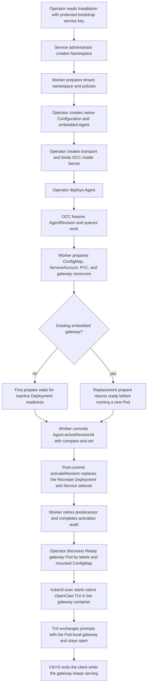

# Production TUI Flow

## Overview

An operator provisions a production Namespace and embedded OpenClaw Agent
through the authenticated OCC API, waits for the worker to activate an immutable
AgentRevision, then attaches to the Agent-owned gateway Pod with
`node /app/openclaw.mjs tui`. This flow starts at the first protected API
request after production startup and ends when the operator exits the TUI
client. It does not cover Helm installation internals, remote shared-cluster
operations, dedicated Codex Agents, Slack channels, or a host-installed TUI.

## Entry Points

- Trigger: authenticated production API calls followed by
  `kubectl exec -it <gateway-pod> -c gateway -- node /app/openclaw.mjs tui`.
- Source: `apps/controller/src/index.ts:createFastifyApp`,
  `packages/occ/src/index.ts:OpenClawController.deployAgent`,
  and `apps/controller/src/drivers/compute/kubernetes/index.ts:KubernetesComputeDriver.prepareRevision`.
- Assumptions: the production API and worker are ready, the caller has an OCC
  bootstrap service administrator key with current Namespace/Agent authority, the selected
  Kubernetes context points to the intended cluster, tenant RoleBindings and
  Agent-owned Secrets exist, gateway memory is sized for the gateway plus an
  interactive client, and the runtime image contains `/app/openclaw.mjs`.

## Flow



## Execution Trace

### 1. The API creates the production Namespace and records exact ownership

`apps/controller/src/auth/index.ts:ControllerAdmissionVerifier.verify`,
`apps/controller/src/index.ts:createFastifyApp`

After the initialization Job completes successfully, the operator retrieves
`initial-admin-service-key.json` from its protected output PVC. Neither the API
nor worker mounts that PVC. The [OCC CLI](../guides/cli.md) reads `data.key` from
the protected response file, sends `x-api-key`, and first
verifies `GET /installation`. The API validates the key, resolves the
Installation-scoped service principal, and applies its current IAM grants; an
invalid, expired, or revoked key returns `401` without cookie fallback.

The production API receives `POST /namespaces` from an authenticated internal
client. Its request handler admits the request, resolves the caller identity,
then calls `OpenClawController.createNamespace`. Responses use the `{data,
meta}` envelope, and the returned `data.id` becomes the OCC `NAMESPACE_ID`. For
driver-managed placement, Kubernetes Compute derives the tenant Kubernetes
namespace name from that ID. For existing placement, the operator supplies
`existingNamespace` and the worker later verifies the pre-existing Kubernetes
namespace before binding tenant ownership.

The worker processes the Namespace claim in `ControllerWorker.process`. It
requires the Namespace to still target `ready`, reauthorizes the original
operation, calls the selected Compute Driver, and only transitions the
Namespace from `provisioning` to `ready` after the driver reports the observed
tenant boundary ready.

### 2. The API freezes the AgentRevision

`packages/occ/src/index.ts:OpenClawController.deployAgent`

After the Namespace is ready, the operator creates a Namespace-owned
`kind: "agent"` Configuration and an Agent with `executionMode: "embedded"`.
For the disposable connectivity demo, the Configuration sets
`agents.defaults.skipBootstrap` to `true` before Agent creation. That avoids
fresh-workspace `BOOTSTRAP.md` onboarding replacing the requested nonce reply;
existing workspaces with bootstrap files are unaffected. The bodyless deploy request to
`POST /namespaces/:namespaceId/agents/:agentId/deploy` locks the exact Agent,
requires the Namespace to be `ready`, reauthorizes `deploy` on the Agent,
reauthorizes `read` on the selected Configuration, validates the required API-key
`harnessAuth` and any gateway Secret bindings, resolves the approved `openclaw`
embedded Harness, and stores an immutable AgentRevision. Both the actor and Agent
service principal need exact Secret `operate`; the API checks physical backend
identity before admission. An administrator with controller-owned IAM-state access
must establish the Agent grant before this request.

The API response returns the frozen revision as `data`. The operator keeps both
`data.id` and the Agent's later `data.activeRevisionId`; the deployment request
does not by itself prove that Kubernetes is serving the new revision.

### 3. The worker prepares and activates the gateway workload

`apps/controller/src/worker.ts:ControllerWorker.processRevision`,
`apps/controller/src/drivers/compute/kubernetes/index.ts:KubernetesComputeDriver.prepareRevision`

The worker claims the durable AgentRevision work, reloads the Namespace, Agent,
revision, and previous active revision, reauthorizes the deployment actor, and
resolves the Secret delivery context from authoritative OCC metadata without
calling the Kubernetes Secret API. The broader activation contract lives in
the [controller worker flow](controller-worker.md#6-persist-the-result-and-finish-revision-activation)
and the
[Harness execution topology flow](harness-execution-topology.md#3-publish-safely-and-complete-activation-once).
This flow calls out the production embedded TUI path.

Kubernetes Compute verifies tenant ownership and NetworkPolicies, writes an
immutable ConfigMap named `gateway-<agent-hash>-rev-<revision-hash>` containing
`openclaw.json` with Driver-rendered operator proxy trust, creates the Agent-owned ServiceAccount, creates or reuses the
gateway private-state PersistentVolumeClaim, and uses one gateway Deployment
with `Recreate` strategy.

For embedded OpenClaw, the gateway Deployment is also the Harness workload. Its
container receives `OPENCLAW_CONFIG_PATH=/etc/openclaw/openclaw.json`,
`OPENCLAW_GATEWAY_PORT`, opt-in `OPENCLAW_GATEWAY_PASSWORD`, `OPENCLAW_STATE_DIR`, and
the exact OCC Secret model credential selected by revision `harnessAuth`. The
API handles the protected initial Secret write; the worker never reads its value. For the first embedded revision, `prepareRevision` creates
the Deployment and keeps the Service on the inactive selector until the gateway
is ready. When a predecessor gateway exists, embedded replacement preparation
returns ready after staging the immutable ConfigMap and related ownership
resources; it does not start the replacement gateway process.

For the bundled Kubernetes Compute Driver, the worker first records the active
revision through a guarded `Agent.activeRevisionId` compare-and-set. Because the
driver does not request `beforeCommit` activation, production then calls
`KubernetesComputeDriver.activateRevision` after that commit. Embedded
`activateRevision` rechecks the existing gateway Deployment, then replaces that
same `Recreate` Deployment with the new revision configuration, applies Agent
runtime NetworkPolicies, updates the gateway Service selector, and waits for the
exact revision gateway to become ready. This replacement can make the gateway
temporarily unavailable while Kubernetes recreates the Pod.

After post-commit activation succeeds, the worker retires the predecessor and
then completes the activation audit. If activation or retirement fails after the
active pointer commit, the worker records pending
`REVISION_FINALIZATION_INCOMPLETE` work and retries finalization; an operator
should not attach until `GET /namespaces/:namespaceId/agents/:agentId` returns
the intended `data.activeRevisionId` and Pod discovery verifies the matching
ConfigMap-mounted gateway is Running and Ready.

### 4–6. Attach the native TUI and exit the client

[Native production TUI client lifecycle](production-tui/native-client.md) traces exact Pod selection, kubectl exec, session replies, and client exit without gateway shutdown.

## Debugging and Verification

- Confirm OCC activation before selecting a Pod:

  ```bash
  OCC_NAMESPACE="$NAMESPACE_ID" occ agent get "$AGENT_ID"
  ```

  Run from the repository root with `OCC_URL` and `OCC_SERVICE_KEY_FILE` set in
  the operator shell. Expect `ACTIVE REVISION` to equal the intended revision ID.

- Confirm the selected gateway mounts the active immutable ConfigMap:

  ```bash
  kubectl --kubeconfig "$KUBECONFIG_FILE" --context "$CONTEXT" \
    -n "$TENANT_NAMESPACE" get pod "$GATEWAY_POD" -o json
  ```

  The Pod must be Running and Ready, carry the exact Namespace and Agent labels,
  carry `app.kubernetes.io/managed-by=openclaw-enterprise`, and include a
  volume whose `configMap.name` is `gateway-<agent-hash>-rev-<revision-hash>`.

- Check gateway startup without printing credentials:

  ```bash
  kubectl --kubeconfig "$KUBECONFIG_FILE" --context "$CONTEXT" \
    -n "$TENANT_NAMESPACE" logs "$GATEWAY_POD" -c gateway --tail=100
  ```

  Expected failure signatures include missing transport Secret keys,
  `CreateContainerConfigError` for a missing bound model Secret, image pull
  failures for unimported digest references, pending gateway PVCs, and resource
  limits too small for an interactive TUI process.

- The native production TUI proof is
  `OCC_TEST_PRODUCTION_TUI_REAL=1 node --test --test-concurrency=1 tests/integration/production-tui-k3d-real.test.mjs`.
  It requires the actual Helm chart, imported immutable controller, runtime,
  PostgreSQL, and Node image references, an explicit disposable k3d
  kubeconfig/context, and `OPENAI_API_KEY`.
- Adjacent source-backed checks remain
  `node --test tests/integration/harness-topology-k3d-real.test.mjs` and
  `node --test tests/integration/kubernetes-compute-real.test.mjs`.

## Related docs

- [Deployment guide](../guides/deploy.md)
- [Production startup flow](production-startup.md)
- [Harness execution topology flow](harness-execution-topology.md)
- [Kubernetes Compute Driver](../reference/drivers/kubernetes-compute.md)
- [Agent placement and deployment](../reference/agents/deployment.md#execution-mode)
- [Production interactive TUI specification](../../specs/plans/16-production-tui-end-to-end.md)
- [Production TUI integration test](../../tests/integration/production-tui-k3d-real.test.mjs)

## Manual Notes

[keep this for the user to add notes. do not change between edits]

## Changelog

- 2026-09-22 21:24: Render Kubernetes operator proxy trust and retain optional loopback passwords. (authoring-run/ffffed03-0b85-4984-990e-aa0705a91645 - cbf1851308a2db398820ae9e1000f57837703ace)
- Kubernetes Compute uses trusted proxy for native gateway authentication. (NOT_IN_SPEC)

- 2026-09-17 00:48: Correct current harness admission and metadata-only dispatch boundaries after implementation review. (01a0acbf-4d5a-7413-9411-dce911f3ad23 - 107900e9551b90c3e9ac24d30f8ea866f17e5dbb)

- 2026-09-17 00:31: Align credential selection and delivery with Agent harnessAuth and the shared Kubernetes rendering path. (01a0acc2-a404-77e3-b1a0-9fa4ffbbdb04 - d2bcbd1c53acb2582a774b5158f254d726abd33f)

- 2026-09-01 19:09: Correct production embedded activation ordering and replacement behavior for the post-commit Kubernetes TUI path. (01a05f95-dd80-7011-990f-d1c46b5bb3cc - aa366c49c44834d59f74994c5fd37fb8096f169f)
- 2026-08-31 20:34: Use the checked-in operator API helper for service-key requests. (01a05a3d-526f-7553-8cd8-070bd1847acb - b6f213cbcee11ba3dd69886c936c7e5abe233eb3)

- 2026-08-31 19:14: Document bootstrap service-key API access and operator credential cleanup for the TUI path. (codex/01a05a3d-526f-7553-8cd8-070bd1847acb - 06c4bccb95543d3d545d011e72074f805f339aa8)

- 2026-08-31 17:12: Recorded shared Kubernetes helpers and the common TUI command used by the refactored production proof. (01a059fc-1a4d-7fa2-8375-3999ef6aeff8 - 86441b7)

- 2026-08-31 16:05: Updated production TUI verification to point at the implemented Helm-backed PTY integration. (01a059fc-1a4d-7fa2-8375-3999ef6aeff8 - b43cc49)
- 2026-08-31 15:50: Documented the production embedded Agent to native TUI attachment flow. (01a059fc-1a4d-7fa2-8375-3999ef6aeff8 - b43cc49)
