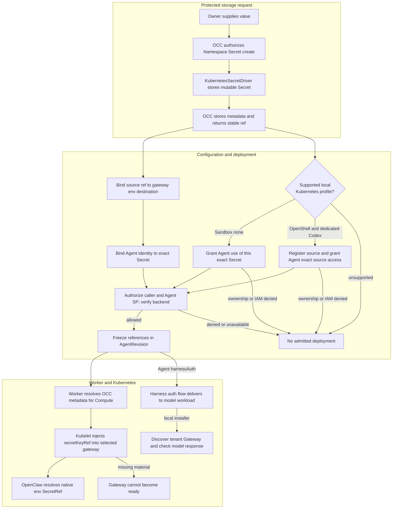

# Secret Storage and Gateway Delivery Flow

## Overview

An authorized owner stores a Namespace-owned Secret before any Agent exists,
binds its stable reference in Configuration for gateway delivery, then grants, assigns
and deploys a consuming Agent. For these Configuration bindings, OCC admits
references and Kubernetes supplies values only to each selected gateway.
Harness model authentication uses the
[shared Agent binding flow](native-service-account-credential-delivery.md).
The local installer also grants a new Agent access and verifies a model response.
Credential issuance and provider internals are outside this flow.

## Entry Points

`apps/controller/src/index.ts:createFastifyApp`

- `POST /namespaces/:namespaceId/secrets`: a ready Namespace and caller
  authorization to create the Secret in that Namespace.
- Configuration create/update, Agent create/update assignment, and the existing
  Agent deployment action: authorized exact Secret references, same-Namespace
  bindings, exact Agent assignment authority, and an approved Harness/Compute
  selection.
- Local installer: `scripts/first-agent.mjs:main` uses the bootstrap service key.
- Source: [HTTP handlers](../../apps/controller/src/index.ts),
  [OpenClawController](../../packages/occ/src/index.ts), and
  [KubernetesSecretDriver](../../apps/controller/src/drivers/secret/kubernetes/index.ts).
- The console and [OCC CLI](../guides/cli.md#provision-integration-secrets)
  call these HTTP operations. They initiate OCC-authorized mutations; neither
  writes directly to SQL, Kubernetes, or credential backends.

## Flow

## Execution Trace

### 1. Authorize storage without requiring a gateway

`packages/occ/src/index.ts:OpenClawController.createSecret`

[OpenClawController.createSecret](../../packages/occ/src/index.ts) validates
bounded, nonempty UTF-8 input and locks the Namespace. The caller needs `create`
on the Namespace's Secret collection. The Namespace must already be ready; an
Agent record does not need to exist. OCC selects the
Installation SecretDriver, generates the Secret identity, and prevents the
caller from choosing Kubernetes backend identity. The value stays in protected
request/driver memory, never in the reconciliation queue or resource metadata.

### 2. Store material and commit safe identity

`apps/controller/src/drivers/secret/kubernetes/index.ts:KubernetesSecretDriver.create`

[KubernetesSecretDriver.create](../../apps/controller/src/drivers/secret/kubernetes/index.ts)
uses Compute-owned verified tenant storage placement. It creates a mutable Opaque Secret with
a Namespace-derived name, exact Namespace ownership metadata, and a fixed
`value` key. Its result contains only backend identity, including UID. [OCC state](../../packages/occ/src/state/postgres-state.ts)
persists immutable Namespace, driver, and backend metadata while public metadata
omits the backend locator and returns `{ kind: "secret", namespaceId, id }`.

Known OCC transaction failure can compensate the exact created object. An
unknown commit outcome must not trigger destructive compensation. There is no
value journal or automatic replay; ambiguous creation can require operator
recovery.

### 3. Bind a source, then admit references

`packages/occ/src/index.ts:OpenClawController.deployAgent`

The Agent response exposes its immutable `servicePrincipalId`. An administrator
grants that identity `operate` on the exact Secret before deployment. OCC checks
Installation administration, Namespace scope, and target access through the
selected IAM Driver; policy and audit commit together.

[createConfiguration and updateConfiguration](../../packages/occ/src/index.ts)
keep `secretBindings` in OCC metadata, separate from native `values`. Each binding
has a Secret source and an env delivery destination; omitted delivery normalizes
to `env`. Unsupported sources, substitution modes, and reserved environment
variables fail closed. All sources must belong to the same Namespace as the
Configuration. A Configuration create/update whose resulting document contains
bindings requires `operate` on every selected Secret, including retained bindings
when PATCH omits `secretBindings`.

[createAgent and updateAgent](../../packages/occ/src/index.ts) require the normal
Agent mutation permission plus `operate` on each exact Secret when selecting a
Configuration with bindings.

[deployAgent](../../packages/occ/src/index.ts) separately authorizes the deploying
caller and consuming Agent service principal to `operate` every Secret, then
checks live backend identity through the API-side driver. Namespace locking
serializes binding/admission changes against deletion. Admission freezes
normalized refs and the selected SecretDriver identity, not backend locators or
values, in the revision. Enabled native channel environment SecretRefs must have
matching bindings at admission; disabled channel provider blocks do not require
them.

Model-auth environment destinations are reserved for Agent `harnessAuth`;
Configuration bindings cannot select or override model credentials in either
execution topology.

### 4. Grant the first local Agent access to its model credential

`scripts/first-agent.mjs:main`;
`scripts/first-agent-database.mjs:grantFirstAgentSecret`

The [tool](../../scripts/first-agent.mjs) targets the persistent installation
started with `./bin/occ dev up`. Before invoking Kubernetes or the OCC API, it
requires the current v3 development marker and state from the same checkout.
The state must select Kubernetes Compute. The default `sandboxDriver: "none"`
path uses embedded OpenClaw; OpenShell requires explicit `--harness codex`.
With the [bootstrap service key](../../packages/iam/src/index.ts), it creates a
Secret, Configuration, and named Agent through the OCC HTTP API. A new Agent uses
`openai/gpt-6-astra` unless `OPENCLAW_FIRST_AGENT_MODEL` selects another authorized
plain model ID; a repeat without an override keeps the recorded model, and a
conflicting override is rejected. Bootstrap already has Secret `operate`; the
Agent does not.

Without OpenShell, the tool opens the recorded local PostgreSQL service. One
transaction verifies the Namespace, Agent, and Secret, then grants the Agent's
existing principal `operate` on that exact Secret. It verifies the bootstrap
identity, honors IAM restrictions, and audits a new grant.

With OpenShell, the tool registers the Secret as an `openai` CredentialSource
and uses the public Namespace IAM API to grant the Agent principal exact
`credential_source:operate`. It does not grant Secret access. `--replace-key`
updates the Secret and asks the Credential Gateway to reread it before deploying
a new revision. The private helper record freezes the Harness and Sandbox Driver
choices so a rerun cannot silently change topology.

The tool provisions initial runtime credentials and requests deployment through
OCC. Once the revision is active,
[`findGateway`](../../scripts/first-agent-model.mjs) discovers the canonical
tenant namespace through `openclaw.dev/namespace`. The supported local setup is
single-cluster, so embedded and dedicated Gateways share that physical namespace
with the provider-owned Harness. The verifier requires the exact Agent labels,
revision ConfigMap mount, and a Running, Ready Gateway Pod before it sends the
prompt. Kubernetes Compute owns any experimental two-cluster placement; this
local helper does not infer physical placement from the Agent execution mode.
The tool leaves the installation and resources in place on exit.

### 5. Render only the exact gateway's projection

`apps/controller/src/worker.ts:ControllerWorker.resolveRevisionSecretContext`

[ControllerWorker](../../apps/controller/src/worker.ts) rechecks
consumption authority and resolves revision refs from OCC metadata before each
preparation and activation. It passes an ephemeral `ComputeRevisionContext`; it
does not add backend metadata to the revision. Its Compute Driver performs
the physical Secret reads and scoped runtime delivery.

[KubernetesComputeDriver.prepareRevision](../../apps/controller/src/drivers/compute/kubernetes/index.ts)
checks the revision, source UIDs, projection identities and verified storage Namespace.
Dedicated Gateways directly reference admitted canonical Secrets. It renders `env[].valueFrom.secretKeyRef` with `optional: false` only in each
selected consuming gateway. Model-auth projections are prepared separately from
Agent `harnessAuth`. ConfigMaps retain native references only. A missing
Secret/key prevents startup; normal readiness and cutover rules still control
activation. Dispatch checks OCC metadata; Compute also rejects a replaced source UID before
delivery. Kubernetes environment references themselves bind a name and key, so
Kubernetes administrators remain trusted.

For an embedded replacement, preparation stages its immutable ConfigMap without
requiring the old gateway to be healthy. The worker commits the selected revision
before activation replaces the gateway Deployment and checks readiness. This lets
an explicit corrected deployment recover from a native SecretRef startup failure;
preparation alone is not proof that the replacement runtime is ready.

Kubelet obtains the bytes and creates the process environment. OpenClaw resolves
its existing `{ source: "env", provider, id }` reference. This is the handoff to
the native consumer, not a new OpenClaw provider or OCC text-substitution engine.
Native channel credentials follow these same admitted bindings. No legacy
per-Agent channel Secret injects additional values. Dedicated gateways receive
channel bytes; the dedicated Harness receives only its separately admitted model
authentication. Embedded channel credentials remain unsupported.

The trusted worker reads canonical sources and manages Harness runtime projections; workload
ServiceAccounts have no Secret API verbs. A trusted workload writer can still
project namespace Secrets, so controller compromise remains outside workload isolation.

### 6. Update, restart, or remove

`packages/occ/src/index.ts:OpenClawController.updateSecret`

[updateSecret](../../packages/occ/src/index.ts) serializes the write and uses
Kubernetes concurrency/ownership checks. It changes only the stored value; the
response retains the same ref. No revision, binding, or running environment is
updated, and no controller automatically restarts the gateway. A successful update
means stored, not delivered.

For coordinated channel replacement, stop the Agent and wait for shutdown before
updating each Secret. A partial update leaves it stopped until repaired; there is
no multi-Secret transaction or rollback of stored bytes.

For model-key replacement, update the OCC Secret and explicitly deploy each
consuming Agent through OCE. The new revision's preparation calls
`KubernetesComputeDriver.deliverHarnessAuth`, which reads the current canonical source
and writes the revision-owned DP Secret before the Harness starts. Wait for
activation and verify a real model request before revoking the old key upstream.
A Harness Pod recreation reads its existing DP projection; it does not deliver
current source values. This remains true when the Configuration and Secret reference
are unchanged.

Dedicated Gateway infrastructure restarts read canonical channel Secrets
directly. Failed cutover does not restore old source values. Revoking `operate`
blocks new OCC admission, not kubelet process starts or already delivered bytes.

[deleteSecret](../../packages/occ/src/index.ts) rejects current Configuration,
Agent harness-binding draft, active revision, and pending-work dependencies under the same serialization
boundary. One `listReferences` query returns at most 50 of them, ordered by kind and ID;
`secretConsumers` checks `read` on each referencing resource, names the readable ones in
the `409`, and counts the rest. `readSecret` returns the same result as `consumers`.
Once unreferenced, it deletes only the exact Namespace-owned backend and metadata.
A partial delete can be retried; missing or foreign objects never become an
adoption or recreation path. Gateway replacement does not garbage-collect
Secrets, so immediate revocation requires stopping workloads or revoking the
credential at its issuer.

## Debugging and Verification

- Read public Secret metadata without requesting or dumping values. Inspect safe
  ownership/UID metadata separately as an authorized operator; do not print
  `Secret.data`, complete process environments, or credential-bearing requests.
- A stored Secret with no ready gateway is valid. Update success does not imply
  delivery. Compare revision/Pod identities and use noncredential sentinel values
  for restart assertions.
- On local failure, rerun the tool with the same Agent name. It prints the Agent
  and revision IDs only after the model responds.
- Source selection, exact Namespace ownership, consumption authorization, missing
  material, and concurrent backend mutations fail closed. Do not retry a denial
  against another driver or model-key source.
- [Real Agent acceptance](../../tests/integration/harness-topology-k3d-real.test.mjs)
  requires explicitly selected PostgreSQL/Kubernetes, digest-pinned real runtime
  images, and an authorized model key. It must prove the native-ref negative control,
  genuine turn, and env restart behavior; mocked rendering is not that proof.
- Run focused conformance, API, startup, Helm, PostgreSQL Secret-state, real
  Compute, and real Agent suites when changing this flow's implementation. State
  skipped credentials, infrastructure, or runtime hooks as verification gaps
  rather than replacing them with mocked rendering.

## Related docs

- [SecretDriver implementation specification](../../specs/.archive/14-secret-driver.md)
- [Secret access architecture](../design/safeguards.md#secret-access)
- [Kubernetes deployment](../guides/deploy.md)
- [Deploy your first Agent](../guides/first-agent.md)
- [Configuration](../reference/configuration.md)
- [Kubernetes Secret Driver](../reference/drivers/kubernetes-secret.md)

## Manual Notes

[keep this for the user to add notes. do not change between edits]

## Changelog

- 2026-10-05 17:02: Align first-Agent Gateway discovery with the canonical single-cluster tenant namespace. (authoring-run/583f86ae-e997-4586-8fb5-217bb20a1410 - 1d7bd797a941a45c36280b7531ee3051b5cad830)

- 2026-10-02: Canonical sources and role-specific projections share the single-cluster tenant namespace. (01a0fe72-58b2-7cc3-b770-7310f5401deb)

- 2026-10-02 16:00: Discover the first-Agent Gateway from its admitted embedded or dedicated execution placement before checking the model response. (authoring-run/f85f64d4-af40-4918-91ea-2d16640c12b2 - 987c8c2b4ace1e152262ef6920b6d0f9ff26a086)

- 2026-10-01: Added the OpenShell dedicated Codex first-Agent path with exact
  CredentialSource access and no Agent Secret grant.

- 2026-09-25 14:57: Align first-Agent admission and its real fixture with v3 development state, and reject the unsupported OpenShell profile before external calls. (authoring-run/6556d897-be75-463f-b50c-73f3b1fb6d72 - 189c62c993066d52703d2cd7eb896e2c2c01bdc4)

- 2026-09-23 14:12: Clarify model-key replacement through OCE deployment and distinguish Harness Pod recreation from credential delivery. (codex/01a0cf72-6985-7712-ba92-d8cc32470f24 - 240c72f2ef96c034c4e05c4775a79a94ebbe64ab)

- 2026-09-23 12:22: Move canonical credential sources to CP and describe revision-scoped Harness delivery in the accompanying change. (codex/01a0cf72-6985-7712-ba92-d8cc32470f24 - 623d56dec26a8ef0f72b562254687cabecdbbf82)

- 2026-09-21 19:52: Trace the local Agent default and preservation or rejection of recorded model selections. (01a0c580-9e39-7e21-bb0f-28fcc4752c59 - 4ec004dbefd25070ff1bdeb89cfb16d245296ac9)

- 2026-09-20 18:25: Document the local first-Agent Secret grant and model-response check added with the installer tool. (01a0c00c-8a45-7233-82c4-e12fb2c3b0d7 - 3bbdc447dbe2dee8c5f757b822e9ebe034047193)
- 2026-09-20 00:00: Recorded channel credentials as Configuration Secret bindings with Agent service-principal grants and gateway-only delivery. (01a0bce5-9f29-7110-85fd-6b140674d362 - 93fe0a83)

- 2026-09-17 00:48: Correct current harness admission and metadata-only dispatch boundaries after implementation review. (01a0acbf-4d5a-7413-9411-dce911f3ad23 - 107900e9551b90c3e9ac24d30f8ea866f17e5dbb)

- 2026-09-17 00:31: Align credential selection and delivery with Agent harnessAuth and the shared Kubernetes rendering path. (01a0acc2-a404-77e3-b1a0-9fa4ffbbdb04 - d2bcbd1c53acb2582a774b5158f254d726abd33f)

- 2026-09-01 19:09: Moved historical pass counts, run timing, and stale environment blockers out of active Debugging while keeping current runnable checks and proof requirements. (01a05f95-dd80-7011-990f-d1c46b5bb3cc - aa366c49c44834d59f74994c5fd37fb8096f169f)
- 2026-08-28: Historical verification retained from prior Debugging: focused conformance reported 134 cases with 1 optional skip; the real Kubernetes Secret API scenario after rebasing onto main `84e773f` reported 1 passed, 0 failed, 0 skipped, exit 0, in 386.4s with OpenClaw 2026.8.1; additional static, API, startup, Helm, PostgreSQL Secret-state, and real Compute checks were reported. Broader host and dedicated file-edit suites were not established because the host OpenClaw build had stale generated assets and the native hook relay was unavailable.

- 2026-08-28 16:33: Updated verification to the passing post-rebase Agent and Compute proofs against main 84e773f and conformance 134. (01a043fa-27fd-7651-b75a-4d46538a2809 - f7c33d5)

- 2026-08-28 15:56: Recorded current Namespace-owned Secret verification from the parent-inspected live proof and focused suites. (01a043fa-27fd-7651-b75a-4d46538a2809 - 9214fbb56f0437b7529f4a9aaa325ae73a489453)

- 2026-08-28 14:48: Updated the flow for Namespace-owned Secrets, retained-binding authorization, selected gateway delivery, and superseded exact-Agent proof. (01a043fa-27fd-7651-b75a-4d46538a2809 - 9214fbb56f0437b7529f4a9aaa325ae73a489453)

- 2026-08-28 13:56: Consolidated duplicate CRUD guidance while preserving runtime ownership and failure transitions. (01a04995-4a11-7c61-ab52-0b43f49524dc - 64e19bb)

- 2026-08-28 13:12: Recorded independent real SecretDriver acceptance and bounded broader-runtime verification gaps. (01a043fa-27fd-7651-b75a-4d46538a2809 - 07d8eb57a05cf4b439f1cb04816da723e4a36209)

- 2026-08-28 10:47: Documented the implemented storage, binding, admission, and gateway delivery path; runtime verification pending. (01a043fa-27fd-7651-b75a-4d46538a2809 - 7b23ec07cef352abc97917eab7c9fa1a331f08a7)
