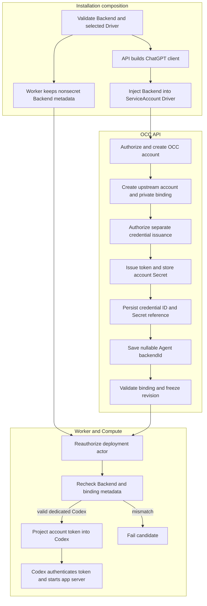

# Service Account Driver Credential Delivery Flow

## Overview

OCC starts with Installation Backend composition, then creates a
Namespace-owned account, separately issues its provider-backed credential, and
deploys an associated dedicated Codex Agent. The API owns the Backend client
and upstream account calls; worker reconciliation repeats metadata checks before
Compute projects the account token to Codex. This flow stops after Codex starts
with the projected access token.

## Entry Points

- Trigger: `POST /namespaces/:namespaceId/service-accounts`, then
  `POST /namespaces/:namespaceId/service-accounts/:serviceAccountId/credentials`,
  Agent association, and deployment.
- Sources: `apps/controller/src/server.mjs:start`,
  `apps/controller/src/drivers/service-account/chatgpt.ts:ChatGPTServiceAccountDriver`,
  `packages/occ/src/index.ts:OpenClawController`.
- Requires PostgreSQL, a ready Namespace, exact OCC permissions, the selected
  ChatGPT Backend and member ServiceAccount Driver, an API-only credential for
  the configured ChatGPT workspace, and a dedicated Codex runtime for managed
  access-token deployment.

## Flow



## Execution Trace

### 1. Compose the Backend and its ServiceAccount Driver

`apps/controller/src/server.mjs:start`

`loadInstallationConfiguration` validates the singular `backend` array and
requires each ChatGPT Backend to declare the selected `service_account` member
Driver. `server.mjs:start` then reads the mounted `apiKeyPath`, constructs
`Backend<ChatGPTClient>`, and injects it into the bundled
`ChatGPTServiceAccountDriver` factory. That client and admin key stay on the API
side. The worker receives only nonsecret Backend definitions so it can reject
stale or mismatched deployment snapshots before Compute effects.

### 2. Create the account and private Backend binding

`packages/occ/src/index.ts:OpenClawController.createServiceAccount`

`OpenClawController.createServiceAccount` authorizes the exact Namespace and
allocates its `sa_*` identity. `ChatGPTServiceAccountDriver.create` creates the
upstream account, registers rollback, and persists its private Backend binding
in the same PostgreSQL transaction, including Backend, Driver, Namespace,
account, and workspace identity.

`apps/controller/src/backends/chatgpt.ts:ChatGPTClient.request` owns each
upstream HTTP response. It consumes successful replies and the structured 404
replies needed to confirm already-absent resources. Before rejecting another
HTTP status or a response declared larger than its 4 MiB allowance, it cancels
the unused body. That releases transport capacity before the next operation;
a cancellation failure does not replace the sanitized Backend error.

Account creation and credential issuance are separate operations. Creating the
account does not issue a token, and later issuance or deletion requires that
exact binding to match the current configured Backend and member Driver.

Before deletion, OCC locks the Namespace and account, then checks Agent drafts,
active revisions, queued or claimed revision work, and queued or running Agent
provisioning plans through `serviceAccounts.hasReferences`. A conflict returns
before any Driver call can revoke the credential or remove its Secret. Namespace locking serializes this
check with draft changes and deployment admission; the PostgreSQL reference
query observes active pointers and pending work together during worker cutover.
With no ServiceAccount Driver selected (no ChatGPT Backend), an account holding
an issued access token answers `409 SERVICE_ACCOUNT_DRIVER_NOT_CONFIGURED`
naming the fix and stays, since nothing can revoke its token.

### 3. Issue the credential and create one account Secret

`apps/controller/src/drivers/service-account/chatgpt.ts:ChatGPTServiceAccountDriver.createCredential`

`OpenClawController.createServiceAccountCredential` authorizes account `update`
before `ChatGPTServiceAccountDriver.createCredential` issues a Codex-scoped
token. `KubernetesComputeDriver.storeServiceAccountCredential` stores it in one
account-owned control-plane Secret. The private Backend binding retains workspace
metadata. The private credential ID, internal
credential reference, and audit changes commit together;
confirmed failures compensate created provider and Kubernetes resources.
With no ServiceAccount Driver selected (no ChatGPT Backend), issuance answers
`409 SERVICE_ACCOUNT_DRIVER_NOT_CONFIGURED` naming the fix after the grant and
account lookup; a selected Driver that fails stays `503`.

### 4. Save Agent Backend intent and admit the revision

`packages/occ/src/index.ts:OpenClawController.createAgent`, `updateAgent`, `deployAgent`

Agent `backendId` is nullable. Create omission saves `null`; PATCH omission
preserves the current value; explicit `null` clears it; and a nonnull ID must
name a configured Backend. Saving or changing the draft Agent reference makes
no upstream call. The Agent selects the issued account through
`harnessAuth: { method: "codex_pat", source: { kind: "service_account", namespaceId, id: serviceAccountId } }`.

`deployAgent` authorizes the Agent, Configuration, and associated account, then
validates `access_token` ownership with
`validateServiceAccountBackendBinding`. Managed access-token deployment requires
the exact nonnull Backend, selected member Driver, workspace, account, recorded
credential issuance, and dedicated Codex execution. An account without an issued
credential cannot deploy; without a ChatGPT Backend that refusal is
`409 SERVICE_ACCOUNT_DRIVER_NOT_CONFIGURED`. Admission freezes the account identity, exact credential
reference, private Backend binding, and Agent `backendId` in the revision.
Supplied API keys use the same [harness binding path](native-service-account-credential-delivery.md)
through an OCC Secret; native account references are not model-auth selectors.

### 5. Recheck metadata and project the account Secret

`apps/controller/src/drivers/compute/kubernetes/index.ts:KubernetesComputeDriver.prepareRevision`

`ControllerWorker.resolveRevisionBackend` runs after IAM reauthorization and
before Compute reconciliation. It rejects a missing configured Backend as
`BACKEND_UNAVAILABLE` and a metadata mismatch as
`SERVICE_ACCOUNT_BACKEND_MISMATCH`. Only Backend, Driver, workspace, account,
and issuance metadata leave the repository; upstream account IDs, admin keys,
and credential values stay private.

`KubernetesComputeDriver.prepareRevision` uses its internal `prepareHarnessAuth`
rendering step and `CODEX_LOGIN_MODE=codex_pat`, then delivers the account token
into a revision-owned data-plane Secret for dedicated Codex. Embedded execution
is rejected for managed access tokens. The Gateway receives no model credential.
The trusted worker reads the CP source and manages the DP projection; workload
ServiceAccounts receive no Secret API permission. Workspace ownership remains
part of control-plane validation, without a runtime workspace override.

### 6. Authenticate Codex with the account token

`apps/controller/src/drivers/compute/kubernetes/runtime-entrypoints.ts:AGENT_RUNTIME_ENTRYPOINT`

`AGENT_RUNTIME_ENTRYPOINT` uses the same native login for Driver-issued account
tokens and directly supplied `codex_pat` credentials:

```sh
codex -c cli_auth_credentials_store=file login --with-access-token
```

Codex derives account identity from the token. The entrypoint clears the token
environment and starts its authenticated app server.
Refresh, rotation, and automated reconciliation remain deferred.

## Debugging and Verification

- Run `node --test tests/conformance/service-account-driver.test.mjs` for
  controller lifecycle coverage and native HTTPS response-release regressions.
  The latter call the actual Backend with built-in fetch, a single-connection
  pool and a loopback TLS server. They prove recovery after rejected 429, 503 and
  oversized declared responses, not live provider accounts or model execution.
- Run `node --test tests/integration/service-account-driver-real.test.mjs`
  with `OCC_TEST_CHATGPT_SERVICE_ACCOUNT_REAL=1`, a protected admin-key file,
  `OCC_TEST_CHATGPT_WORKSPACE_ID`, disposable Kubernetes/PostgreSQL, and real
  digest-pinned OpenClaw/Codex images; do not use `OPENAI_API_KEY`.
- Verify the provider account, private credential ID, exact-account Secret,
  revision-scoped Codex-only projection, and genuine model response. For ownership,
  compensation, and ambiguous commits, see the [service-account guide](../reference/service-accounts.md)
  and [security model](../reference/security.md).

## Related docs

- [Backends](../reference/backends.md)
- [Service accounts](../reference/service-accounts.md)
- [Service Account Driver specification](../../specs/.archive/11-service-account-driver.md)
- [Platform design](../design.md)
- [Kubernetes Compute Driver](../reference/drivers/kubernetes-compute.md)
- [Harness authentication binding](native-service-account-credential-delivery.md)
- [Harness execution topology](harness-execution-topology.md)

## Manual Notes

[keep this for the user to add notes. do not change between edits]

## Changelog

- 2026-10-08 17:45: Deleting an account that holds an issued access token, with no ChatGPT Backend, answers `409 SERVICE_ACCOUNT_DRIVER_NOT_CONFIGURED` naming the fix instead of a generic `503`. (fix-816-819)
- 2026-10-08 13:00: Issuance, and deploying an account without an access token, on an Installation with no ChatGPT Backend answer `409 SERVICE_ACCOUNT_DRIVER_NOT_CONFIGURED` naming the fix instead of a generic `503` or `409`. (fix-780-781/d540)

- 2026-10-07 12:07: Unify imported and managed PAT authentication while preserving source ownership and existing OAuth behavior. (01a0e5ec-d802-7800-9eb6-8022c1ac0d06 - be5006e62)

- 2026-10-05 20:51: Trace rejected Backend HTTP response disposal and native HTTPS recovery coverage. (c0a8f27c-4c0f-42ed-b6e8-be41aff648c7 - b5b3ba296f38dd5090c1f4bb1287ed87ae3f9eba)

- 2026-09-23 12:22: Move canonical credential sources to CP and describe revision-scoped Harness delivery in the accompanying change. (codex/01a0cf72-6985-7712-ba92-d8cc32470f24 - 623d56dec26a8ef0f72b562254687cabecdbbf82)

- 2026-09-17 00:31: Align credential selection and delivery with Agent harnessAuth and the shared Kubernetes rendering path. (01a0acc2-a404-77e3-b1a0-9fa4ffbbdb04 - d2bcbd1c53acb2582a774b5158f254d726abd33f)

- 2026-09-01 19:09: Merged Provider and Driver lifecycle details into the managed credential delivery flow, including nullable Agent Provider references and worker metadata checks. (01a05f95-dd80-7011-990f-d1c46b5bb3cc - aa366c49c44834d59f74994c5fd37fb8096f169f)
- 2026-09-01 08:47: Trace Provider membership, API-only client injection, and persisted ownership checks. (01a05d97-f2b0-71d0-bfc3-01ee7d6d58f9 - b079c4b755ef336a9c65bb4eb737e3aedbfdaa7d)

- 2026-08-28 17:58: Updated moved feature-reference links for the documentation organization. (01a036f4-cf1d-7cc1-bbc1-000879038ac8 - 4270aa29b7015562049f46c6027962fd85b584a9)
- 2026-08-24 23:35: Documented API-only provider integration, private transactional account and credential bindings, scoped Kubernetes Secret ownership, immutable account association, dedicated Codex token login, compensation boundaries, and genuine provider-backed verification. (01a03542-30ff-77a1-9967-587d55548ace - 51033bee121374332df2791e90e2290a5c892e5d)
- 2026-08-25 00:27: Consolidated the execution trace around the direct Driver-owned binding and shared API initialization while preserving security, rollback, and verification boundaries. (01a03542-30ff-77a1-9967-587d55548ace - 96a841f)
- 2026-08-25: Consolidated repeated implementation and security detail into the canonical service-account and security guides.
