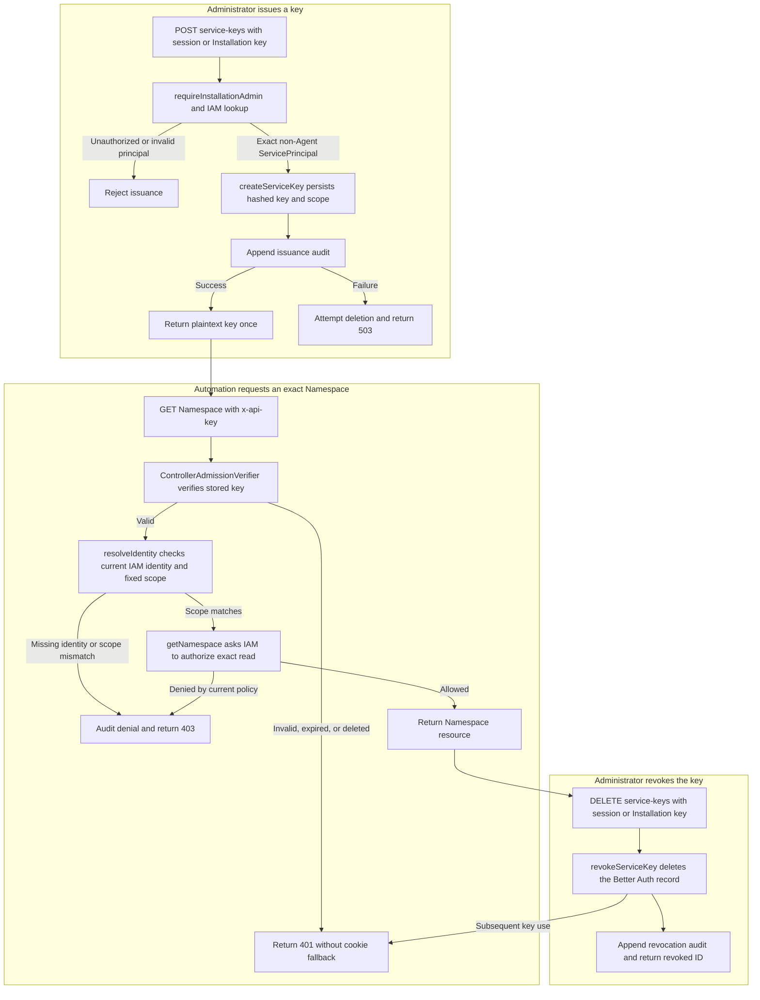

# Service API Keys Flow

## Overview

An Installation administrator, authenticated by human session or service API
key, issues a Better Auth key for an existing non-Agent IAM ServicePrincipal.
Automation uses that key to request an exact resource, and an authorized
administrator can later revoke it. This flow follows a
Namespace reader from issuance through `GET /namespaces/:namespaceId` to
revocation. It stops at the OCC resource response or the credential's deletion
and audit result; provisioning IAM identities and Agent workload credentials
remain separate lifecycles. Fresh native-IAM bootstrap provisions the initial
service administrator and calls the same key helper, delivering its response to
protected storage rather than an HTTP issuance response. That separate entry and
commit boundary is traced in the [bootstrap flow](local-password-authentication.md).

Better Auth owns key material and persistence. The selected IAM Driver owns
identity lookup and authorization. A key fixes the identity's Installation and
optional Namespace at issuance, but it does not snapshot or grant permissions.

## Entry Points

- `POST /api/auth/service-keys`: a human session or Installation-scoped service
  key with current IAM `administer` on the bootstrapped Installation names an
  existing principal in its exact scope.
  [apps/controller/src/index.ts:requireInstallationAdmin](../../apps/controller/src/index.ts).
- `GET /namespaces/:namespaceId` with `x-api-key`: a stored, unexpired key
  authenticates the service identity before IAM evaluates the resource request.
  [apps/controller/src/auth/index.ts:ControllerAdmissionVerifier.verify](../../apps/controller/src/auth/index.ts).
- `DELETE /api/auth/service-keys/:keyId`: an administrator with the same
  credential and authority requirements supplies the non-secret ID returned
  at issuance.
  [apps/controller/src/auth/index.ts:revokeServiceKey](../../apps/controller/src/auth/index.ts).

The controller already has configured Better Auth storage and its selected IAM
Driver. Native IAM requires an existing ServicePrincipal, Role, and
AccessBinding; issuance creates none of them. For Namespace automation, an
administrator creates the ServicePrincipal through `POST
/namespaces/:namespaceId/iam/service-principals`
([`createIAMServicePrincipal`](../../packages/occ/src/index.ts)), which writes a
non-Agent `iam_identities` row under the Namespace lock with no grant and audits
`openclaw.iam.service_principals.create` in the same transaction. Request fields and lifetime
limits are defined in the [authentication reference](../reference/authentication/service-api-keys.md#issuance)
and [API reference](../reference/api.md).

## Flow

## Execution Trace

### 1. Authorize the issuer and resolve the target principal

[apps/controller/src/index.ts:requireInstallationAdmin](../../apps/controller/src/index.ts),
called after `admit` and `resolveIdentity` in `createFastifyApp`.

The issuance route admits a human session or Installation-scoped service key,
resolves its current IAM Principal or non-Agent ServicePrincipal, then requires
`administer` on the server-owned Installation. Invalid credentials return
`401` without falling back to an accompanying cookie. A valid caller without
the exact authority, or a Namespace-scoped key, receives `403`. Account
creation and bootstrap retain their human-session boundary.

The handler asks the selected IAM Driver for the requested ServicePrincipal and
checks that its ID and optional Namespace match exactly. Unknown identities,
human Principals, Agent-owned ServicePrincipals, and mismatched scope return
`400`. Successful lookup grants no new permission and passes the existing
principal to Better Auth.

### 2. Persist the key, freeze its scope, and audit before disclosure

[apps/controller/src/auth/index.ts:createServiceKey](../../apps/controller/src/auth/index.ts),
configured by `createControllerAuth`;
[packages/occ/src/state/postgres-schema.ts:apikey](../../packages/occ/src/state/postgres-schema.ts).

The server calls Better Auth's supported `createApiKey` API. The plugin hashes
the key and stores the principal reference with the Installation and optional
Namespace metadata. These metadata values are the credential's fixed scope;
changing IAM scope later does not widen an existing credential. PostgreSQL
uses the official Drizzle adapter and the `occ.apikey` table. Key-based sessions
and public plugin management routes are not enabled.

The controller appends an issuance audit containing the resolved issuer, the
principal ID, and the key's ID (`serviceKeyId`) and name (`serviceKeyName`), then
returns `201` with the plaintext key once.
There is no plaintext retrieval endpoint. If creation or audit persistence
fails, the response is `503` with no credential. If creation already succeeded,
the controller attempts deletion of the unreturned key; this cleanup is best
effort, not an atomic transaction with the audit sink.

### 3. Verify the credential and enforce its fixed identity scope

[apps/controller/src/auth/index.ts:ControllerAdmissionVerifier.verify](../../apps/controller/src/auth/index.ts);
[apps/controller/src/index.ts:resolveIdentity](../../apps/controller/src/index.ts).

For the resource request, an explicitly supplied `x-api-key` selects Better
Auth's `verifyApiKey` before cookie handling. Blank, forged, expired, or revoked
keys return `401` without falling back to a session. A mismatched Installation
or malformed stored key also fails authentication. Without the key header,
the existing session path remains unchanged; bearer authentication remains
unsupported.

Successful verification supplies the service-principal ID and stored scope to
`resolveIdentity`. The selected IAM Driver looks up the current identity by ID.
The controller rejects a missing identity, Agent ownership, changed scope, or
another requested Namespace with `403`. A Namespace key cannot enter an
Installation-level resource operation. Better Auth neither creates a human
session nor authorizes this request.

### 4. Authorize the exact read with current IAM policy

[apps/controller/src/index.ts:perform](../../apps/controller/src/index.ts);
[packages/occ/src/index.ts:OpenClawController.getNamespace](../../packages/occ/src/index.ts);
[packages/iam/src/index.ts:NativeIAMDriver.authorize](../../packages/iam/src/index.ts).

`perform` passes the resolved service-principal ID and requested Namespace to
OCC. Before reading the resource, `getNamespace` requires `read` on that exact
Namespace through the selected IAM Driver. Native IAM loads current policy
separately for identity lookup and authorization. Removed bindings or Roles,
and matching Restrictions, affect subsequent decisions without key reissuance.
Installation-scoped keys still need their own explicit grants; the issuer's
permissions are never inherited.

A denied decision records authorization evidence and returns `403`. Unavailable
required dependencies fail closed with `503`. An allowed read returns the
Namespace response through the existing OCC API envelope. Other resource
operations retain their own OCC authorization and mutation-audit behavior;
key admission does not bypass them. Admission keeps the verified key's ID, and
every route audit event built for the request (change, audited read, or denial)
records it as `details.actorServiceKeyId`. Events OCC appends for the work
itself, such as `openclaw.agents.provision`, carry only the principal.

### 5. Delete the credential and record revocation

[apps/controller/src/index.ts:requireInstallationAdmin](../../apps/controller/src/index.ts),
used by the service-key DELETE handler;
[apps/controller/src/auth/index.ts:revokeServiceKey](../../apps/controller/src/auth/index.ts),
called after `getServiceKey`.

The administrator repeats credential admission and current IAM
Installation-authority checks. Either a human session or an Installation-scoped
service key can authorize this request.
The handler looks up the non-secret key ID in this Installation; a missing or
already removed key returns `404`. It deletes the Better Auth record through
the adapter, appends the revocation audit, and returns the ID with
`revoked: true`. The IAM principal and its policy remain unchanged.

Deletion prevents ordinary concurrent verification updates from recreating the
row. Subsequent verification fails across controller instances, although a
request already authorized may finish. If audit persistence fails after
deletion, the response is `503` and the key stays deleted. Rotation therefore
uses the same lifecycle: issue a replacement, switch the client, then revoke
the old key. An authorized service administrator can perform these calls for
itself or another eligible principal in the same Installation; OCC does not
schedule rotation.

## Debugging and Verification

- [HTTP integration](../../tests/integration/service-api-keys.test.mjs):
  `node --test tests/integration/service-api-keys.test.mjs` exercises real
  Fastify, Better Auth memory storage, and native IAM. It covers valid,
  invalid, expired, revoked, unauthorized, and cross-Namespace requests;
  IAM-authorized service-key management; session preservation; Agent exclusion;
  and audit attribution without keys.
- [PostgreSQL integration](../../tests/integration/postgres-service-api-keys.test.mjs):
  with `OCC_TEST_DATABASE_URL` selecting a disposable application-role database,
  run `node --test tests/integration/postgres-service-api-keys.test.mjs`.
  This separately checks stored hashing, foreign-Installation rejection,
  cross-instance revocation, and deletion during concurrent verification.
  Use the existing [test environment instructions](../testing/postgresql.md#postgresql-test-environment).
- [IAM conformance](../../tests/conformance/iam.test.mjs) verifies identity lookup.
  Run `pnpm openapi:check` to check that the OpenAPI contract, HTTP API reference,
  and API cheat sheet remain current with the controller routes.
- Investigate `401` as credential rejection and `403` as identity, scope, or
  policy denial. Check `openclaw.auth.service-keys.create` and
  `openclaw.auth.service-keys.revoke` audit actions using the request and
  non-secret key IDs. Never log the header or plaintext key. A `503` requires
  checking the auth, IAM, or audit dependency; revocation may already have
  deleted the credential.

These commands describe the proof hooks, not a new runtime execution record.

## Related docs

- [Authentication reference](../reference/authentication/service-api-keys.md#service-api-keys)
- [Deployment procedure](../guides/deploy/service-keys.md#service-api-keys-for-automation)
- [Human password/session flow](local-password-authentication.md)
- [Authorization reference](../reference/authorization.md)
- [Platform identity and authority](../design/access.md#iam-and-authority)
- [Service API key implementation spec](../../specs/.archive/13-service-api-keys.md)

## Manual Notes

[keep this for the user to add notes. do not change between edits]

## Changelog

- 2026-10-07: Namespace ServicePrincipals are created through the Namespace IAM policy API; `occ service-key` issues and revokes keys.

- 2026-08-31 17:43: Document fresh human/service administrator bootstrap, private key delivery, and operator recovery. (codex/01a05a69-3fbe-7441-9e6d-20394758cf94 - 0797098646028ac00cb26cd4afcbc9b2cf8bcb24)

- 2026-08-28 20:17: Allow human or service administrators with current Installation authority to issue and revoke keys. (codex/01a04927-11d8-7083-a4b7-9f3124559d82 - d4b5b01d02cf68a89965f7c00a0fc7d0dcec18d8)

- 2026-08-28 16:57: Documented service-key issuance, current-policy resource authentication and authorization, revocation, and proof boundaries. (codex/01a04927-11d8-7083-a4b7-9f3124559d82 - ab560806dbd945436835ab092ebd10bf3e50d942)
