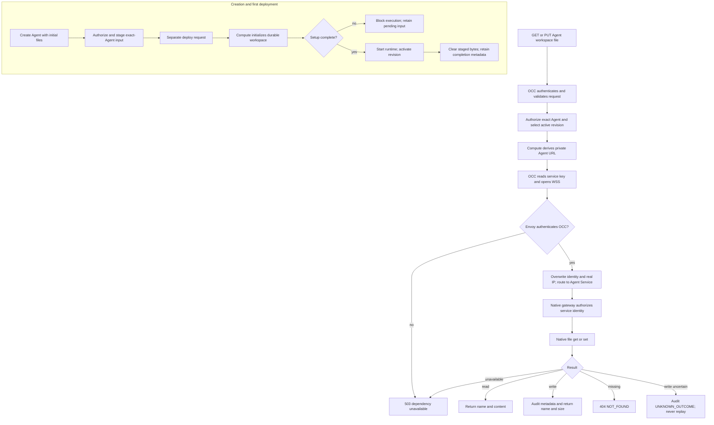

# Agent Workspace Files Flow

## Overview

OCC privately stages authenticated creation inputs: `AGENTS.md`, `SOUL.md`,
`IDENTITY.md`, and `USER.md`. Compute initializes durable storage before execution;
activation retains completion metadata.

Subsequent file operations authorize the exact active Agent and use its
Compute-resolved private endpoint through Envoy Gateway.

Dedicated execution uses Kubernetes Codex; see
[workspace and launcher boundaries](../reference/drivers/kubernetes-compute/storage-and-credentials.md#shared-contracts-and-the-codex-implementation).
Dedicated OpenClaw worker execution remains pending.

See [two-cluster transport](../testing/two-cluster-local.md) for CP/DP routing.

## Entry Points

- `apps/controller/src/index.ts:createFastifyApp` accepts initial contents through
  `POST /namespaces/:namespaceId/agents` and handles live `GET` and
  `PUT /namespaces/:namespaceId/agents/:agentId/workspace/files/:name`.
- `packages/occ/src/index.ts:createAgent` authorizes creation and persists private
  setup state; `apps/controller/src/worker.ts` passes it to Compute on deployment.

Live access requires the Agent's private HTTPRoute and native gateway.
Operators configure Envoy Gateway, native trust, and network restrictions through
[deployment](../guides/deploy/workspace-routing.md#agent-workspace-files); see the
[routing contract](../reference/gateway-routing.md) for transport, credentials,
the default hostname and cert-manager CA, and existing issuers.

## Flow

## Execution Trace

### 1. Creation validates and privately stages the inputs

`apps/controller/src/console/agents/create.mjs` fills four textareas from
`workspace-defaults.mjs` and submits their values with `WORKSPACE_DEFAULTS_ID`.
`apps/controller/src/index.ts:createFastifyApp` rejects a stale defaults identity;
`packages/contracts/src/workspace-setup.ts:normalizeInitialWorkspaceFiles`
rejects unknown names, invalid Unicode, NUL, and values above 16 KiB UTF-8.
An absent or empty map creates no setup state and follows ordinary startup; see
the [create body limit](../reference/agents.md#initial-contents-at-creation).

`packages/occ/src/index.ts:createAgent` checks Namespace-scoped Agent creation,
exact Configuration read, and existing binding permissions. Its transaction
creates a stopped Agent and, when keys were supplied, a private `workspaceSetups`
record keyed by exact Namespace/Agent. No AgentRevision is created. Inputs do
not enter the Agent, Configuration, revision snapshot, public response, or
metadata-only create audit. The original API strings are preserved; Console
textarea values use LF newlines.

### 2. Deployment initializes storage before execution

`apps/controller/src/worker.ts` reads private setup state while resolving
`ComputeRevisionContext`. A selected Driver without `supportsWorkspaceSetup`
returns `WORKSPACE_SETUP_UNSUPPORTED`. The deployment worker serializes the
Agent's startup and passes `workspaceSetup` to Compute.

The bundled Drivers deliver inputs to the shared
`apps/controller/src/drivers/compute/workspace-setup-runtime.ts:WORKSPACE_SETUP_RUNTIME`:
Kubernetes uses an owned Secret and an init container on the workspace owner
(Gateway when embedded; Harness when dedicated); Docker uses a
separate setup container and Agent-owned durable volumes; SSH uses the protected
exact-Agent directory and remote helper. Delivery does not put document strings
in container arguments or environment values. Dedicated Harness startup must
also verify completion before execution. Unsupported workspace placement fails
rather than writing outside managed storage. Provider-owned Sandbox startup
cannot carry this init container, so it rejects workspace setup instead of
dropping initialization.

The runner validates identity, paths, OpenClaw `2026.9.8`, and the rendered
template digest against Console defaults; defaults identities must match, and
links and conflicts fail. Without a completion
marker, native `setup` initializes the workspace and Git without starting the Gateway.
The Kubernetes initializer uses the configured Gateway resource budget because it
loads the native CLI, even when it runs in the dedicated Harness Pod.
It atomically replaces supplied files, including empty strings, when existing
content is absent, stock, or already submitted. It reruns native setup so the
`BOOTSTRAP.md` lifecycle sees the submitted profile, verifies the results, then
atomically writes `.oce-workspace-setup.json`.

Matching markers skip application after lost acknowledgement.
Incomplete writes retry with the same safety checks. After recorded completion,
a divergent file or missing or mismatched marker blocks startup and never
authorizes replay over later user edits. Native setup output and
failure details are suppressed at the delivery boundary to avoid disclosing
contents.

### 3. Activation clears staged contents and keeps completion metadata

`apps/controller/src/worker.ts` completes setup in the activation-completion
transaction only after checking the exact active revision and work claim.
`workspaceSetups.complete` removes document bytes and retains identity and
completion metadata. Drivers remove or replace private delivery bytes with
metadata; subsequent startup verifies the durable workspace marker.

Failed or never-deployed Agents retain pending inputs. Agent deletion removes
the setup record through `packages/occ/src/index.ts:deleteAgent`; Driver
cleanup owns runtime storage. There is no public setup read
or update endpoint.
Live edits after activation follow the independent path below and do not
update the setup record.

### 4. Composition configures private access

`apps/controller/src/server.mjs:start` validates the optional absolute
`OCC_GATEWAY_API_KEY_PATH` before opening the database. Production and
PostgreSQL development composition bind the selected Compute Driver to
`createWorkspaceFilesAccess`. The worker uses the same mounted service key
for native node enrollment.

API and worker Pods wait for the root Secret and load only public CA trust through `NODE_EXTRA_CA_CERTS` at
startup, never the CA signing key; the
[TLS lifecycle](../reference/gateway-routing.md#tls-and-certificate-lifecycle)
covers the automatic CA and explicit issuers.

Kubernetes derives endpoints from admitted IDs and Installation routing; Drivers
without endpoint support cannot serve workspace files.

### 5. OCC admits one exact-Agent file operation

`apps/controller/src/index.ts:createFastifyApp` requires a valid user
session or scoped service API key. Native Agent credentials cannot invoke this
administration surface. `GET` needs Agent `read`; `PUT` needs Agent `operate`
and, for session callers, passes the browser CSRF boundary. OCC resolves the
active AgentRevision before Compute endpoint resolution.

Names, the `PUT` body, and content and body limits follow the
[live file contract](../reference/agents.md#live-file-access). The deadline and
disconnect signal cover admission and native access.

### 6. Compute resolves a route and OCC loads the current key

`apps/controller/src/composition/workspace-files.ts:createWorkspaceFilesAccess`
uses `ComputeDriver.getGatewayEndpoint(revision)` to resolve
`wss://<hostname>[:<endpointPort>]/namespaces/<namespaceId>/agents/<agentId>`.
Hostname defaults to Helm's Service DNS, port to `443`; resolution does not
prove readiness.

`kubernetes/index.ts:reconcileGatewayRoute` provisions operator routing plus an
exact `/node` HTTPRoute and SecurityPolicy for dedicated runtimes.
Only operator routes allow native admin UI subpaths; both strip authorization
and cookies.
The [node endpoint contract](../reference/gateway-routing.md#native-node-endpoint)
owns route ownership across preparation, activation, stop and retirement.

`prepareWorkspaceNode` calls
`gateway/node-enrollment-client.ts:createGatewayNodeEnrollment` after Gateway
readiness. An Agent-owned Secret per Harness kind keeps the setup code and
device ID; preparation renews expired setup codes.
A Codex Harness reads the code from an optional Secret volume, so
enrollment restarts neither workload ([Harness storage](../reference/drivers/kubernetes-compute/storage-and-credentials.md#harness-storage)).
Other Harnesses are replaced, restarting their Gateway.

- Readiness requires `file.fetch`, `file.stat`, `file.write`, `file.create`,
  `dir.list`, `workspace.memory`, and `workspace.skills`. Gateway admits these
  commands before pairing, preserving explicit denies.
- The Harness PVC keeps Agent-scoped identity at `/home/node/.openclaw-node`
  (`0700`, nonroot initializer) across revisions until Agent deletion.
- `AGENT_WITH_NODE_ENTRYPOINT` runs native `setup --baseline` before supervising
  Codex and the node under `tini`. It passes admitted bootstrap options, preserves
  existing edits, and stops on setup failure. Codex starts at once with the
  managed PATH; the node waits for a complete code. Neither gets OCC's key.
- With the status proxy, a Codex Gateway hot-loads `file-transfer` from an
  Agent-owned ConfigMap (replacing the Codex plugin runtime); activation awaits
  OpenClaw's report or fails with its cause. The wrapper queries `plugins.list`
  through the public Gateway SDK, not a CLI process; each query has an
  eight-second deadline and cancels its connection on timeout, and later polls
  can retry. Acknowledging the binding still requires an active plugin in the
  newly loaded registry. A Gateway that refuses that SDK connection's own
  credentials (a fixed auth refusal such as `AUTH_UNAUTHORIZED`, not rate
  limiting or pairing) reports `GATEWAY_UNAUTHORIZED` at once, and activation
  fails with `AGENT_GATEWAY_UNAUTHORIZED`.
  Otherwise the ID is set at Gateway start; losing it fails.
- The Gateway's own `/home/node/workspace` stays empty. It withholds from Codex
  OpenClaw tools that act on it or run commands in the Gateway Pod
  (`ls`, `read`, `write`, `edit`, `apply_patch`, `exec`, `process`,
  `gateway_exec`, `gateway_process`, `terminal`), and `openclaw`, whose
  configuration changes could drop this list, through `codexDynamicToolsExclude`,
  keeping owner entries. It sets `cron.triggers.enabled: false`, because stream
  schedules and trigger scripts run in the Gateway; timed automations still run
  Codex turns. Codex's native tools act in the Harness; the file-transfer tools
  reach it through the node.
- The Harness reaches the model itself, so the Gateway's `codex` and `openai`
  provider rows keep only their models: overrides (`request`, `headers`,
  `params`, `localService`) are dropped, and an authored transport (always for
  `codex`) becomes the `http://127.0.0.1:9` stub. A session switched to
  OpenClaw's built-in runtime with
  `/model <ref> --runtime openclaw` runs in the Gateway with no reachable model,
  and Codex never hands that runtime a turn.
- At each start the Gateway logs one `runtime.gateway_settings_overridden`
  event naming (never valuing) the owner settings it replaced or dropped.
  `occ agent logs` shows the setting names; the Collector exports only the
  [event name](common-logging.md#7-collector-exports-only-operational-classes).
  Deployment admission rejects the shapes it cannot rewrite: a non-list
  `codexDynamicToolsExclude`, a non-object Codex plugin `config`, `cron`,
  `cron.triggers`, `models` or `models.providers`. The deploy request fails
  with `400 INVALID_REQUEST` naming the setting path, and no revision is
  created. A provider row that is not an object, or whose `models` is not a
  list of catalog entries for the Agent's configured models, is refused earlier by OCC's
  model check, also `400 INVALID_REQUEST` and naming the setting path.
- Default reads cover the enrolled Agent's Harness workspace and managed skill
  roots for previews, browsing, bootstrap and outputs. Symlinks are not followed;
  explicit policies remain authoritative.
- `runtime-entrypoints.ts:configureWorkspaceNodePlugins` defaults writes to
  owner documents, memory, `skills/**`, the two ClawHub lockfiles,
  `.openclaw/skill-installs/**`, and staged inbound files. It leaves explicit
  node and wildcard policies unchanged. `file.create` preserves existing files.
  Reads above 16 MiB retain caller and node limits; command admission does not replace path authorization.

The chart supplies worker credentials/public trust and Compute installs node
access to Envoy. Memory uses node duplex with existing native file workers;
index and embedding configuration stay on Gateway. Skills uses remote discovery,
reads and policy-checked dependency installation. Each host initializes its own
image assets; Gateway-provided Skills stay local. See the
[ownership table](../../specs/plans/30-storage-split-integration.md#where-data-lives).
Remote channel menus remain deferred to [#241](https://github.com/openclaw/openclaw-enterprise/issues/241).

Only Harness mounts dedicated workspace, generated-image and Codex rollout
storage. The rollouts let the Gateway resume its bound Codex thread after
stop/start or Pod replacement; the rest of `CODEX_HOME` stays Pod-local unless
OAuth keeps it on the claim. Codex's remote-media reader transfers reply
artifacts before cleanup. Embedded storage is unchanged.
`KubernetesComputeDriver.verifyPersistentVolumeClaim` rejects RWX claims without
mutating them. The worker stops predecessors and suppresses their maintenance
before dedicated preparation. The [storage contract](../reference/drivers/kubernetes-compute/storage-and-credentials.md#harness-storage)
owns RWO, downtime and recovery limits. These contracts require matching runtime
images; local checks do not prove deployed acceptance.

The API reads the mounted key per operation, so new connections pick up
Secret rotation without a restart. Missing routing, missing or invalid
keys, expired deadlines, and unavailable targets fail closed. No URL
or credential comes from caller JSON or headers.

### 7. Envoy authenticates and routes the native connection

`apps/controller/src/gateway/workspace-files-client.ts:requestNativeWorkspaceFile` opens WSS with only the
service key in `x-api-key`. The client verifies the server hostname and CA;
there is no leaf pin, device enrollment, native token, or client-certificate
option. It connects as a backend operator with `deviceIdentity: null` and no
self-asserted scopes.

The Gateway-level Envoy SecurityPolicy verifies and strips the key. The exact
Agent HTTPRoute overwrites `x-occ-identity`, removes forwarded and native-scope
headers, and sets `X-Real-IP` to Envoy's direct downstream socket address. It
rewrites the upgrade path to `/` for the same-namespace Agent gateway Service. Namespace attachment labels, route ownership checks, and
restricted Kubernetes RBAC protect this mapping.

Kubernetes Compute renders
[native trust](../reference/gateway-routing.md#service-key-and-native-identity)
from Installation `network.gatewayTrustedProxyCidrs`; conflicting tenant trust
settings fail deployment. `allowRealIpFallback` accepts the genuine nonloopback
OCC connection address even within a shared Pod CIDR. NetworkPolicy admits only
Envoy to the native gateway; the CIDR is not an independent authentication
boundary. Native
hello grants `operator.admin`; reads also accept `operator.read`.

### 8. Native file access returns a bounded result

The same client invokes `agents.files.get` or `agents.files.set` for native Agent
`main`. Reads enforce the response content limit and return
`{ name, content }`; writes return `{ name, size }`. There is no list, delete,
compare-and-swap, generic RPC, chat bridge, or PostgreSQL file copy.

Certificate renewal under the same CA reaches new WSS connections without an
OCC restart. Root-CA replacement follows the
[trust rotation requirements](../reference/gateway-routing.md#tls-and-certificate-lifecycle).

Writes audit only the Agent resource, authorization action, outcome, reason
when present, and file name. If a dispatched write has an unknown outcome,
OCC returns `503 UNKNOWN_OUTCOME`, attempts the corresponding audit, and never
replays it. The native client closes in the operation's cleanup path.

## Debugging and Verification

- For initial setup failure, check revision/work status and the selected Driver's
  support, native release, defaults identity, and durable workspace placement.
  `WORKSPACE_SETUP_FAILED` intentionally omits document bytes. Do not delete a
  completion marker to force a replay; missing initialized storage needs operator
  recovery, not reuse of the creation payload.
- A stale `workspaceDefaultsId` rejects creation with `409 RESOURCE_CONFLICT`;
  reload the Console create form and resubmit. A create response alone
  does not prove runtime initialization; verify active revision and live content.
- Structural and Driver checks do not replace
  the [required real-workflow proof](../../specs/plans/34-agent-workspace-files-setup.md#verification)
  for first use, retry, and redeploy.
- For `503 DEPENDENCY_UNAVAILABLE`, check the Compute routing settings and key
  mount, then the Gateway, Certificate, SecurityPolicy, and HTTPRoute status.
  Check DNS/CA trust and exact NetworkPolicy peers before changing native auth.
- `403 FORBIDDEN` can indicate missing exact-Agent IAM or session PUT CSRF
  rejection. Granting a native service scope does not change human IAM.
- An authenticated native upgrade failure can indicate missing trusted-proxy
  configuration, a simultaneous token, a loopback real IP, or absent native
  identity scopes. Do not fix it by inventing a forwarded address.
- [Testing](../testing/README.md) separates API conformance, Helm rendering, and the
  real Envoy/cert-manager/native-runtime proof. A calculated URL, ready proxy,
  or rendered chart does not establish file writes or model consumption.

## Related docs

- [Agents](../reference/agents.md#workspace-files)
- [Kubernetes Compute Driver](../reference/drivers/kubernetes-compute.md)
- [Settings reference](../reference/settings/production.md#required-production-controller-environment)
- [Production deployment](../guides/deploy/workspace-routing.md#agent-workspace-files)
- [HTTP API](../reference/api.md)

## Manual Notes

[keep this for the user to add notes. do not change between edits]

## Changelog

- 2026-10-06 18:40: Say that OCC's model check refuses malformed provider rows before the Codex Gateway shape check, without naming the path. (dogfood-r38)

- 2026-10-04 00:40: Fail activation at once when the Gateway refuses its own SDK connection as unauthorized. (f351-gateway-unauthorized)

- 2026-10-01 15:11: Query Gateway workspace binding state through bounded SDK calls. (authoring-run/24df37c6-7eef-483a-a31c-d2c14a51ca6c - 521549df)

- 2026-10-01 11:27: Authorize dedicated Skill source trees and lifecycle metadata in the default node policy. (authoring-run/944b9f5c-dd07-45f4-8179-ed96b2ba3e79 - 836a88e048dc79dfb42066fd0cf868e7405a2f98)

- 2026-09-30 16:29: Require RWO for new and reused Harness claims, including final deletion. (authoring-run/e062d2c6-e51f-42eb-8046-fd6ec6d6b3c4 - 4baeb8f6d21ff0d73102e0800c4e6cc0ed6a6366)

- 2026-09-29 08:09: Align the documented workspace version. (authoring-run/5e3ebbae-97b8-4709-8c03-6a032657e102 - 395c735c3915135e4d5fe533041b3d2c04e995ea)

- 2026-09-28 21:47: Defer enrollment checks until Gateway readiness. (authoring-run/1b67a5da-eea7-4eb4-a91f-38abd1fb5792 - 1365d9b33eec2de2452bd3142f57a1729cccd559)

- 2026-09-27 05:17: Give native workspace initialization the Gateway resource budget. (01a0cf72-6985-7712-ba92-d8cc32470f24 - c0f792d5b92e2dee596711654784759d327e0817)

[Agent workspace files documentation history](workspace-files/history.md) preserves the older dated entries.
