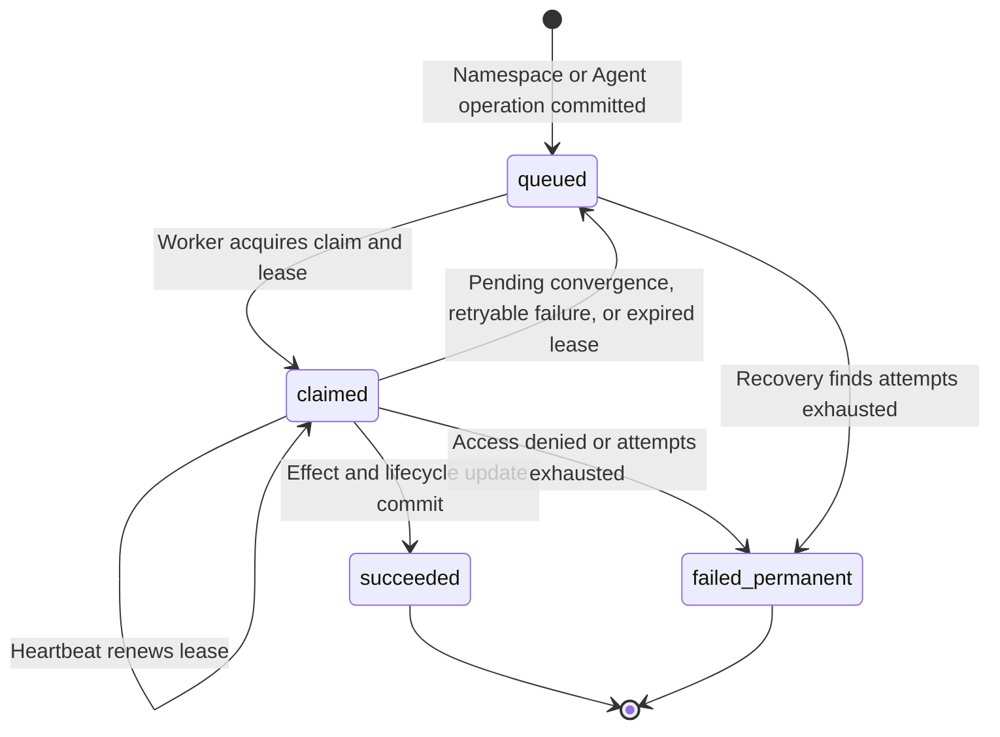

# Namespace and Agent reconciliation

The [controller worker](../controller.md) reconciles durable Namespace and AgentRevision operations. This reference defines lifecycle transitions, queue ownership, retries, and recovery.

## Namespace lifecycle

Creating a Namespace saves `provisioning` and queues its provisioning operation
in the same transaction. An Installation administrator can also specify
`existingNamespace` to persist the exact existing Kubernetes namespace before
provisioning starts. Before acting, the worker reloads current IAM policy,
reauthorizes the original actor, and confirms the operation still belongs to
its exact Namespace. External selection additionally requires Installation
`administer` authorization at admission and immediately before adoption. The
worker asks the Compute Driver to ensure backing infrastructure and sets `ready`
once it is ready; selecting an existing namespace never requires stopping the
shared worker.

Deleting an empty Namespace saves `deleting` and queues a distinct teardown
operation. The worker rechecks the original actor's permission, asks the same
Compute Driver to delete the Namespace and its owned Agent gateways, and records
a tombstone after Namespace deletion. Tombstoned Namespaces disappear from public reads.

Selected non-Compute Drivers may run hooks after Namespace infrastructure
readiness, before workload start, before workload retirement, and before
Namespace removal. Compute owns every transition; revocation failures block
teardown, launch values are restricted to `opaque-` placeholders, and production
workers process Namespace operations plus embedded OpenClaw and dedicated Codex
Agent revisions. See
[ComputeDriver lifecycle hooks](../drivers/compute.md#optional-selected-driver-hooks).

Backing infrastructure behavior is defined by the selected
[Docker](../drivers/docker-compute.md) or [Kubernetes](../drivers/kubernetes-compute.md)
Compute implementation. A successful
queue transition does not itself establish enforcement of cluster admission,
NetworkPolicy, or a SandboxDriver facet; those guarantees require the selected
implementation and its documented infrastructure.

## Agent lifecycle

Stopping an Agent sets its desired runtime state to `stopped` and queues an
exact-Agent `stopped` target. The worker reauthorizes the original actor, stops
the current revision, and clears the active pointer only if it still identifies
that revision. Revision history, credentials, and persistent state remain; a
later deployment starts a new revision.

Deleting an Agent sets its lifecycle status to `deleting`, sets desired runtime
state to `stopped`, and queues an exact-Agent `deleted` target. Synchronous Agent
mutations reject this state. The worker reauthorizes `delete`, retires every
revision, and removes runtime credentials before a claim-protected database
finalizer removes the Agent, revisions, service principal, API keys, exact IAM
references, and Agent work rows. The function records durable success evidence;
an expired claim or failed external cleanup leaves the rows intact for safe
retry. Namespace-owned Configurations and Secrets are not Agent teardown state.

## AgentRevision lifecycle

An authorized bodyless Agent deployment reads its exact Namespace-owned native
Configuration and permits the selected SandboxDriver to transform a copy before
validation. It snapshots the admitted document, including unresolved inline
SecretRefs, alongside the native-selected Harness identity,
server-approved version, explicit Agent execution mode, and Compute
implementation. The required Agent `harnessAuth` selects either an OCC Secret
API-key source or an issued managed ChatGPT account. The revision freezes the
Secret reference and selected Driver, or the account's exact access-token
reference and verified private Backend binding. OCC separately authorizes the
Configuration and harness source before queueing one revision operation in the
same transaction. The source Configuration identity and generation remain pinned even when the
admitted copy differs. Later Configuration, account, or Agent placement changes
never mutate an admitted revision; see [Agent references and deployment](../agents/deployment.md#revisions-and-deployment).
PostgreSQL enforces the exact admitted snapshot shape, so the worker trusts
persisted structure instead of revalidating it.

Before processing that operation, the worker reloads current IAM policy,
reauthorizes the original actor for the exact Agent and Configuration, and
checks the frozen harness source. API-key delivery requires exact Secret
`operate` for both actor and Agent service principal; managed ChatGPT delivery
requires actor `read` on the exact account and matching credential/Backend
ownership. It also checks the owning ready Namespace, stable Agent service
principal, and approved Harness, version, mode, and Compute implementation.
These checks use the immutable revision, not a later Agent draft. Revoked source
access fails permanently with `AUTHORIZATION_DENIED`, records attributable
deployment-denial audit evidence, and prevents Compute calls and activation.
The [harness credential flow](../../flows/native-service-account-credential-delivery.md)
owns the complete source-resolution sequence. Production accepts dedicated
Codex and embedded OpenClaw. Dedicated Codex prepares its revision-specific
workload before the Agent Service selects it. Embedded OpenClaw replaces and
checks the shared Agent gateway during activation. The worker records the exact
active revision, activates the Kubernetes route when applicable, and retires the
prior revision. Its live claim remains unfinished until it atomically records
one attributable activation audit and completes the durable operation.
Already-active recovery repeats route activation and predecessor retirement
before that audit and finalization. Kubernetes dedicated replacement stops all
earlier runtimes before preparing the candidate and reuses the Harness-only RWO
claim. This interrupts serving, including the gateway; a failed candidate needs
retry or a new revision, not automatic rollback. See the
[exclusive replacement contract](../drivers/compute.md#production-revision-stages).
Pod termination does not fence independent processes during node partitions or
manual replacement.
See the
[Harness execution topology flow](../../flows/harness-execution-topology.md) for the
full placement, runtime, and recovery sequence.

A recovered older operation never replaces a newer active revision: the worker
marks it superseded without calling Compute. Sibling Agents have independent
queue lanes, while revisions for the same Agent serialize. The default
PostgreSQL-backed development Compute Driver provisions Docker Namespace resources
but rejects harness bindings for Agent deployment; manual
host-process debugging also needs PostgreSQL for a durable worker path. The explicitly selected
Kubernetes driver creates a hardened Deployment and dedicated Kubernetes
ServiceAccount for the revision's existing Agent ServicePrincipal. Its
audience-scoped projected token is required in production but does not
implement ServicePrincipal token verification or exchange. The dedicated Codex
Agent Service does not select a replacement workload until it is ready and the
revision is active; embedded OpenClaw reuses and replaces its existing gateway.
Selected SandboxDriver facets are pinned at admission and enforced by the
selected Driver. See the [SandboxDriver contract](../drivers/sandbox.md) for
provider-specific preparation and failure boundaries.

## Controller queue states

Every controller operation persists in PostgreSQL and moves through the
following states:

- **`queued`:** The operation is durable and awaiting an eligible worker. New
  work becomes available immediately; retries wait until their persisted
  backoff expires. Both development and production workers process Namespace
  operations and admitted AgentRevisions through the selected bundled or
  installed Compute Driver. The bundled Kubernetes Driver supports embedded
  OpenClaw and dedicated Codex in both modes.
- **`claimed`:** One worker owns a time-limited claim and increments the attempt
  count. It checks current authorization, calls the appropriate Compute Driver
  method, renews its lease before each effect, and keeps renewing while it runs.
  Consecutive short effects must not starve renewal. Only the current claim
  token can publish lifecycle state, audit evidence, or completion.
- **`succeeded`:** The exact Namespace or Agent operation completed
  successfully. Namespace transitions finalize with their audit; an Agent
  revision first becomes active and publishes its route, then commits its
  activation audit and queue completion together. These terminal records remain
  available for idempotency. Successful Agent deletion instead removes its work
  rows after recording lifecycle evidence because the owner no longer exists.
- **`failed_permanent`:** Processing stopped because authorization failed, an
  unrecoverable error occurred, or the retry limit was exhausted. The failure
  is audited, and the terminal operation is never retried automatically.
  The initiating caller can explicitly [retry Agent deletion](../agents.md#deletion)
  or [Namespace deletion](../namespaces.md#failure-semantics-and-limitations).

### Terminal results

Terminal work stores its overall outcome in `reasonCode` and optional structured
success or failure details in `resultData` (the PostgreSQL `result_data` column).
Successful activation keeps `REVISION_ACTIVATED` or `REVISION_ALREADY_ACTIVE`
even when `resultData.warnings` contains different plugin failure codes.
Convergence deadline failures store their allowed `timeoutMs` in the same field.
Queued and claimed work have no result data.

Warnings contain only an allowed code and an admitted plugin ID. The
[deployment status API](../agents.md#deployment-status) derives `error` and
`warnings` from this saved outcome; a successful deployment with plugin warnings
still returns `error: null`. Only the current live claim can publish the result.

### Deferred Namespace and Agent convergence

The worker defers a Namespace or AgentRevision operation when its Compute Driver
successfully observes infrastructure that is not ready yet and reports no
operational failure. Examples include waiting for an operator-provisioned
tenant RoleBinding, Agent image startup, a ready gateway Pod or EndpointSlice,
or completion of Kubernetes Namespace deletion.

`defer()` is a transition, not an additional queue state. It returns the work
to `queued`, releases its claim, schedules bounded backoff, records audit
evidence, and restores the attempt consumed when the work was claimed. The
worker can observe ordinary convergence repeatedly without exhausting its
failure budget.

Actual dependency failures instead use `retry()`, which also returns work to
`queued` but retains the consumed attempt. Once `OCC_WORKER_MAX_ATTEMPTS` is
exhausted, the operation becomes `failed_permanent`. A Compute or Sandbox dependency
failure that clears without a change to the revision is deferred like
convergence instead: the Agent Gateway route refusing or dropping the worker's
connection while it converges (`AGENT_GATEWAY_UNAVAILABLE`), a Kubernetes API
request that timed out, never reached the API server, or got 429 or 5xx
(`KUBERNETES_API_UNAVAILABLE`), or an OpenShell gateway refusing new requests at
its durable request admission limit (`SANDBOX_ADMISSION_LIMIT_REACHED`). Each such
pass records that code, and `worker.completed` names the `dependency` and its
`cause`. If the dependency is still failing at the convergence deadline, the
deployment fails with that code rather than `CONVERGENCE_DEADLINE_EXCEEDED`.
Pending convergence has its own limit: `OCC_WORKER_CONVERGENCE_TIMEOUT_MS`,
measured from the original operation creation time. Exceeding it fails the operation with
`CONVERGENCE_DEADLINE_EXCEEDED`. A runtime that reports a deterministic
credential rejection fails the deployment earlier with
`RUNTIME_AUTHENTICATION_FAILED`, and one whose startup model probe ran out of
CPU at its limit with `RUNTIME_CPU_STARVED`. Other failures a runtime holds
until restart fail it early too: `RUNTIME_MODEL_PROBE_TIMEOUT`,
`RUNTIME_MODEL_PROBE_FAILED`, `RUNTIME_LOGIN_FAILED`, and
`RUNTIME_STARTUP_FAILED`. A dedicated gateway that refuses its own in-Pod CLI as
unauthorized fails activation at once with `AGENT_GATEWAY_UNAUTHORIZED`. A Sandbox Driver that cannot run
the revision fails it on the first attempt with its
[closed code](../drivers/sandbox.md), such as
`SANDBOX_SECRET_ENVIRONMENT_UNSUPPORTED`, and two credential sources that share
a placeholder variable fail it the same way with
`CREDENTIAL_SOURCE_ENVIRONMENT_CONFLICT`. Dispatch also fails it at once when
the Harness credential source was withdrawn from the revision
(`CREDENTIAL_WITHDRAWN`), when the Harness authentication Secret or source, or a
listed credential source, is missing or changed since admission
(`HARNESS_AUTH_SOURCE_UNAVAILABLE`, `CREDENTIAL_SOURCE_UNAVAILABLE`), or when the
Installation no longer selects the revision's Credential Gateway
(`CREDENTIAL_GATEWAY_MISMATCH`) or Secret Driver (`SECRET_DRIVER_MISMATCH`). A
revision pinned to a Compute Driver the controller no longer selects, or to a
Harness version it no longer approves, fails with `COMPUTE_DRIVER_MISMATCH` or
`HARNESS_DESCRIPTOR_MISMATCH`. A revision whose ServiceAccount Backend binding
no longer matches the Agent's Backend, or whose credential is no longer issued,
fails with `SERVICE_ACCOUNT_BACKEND_MISMATCH`. Each status message names the fix. See the
[worker configuration reference](../settings/operations.md#controller-worker-environment) for
defaults and supported overrides.

Replacement behavior depends on the Harness. Dedicated Codex prepares its
revision-specific workload before the worker switches the Agent Service, but the
shared single-replica gateway can still interrupt serving during its rollout.
Embedded OpenClaw replaces that shared gateway using Kubernetes `Recreate`: the
predecessor can stop before the replacement passes startup authentication and
readiness. A failed embedded rollout can interrupt serving; the worker retries
according to its queue policy but does not guarantee that the predecessor stays
available or restore it automatically.

If a worker exits or stops renewing its lease, stale-claim recovery either
requeues the operation or marks it `failed_permanent` after its final attempt.
Recovery can also terminalize an already queued operation whose attempts are
exhausted. When that work targets Namespace creation, recovery changes a still
`provisioning` Namespace to `failed` in the same atomic statement as the terminal
work state and audit evidence. Retryable recovery leaves it `provisioning`;
Agent work, Namespace deletion work, and Namespaces already past provisioning
do not change Namespace status through this recovery path.

## Authorization, retries, and scope

- Namespace provisioning and deletion remain the only Namespace infrastructure
  operations; Agent lifecycle and AgentRevision work use the same Compute Driver.
- PostgreSQL accepts only Namespace lifecycle, exact-Agent lifecycle, or fully
  owned AgentRevision work and rejects malformed queue shapes.
- Creating or updating Agent metadata does not enqueue infrastructure work.
- Every admitted AgentRevision is created through the canonical deployment
  path with pinned Harness and Compute metadata, then processed asynchronously.
- Work is isolated by `namespaceId`. Namespace lifecycle operations serialize
  per Namespace, while the underlying queue preserves independent Agent lanes.
- Current IAM policy is reloaded before each effect. Revoked access fails
  permanently without calling Compute; temporary dependency failures retry.
- Expiring claim leases recover interrupted work. A stale worker cannot commit
  Namespace changes, revision activation, audit evidence, or completion after
  losing its claim.
