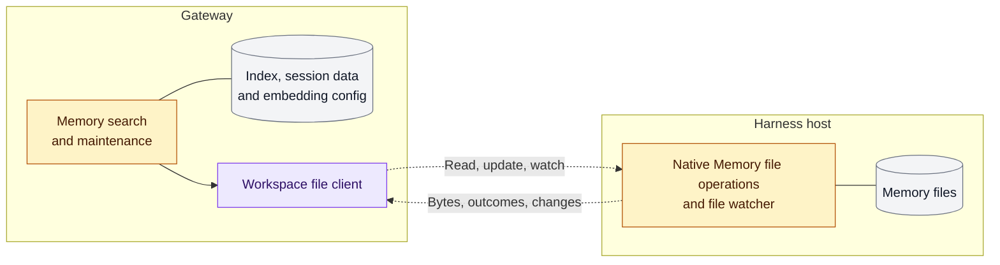

# Storage split: shared interface and integration

**Status: Draft; integration incomplete.** This updates the Memory and Skills placement and
implementation plan in [the original proposal](../rfcs/0003-gateway-harness-storage-split.md).
The separate-storage boundary, native Harness file tools, four-document owner
editing scope, and first-start file behavior remain the same.

OpenClaw owns the common workspace interface and native file operations. An SSH
adapter supplies access to a remote host; Enterprise supplies paired-node transport
through its existing Compute Driver. Neither transport requires Codex
app-server. A remote OpenClaw worker can implement the same interface; its
compatibility is a source-review requirement, not a second model E2E environment.

## Where data lives

| Data                                                     | Authoritative location  | Why / cross-host access                                                                                       |
| -------------------------------------------------------- | ----------------------- | ------------------------------------------------------------------------------------------------------------- |
| Credentials, policy, conversation history                | Gateway                 | Gateway controls routing, access and session state.                                                           |
| Project files, Git repo, Agent documents                 | Harness                 | Native file tools operate locally; Gateway reads permitted documents and edits only the four owner documents. |
| Memory files                                             | Harness                 | The model reads and writes files; Gateway accesses them for indexing and maintenance.                         |
| Memory index and maintenance state                       | Gateway                 | Reuse search, embedding and session-indexing logic.                                                           |
| Bundled, plugin, Library, Workshop and user-level Skills | Gateway                 | These sources are installed or published on Gateway; deliver selected resources to the Harness when needed.   |
| Workspace Skills                                         | Harness                 | Discover workspace roots remotely; read and execute their contents locally.                                   |
| Harness-private Skills, such as Codex-managed Skills     | Harness                 | Keep native discovery private; do not enumerate them into Gateway's catalog.                                  |
| Skill execution dependencies                             | Harness                 | Run approved installers where the tools execute, regardless of the Skill source.                              |
| Attachments                                              | Each consumer's storage | Stage inputs on Harness; retrieve selected outputs into Gateway for delivery.                                 |

Source names alone do not determine placement. Configured extra directories and
managed directories inside the workspace are Harness-owned; those outside it
remain Gateway-owned. Preserve existing source precedence across the two hosts.

The Harness remains an untrusted execution environment. Neither side gets a
general mount of the other's storage. Gateway retrieves permitted content for
its existing consumers; this does not promise content inspection or malware detection.

## Memory: move file access, keep the existing index

Gray = storage; blue = unchanged reuse; yellow = adapted existing code;
purple = new shared code, not a separate service. Dashed connections still need
Enterprise transport integration; the diagram is not deployment evidence.

Keeping the index on Gateway reuses session indexing, embedding providers and
maintenance state. Only file operations move. The tradeoff is remote file reads
and change notifications, rather than remote search results. Missing remote
access reports unavailable; it must not read an old Gateway workspace copy.

## Skills: keep discovery with the source owner

Gateway reads its own Skill sources locally. Task preparation reads workspace
Skill metadata through `loadSkills`; selected bodies and resources use
`skillResources`. The source owner does not determine execution location:
Gateway applies policy, and `installSkillDependencies` runs on Harness.

Each image initializes its own bundled/plugin assets. This supplies local
software resources; it does not make Gateway discover every Skill remotely or
synchronize a mutable workspace.

Channel startup uses Gateway-local Skill discovery. The first release does not
generate native channel command menus from remote workspace Skills; ordinary
message ingress does not wait for that catalog. Required task-time reads still
report unavailable when Harness cannot supply them.

[OCE #241](https://github.com/openclaw/openclaw-enterprise/issues/241) tracks remote
Skill menus: cache names, descriptions and command mappings on Gateway, refresh
in the background, and update menus and handlers together. Start from the cached
list, or basic commands on first startup. Execution still resolves current Skill
content and permissions. The cache and background refresh are deferred, not part
of this implementation.

## Common contract, different transports

The OpenClaw candidate registers `AgentWorkspaceAccess` for the Agent's workspace.
Existing Gateway callers select it; ordinary local workspaces keep their current path.

| Consumer                      | Shared candidate interface                                 | Harness-side work                                                                    |
| ----------------------------- | ---------------------------------------------------------- | ------------------------------------------------------------------------------------ |
| Agent documents and bootstrap | `bridge` (`SandboxFsBridge`)                               | Read permitted documents; write only the owner-editable documents                    |
| Attachments                   | `prepareTurnAttachments`, `outboundMedia`                  | Stage inputs and fetch selected outputs                                              |
| Memory                        | `memoryFiles`                                              | Native discovery, reads, maintenance writes and watch notifications                  |
| Skills                        | `loadSkills`, `skillResources`, `installSkillDependencies` | Discover workspace sources; read selected resources; run approved dependency recipes |

Candidate source owners in `openclaw/openclaw`:

- `src/agents/workspace-access.ts`: registration and lifetime checks.
- `extensions/file-transfer/src/workspace-service.ts`: existing paired-node file adapter.
- `src/agents/workspace-memory-client.ts`: shared Memory client; adapters supply
  request and subscription transport.
- `extensions/file-transfer/src/workspace-memory.ts`: node transport for that
  client, using the plugin-owned `workspace.memory` command and existing file grants.
- `extensions/memory-core/src/remote/memory-files-worker.ts`: native file operations,
  without an index or embedding credentials on Harness.
- `src/skills/loading/workspace-skill-sources.ts`: partition Gateway and workspace roots.
- `src/skills/loading/workspace-skill-loader.ts`: merge discovery in existing precedence;
  use Harness availability facts without moving Gateway source files.
- `src/skills/lifecycle/install.ts`: Gateway policy check before remote dependency installation.

These are candidate paths, not a claim that the current OpenClaw release supplies
the complete interface. The Memory file protocol needs request input and a
cancellable subscription. `system.run` currently has no stdin field, and Gateway
plugin services can invoke only their own registered commands. `node.invoke`
therefore needs an authorized adapter; naming the transport is not the implementation.

Nothing in the storage contract requires Codex app-server. A remote OpenClaw
worker can use the same file operations once its adapter is wired. Its model-tool
protocol is a separate constraint: the audited worker tool list does not expose
`memory_search` or `memory_get`. This proposal does not add those model tools.

## Enterprise completion work

| Normal workflow                                     | Enterprise work still needed                                                                        | Completion evidence                                                                             |
| --------------------------------------------------- | --------------------------------------------------------------------------------------------------- | ----------------------------------------------------------------------------------------------- |
| Owner reads or saves an Agent document              | Finish node enrollment and connect the existing file adapter through Compute                        | Owner reads and saves the Harness file; the four-document write scope stays the same            |
| User sends an attachment and receives a task output | Use the shared attachment interfaces through the enrolled node                                      | A real task consumes the uploaded file and returns a downloadable output                        |
| Agent writes and searches Memory                    | Validate the wired `workspace.memory` adapter with the selected runtime image                       | Gateway search finds the Harness file, with the index on Gateway                                |
| Agent uses a Skill                                  | Verify the wired Skills discovery, installer and private runtime assets in the selected image       | Gateway checks installation policy; the Harness discovers and executes the installed dependency |
| Task continues after a normal deployment restart    | Verify Harness-only workspace storage and Gateway-private sessions through the normal revision path | Workspace files remain available and the task can continue                                      |

Verification of a Codex host over SSH does not prove Enterprise node transport
or provisioning. The existing node adapter
currently registers document, attachment, Memory and Skills access. Native Memory
operations pass local tests. Skills discovery, instruction reads and a real npm
dependency installation pass locally. Bundled/plugin assets initialize from each
host's image instead of shared mounts; the Harness runtime-image test passes.
The dedicated Gateway workspace and generated-image mounts are removed; sessions
use Gateway private storage. Manifest checks pass, but these checks do not prove
a deployed Enterprise model turn or revision replacement.

The Kubernetes Harness PVC still uses RWX for overlapping revisions. Gateway no
longer mounts that PVC. The shared interface requires neither RWX nor shared
storage between Gateway and Harness; changing the Driver's remaining RWX backend
requirement is a separate revision/storage decision.

Additional fixes in this delivery must address a common workflow that worked
before storage separation. Existing bugs, unusual configurations and injected
failure states do not expand this acceptance list.

Update the [existing workspace flow](../../docs/flows/workspace-files.md) as each path
lands. Local packaged-worker tests and mount checks are useful evidence, but do
not establish Enterprise deployment or model E2E.

Remaining integration and accepted limitations are tracked under
[OCE #76](https://github.com/openclaw/openclaw-enterprise/issues/76), with deferred
remote menus in #241. Existing bugs and unconfirmed test-only states are recorded
separately from features deferred by this design.
