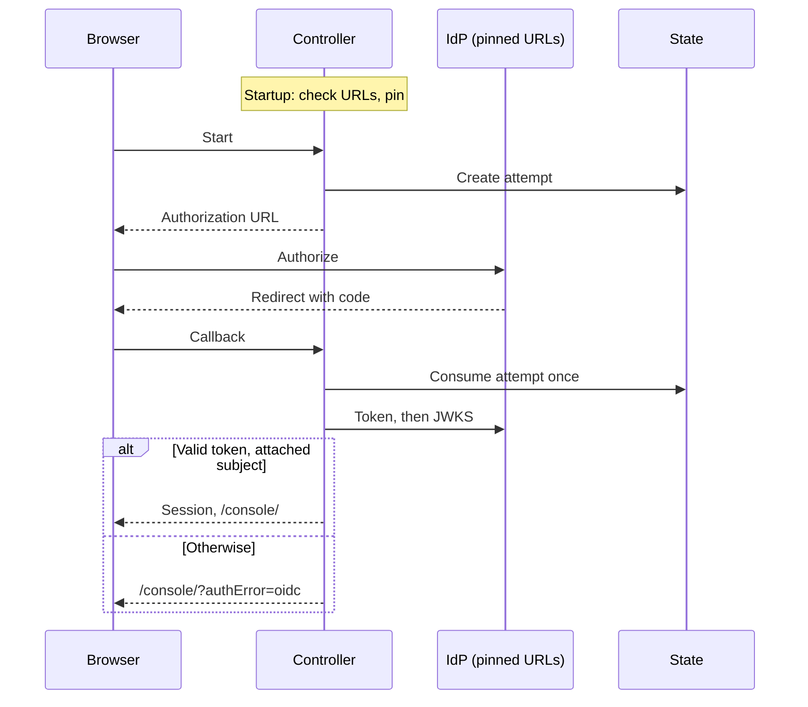

# Proposal: Generic OIDC sign-in for existing accounts

- **ID:** RFC-0001
- **Owner:** rclarke0 (proposal). Auth design review: freeqaz. Scope and release: kevinlin-openai.
- **Created:** 2026-09-30
- **Last updated:** 2026-10-01
- **RFC PR:** [#731][pr-731]; implementation [#790][pr-790], stacked on it
- **Related:** [#729][issue-729]; SSO/SCIM stays in the 1.0 backlog ([#82][issue-82], [#92][issue-92]);
  Google sign-in [PR #594][pr-594]; [RFC-0007](0007-human-federated-sign-in/index.md).
- **Source baseline:** `main` at `ccf5d79b`; source links are pinned to it. Details may change as
  the implementation lands in the stacked PR; this document follows the code, not the reverse.

## Summary

Add one operator-configured provider, `oidc`, to the guarded profile. It runs the existing
Google authorization-code flow (PKCE, nonce, ID-token checks) against a single configured
issuer with four pinned URLs. An administrator attaches a person's exact `(iss, sub)` to an
existing account; sign-in admits only that account. Nothing is provisioned or mapped.

## Motivation

A team using Auth0, Okta, Entra ID or Keycloak wants to sign in to the Console with that
identity provider (IdP). OCC offers password, GitHub and Google sign-in and states that generic
OIDC is unsupported ([authentication.md:15][ref-unsupported]). Google sign-in is already an
OIDC flow, but its issuer and endpoints are constants ([google.ts:10-15][g-const]).
RFC-0007 left other providers to a future spec ([scope](0007-human-federated-sign-in/index.md#scope));
this is that spec, limited to sign-in.

## Non-goals

Provisioning, just-in-time accounts or signup; group, role or claim mapping; SCIM; more than
one issuer, including multi-tenant issuers such as Entra ID `common`; SAML; tokens as API
credentials; IdP-driven logout; runtime discovery. The guarded profile's prerequisites are
unchanged.

## Proposal

### Configuration

| Variable (API only)                    | Helm `auth.oidc`              | Rule                                                               |
| -------------------------------------- | ----------------------------- | ------------------------------------------------------------------ |
| `OCC_AUTH_OIDC_ISSUER`                 | `issuer`                      | The exact `iss` string, compared byte for byte.                    |
| `OCC_AUTH_OIDC_AUTHORIZATION_URL`      | `authorizationUrl`            | Browser redirect target; never fetched.                            |
| `OCC_AUTH_OIDC_TOKEN_URL`, `_JWKS_URL` | `tokenUrl`, `jwksUrl`         | Fetched by the controller.                                         |
| `OCC_AUTH_OIDC_CLIENT_ID`, `_SECRET`   | Secret keys, as `auth.google` | Required; a dedicated Secret, distinct from GitHub's and Google's. |
| `OCC_AUTH_OIDC_TOKEN_AUTH`             | `tokenAuth`                   | Optional: `client_secret_post` (default) or `client_secret_basic`. |
| `OCC_AUTH_OIDC_DISPLAY_NAME`           | `displayName`                 | Optional label, 1–40 printable characters; default single sign-on. |

Required values are all or none; a partial set fails startup, as for Google
([google.ts:33-43][g-config]), and Helm and the profile renderer refuse the same inputs
([\_helpers.tpl:42-45][helm-google], [render-installation-profile.mjs:384-412][profile-render]).
The recovery user ID stays required ([auth/index.ts:97-124][login-config]). Operators copy
the values from the IdP's discovery document.

| IdP      | Values that fit the rules below                                                                                                                                              |
| -------- | ---------------------------------------------------------------------------------------------------------------------------------------------------------------------------- |
| Entra ID | Tenant **v2** only: `https://login.microsoftonline.com/<tenant>/v2.0`, `/oauth2/v2.0/{authorize,token}`, `/discovery/v2.0/keys`. The v1 issuer `sts.windows.net` is refused. |
| Okta     | Org server `/oauth2/v1/…` or a custom server `/oauth2/<id>/v1/…`; one host either way.                                                                                       |
| Auth0    | Issuer `https://<tenant>.auth0.com/` (trailing slash) or the custom domain for all four values; the application must sign with RS256.                                        |
| Keycloak | `/realms/<realm>` and `/protocol/openid-connect/{auth,token,certs}` behind a TLS proxy on 443; a confidential client.                                                        |

### Endpoint trust

The four URLs are operator configuration, not request input: nothing at request time chooses
a host. At startup each must be `https:` on port 443, with no userinfo, query or fragment, a
DNS name rather than an IP address, and the issuer's host. The issuer is written without a
port, even `:443`, because `iss` is compared with it as written. `ProviderEndpoint` is a
compile-time union ([provider-transport.ts:29-34][pt-endpoint]); `providerJSON` also
accepts a `PinnedEndpoint` that only the OIDC parser constructs. That is code discipline,
not a runtime boundary: pinning bounds host names, not DNS answers. Addresses are bounded by
the chart's OIDC egress NetworkPolicy on TCP 443 from `auth.oidc.egressCidrs`, defaulting to
any address like Google's ([networkpolicies.yaml:236-253][np-google]) with `169.254.0.0/16`
excepted. The ten-second deadline ([google.ts:214-216][g-deadline]), `redirect: "error"` and
the 64 KiB per-response limit ([provider-transport.ts:9-81][pt-read]) stay. TLS trust is
Node's default store; a private CA needs `NODE_EXTRA_CA_CERTS` on the API Pod.

### Identity and enrollment

The provider instance is `oidc:<sha256(issuer + "\0" + clientId)>`. GitHub and Google key on
the client ID alone ([github.ts:198][gh-instance], [github.ts:212][g-instance]); including the
issuer makes each method an exact `(iss, sub)` pair, unique per instance
([0008:58][db-unique]). The attempt identity also hashes the client secret, so rotating the
secret keeps enrollment and voids pending attempts, as for Google.

The subject is an opaque string matching `^[\x21-\x7E]{1,255}$`, the rule Google uses
([google.ts:97][g-sub]), within the 512-character column ([0008:52][db-length]). Auth0
(`auth0|…`), Okta and Keycloak subjects fit and are visible in each admin console. Entra ID's
`sub` is pairwise per application and not shown in the portal; see the open questions.

`POST /api/auth/accounts/:userId/providers/oidc` with `{subject, expectedVersion}` joins the
account operations ([index.ts:3798-3812][account-ops]) under unchanged rules: a human session,
exact `Origin`, Installation `administer`, and every IAM grant of the target account's
Principal ([index.ts:3677][covers]). Attach advances the version and ends the account's
sessions ([human-authentication.ts:797-840][attach-state]). Statuses match the Google route:
`409` when OIDC is off, the version is stale or the account is disabled; a subject attached
elsewhere is refused as `404` today ([errors.ts:378-383][errors]). Account creation accepts
only `github.subject` ([index.ts:4278][create-account]), so OIDC identities are attached
afterwards.

The callback admits only an attached (instance, subject) pair
([human-authentication.ts:545-562][snapshot]); anything else is audited as
`EXTERNAL_IDENTITY_REJECTED` and creates no account. Only the `openid` scope is requested and
email is never read. A brokering IdP can give one person several subjects; only attached
ones sign in.

Changing the issuer or client ID makes a new instance: administrators attach again and
detach stale methods. A session authenticates only while its sign-in method's instance is
configured, so an issuer or client change, or removing the provider, ends the old instance's
sessions on their next use, audited as `authentication.session.end`. Other sessions end at
detach (version bump) or expiry, eight hours at most. OCE does not learn when an IdP
disables someone, so offboarding also means detaching or disabling in OCE. Sign-out is
local: while the IdP session lives, one click signs in again.

### ID-token checks

Google's verifier ([google.ts:132-205][g-verify]) generalised, with the contract stated:
`iss` equals the configured issuer exactly; `alg` is `RS256` and `kid` names an RSA key of at
least 2,048 bits in the JWKS fetched for this callback, a floor main lacks
([google.ts:109-127][g-key]); `none`, `HS*` and the header members `jwk`, `jku`, `x5c`, `x5u`
and `crit` are refused;
`aud` is the client ID alone, as a string or a one-element list, and `azp` equals it when
present. The configured client is the only trusted audience, so a token naming any other
audience is refused, as [OIDC Core 3.1.3.7][oidc-validation] requires; main's Google verifier
accepts an extra audience when `azp` names the client, and the shared verifier refuses it for
Google too. The nonce is the HMAC of the one-use, browser-bound state; `exp > now` with no leeway; `iat` within
`[now − 3600 s, now + 60 s]`; `nbf`, which Entra emits and main ignores, is refused when more
than 60 s ahead; the subject is bounded as above. The JWKS is fetched on every callback with no
cache ([google.ts:233][g-jwks]), a decision: rotation needs no restart and a JWKS outage
fails closed. `hd`, email, `auth_time`, `acr` and `amr` are not checked; multi-factor policy
belongs to the IdP.

### Routes and Console

`/api/auth/providers/oidc/{start,callback,result}` use the shared helper
([github.ts:428][gh-helper]) and inherit the three per-step budgets, each 30 per minute and
four active per key with eight active globally ([github.ts:393-419][gh-budget]), PKCE, the
receipt, and the known-device cookie a successful callback sets
([github.ts:532-542][gh-known-device]), which grants that browser the password fallback
lane. Each provider has its own callback and consumes attempts under its own attempt
identity, so a code or receipt cannot cross providers; receipts stay unchanged. The
callback's code cap rises from 1,024 ([github.ts:479][gh-code-cap]) to 4,096 characters
for every provider, since Entra codes are long. Denial audits gain the provider name as
`details.provider` ([human-authentication.ts:1151][denied]). Failure redirects to `/console/?authError=oidc`.

`GET /api/auth/providers` adds `oidc` and `oidcSignIn: {label, authorizationUrl}`
([index.ts:3474-3504][discovery]); the schema is closed, so it changes. The route needs no
session, so the label and authorization URL are public, as starting a sign-in reveals them
anyway. `sessionBinding` becomes `github || google || oidc`: the Console records the attempt
and exchanges the receipt only when it is true ([console.mjs:471-473][console-binding]), so an
OIDC-only installation would otherwise let a returning tab adopt a cookie another tab
replaced. The Console checks GitHub and Google start URLs against a fixed origin and path ([console.mjs:31-51][console-table],
[console.mjs:463][console-check]); for OIDC it requires `https:` and the discovered
`authorizationUrl`, a consistency check rather than a trust boundary. `displayName` renders
as text, and the tab remembers it so messages after the IdP redirect name it. The name `oidc` names the protocol, so it stays correct if the IdP changes
([console.mjs:646-648][console-error]).

### Recovery and failure

- `OCC_AUTH_PASSWORD_SIGN_IN=recovery-only` accepts OIDC as the configured provider: the
  parser, the startup guard and its label ([auth/index.ts:1676-1680][startup-guard]), the
  chart checks ([\_helpers.tpl:16-19][helm-recovery]) and the coverage report
  `accountsWithoutExternalIdentity([...])` ([auth/index.ts:1773][coverage]), which must
  list the OIDC instance or every OIDC-only account is reported as uncovered.
- The recovery password path reads only State, and startup never contacts the IdP. An outage
  or blocked egress fails OIDC sign-in closed, audited as `PROVIDER_UNAVAILABLE`
  ([provider-transport.ts:20-27][pt-denial]); the recovery account still signs in
  ([external-sign-in.md:99][ref-outage]).
- Activation is one-way: removing OIDC when it is the only provider fails startup.

### Request lifecycle

Proposed flow; the browser steps are the implemented Google flow.

## Delivery and verification

1. Parser, pinned transport, generalised verifier (key floor, `nbf` and the single trusted
   audience apply to Google too)
   and provider instance: the provider unions in `github.ts`, `createHumanLogin`,
   `humanLoginConfiguration`, the startup guard and the coverage list.
2. Routes, attach, discovery, Console tables, Helm (`auth.oidc`, `controlPlane.oidc`,
   three-way Secret distinctness, egress checks, NetworkPolicy), profile renderer, and
   documentation: [authentication.md:15][ref-unsupported], the external sign-in reference, an
   OIDC guide with the IdP table and where each IdP shows `sub`, and the cheat sheets.
3. The live check, recorded in the implementation PR.

Proof:

- `oidc-id-token`: configuration refusals (HTTP, off-host URL, query, partial set) and token
  refusals (trailing-slash mismatch, `HS256`, `none`, a 1,024-bit, foreign or header-carried
  key, `aud`/`azp` including an extra untrusted audience, nonce, `exp`/`iat`/`nbf`, subject
  bounds). `sign-in-chart-parity` keeps chart and parser aligned.
- `oidc-login-transport`: only pinned URLs are fetched, with redirect refusal, the size limit
  and the deadline.
- `postgres-oidc-sign-in`, modelled on `postgres-google-sign-in`: attach and sign in; an
  unattached subject refused; a 4,000-character code; key rotation between callbacks; issuer
  change, which ends the old instance's session; recovery during an outage; the coverage
  report naming an OIDC-only account only before attach; disable; three providers side by side. The shared budgets are proven in
  `oidc-login-transport`.
- `postgres-oidc-tab-binding`: the GitHub tab-binding proof with only OIDC configured; a tab
  that signed in with OIDC signs out after another tab's password sign-in.

A `fakeOidc` fixture beside `fakeGoogle` ([production-sign-in.mjs:385][fake-google]) serves
the token and JWKS URLs with Auth0-shaped issuers and subjects; it proves OCE against its own
reading of OIDC, not any IdP's behaviour. The live check, against an Auth0 development tenant
(which the requesting team can provide) and a disposable Keycloak realm, covers the
authorization request, the real `iss` form, subjects, both token methods, key rotation,
NetworkPolicy egress and a Console sign-in. Okta and Entra ID stay unverified unless someone
runs them. [#790][pr-790] implements this RFC and records which of these checks ran.

## Rationale and alternatives

**Discovery once at startup** needs fewer settings but makes startup depend on the IdP: a
restart during an outage would fail, locking out recovery, or start without OIDC, and a
changed document would change trusted URLs without review. **Per-request discovery** lets
the IdP choose what the controller fetches. **Email matching** fails when addresses change
owners. **A JWKS cache** needs lifetime and unknown-`kid` rules; parity with Google is
simpler first.

## Open questions (blocking)

Each default stands, so implementation can proceed, unless the owner overrules it.

| Question                                                                 | Owner           | Proposed default                                                                                                                                                                     |
| ------------------------------------------------------------------------ | --------------- | ------------------------------------------------------------------------------------------------------------------------------------------------------------------------------------ |
| Sponsor this in 0.x, apart from SSO/SCIM, in the published image         | kevinlin-openai | Yes; the non-goals stay binding.                                                                                                                                                     |
| Endpoint trust: is operator-configured, host-pinned egress the boundary? | freeqaz         | Yes. No DNS-answer policy; `egressCidrs` narrows addresses; the link-local range is excepted by default; private CAs are out of scope for the first PR.                              |
| Entra ID: subjects are pairwise and invisible in the portal              | freeqaz         | Entra ships unverified. The guide documents where Okta, Auth0 and Keycloak show `sub`; an opt-in `subjectClaim: oid` is a follow-up. Unattached subjects are never listed to anyone. |
| Sessions after an issuer or client change                                | freeqaz         | Resolved: `currentSession` admits an external session only while its GitHub, Google or OIDC instance is configured. Detaching stale methods remains the cleanup.                     |

Defaults unless overruled (not blocking): ports other than 443 and extra hosts are refused
until an IdP needs them; `ES256`/`PS256` wait, symmetric algorithms never; `exp` keeps zero
leeway; the JWKS stays uncached; the code cap is 4,096; denial audits carry the provider name.

## References

[Authentication](../../docs/reference/authentication.md),
[external sign-in](../../docs/reference/authentication/external-sign-in.md),
[Google sign-in guide](../../docs/guides/deploy/google-sign-in.md),
[RFC-0007](0007-human-federated-sign-in/index.md); source links above.

[pr-731]: https://github.com/openclaw/openclaw-enterprise/pull/731
[oidc-validation]: https://openid.net/specs/openid-connect-core-1_0.html#IDTokenValidation
[console-binding]: https://github.com/openclaw/openclaw-enterprise/blob/ccf5d79bd377d11d9e6ce66117839aa0e538fa19/apps/controller/src/console/console.mjs#L471-L473
[pr-790]: https://github.com/openclaw/openclaw-enterprise/pull/790
[issue-729]: https://github.com/openclaw/openclaw-enterprise/issues/729
[issue-82]: https://github.com/openclaw/openclaw-enterprise/issues/82
[issue-92]: https://github.com/openclaw/openclaw-enterprise/issues/92
[pr-594]: https://github.com/openclaw/openclaw-enterprise/pull/594
[ref-unsupported]: https://github.com/openclaw/openclaw-enterprise/blob/ccf5d79bd377d11d9e6ce66117839aa0e538fa19/docs/reference/authentication.md#L15
[ref-outage]: https://github.com/openclaw/openclaw-enterprise/blob/ccf5d79bd377d11d9e6ce66117839aa0e538fa19/docs/reference/authentication/external-sign-in.md#L99
[g-const]: https://github.com/openclaw/openclaw-enterprise/blob/ccf5d79bd377d11d9e6ce66117839aa0e538fa19/apps/controller/src/auth/google.ts#L10-L15
[g-config]: https://github.com/openclaw/openclaw-enterprise/blob/ccf5d79bd377d11d9e6ce66117839aa0e538fa19/apps/controller/src/auth/google.ts#L33-L43
[g-sub]: https://github.com/openclaw/openclaw-enterprise/blob/ccf5d79bd377d11d9e6ce66117839aa0e538fa19/apps/controller/src/auth/google.ts#L97
[g-key]: https://github.com/openclaw/openclaw-enterprise/blob/ccf5d79bd377d11d9e6ce66117839aa0e538fa19/apps/controller/src/auth/google.ts#L109-L127
[g-verify]: https://github.com/openclaw/openclaw-enterprise/blob/ccf5d79bd377d11d9e6ce66117839aa0e538fa19/apps/controller/src/auth/google.ts#L132-L205
[g-deadline]: https://github.com/openclaw/openclaw-enterprise/blob/ccf5d79bd377d11d9e6ce66117839aa0e538fa19/apps/controller/src/auth/google.ts#L214-L216
[g-jwks]: https://github.com/openclaw/openclaw-enterprise/blob/ccf5d79bd377d11d9e6ce66117839aa0e538fa19/apps/controller/src/auth/google.ts#L233
[pt-read]: https://github.com/openclaw/openclaw-enterprise/blob/ccf5d79bd377d11d9e6ce66117839aa0e538fa19/apps/controller/src/auth/provider-transport.ts#L9-L81
[pt-denial]: https://github.com/openclaw/openclaw-enterprise/blob/ccf5d79bd377d11d9e6ce66117839aa0e538fa19/apps/controller/src/auth/provider-transport.ts#L20-L27
[pt-endpoint]: https://github.com/openclaw/openclaw-enterprise/blob/ccf5d79bd377d11d9e6ce66117839aa0e538fa19/apps/controller/src/auth/provider-transport.ts#L29-L34
[gh-instance]: https://github.com/openclaw/openclaw-enterprise/blob/ccf5d79bd377d11d9e6ce66117839aa0e538fa19/apps/controller/src/auth/github.ts#L198
[g-instance]: https://github.com/openclaw/openclaw-enterprise/blob/ccf5d79bd377d11d9e6ce66117839aa0e538fa19/apps/controller/src/auth/github.ts#L212
[gh-budget]: https://github.com/openclaw/openclaw-enterprise/blob/ccf5d79bd377d11d9e6ce66117839aa0e538fa19/apps/controller/src/auth/github.ts#L393-L419
[gh-helper]: https://github.com/openclaw/openclaw-enterprise/blob/ccf5d79bd377d11d9e6ce66117839aa0e538fa19/apps/controller/src/auth/github.ts#L428
[gh-code-cap]: https://github.com/openclaw/openclaw-enterprise/blob/ccf5d79bd377d11d9e6ce66117839aa0e538fa19/apps/controller/src/auth/github.ts#L479
[gh-known-device]: https://github.com/openclaw/openclaw-enterprise/blob/ccf5d79bd377d11d9e6ce66117839aa0e538fa19/apps/controller/src/auth/github.ts#L532-L542
[login-config]: https://github.com/openclaw/openclaw-enterprise/blob/ccf5d79bd377d11d9e6ce66117839aa0e538fa19/apps/controller/src/auth/index.ts#L97-L124
[startup-guard]: https://github.com/openclaw/openclaw-enterprise/blob/ccf5d79bd377d11d9e6ce66117839aa0e538fa19/apps/controller/src/auth/index.ts#L1676-L1680
[coverage]: https://github.com/openclaw/openclaw-enterprise/blob/ccf5d79bd377d11d9e6ce66117839aa0e538fa19/apps/controller/src/auth/index.ts#L1773
[discovery]: https://github.com/openclaw/openclaw-enterprise/blob/ccf5d79bd377d11d9e6ce66117839aa0e538fa19/apps/controller/src/index.ts#L3474-L3504
[covers]: https://github.com/openclaw/openclaw-enterprise/blob/ccf5d79bd377d11d9e6ce66117839aa0e538fa19/apps/controller/src/index.ts#L3677
[account-ops]: https://github.com/openclaw/openclaw-enterprise/blob/ccf5d79bd377d11d9e6ce66117839aa0e538fa19/apps/controller/src/index.ts#L3798-L3812
[create-account]: https://github.com/openclaw/openclaw-enterprise/blob/ccf5d79bd377d11d9e6ce66117839aa0e538fa19/apps/controller/src/index.ts#L4278
[errors]: https://github.com/openclaw/openclaw-enterprise/blob/ccf5d79bd377d11d9e6ce66117839aa0e538fa19/apps/controller/src/http/errors.ts#L378-L383
[console-table]: https://github.com/openclaw/openclaw-enterprise/blob/ccf5d79bd377d11d9e6ce66117839aa0e538fa19/apps/controller/src/console/console.mjs#L31-L51
[console-check]: https://github.com/openclaw/openclaw-enterprise/blob/ccf5d79bd377d11d9e6ce66117839aa0e538fa19/apps/controller/src/console/console.mjs#L463
[console-error]: https://github.com/openclaw/openclaw-enterprise/blob/ccf5d79bd377d11d9e6ce66117839aa0e538fa19/apps/controller/src/console/console.mjs#L646-L648
[snapshot]: https://github.com/openclaw/openclaw-enterprise/blob/ccf5d79bd377d11d9e6ce66117839aa0e538fa19/packages/occ/src/state/human-authentication.ts#L545-L562
[attach-state]: https://github.com/openclaw/openclaw-enterprise/blob/ccf5d79bd377d11d9e6ce66117839aa0e538fa19/packages/occ/src/state/human-authentication.ts#L797-L840
[denied]: https://github.com/openclaw/openclaw-enterprise/blob/ccf5d79bd377d11d9e6ce66117839aa0e538fa19/packages/occ/src/state/human-authentication.ts#L1151
[db-length]: https://github.com/openclaw/openclaw-enterprise/blob/ccf5d79bd377d11d9e6ce66117839aa0e538fa19/migrations/0008_better_auth_sessions.sql#L52
[db-unique]: https://github.com/openclaw/openclaw-enterprise/blob/ccf5d79bd377d11d9e6ce66117839aa0e538fa19/migrations/0008_better_auth_sessions.sql#L58
[helm-recovery]: https://github.com/openclaw/openclaw-enterprise/blob/ccf5d79bd377d11d9e6ce66117839aa0e538fa19/deploy/helm/openclaw-enterprise/templates/_helpers.tpl#L16-L19
[helm-google]: https://github.com/openclaw/openclaw-enterprise/blob/ccf5d79bd377d11d9e6ce66117839aa0e538fa19/deploy/helm/openclaw-enterprise/templates/_helpers.tpl#L42-L45
[np-google]: https://github.com/openclaw/openclaw-enterprise/blob/ccf5d79bd377d11d9e6ce66117839aa0e538fa19/deploy/helm/openclaw-enterprise/templates/networkpolicies.yaml#L236-L253
[profile-render]: https://github.com/openclaw/openclaw-enterprise/blob/ccf5d79bd377d11d9e6ce66117839aa0e538fa19/scripts/render-installation-profile.mjs#L384-L412
[fake-google]: https://github.com/openclaw/openclaw-enterprise/blob/ccf5d79bd377d11d9e6ce66117839aa0e538fa19/tests/helpers/production-sign-in.mjs#L385
