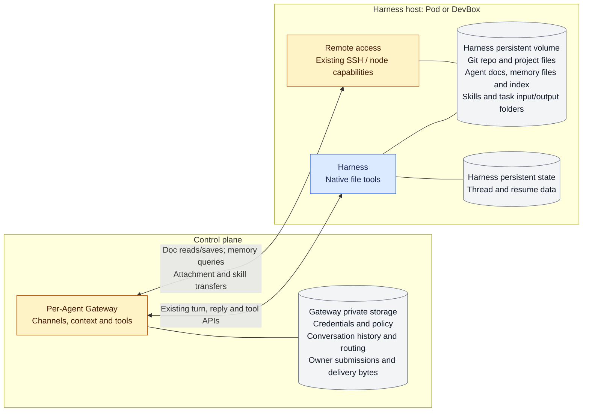
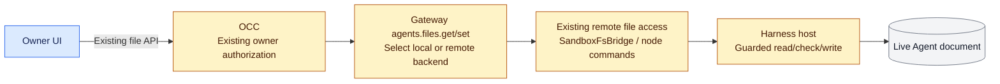
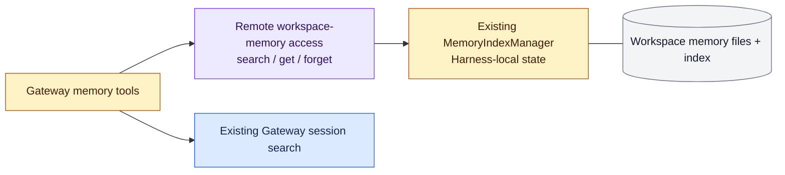

# Gateway–Harness storage split

> **Memory and Skills placement is superseded by [spec30](../plans/30-storage-split-integration.md).**
> The current proposal keeps the Memory index on Gateway; the original design below is preserved as history.

**Status: Proposed.** Covers [#76](https://github.com/openclaw/openclaw-enterprise/issues/76)
and [#89](https://github.com/openclaw/openclaw-enterprise/issues/89), building on
Russell Bryant's placement design in [#125](https://github.com/openclaw/openclaw-enterprise/pull/125).
This draft proposes data ownership and access patterns; it does not prescribe
every implementation interface. It carries forward initial-file and durability
ideas from his [#131](https://github.com/openclaw/openclaw-enterprise/pull/131),
while retaining live Agent-document editing.

## 1. Storage and the security boundary

**Keep the workspace on the Harness host. Give Gateway separate storage and
limited access across the boundary.** A compromised Harness must not gain access
to Gateway credentials or policy; Gateway must not treat the Harness filesystem
as its own trusted filesystem. Native Harness file tools continue to work locally.

| Baseline                                             | How both sides access files                                                                                     |
| ---------------------------------------------------- | --------------------------------------------------------------------------------------------------------------- |
| Existing internal deployment informing this proposal | Each host has local copies; synchronization propagates selected content.                                        |
| Current OCE Kubernetes code                          | Both Pods mount one RWX PVC for five [file categories][oce-storage]. This differs from the internal deployment. |
| Proposal                                             | Each side owns its storage; explicit requests replace shared paths and ongoing synchronization.                 |

Gray = storage; blue = reuse; yellow = adapt; purple = new capability, not a new service.
Gateway history supports chat and routing; Harness thread data supports resume.
The Harness resume database stays local; Gateway stores thread references.

| Cross-boundary need                                  | Allowed access                                                                                                    |
| ---------------------------------------------------- | ----------------------------------------------------------------------------------------------------------------- |
| Owner opens/saves Agent docs; Gateway builds context | Named documents on Harness storage. Bootstrap reads have a separate allowlist from owner writes.                  |
| Attachment input/output                              | Gateway writes admitted inputs and retrieves selected outputs in task-bound folders. Harness uses ordinary paths. |
| Memory search                                        | Gateway requests workspace-memory results; workspace files and index stay on the Harness host.                    |
| Skills                                               | Gateway receives an approved catalog; required bodies/scripts are available locally to the Harness.               |
| Harness calls a Gateway tool                         | Existing authenticated APIs return authorized results, never general access to Gateway storage.                   |

Bind endpoints to the exact Namespace, Agent and admitted revision. Enforce
operation/path/size limits using guarded file operations; UI and Harness input
cannot select arbitrary Gateway files or commands. Permitted outputs are
delivered normally; this limits access without claiming to detect unsafe content.

## 2. Agent documents: change the caller, reuse remote I/O

- **Reuse:** [OpenShell remote mode][openshell] already uses [SandboxFsBridge][bridge].
  The [SSH backend][ssh] can adopt an existing remote workspace without mirroring
  local files into it. This is a reference implementation; SSH is not a
  requirement of the storage split. The [file-transfer plugin][file-transfer]
  also provides node `file.fetch` / `file.write` commands; assess these existing
  paths before adding commands.
- **Change:** [Gateway file handlers][agent-files], identity and [bootstrap loading][bootstrap]
  still use local paths. Resolve the Agent's selected backend at those callers.
  Keep local OpenClaw behavior as the default. OCE retains its existing
  [file client][oce-files], four filenames (`AGENTS.md`, `SOUL.md`, `IDENTITY.md`,
  `USER.md`), 16 KiB limit and authorization. Runtime reads such as `BOOTSTRAP.md`
  and `MEMORY.md` do not expand owner editing permissions.
- **Live saves:** detect stale saves against the Harness copy and retain owner
  submissions on Gateway for recovery. Reject detected conflicts; a lost write
  acknowledgement remains an unknown outcome.
- **Concurrency limit:** this detects stale edits but cannot exclude arbitrary
  native shell writes between check and write. Tasks continue; a later Harness
  write may replace an owner save. Saving does not force an active model to reread
  the document or hot-reload mandatory policy.

A local component test carried 16 KiB documents through the bridge over
[`system.run`][node-exec] using a transport adapter. Enterprise endpoint selection
and authorization still need end-to-end verification.
File access should survive a stopped Harness; an unreachable host returns
unavailable, without a stale-copy fallback.

## 3. Files before Agent creation (#89)

The [current live API][oce-api] requires an active Agent revision and reachable
Gateway. OCC therefore needs to hold initial files before that runtime exists.

| Stage                | Ownership and behavior                                                                                                                                  |
| -------------------- | ------------------------------------------------------------------------------------------------------------------------------------------------------- |
| Before creation      | OCC stores authorized initial files, using the same four-document scope and size limit.                                                                 |
| First start          | Write the selected contents to the Harness workspace before execution. Initialization failure must be visible and prevent execution with missing files. |
| After initialization | The workspace holds the current content. Live edits use section 2; restart and redeploy do not overwrite it with initial files.                         |

Extend the existing [OCC resource lifecycle][oce-contracts] to support this flow.
Template reuse, version storage and database layout remain implementation choices.

## 4. Remaining consumers of the shared paths

### Memory

Keep the [existing index manager][memory-manager] with the files so its local
watcher sees native edits. Route [workspace-memory queries][memory-tools] to
the Harness host; this remote access is the missing capability in the audited
path. Session search stays on Gateway. Preserve source visibility and forgetting
across both stores, and report an unavailable workspace source explicitly.

### Attachments, skills and configuration

| Reuse                                                                            | Required adaptation                                                                                                    |
| -------------------------------------------------------------------------------- | ---------------------------------------------------------------------------------------------------------------------- |
| [`prepareWorkerTurnAttachments`][attachments]                                    | Adapt its stdin-capable transport and ownership checks; stage admitted inputs before starting the turn.                |
| [Codex remote media reader][outputs] / SSH bridge                                | Fetch selected task outputs; retain delivery bytes on Gateway. Use SSH/node when app-server is stopped.                |
| [Node skill catalog][skill-catalog] + [`transferSkillResources`][skill-transfer] | Bind approved roots, adapt transfer/cleanup, and verify native Harness discovery and execution.                        |
| [OCE configuration and plugin installation][oce-runtime]                         | Deliver side-specific config/assets. Gateway plugins remain trusted; Harness scripts/plugins stay on the Harness host. |

Mandatory policy updates require an applied-version acknowledgement and any
required restart before new turns; ordinary document edits do not.

## 5. Delivery

1. **Prototype:** disable sync for document and attachment paths; prove owner
   read/save and attachment upload → native Harness read → output delivery,
   including conflicts, denied paths and unavailable-host behavior.
2. **Complete consumers:** initial files, Memory and skills. Preserve live
   files across replacement, with only one active runtime writer.
3. **Integrate OCE:** change [PVCs, mounts, validation and cleanup][oce-storage]
   together. The [direct-Codex entrypoint][oce-runtime] starts app-server, not a
   node host; node transport requires image/startup changes. Remove each shared
   category only after its consumer works, including the old Gateway-session
   copy and generated-image paths.

**Decisions for review:** storage ownership and restricted access; live Agent-doc
editing; initial files applied once. Qualify transport choices during the prototype.
OpenClaw changes use opt-in remote routing; local behavior stays the default.
The prototype provides implementation feedback; OCE still needs its own real
deployment and replacement tests.

Source audit: OCE `b2658e0`; OpenClaw `9b99c61` (pinned reuse reference, not a
claim about the deployed runtime). Implementation will update
[file flows](../../docs/flows/workspace-files.md), [Agent reference](../../docs/reference/agents.md),
[Harness execution](../../docs/reference/harness-execution.md), and the accepted
[platform design](../../docs/design.md).

[oce-storage]: https://github.com/openclaw/openclaw-enterprise/blob/b2658e0f5c71d08307f0e4bce6e68d9774387c51/apps/controller/src/drivers/compute/kubernetes/index.ts#L264
[oce-files]: https://github.com/openclaw/openclaw-enterprise/blob/b2658e0f5c71d08307f0e4bce6e68d9774387c51/apps/controller/src/gateway/workspace-files-client.ts#L20
[oce-api]: https://github.com/openclaw/openclaw-enterprise/blob/b2658e0f5c71d08307f0e4bce6e68d9774387c51/apps/controller/src/index.ts#L1806
[oce-contracts]: https://github.com/openclaw/openclaw-enterprise/blob/b2658e0f5c71d08307f0e4bce6e68d9774387c51/packages/contracts/src/index.ts#L274
[oce-runtime]: https://github.com/openclaw/openclaw-enterprise/blob/b2658e0f5c71d08307f0e4bce6e68d9774387c51/apps/controller/src/drivers/compute/kubernetes/runtime-entrypoints.ts#L613
[openshell]: https://github.com/openclaw/openclaw/blob/9b99c6113fe03bde15af4539fd6a9692c9fa252c/extensions/openshell/src/backend.ts#L370
[bridge]: https://github.com/openclaw/openclaw/blob/9b99c6113fe03bde15af4539fd6a9692c9fa252c/src/agents/sandbox/remote-fs-bridge.ts#L47
[ssh]: https://github.com/openclaw/openclaw/blob/9b99c6113fe03bde15af4539fd6a9692c9fa252c/src/agents/sandbox/ssh-backend.ts#L167
[agent-files]: https://github.com/openclaw/openclaw/blob/9b99c6113fe03bde15af4539fd6a9692c9fa252c/src/gateway/server-methods/agents.ts#L1557
[bootstrap]: https://github.com/openclaw/openclaw/blob/9b99c6113fe03bde15af4539fd6a9692c9fa252c/src/agents/workspace.ts#L1226
[node-exec]: https://github.com/openclaw/openclaw/blob/9b99c6113fe03bde15af4539fd6a9692c9fa252c/src/node-host/invoke-types.ts#L26
[file-transfer]: https://github.com/openclaw/openclaw/blob/9b99c6113fe03bde15af4539fd6a9692c9fa252c/extensions/file-transfer/index.ts#L42
[memory-manager]: https://github.com/openclaw/openclaw/blob/9b99c6113fe03bde15af4539fd6a9692c9fa252c/extensions/memory-core/src/memory/manager.ts
[memory-tools]: https://github.com/openclaw/openclaw/blob/9b99c6113fe03bde15af4539fd6a9692c9fa252c/extensions/memory-core/src/tools.ts
[attachments]: https://github.com/openclaw/openclaw/blob/9b99c6113fe03bde15af4539fd6a9692c9fa252c/src/gateway/worker-environments/worker-turn-attachments.ts#L86
[outputs]: https://github.com/openclaw/openclaw/blob/9b99c6113fe03bde15af4539fd6a9692c9fa252c/extensions/codex/src/app-server/remote-workspace-media.ts
[skill-catalog]: https://github.com/openclaw/openclaw/blob/9b99c6113fe03bde15af4539fd6a9692c9fa252c/src/skills/runtime/remote-skills.ts
[skill-transfer]: https://github.com/openclaw/openclaw/blob/9b99c6113fe03bde15af4539fd6a9692c9fa252c/src/gateway/worker-environments/skill-resource-transfer.ts#L106
