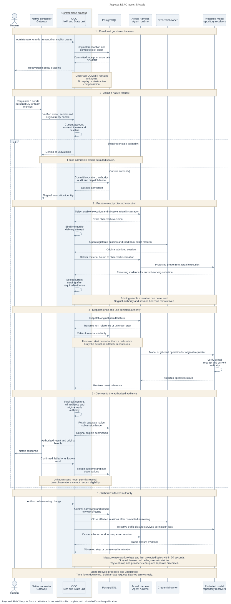

# RBAC architecture

Read the [current-source and release-scope amendment](index.md#current-source-amendment--2026-09-24)
before applying this original proposal. Its broader invocation scope is deferred
past 0.x; the requirements below are not implementation acceptance.

The [proposal](index.md) connects existing owners so an ordinary human
request can acquire exactly its admitted authority. The ordering below is required
by the design. It is not evidence of a composed or installed implementation.

## Components and dependencies

OCC coordinates enrollment, policy administration and invocation. The selected IAM
Driver evaluates exact actions and owns policy semantics. Authentication resolves a
human Principal or enrolled connector ServicePrincipal. State owns the original
transaction, resource parentage, durable invocation and authority registration.
There is no second account store, repository ACL store, invocation queue or audit
journal introduced by this proposal.

The connector Gateway verifies the native event and retains the original reply
handle. The selected Compute and Harness owners connect OCC to the private Agent
Gateway and actual runtime. Compute owns observed execution facts. State owns
authoritative current-serving selection, serialized with Compute and predecessor
withdrawal. Identity owns verification and currentness interpretation through its
execution lifecycle, proposed in the unmerged basic Agent identity MVP spec.
Egress owns the accepting transport and mandatory protected routes.
Repository and model credential owners own acquisition, delivery and settlement.
Audit records safe facts through its existing State owner.

[Authorization at the earlier source snapshot](https://github.com/openclaw/openclaw-enterprise/blob/e9766f35a25afa240ee109b41a6ef821fb68687e/docs/reference/authorization.md)
provides exact-action evaluation. This RFC's proposed
[policy units](interfaces.md#policy-administration) do not establish these joins.
That snapshot’s [workspace selection](https://github.com/openclaw/openclaw-enterprise/blob/e9766f35a25afa240ee109b41a6ef821fb68687e/packages/occ/src/index.ts#L947-L962)
uses broader `read/operate` actions. The selected content cutover needs real
consumers, not just new permission names.

## Original State transaction

Use one explicit `READ COMMITTED` transaction for policy/account mutation and
protected currentness admission. Snapshot-only reads can retain their existing
read-only isolation. Select read or write intent before taking locks. Preserve
this order:

1. Acquire the canonical Installation authority prefix.
2. Acquire every required account and session-currentness guard. Sort multiple
   identifiers, include the complete changed-account set and additional recovery
   accounts, and retain original account-owner evidence.
3. Lock all six native policy tables in order: `iam_identities`, `iam_roles`,
   `iam_groups`, `iam_group_memberships`, `iam_access_bindings`, then
   `iam_restrictions`. Readers use `SHARE`. Writers use `SHARE ROW EXCLUSIVE`, then
   policy-head `FOR UPDATE` and its revision comparison.
4. Lock exact protected resources and authority/withdrawal rows.
5. Acquire retention/disclosure locks and write mandatory audit.

The account guard uses the existing Installation-scoped
`native-account-security-v1` advisory-key domain. Protected readers take shared
mode. Account/security changes and policy changes affecting the recovery set take
exclusive mode at entry. The same guard serializes local recovery. A new policy
head or advisory key alone cannot exclude existing policy-table writers.

All writers participate: bootstrap, grant-free enrollment, Agent ServicePrincipal
creation, creation ownership, deployment, legacy seed/append and migration/operator
DML. Session issuance and logout take the account owner's Installation guard before
account/session rows. Worker reconciliation retains its queue claim/lease fencing
and acquires admission guards before protected resources when it needs a current
policy decision. History disclosure and retention consume this same prefix before
their own resource/retention locks. Existing credential-session contracts remain
with their owner until an explicitly reviewed stronger join.

No late read-to-write upgrade, nested commit or unrestricted application SQL
mutation is allowed. Creation must select policy write intent before its existing
Namespace/Agent lock. Controlled membership removal requires deliberate SQL and
privilege review because existing membership immutability blocks deletion.

Original State issues live read/write tokens. The selected Driver must authenticate
that tokens, candidates and recovery evidence belong to the exact live owner,
Driver, store and Installation. Copied, foreign or expired handles reject. A read
unit cannot become a writer after protected locks. These are runtime custody
checks, not authority supplied by the caller's object fields.

Authentication supplies current account facts under its guards. IAM evaluates the
complete candidate policy, including Groups and deny Restrictions. Joint changes
must preserve at least one enabled, usable local-password human Principal with
effective Installation `administer`. External-only accounts and service identities
cannot satisfy this recovery invariant. Complete multi-account repair must include
all affected accounts in the sorted evidence set.

Current authorization, mutation, monotonic revision, digest/receipt, audit and
narrowing intent commit together. Failed policy acceptance poisons the transaction.
Admitted repository work drains before COMMIT. Account-only narrowing may advance
account version without advancing policy revision. Acceptance inside the unit
returns a prepared receipt. Only original State's acknowledged commit or retained
commit evidence establishes the [committed outcome](interfaces.md#policy-outcomes-and-recovery).

Invocation/deployment admission, session opening and renewal register every usable
authority under the policy barrier before commit. A racing revoke either denies
that admission or includes it in withdrawal. External credentials open afterward.
Recovery cannot create unindexed authority or revive withdrawn generations.
Uncertain COMMIT stays unknown until retained evidence resolves it, without replay
or destructive compensation.

## Request lifecycle

Proposed lifecycle, with time flowing downward. Solid sequence arrows are requests
and dashed sequence arrows are replies. The complete path remains unqualified.
[Editable diagram source](request-lifecycle.mmd).

1. An administrator performs [grant-free enrollment](interfaces.md#account-lifecycle-consumption)
   and explicit [policy grants](interfaces.md#policy-administration) in the original
   State transaction. Creation and deployment receive only approved exact grants.
2. The enrolled connector submits [verified native facts](interfaces.md#connector-admission).
   OCC resolves current context, checks `invoke` and baseline eligibility, and
   commits the [invocation](interfaces.md#agent-invocation), audit and dispatch fence.
3. Select a usable execution and complete its required
   [protected handoff](invocation-and-content.md#protected-operation-handoff) before
   the real Harness dispatches the admitted turn. Preserve the observed incarnation,
   original requester and exact repository assignment.
4. Before native submission, OCC rechecks current content permission, full audience
   eligibility and original reply authority. A separate durable submission fence
   prevents a second send after restart or uncertainty.
5. Committed narrowing refuses new work and results. The protective worker closes
   affected traffic and records [withdrawal outcomes](security.md#withdrawal-and-failure)
   without depending on the withdrawn human's ordinary permissions.

## Profile admission and availability

Installation `compatibility` preserves existing tools, authentication, IAM,
sessions, credentials and administrator setup. It claims neither verified
execution nor bounded withdrawal. Protected `enforced` admission requires its
installed capabilities and denies on missing evidence or dependency outage without
downgrade. Invocation callers cannot select compatibility.

Security-profile edits require privileged configuration and audit. The server
selects route/profile semantics and enforces narrow content actions. Unsupported
or ambiguous combinations deny. Legacy `read/operate` cannot substitute for
protected content checks.

[gVisor runtime](https://github.com/openclaw/openclaw-enterprise/pull/248),
[egress C1](https://github.com/openclaw/openclaw-enterprise/pull/249) and complete
[protected identity](https://github.com/openclaw/openclaw-enterprise/pull/247) are
separate qualification checkpoints. Their combination must be explicitly offered
and proved. Changed requirements require fresh revision admission. Pinned Compute
implementation identity and existing enforced requirements survive default edits.

**Proposal, Installation/product decision pending:** separate prospective defaults
from explicit audited protective withdrawal of existing weaker admissions. Owners
must fix finite combinations, affected revisions and sessions, the effective event
and renewal eligibility. There is no implied grace period or stronger assurance.
[Delivery](delivery.md#decisions-and-follow-ups) retains this decision as open.
