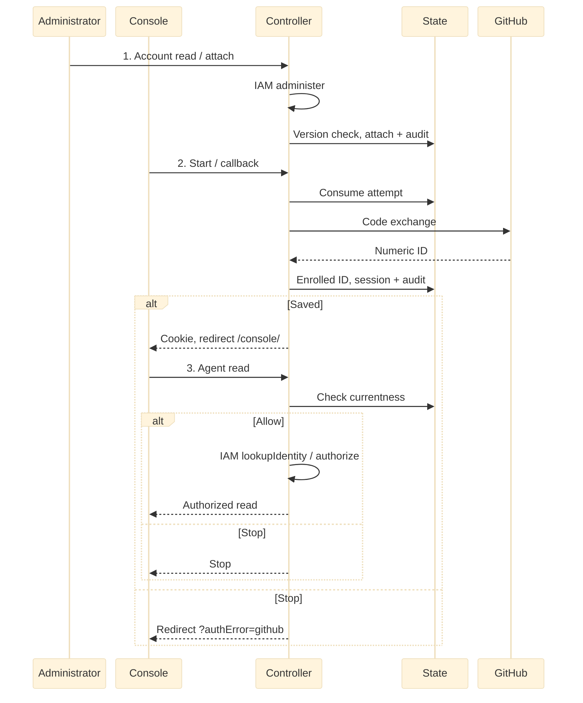

# RFC: GitHub sign-in for existing accounts

- **Status:** Implementing. M1 to M4 are on `main`, implemented by [PR #305](https://github.com/openclaw/openclaw-enterprise/pull/305), [#520](https://github.com/openclaw/openclaw-enterprise/pull/520), [#521](https://github.com/openclaw/openclaw-enterprise/pull/521) and [#522](https://github.com/openclaw/openclaw-enterprise/pull/522). Untagged statements describe `main`; the M1.1 tag marks deferred work and covers its paragraph or table row. Completed after live GitHub verification.
- **Owner:** freeqaz (PR #246).
- **Related:** [PR #305](https://github.com/openclaw/openclaw-enterprise/pull/305) (M1), [#522](https://github.com/openclaw/openclaw-enterprise/pull/522) (M2), [#521](https://github.com/openclaw/openclaw-enterprise/pull/521) (M3), [#520](https://github.com/openclaw/openclaw-enterprise/pull/520) (M4) and [PR #509](https://github.com/openclaw/openclaw-enterprise/pull/509) (exact `Origin` on sign-out and every cookie-authenticated mutation).
- **Date:** 2026-09-22, amended below.

**2026-09-23 amendment:** Use the repository integration's GitHub App for sign-in, superseding the OAuth-App-only choice. Login uses the client ID and secret. Repository access retains its separate private-key consumer.

**2026-09-28 amendment:** Administrator-provisioned password accounts are the default onboarding path. GitHub is an optional add-on identity on the same account; every enabled account keeps its password. Account creation continues after activation (M1). Launch activates the guarded profile through the environment; running it without GitHub is deferred (M1.1). Forwarded client addresses are trusted only from configured proxies (M1). The 2026-09-27 mechanisms (stopped-maintenance enrollment, `auth:maintain`, attempt identifier, result receipt, `x-occ-session-key`, `sessionBinding` discovery, uncertain-outcome client rules) move to M2 and M3.

## Problem and decision

An Installation administrator creates an OpenClaw Enterprise (OCE) password account, its Principal and its grants in one transaction, and may attach the person's exact GitHub identity at creation or later. The person signs in with either method and reads an authorized Agent. Sign-in creates no account, link, IAM grant or repository access. Unknown or disabled identities are denied.

## Scope

One Installation and one serving controller, which the chart enforces with `Recreate`. Helm is the launch deployment path, behind ingress-nginx, an AWS load balancer or another proxy. The guarded profile requires PostgreSQL State with its restricted role, native IAM and one HTTPS origin. Excluded: self-service linking, providers other than GitHub and [Google](#google-sign-in) (future spec), password reset by email, and shared native administration with the guarded profile. Service keys retain precedence.

## Profiles: password default, optional GitHub, fallback

The environment and the database select one of three profiles:

- **legacy**: no `OCC_AUTH_GITHUB_*` variable and no recovery designation row. Password accounts, account creation, plain sessions, no account administration. Every fresh install runs here.
- **guarded with GitHub**: `OCC_AUTH_GITHUB_RECOVERY_USER_ID`, `OCC_AUTH_GITHUB_CLIENT_ID` and `OCC_AUTH_GITHUB_CLIENT_SECRET`, all three. State-guarded sessions, the admission limiter, `__Host-` cookies, eight-hour sessions, disablement, account administration and the GitHub routes. The first start records the recovery designation (activation). The launch profile.
- **guarded without GitHub** (M1.1): the designation row or the recovery ID alone selects the guarded profile; client ID and secret are set both or neither.

Startup fails on a partial variable set, an activated database without the GitHub variables, non-PostgreSQL State, a non-native IAM Driver, a shared cookie domain, production without HTTPS, or a recovery Principal that is missing or lacks Installation `administer`. Until M1.1 ships, keep the three variables set after activation: startup fails otherwise, and nothing reopens silently; `auth:maintain deactivate` is the supported return to the legacy profile. The recovery ID only seeds first activation; afterwards a differing value warns and each start re-checks the stored holder.

One account version and one disablement flag cover both methods. Password sign-in for every enabled account survives a GitHub outage, a blocked egress route or a misconfigured provider. After a client ID rotation, detach the stale GitHub methods; M1.1 also rejects GitHub-issued sessions of any other provider instance.

A controller older than PR #305 ignores disablement and session bindings. After activation the database refuses every session it tries to create, through a deferred constraint trigger in migration 0037. Sessions bound earlier expire within eight hours. Rollback to such an image is unsupported; it fails closed instead of silently re-admitting users.

## Contract

Better Auth runs in the controller. PostgreSQL State owns attempts, account and method currentness, sessions and audit. The controller's IAM Driver resolves identity to a Principal and authorizes each exact action. Normative: sign-in creates no account; identities match exactly; only administrators attach; the `Origin` rules in the table below hold; an unknown outcome returns `503`. Start, sign-in, session and providers bodies are extensible objects, and the callback may set additional short-lived HttpOnly cookies, so M2 stays additive.

### Helm setup and activation

Register `OCC_AUTH_BASE_URL` + `/api/auth/providers/github/callback` on the GitHub App. The chart values below configure the profile. A fresh install runs two phases: `helm install` with `auth.github.enabled: false` runs the legacy profile and creates the bootstrap administrator; read that user ID, then upgrade:

1. Create the `occ-github-login` Secret with `client-id` and `client-secret`.
2. Set `auth.recoveryUserId` to that user ID and `auth.github.enabled: true`. The chart then allows the API Pod TCP 443 egress to `0.0.0.0/0`; set `auth.github.egressCidrs` to the `web` and `api` ranges from `https://api.github.com/meta` to narrow it.
3. Behind a proxy, set `api.trustedProxy` (see [Sign-in admission](#sign-in-admission)).
4. Close the Ingress and stop identity writers.
5. Run `helm upgrade`. The API Deployment uses `Recreate`, so the old Pod stops first.
6. Startup records the designation, enrolls qualifying accounts, reports skipped ones in the audit event and log, and purges unbound sessions. A failure keeps the Ingress closed.
7. Verify password and GitHub sign-in through restricted access, then reopen the Ingress.

`helm rollback` past activation is unsupported; the pre-activation procedure lives in the [upgrade guide](../../../docs/guides/deploy/production-upgrade.md).

### Console sign-in and account administration

All paths begin with `/api/auth`. JSON results use the `{data, meta: {requestId}}` envelope.

| Operation                                 | Input and result                                                                                                                                                                                          |
| ----------------------------------------- | --------------------------------------------------------------------------------------------------------------------------------------------------------------------------------------------------------- |
| `GET /providers`                          | Returns `{github, sessionBinding}` booleans for the Console button.                                                                                                                                       |
| `POST /providers/github/start`            | Requires the exact configured `Origin` (`Sec-Fetch-Site`, when present, must be `same-origin`); returns `{url, attemptId}` and sets the attempt cookie. No provider override or return URL.               |
| `GET /providers/github/callback`          | `state` and `code` or `error` with the matching cookie; redirects to `/console/` or `/console/?authError=github`.                                                                                         |
| `POST /providers/github/result`           | `{attemptId}` with the exact configured `Origin` and the receipt cookie; returns that callback session's `sessionKey` once and issues no session.                                                         |
| `POST /sign-in/email`                     | Password sign-in. An `Origin`, when present, must match; a request without one is rejected only on `Sec-Fetch-Site: cross-site`. Admission is keyed by client address and email.                          |
| `POST /sign-out`                          | Revokes the cookie's session; audit commits before the cookie clears. Requires the exact configured `Origin` (a missing one is `403`); `Sec-Fetch-Site`, when present, must be `same-origin`.             |
| `GET /session`                            | Current session, or `null` (`data: null` in the envelope).                                                                                                                                                |
| `POST /accounts`                          | Installation `administer`; open before and after activation, creating user, credential, Principal and enrollment atomically; optional `github.subject` (`409` if GitHub is off or the identity is taken). |
| `GET /accounts/:userId`                   | Current `version`, `disabled`, `principalId` and `methods` (`methodId`, `providerId`, `subject`).                                                                                                         |
| `POST /accounts/:userId/providers/github` | `{subject, expectedVersion}`; attaches the numeric identity and invalidates sessions and proofs. `409` while the lane is off (M1.1).                                                                      |
| `POST .../methods/:methodId/detach`       | `{expectedVersion}`; removes one GitHub method. Refuses password and recovery methods.                                                                                                                    |
| `POST .../disable`, `.../enable`          | `{expectedVersion}`; blocks or restores sign-in, invalidating sessions and proofs. Disable refuses recovery.                                                                                              |
| `POST .../revoke`                         | `{expectedVersion}`; invalidates sessions and proofs, fresh sign-in allowed.                                                                                                                              |
| `GET`, `POST /recovery`                   | Reads and replaces the recovery designation with full rechecks.                                                                                                                                           |

Account read, attach, detach, disable, enable and revoke require Installation `administer` through the acting user's current human session; service keys do not qualify. The mutations require the exact configured `Origin` and, when `Sec-Fetch-Site` is present, `same-origin`, the rule every cookie-authenticated mutation inherits from PR #509. `expectedVersion` comes from a guarded read; a stale version returns `409 RESOURCE_CONFLICT`. Every method change bumps the version and purges sessions. The recovery password cannot be removed and its account cannot be disabled.

Console shows **Continue with GitHub** after discovery succeeds; password sign-in is always available. Callback consumes the browser-bound attempt once before exchange, including valid provider errors, uses S256 PKCE and fixed endpoints, reads the numeric ID and discards tokens. Client ID plus immutable numeric ID identifies the method; email, username, domain and organization confer no authority.

After session and audit commit, callback sets the session cookie and redirects to `/console/`. Failures redirect to `/console/?authError=github` with a generic message, no new cookie and no automatic retry.

GitHub lifecycle; password sign-in shares step 3. Commit must be confirmed; read requires current identity and IAM allow. [Source](request-lifecycle.mmd) and [SVG](request-lifecycle.svg).

### Sign-in admission

Admission is keyed: password attempts by client address and by email, 10 per minute and two active per key; GitHub start and callback by address, 30 per minute and four active. Global lanes cap only concurrency, four password and eight GitHub, with no per-minute ceiling because a proxy presents one address. A reserved recovery lane keyed by the recovery email admits 20 per minute, two active, one slot reserved. The table holds 4,096 entries. Denied attempts return `429` without an audit event at launch. Limits are process-local, hence one controller.

`OCC_AUTH_TRUSTED_PROXY_CIDRS`, `OCC_AUTH_TRUSTED_PROXY_PRESET` and, for `generic`, `OCC_AUTH_CLIENT_IP_HEADER` are off by default, so direct requests keep today's behavior. From a socket peer inside the CIDRs, protected routes accept forwarded headers instead of returning `403`, and the limiter keys on the client address from the header, walking `X-Forwarded-For` right to left past trusted addresses; a missing or malformed value falls back to the peer. From any other peer, protected routes still reject forwarded headers and the limiter keys on the peer. The forwarded address is used only for limiter keys, not authentication or authorization; Fastify `trustProxy` remains disabled. Helm renders them from `api.trustedProxy`: `preset` `ingress-nginx` (`X-Forwarded-For`), `aws` (`X-Forwarded-For` as appended by an ALB; an NLB that preserves the source address needs no preset) or `generic` (`clientAddressHeader`, for example `X-Real-IP`), each with `cidrs` naming the proxy Pods or subnets, never `/0`.

Attempts expire in five minutes and bind to one browser cookie; State caps 1,000 pending attempts per Installation; a new start evicts the oldest instead of failing. Provider calls share ten seconds, cap responses at 64 KiB and refuse redirects. Sessions last eight hours without refresh and use host-only Secure, HttpOnly, SameSite=Lax cookies. Revocation does not track GitHub suspension or stop Agents.

### Recovery and uncertain outcomes

State commits local effects and audit together, not IAM reads, GitHub calls or browser delivery. An unknown administrative commit returns `503 DEPENDENCY_UNAVAILABLE` stating the outcome is unknown, without replay or compensation; inspect before retrying. An administrator replaces the recovery designation online through `POST /recovery`. `auth:maintain` (PR #521) is implemented: with every writer stopped it activates, repairs enrollment, resets a lost recovery password, purges sessions and deactivates; see the [operator procedure](../../../docs/guides/deploy/auth-maintenance.md). Before activation, verify the designated account's local password and preserve that credential. Do not edit authentication rows ad hoc or roll back past activation.

## Google sign-in

**2026-09-29 amendment (G, branch `feat/google-sign-in-20260929`).** Google OpenID Connect is a second optional provider in the guarded profile, with the same rules: administrators attach an exact identity to an existing account, sign-in never creates or matches accounts, and password fallback and recovery are unchanged. Operator procedure: [Google sign-in](../../../docs/guides/deploy/google-sign-in.md).

- **Provider instance.** `google:<sha256(client ID)>`, mirroring `github:<sha256(client ID)>`; the method subject is the ID token's `sub`, never the email. A new client ID needs reattachment.
- **Shared endpoint code.** Start, callback and result run through one provider-parameterized helper in `apps/controller/src/auth/github.ts`, so `Origin` checks, PKCE `S256`, state, the `__Host-` binding cookie, the keyed limiter (one budget for both providers), `attemptId`, the receipt and the one-use result apply unchanged. Routes are `/api/auth/providers/google/{start,callback,result}` and `POST /api/auth/accounts/:userId/providers/google`; discovery adds `google`.
- **Nonce.** `base64url(HMAC-SHA256(OCC_AUTH_SECRET, "oce-google-nonce\0" + state))`, sent at start and recomputed from the callback state. It binds the ID token to one one-use, five-minute attempt without storage; rotating the auth secret fails attempts in flight.
- **Verification.** Fixed endpoints, no runtime discovery. The ID token must have exactly three base64url segments, `alg` `RS256` and a `kid` matching an RSA key from `https://www.googleapis.com/oauth2/v3/certs`, fetched through the bounded provider transport. `iss` is `https://accounts.google.com` or `accounts.google.com`; `aud` equals the client ID (an array must include it, with `azp` equal to it); `exp` is in the future; `iat` lies within the last hour and at most 60 seconds ahead; `nonce` matches; `sub` is 1–255 printable ASCII characters. With `OCC_AUTH_GOOGLE_ALLOWED_DOMAINS`, `hd` must be listed and `email_verified` exactly `true`. Tokens are never stored or logged.
- **Configuration.** Client ID and secret are both or neither; the recovery ID (`OCC_AUTH_GITHUB_RECOVERY_USER_ID`, Helm `auth.recoveryUserId`) is required when either provider is configured; an activated database with no provider refuses startup. Helm adds `auth.google` with its own Secret and egress policy.
- **No migration.** Identities are `identity_only` account rows and attempts use the existing free-text provider id.
- **Verification status.** Tested against a fake OIDC provider (`google-id-token`, `google-login-transport`, `postgres-google-sign-in`, chart parity). Not yet verified against a real Google client.

## Milestones

**M1, launch.** Landed in PR #305: the keyed limiter with the trusted-proxy presets; Helm values, `Recreate` and GitHub egress; migration 0037 with the session fence and the recovery `UPDATE` grant; atomic account creation with relaxed activation; detach and enable.

**M1.1, GitHub off.** Deferred, not implemented: the guarded profile keyed on the recorded designation, startup without the GitHub variables, provider-instance-scoped GitHub sessions, attach `409` while the lane is off.

**M2, hybrid session binding.** Landed in PR #522. Start returns `attemptId`; callback adds a signed two-minute receipt cookie; `POST /providers/github/result` exchanges receipt, attempt and session cookie for a session key; `x-occ-session-key` narrows, never widens, the cookie session; `sessionBinding` discovery.

**M3, `auth:maintain`.** Landed in PR #521. Break-glass CLI run as the migration role with writers-stopped proof: activate, repair enrollment, reset the recovery password, purge sessions, deactivate (refuses while disabled accounts exist). Its `activate` keeps an existing designation like startup, and `enrol` shares the enrollment rule with the M4 repair route. See the [operator procedure](../../../docs/guides/deploy/auth-maintenance.md).

**M4, recovery replacement.** Landed in PR #520: `/recovery` routes, optional GitHub subject at creation, an enrollment repair route, and the environment recovery ID as seed only.

**Follow-up design.** Restricted GitHub egress through the OpenShell proxy instead of the broad egress rule; a separate RFC.

## Implementation and verification

Migration `0037_human_authentication`, renumbered from PR #305's original number and amended with the fence trigger and the recovery `UPDATE` grant before merge. Suites: `github-login-transport`, `postgres-human-authentication`, `postgres-github-*`, `postgres-break-glass-auth-maintain`, `production-kubernetes-packaging` and `postgres-migration-compatibility`. Documentation stays within the word caps.

## References

Current behavior: [`docs/reference/authentication.md`](../../../docs/reference/authentication.md), [`docs/reference/settings/production.md`](../../../docs/reference/settings/production.md), the [installation guide](../../../docs/guides/deploy/production-installation.md#authenticate-to-the-production-api) and the [upgrade guide](../../../docs/guides/deploy/production-upgrade.md). The GitHub sign-in reference and install sections shipped with [PR #305](https://github.com/openclaw/openclaw-enterprise/pull/305) and its follow-ups, and the [`auth:maintain` procedure](../../../docs/guides/deploy/auth-maintenance.md) with PR #521.

## Manual Notes
