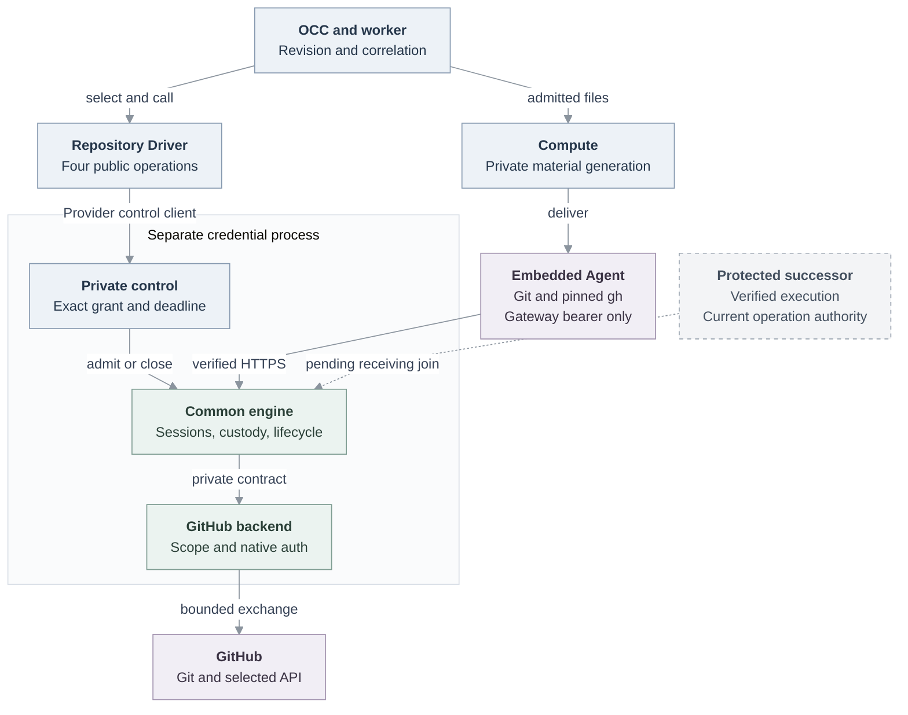

# RFC: Repository credentials for ordinary Agents

**Status:** Selected interface and ownership refinement. Source behavior, historical qualification and final-artifact acceptance are distinguished below.
**Owners:** Repository Driver/service, OCC/State, worker and Compute maintainers.

**Historical scope (2026-09-28):** The consumer boundary, `git-full` PR
requirement and profile table below, and T5 in the
[qualification companion](qualification.md#t5--profiles),
record the September 19 implementation. Later changes expanded consumer support
and profile access. For current runtime scope, see the [reference][reference];
for current permissions and REST and GraphQL boundaries, see
[GitHub access levels](../../../docs/reference/repository-credentials/access-levels.md).
Use the [testing guide](../../../docs/testing/repository-credentials.md) to qualify
current source.

## Decision

An API-created ordinary Agent clones or fetches an approved repository, edits and tests, commits, pushes a branch, and creates a same-repository PR when explicitly assigned `git-full`. A separate credential process authenticates upstream requests. The Agent receives private gateway-bearer/client files and public trust material; GitHub App keys, JWTs, installation tokens and provider renewal secrets stay outside its workload.

Use **`RepoDriver extends Driver`**, capability **`repo`**, and **`GitHubRepoDriver`**, retaining `resolve`, `open`, `status`, `close` and the maintenance interval. The [platform contract][contract] adds no repository CRUD or public token-issuance API. Follow the established [Driver/Provider ownership][design].

Repository access is **team-first**: the current service uses GitHub App installation authority, and GitHub attributes its API actions to the App. A one-to-one conversation with a team Agent still uses that authority; it does not act as the chatting user's GitHub account or inherit that user's repository permissions. OCE authorization to invoke the Agent remains separate. Personal delegated-user access is a later phase, defined below.

## Scope and current boundary

The implemented consumer supports Kubernetes Compute, embedded OpenClaw, `api_key` Harness authentication, no SandboxDriver, and one worker/credential-service owner. Integration is opt-in; Agents without bindings retain their existing lifecycle. Unsupported topologies reject repository-bearing revisions. One configured GitHub App installation supports multiple approved repositories: an Agent selects at most **16 bindings**, each session fixing one repository, resolved grant and original absolute deadline. Registry policy is the Namespace ceiling; configuration changes cannot widen an active revision.

| Profile                               | Exact permission ceiling and behavior                                                                      |
| ------------------------------------- | ---------------------------------------------------------------------------------------------------------- |
| `git-read`                            | `metadata:read`, `contents:read`; clone/fetch/checkout; deny push discovery, push RPC and every API route. |
| `git-write` — omitted-profile default | `metadata:read`, `contents:write`; Git writes under native repository rules; no API.                       |
| `git-full` — explicit                 | Also `pull_requests:write`, `issues:write`; selected REST and GraphQL PR/issue/comment operations.         |

Every issuance explicitly selects one repository and the complete permission map. Missing permissions fail without widening or ambient-credential fallback. Reject obsolete `read-write`. `git-full` provides no branch-only or per-field GraphQL authorization: GitHub may also return permitted public information; every GraphQL POST is treated as a possible write. Administration, extra workflow permissions, SSH, LFS and additional-repository submodules are excluded.

The [reference][reference] owns exact profiles, registry limits, control protocol and client restrictions. The qualified API client is **`gh` 2.100.0**, using canonical `github.com` identity and verified gateway TLS on port 443. Routing is not network confinement. Bearer possession authorizes the session but proves neither workload origin nor the current human requester. Ordinary process/container/filesystem separation remains the trust assumption.

## Ownership and failure behavior

Solid edges describe the [source connections][agent-flow]; they do not certify an installed deployment. The dashed connection is future work. Only the separate credential container receives App/TLS private inputs; its private control channel is unavailable to the Agent.

| Handoff             | Owner and consequential rule                                                                                                                                                                                                                                                                                        |
| ------------------- | ------------------------------------------------------------------------------------------------------------------------------------------------------------------------------------------------------------------------------------------------------------------------------------------------------------------- |
| Resolve and admit   | OCC checks selected Driver/Provider membership and Namespace policy, freezing exact grants and deadline. Private control independently verifies the binding.                                                                                                                                                        |
| Deliver and recover | Worker persists attempt correlation before open and session identity before delivery. Lost responses recover status, never bearer files; `recoverOnly` cannot create authority. Close before explicit replacement. Compute owns private modes, complete generations, readiness, exact-subset repair and retirement. |
| Acquire and forward | Common owners reserve capacity, capture all observed material before acceptance, coalesce waiters and retain original handles/outcomes through settlement. The backend owns native scope/authentication; common code assumes no provider identity or fixed token lifetime.                                          |
| Close               | Deny new use first and cancel owned exchanges. Retain original actions, captures, auxiliary renewal authority and cleanup capacity until their obligations resolve.                                                                                                                                                 |

Demand renewal preserves the same bearer after hour 13 without extending admission. Credential validity must cover the **full remaining exchange budget plus margin**. After asynchronous preparation, the sender rechecks authority/validity synchronously before dispatch and joins I/O before releasing its use. Drain-before rotation must not invalidate an active push; predecessor retirement must preserve its replacement.

Unknown issuance blocks automatic remint. Possible Git/API writes are never automatically replayed; inspect remote state before a separately authorized follow-up. `CLOSED`, `DISPOSED`, confirmed provider revocation and observed runtime stop are different facts. Finite shutdown can exit with unresolved cleanup; unsettled actions retain capacity until exit. Restart loses provider inventory, so issued tokens may survive until expiry. Platform State retains safe correlation and cleanup work, not tokens; replacement remains inside the original deadline. The [service flow][service-flow] and [operator guide][guide] own detailed bounds, settlement and recovery procedures.

The public status contains only `sessionId`, `state`, `deadlineWallMs` and `binding`. Validate full private control responses **before** constructing fresh public snapshots for created-open, recovered-open, status and close. Keep diagnostic counters private. `RepositoryCredentialClientConfiguration` belongs in a dependency-free private contract; preserve all private validators and the closed Git/gh file bundle.

Keep requested, selected and admitted bindings distinct, including Provider, upstream-instance, repository and grant identities. `created/recovered/missing`, `recoverOnly` and `new/retained` material express real recovery obligations. Status cannot regenerate files. Command routing selects an immutable generation from the actual target/effective remotes, rejects ambiguity and conflicting selectors, and never changes a global selected-repository file.

Ownership places the public contract in `packages/contracts/src/repo.ts`, the adapter in `drivers/repo/github/driver.ts`, common machinery in `drivers/repo/credentials/`, and native GitHub policy/backend/client code in `drivers/repo/github/credentials/`. Providers retain configured control clients; composition retains loading and separate-process assembly. Registration, selection, consumers, exact source guards and emitted packaging must agree on these paths. Preserve opaque Driver identities and persisted credential payload fields; no migration follows from the rename.

## Acceptance and delivery

The [qualification companion](qualification.md) retains R1–R12/T1–T9, alternate-backend conformance, actual Git/pinned-gh, controlled hour-13 composition, delivered custody, ordinary-Agent contribution and cleanup. [Testing instructions][testing] own runnable selectors.

The historical source at `eb52cc4` and successor [`46a8fbd`][successor] establish the existing consumer and genuine supplier join. Their controlled evidence includes 17 container cases and one fixture-Harness platform case; it does not qualify the accompanying interface or layout changes. Historical installed Helm/actual-model/live-GitHub acceptance belongs to [`02f8fe0b`][historical]. Final-source assertions require justified equivalence or bounded affected requalification. Combined test containers and rendered mounts do not prove separate runtime custody. CodeQL performed no analysis; code-owner acceptance and release remain separate.

## Alternatives and follow-ups

The ephemeral external process and narrow Driver preserve custody without a new Issuer, broker or parallel lifecycle store. Durable provider recovery, recipes/plugin enrollment, another production provider, PAT import, multiple replicas and arbitrary CLI parity require separate selection. A synthetic adapter establishes conformance only. These scope limits supersede older broad gateway prerequisites for this service; retained authority, recovery and publication obligations remain with the [companion's named successors](qualification.md#recovery-and-acceptance-record).

| Successor owner             | Required connection and closure evidence                                                                                                                                                                                        |
| --------------------------- | ------------------------------------------------------------------------------------------------------------------------------------------------------------------------------------------------------------------------------- |
| RBAC/IAM/State              | Exact assignment/use checks and generation through existing bindings. **All new assignments** explicitly choose `git-read` unless widened, regardless of assurance profile; existing omission remains `git-write`.              |
| Identity/Compute/credential | Prepare disabled, independently observe execution, open a fresh immutable session, deliver/recheck/enable; verify receiving evidence before acquisition/dispatch.                                                               |
| Compute/Harness             | Dedicated/gVisor material, shims, readiness and retirement before topology expansion; retained workspaces require writer exclusion.                                                                                             |
| Egress/authority receiver   | Make routing mandatory, join finite authenticated currentness ordered against withdrawal, and measure new/active closure within 30 seconds including renewal loss and selected tighter bounds. Reuse local expiry/cancellation. |
| OIDC/account                | Separate identity-only login registration and discarded login tokens; sign-in creates no repository grant.                                                                                                                      |
| Invocation/runtime/Audit    | Prove requester B separately from deployer A and reader, projecting safe observed/unknown facts through existing Audit/State.                                                                                                   |

These successor obligations do not become gates for the current credential refinement.

### Later phase: personal delegated-user access

Support explicit personal and team modes through the same **repository GitHub App**. In personal mode, the trusted credential service uses a [GitHub App user access token][github-user-auth]; it does not deliver the user's token or renewal secrets to the Agent. This is a selected direction, not an implemented capability or an expansion of this PR's acceptance scope.

Before enabling personal mode:

- Bind the consenting GitHub user to the verified OCE account and the current requester. Freeze the selected authority mode and identity into the repository admission; neither a private conversation nor the Agent's deployer selects personal authority implicitly.
- Bound repository operations by the user's access, the App's permissions and installation access, and the admitted OCE grant. Audit the requester and selected authority separately from Git commit author metadata.
- Implement consent, token renewal, revocation and disconnect handling in the trusted service. Missing, expired or revoked personal authorization fails closed; never fall back silently to installation/team authority.

Keep OCE sign-in separate: identity-only login neither establishes repository delegation nor supplies repository credentials. Qualification must demonstrate both modes, consent and withdrawal, cross-user isolation, and refusal without fallback before claiming support.

[contract]: ../../../packages/contracts/src/repo.ts
[design]: ../../../docs/design/drivers.md#drivers-and-providers
[reference]: ../../../docs/reference/repository-credentials.md
[agent-flow]: ../../../docs/flows/agent-repository-credentials.md
[service-flow]: ../../../docs/flows/repository-credentials.md
[guide]: ../../../docs/guides/repository-credentials.md
[testing]: ../../../docs/testing/repository-credentials.md
[successor]: https://github.com/openclaw/openclaw-enterprise/commit/46a8fbd645a5c937d6190794576dd2dda31c0d25
[historical]: https://github.com/openclaw/openclaw-enterprise/commit/02f8fe0b1266462a5726c6684344394324a8bdf7
[github-user-auth]: https://docs.github.com/en/apps/creating-github-apps/authenticating-with-a-github-app/authenticating-with-a-github-app-on-behalf-of-a-user
