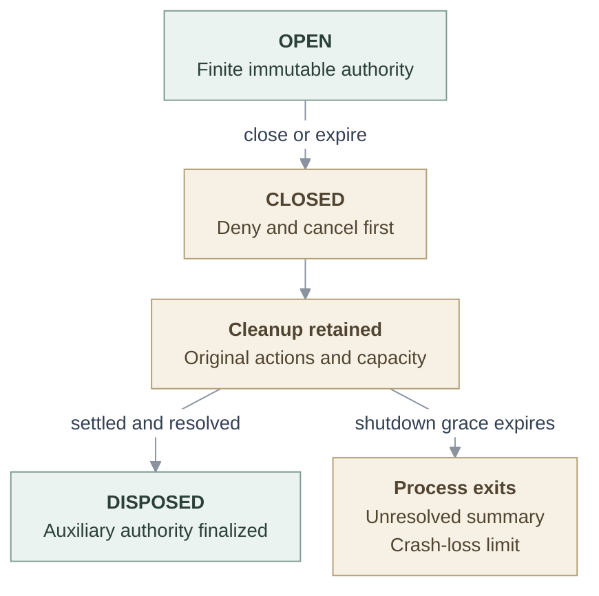

# Repository credentials: qualification

This companion to the [RFC](index.md) defines acceptance and evidence interpretation. The [testing guide][testing] owns setup, selectors and prerequisites; the [operator guide][guide] owns deployment and recovery commands. Requirements below are retained obligations, not an assertion that every final artifact is qualified.

## Scope and exact artifacts

**Historical consumer scope (2026-09-28):** The consumer support described in
this section records the September 19 implementation. For current supported
consumers, see the [repository credentials reference](../../../docs/reference/repository-credentials.md).
Use the [testing guide][testing] to qualify current source.

| Source checkpoint                                                         | Contribution and evidence boundary                                                                                                                                                                                                            |
| ------------------------------------------------------------------------- | --------------------------------------------------------------------------------------------------------------------------------------------------------------------------------------------------------------------------------------------- |
| [`a3aa9da`][core], based on [`724dcb5`][main]                             | Core contracts, GitHub adapter, custody and sessions; incorporated #222 is history.                                                                                                                                                           |
| [`b0a4b65`][transport], based on [`a3aa9da`][core]                        | HTTPS/control transport and actual Git/gh clients.                                                                                                                                                                                            |
| [`f0969fa`][package], based on [`b0a4b65`][transport]                     | Service/client packaging; attributed hosted container result: 16 cases.                                                                                                                                                                       |
| [`eb52cc4`][consumer], based on [`41548ac`][consumer-base]                | Actual OCC/worker/Compute consumer; this frozen version lacks the later supplier refinement.                                                                                                                                                  |
| [`46a8fbd`][join], parents [`eb52cc4`][consumer] and [`f0969fa`][package] | Genuine supplier join, tree `8b7ee8323eefd6517867a2fee443a649c5fc1bf0`; four changed acquisition/retirement/test files. [Hosted run][ci] records 17 container and one platform case against a matching tested tree. The Harness is a fixture. |
| [`02f8fe0b`][live-source]                                                 | Historical installed Helm/actual-model/live-GitHub contribution and cleanup acceptance. It is not automatically transferred to later source.                                                                                                  |

The accompanying refinement uses `RepoDriver` / `repo` / `GitHubRepoDriver`, four-field public status, a private client DTO and the repository Driver hierarchy. The checkpoints above precede that refinement. Final integration must preserve genuine supplier ancestry and qualify the changed interfaces and emitted artifacts; these historical results do not establish that acceptance. Build a final assertion record from exact base/head/tree, tested merge tree, service/client/controller/runtime image digests, client versions, topology, configuration generation, results/skips and cleanup. A filename count or green aggregate proves neither equivalence nor the need to repeat every test.

Current support remains one worker/service owner, Kubernetes embedded OpenClaw, `api_key`, no SandboxDriver, one App installation, up to 16 approved bindings and one exact repository per session. Test actual native exec routing, immutable generations and separate credential-container mounts. Use Node 24 and GitHub CLI **2.100.0** with canonical `GH_HOST=github.com`, valid gateway DNS/SAN/trust and HTTPS port 443. Never replace that path with insecure TLS, localhost identity, ambient tokens or a different client.

## Required behavior and decisive observations

### Requirement coverage

| Requirement | Preserved behavior                                             | Decisive scenarios |
| ----------- | -------------------------------------------------------------- | ------------------ |
| R1          | Provider material outside Agent surfaces                       | T1, T9             |
| R2          | Trusted immutable repository/grant/deadline admission          | T2, T5             |
| R3          | Same-bearer demand renewal beyond twelve hours                 | T3, T9             |
| R4          | Real Git clone/fetch/checkout/push                             | T6, T9             |
| R5          | Explicit exact `git-full` permissions and selected APIs        | T5, T7, T9         |
| R6          | Provider-independent common owners                             | T8                 |
| R7          | Capture, uncertainty and no automatic replay                   | T4, T6, T7         |
| R8          | Immediate local closure; separate upstream cleanup             | T4                 |
| R9          | Bounded use, actions, sockets, bodies, queues and records      | T4, T6             |
| R10         | Bounded material lifetime and explicit shutdown                | T1, T4             |
| R11         | Actual packaged forwarding, bearer/public client material only | T7, T9             |
| R12         | Reuse without importing deferred durable orchestration         | T1, T8             |

### T1 — custody, startup and build

Exercise real protected-file permissions, ownership, ancestors, symlinks, nonregular/oversized inputs, replacement races and descriptor stability. Verify every failed transfer disposes its still-owned candidate bytes, including rejected descriptor close, without changing sanitized errors. Use focused owner-level cleanup evidence; the original concern was source-inferred, not a reproduced disclosure. Preserve successful transfer and best-effort temporary-byte disposal without promising forensic JavaScript erasure. Inspect DTOs/errors/logs/config/images/running containers for provider material; authentication is sender-only. Bound custody and failed-construction cleanup. Start the emitted service without database/worker dependencies. The [configuration flow][configuration] owns loader distinctions.

### T2 — admission and identity

Reject invalid/foreign bearers and upstream use of the gateway bearer. Require at least 32 random bearer bytes, digest lookup, one-time return and atomic private-file delivery without printing material. Preserve independent sessions/provider instances even with colliding native repository IDs. Verify immutable grants, deadline and configuration drift refusal. Through real Unix control, distinguish 201 creation, 200 status-only recovery, authoritative absence and outage/overload. Close known-undelivered admission. Recovery must fence delayed creation, never replay bearer material or create on `recoverOnly`. Persist attempt identity before dispatch and session identity before delivery; policy changes must not obstruct restrictive cleanup. The [Agent flow][agent-flow] owns State ordering.

### T3 — lifecycle and time

Use trusted wall/monotonic clocks, never Agent-accessible clock control. Keep the original session/bearer beyond hour 13; require a fresh JWT and unchanged grant after idle expiry. Test coalescing, independent waiter abort, last-waiter cancellation with retained capture/settlement, new waiters inheriting fixed attempt bounds, full-exchange validity and delayed-dispatch recheck. Repeated replacement must reclaim eligible slots without losing renewal authority. Backward wall time and delayed settlement cannot extend authentication or cleanup deadlines; forward time alone cannot certify remote expiry.

### T4 — failure and ownership

Close during acquire, authentication, queueing and streaming. Capture refused-scope, insufficient-validity and late tokens under their original reservation; unknown issuance blocks remint. Preserve original outcome/handle identity and settlement before releasing slots. Test key-loss token cleanup, one session finalizing without closing the shared signing key, uncertain/non-204/lost-response retirement, drain-before active-push safety, replacement-preserving predecessor retirement and auxiliary finalization after access-slot reclamation. Invoked uncertain cleanup is not automatically replayed; pre-invocation queue rescheduling remains distinct. Exercise fairness, saturation, failed construction and finite grace exit with unresolved callbacks/capacity. [Service flow][flow] owns ordering and boundedness.

### T5 — profiles

**Historical profile scope (2026-09-28):** The Git-only API exclusion in this
section records the September 19 profile contract. Later changes expanded profile
access. For current permissions and API boundaries, use
[GitHub access levels](../../../docs/reference/repository-credentials/access-levels.md)
and the [testing guide](../../../docs/testing/repository-credentials.md) when
qualifying current source.

On every issuance/replacement assert exactly one repository and the complete exact permission map; reject omitted, inherited, surplus, wrong-scope or invalid-expiry responses. Both Git-only profiles deny every API route. `git-read` denies receive-pack discovery and RPC **before mint/dispatch**, while real clone/fetch/checkout work and denied push leaves remote refs unchanged. Reject `read-write`; enforce Namespace ceilings and native repository policy without fallback or widening. [Profile/registry reference][reference] owns the maps and limits.

### T6 — real Git transport

Run real Git over verified TLS against `git-http-backend`; inspect remote refs. Cover cold-helper 401 challenge without upstream dispatch, protocol v2, receive-pack, gzip wire/decoded bounds, reconstructed framing, streaming backpressure and finite socket/header/connect/input/stall/exchange deadlines. Reject duplicate/ambiguous framing, redirects, wrong host/repository, absolute targets, traversal and encoded aliases. Exercise cancellation, joined release and overload before/after authentication. A dropped response after accepted push must produce one dispatch and an independently visible remote commit, with no automatic replay.

Retain [finite defaults and override constraints][limits]:

| Accounted resource                                              | Default bound                                                                    |
| --------------------------------------------------------------- | -------------------------------------------------------------------------------- |
| Sessions including cleanup; credential slots                    | 16; two per session                                                              |
| Provider actions and queue                                      | One active; 64 queued                                                            |
| Sockets and exchanges                                           | 64 sockets per listener; 32 exchanges total/four per session; one per connection |
| Headers, target, control body                                   | 32 KiB/64 pairs; 8 KiB; 16 KiB                                                   |
| Git fetch input; push input/output                              | 1 MiB; 256 MiB, independent wire/decoded input bounds                            |
| API input/response                                              | 1 MiB/8 MiB                                                                      |
| TLS/header/connect/stall; API/fetch input/first response header | Five seconds; 30 seconds                                                         |
| Exchange, provider action, margin, shutdown                     | Five minutes; at most 30 seconds; 60 seconds; 60 seconds                         |
| Access token, session renewal material, PEM                     | 16 KiB; 16 KiB; 64 KiB                                                           |

Headers begin on the HTTPS TLS socket after handshake; upstream response-header timing begins after upload unless headers arrived. Push input uses the exchange bound. Queue/input time counts toward the total. Overrides are positive safe integers with tested policy; unknown keys reject, zero never means unlimited, one provider action and hard token/key/action caps remain. Rejections cannot drain indefinitely or drop unresolved obligations. HTTP/1.1 is supported; CONNECT, HTTP/2, arbitrary forwarding and transparent interception are not.

### T7 — real API client

Run every selected pinned-gh command: REST PR create/read/update, issue create/read/update, paginated issue/comments, individual comment read/update/delete, and explicit-head native `gh pr create` through GraphQL. Qualify success/denial for every admitted method/route pair; use separate branches or reset state between REST and native PR creation.

The [exact routes][routes] include `GET /OWNER/REPO.git/info/refs?service=git-upload-pack` (or `git-receive-pack`), `POST /OWNER/REPO.git/git-upload-pack` (or `git-receive-pack`); `GET /repos/OWNER/REPO`; `/pulls` and `/issues` collections `GET/POST`, numbered items `GET/PATCH`; `/issues/{number}/comments` `GET/POST`, `/issues/comments/{id}` `GET/PATCH/DELETE`; `GET /meta`; and `POST /graphql`. API repository suffixes stay beneath the exact `/repos/OWNER/REPO`. Query/media/framing policy remains fixed. GraphQL may return allowed public information and all POSTs are possible writes, without field/branch filtering.

Trace actual gateway routing and sanitized environments. Check bounded query/pagination parsing, validated and rewritten follow-up URLs, repository-ID links, bodyless 204, recomputed framing and unchanged human/body text. Preserve allowlisted Git/API request and response headers; discard inbound credentials/cookies/hop-by-hop fields and upstream auth challenges. Fixed origins/SNI/verification, no ambient proxy/redirect/retry, canonical auth parsing and reconstructed upstream authorization remain mandatory. Unknown routes and uncertain POST/PATCH/DELETE never cause login/PAT fallback or automatic replay.

### T8 — alternate backend

A deliberately different adapter must use the **same production** sessions, custody, lifecycle, listeners and sender: nonnumeric repository identity, nested path, different provider instance/auth header/permissions, short expiry, bounded private renewal secret and drain-before rotation. Test foreign-handle rejection, late capture, uncertainty, budget validity, idle expiry then renewal, predecessor retirement preserving replacement and finalization after access-slot reclamation. Common modules cannot import GitHub, branch on provider names or assume one-hour tokens. This proves conformance, not a second production provider or universal CLI support.

### T9 — packaged composition and actual consumer

Compose emitted service/client entrypoints with real Git/pinned-gh and controlled provider/Git/API peers. After initial clone, advance trusted time past hour 13, drain lifecycle work, then push and perform PR/issue/comment operations using unchanged session/bearer/files. Independently verify expired A has **no later authentication attempts**, fresh B carries unchanged scope, remote state is correct, and local close/provider cleanup remain distinct. Qualify repeated renewal and the alternate adapter through emitted common owners. No thirteen-hour sleep or real-time soak is required.

Record both input images and the combined qualification image; prohibit source fallback. Combined fixtures prove emitted composition. Rendered Compose/Helm proves declarations. **Separate running service/client containers and inspected workload surfaces** establish delivered custody. Missing selectors are skips/unavailable evidence; selected missing prerequisites fail.

For platform acceptance use the actual API, PostgreSQL queue, worker, control service and Kubernetes delivery. Cover independent concurrent repository routing, read-only second binding, real claim-expiry recovery, retained material across worker replacement, exact missing-Secret repair, service-restart replacement and ordinary stop without harming a sibling Agent. Preserve private 0700/0600 files, immutable scoped Secrets, complete-generation readiness, actual Pod references and UID/resourceVersion-sensitive deletion. Platform hour-13 **fetch** evidence is distinct from container hour-13 push/API evidence.

Installed/live acceptance uses an API-created ordinary Agent whose **actual model/tools** clone/fetch, edit/test, commit, push and create a same-repository native PR. Independently read back the commit/PR; inspect installed custody and normal stop/session/material cleanup. Host Git, pod-exec Git, canned model text, fixture Harnesses and ready Pods cannot substitute. A short authorized live smoke additionally checks real App scope and PR/issue/comment behavior; it never needs real token expiry. Missing authorization/provider/model inputs leaves that evidence unavailable.

### Refined interface and packaging

At the real Unix client/Driver/service boundary, validate exact private fields/types/bounds/envelopes first, then explicitly project fresh four-field snapshots and fresh bindings for **created-open, recovered-open, status and close**. `DISPOSED` rejects nonzero active uses or active/pending/uncertain cleanup and auxiliary obligations; historical revoked/expired counters may remain nonzero. Preserve wrong identity/deadline, 201/200, recovery-only, missing/outage and close-refuses-OPEN checks. Engine disposal still waits for actual settlement/finalization, not merely a DTO predicate. See the [current validation][validation] and [Driver exits][driver].

Move the client DTO through its six private type consumers without changing distinct validators, wire/file schemas or emitted runtime dependencies. Preserve public material and `new/retained` contracts. Move exact source-guard roots, privileged members, sender consumers, missing-root checks, entrypoints, Dockerfiles, closed client subtree and shims together; run positive/negative boundary and build/package checks. Preserve Provider membership, selection, persisted fields and opaque identities. The guard is regression evidence, not malicious-code isolation. Remaining feedback requires source-backed disposition; particular class/scanner shapes remain proposals.

## Recovery and acceptance record

Solid edges describe implemented service transitions, not guaranteed revocation or observed runtime termination. Elapsed grace never resolves an obligation. Restart invalidates local sessions but cannot reconstruct lost provider tokens; `invalidated` is not `disposed`.

The [restart qualification and follow-up plan](restart.md) separates current limitations, missing crash evidence and the work required for stronger recovery. Documenting that plan does not accept the limitations or qualify the implementation.

Record each assertion's historical source/artifact/result, relevant delta, current controlled evidence, justified equivalence or smallest affected rerun, and residual gap. Keep unknown issuance, possible writes, provider cleanup, runtime stop and remote-resource cleanup distinct. Reconcile uncertain creates by bounded unique ownership markers; never replay them to discover identity. Report ambiguous/missing/truncated readback and client temporary-home cleanup separately from command success.

Core maintainers own protected-file transfer and private engine corrections; platform maintainers own coherent interfaces, propagation and material consumers; qualification owners assess final artifacts. Preserve already completed acquisition/retirement extraction and real-custody failure cases, including token-copy wiping before response disposal. Remove unread `safeCleanupRetry` and keep uniform authentication parsing separate from consequential denial policy without changing retry semantics. Broad lifecycle/class and queue redesign is outside this refinement. Retain distinct provider-issuance and streaming senders, original-object authority, borrowing and seal-before-await disposal; no test-only public APIs or generic framework. Update reference, guide, configuration/service/Agent flows and testing by their existing ownership. Disabled CodeQL is no scan; code-owner/protection and release decisions remain separate.

Durable provider recovery remains custody/State successor work. RBAC's new assignments explicitly pass read regardless of assurance profile; identity supplies authentic receiving evidence; Compute/Harness supplies dedicated delivery; egress supplies mandatory routing/currentness and measured withdrawal; OIDC keeps login separate; invocation/Audit supplies genuine requester facts. These do not qualify themselves through a session status or maintenance interval.

Retain further successor obligations with explicit owners: authority/Work owns root Work, fresh per-effect IAM, durable dispatch permits, restart-safe PR submission IDs/deduplication and unknown-effect accounting; custody/State owns encrypted inventory, canonical holds, original-key retirement and compatibility drains across restart. Repository-publication owners retain per-ref receive-pack/receipt semantics, human-approved retained candidates, branch policy and ownership/visibility-change protection. Runtime/Compute owns helper aggregation, independent children, durable continuation, stop/start/result delivery, compatible context restore, host-loss recovery and predecessor writer fencing. Native-token and offline-read modes retain separate qualification and are never fallbacks here. Egress network, repository-composition and protected-currentness checkpoints remain distinct; the earlier network checkpoint's direct model-key profile supplies no protected-custody claim.

[core]: https://github.com/openclaw/openclaw-enterprise/commit/a3aa9dacee8610e78175f18a9770093ab226c3f6
[transport]: https://github.com/openclaw/openclaw-enterprise/commit/b0a4b65660ef14cc31fe920a49b13abd8b15df4f
[package]: https://github.com/openclaw/openclaw-enterprise/commit/f0969faab3dea0fa4191d7360f3bbe14b12bc013
[consumer]: https://github.com/openclaw/openclaw-enterprise/commit/eb52cc4cfe68f08017e7ece6585fe7e937e0747a
[join]: https://github.com/openclaw/openclaw-enterprise/commit/46a8fbd645a5c937d6190794576dd2dda31c0d25
[ci]: https://github.com/openclaw/openclaw-enterprise/actions/runs/35404570914
[live-source]: https://github.com/openclaw/openclaw-enterprise/commit/02f8fe0b1266462a5726c6684344394324a8bdf7
[reference]: ../../../docs/reference/repository-credentials.md#profiles
[testing]: ../../../docs/testing/repository-credentials.md
[guide]: ../../../docs/guides/repository-credentials.md
[flow]: ../../../docs/flows/repository-credentials.md
[configuration]: ../../../docs/flows/repository-credential-configuration.md
[agent-flow]: ../../../docs/flows/agent-repository-credentials.md
[validation]: ../../../apps/controller/src/backends/repository-credentials/control-client.ts
[driver]: ../../../apps/controller/src/drivers/repo/github/driver.ts
[limits]: ../../../docs/reference/repository-credentials.md#client-routing-and-limits
[routes]: ../../../apps/controller/src/drivers/repo/github/credentials/routes/classification.ts
[main]: https://github.com/openclaw/openclaw-enterprise/commit/724dcb5cb80b5e76a62e8267a21185a2e91a85c2
[consumer-base]: https://github.com/openclaw/openclaw-enterprise/commit/41548ac1dbfb67908c7dfcf407085a6c29ba1921
