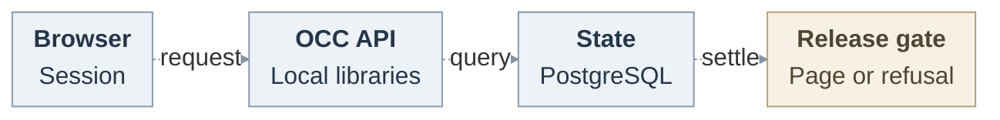

# RFC: Platform audit

## Problem and decision

Humans need administrative facts without broader access. **Proposed:** this view awaits human/IAM/State decision as a narrow exception to [RFC250’s deferred Installation search][history-security]. RFC250 retains its [repository read][repository], exact retained/deleted-Agent `read_audit`, parentage, attribution, recovery, [both retention modes and expiry/purge/restore gates][retention], and unresolved decisions. Platform grants give no History access or new retention policy. Ledger controls apply.

## Events and access

Compatible schema and genuine authentication/IAM/State must precede IAM’s controlled human-Principal grant/revoke of `platform_audit_reader`, containing only `read_platform_audit` on the server-owned singleton Installation. Namespace bindings cannot supply its open entrypoint. Require current human sessions, without anonymous, service-key, Agent, Group, administrator, ordinary-read or History-grant fallback.

**Seven success tuples** are allowed. `bootstrap/success` accepts `openclaw.installation.bootstrap` and operator `administer` on the exact Installation without Namespace. `mutation/success` accepts `openclaw.namespaces.create/.delete` on the matching recorded Namespace and `openclaw.secrets.create/.update/.delete` on exact Secrets at recorded Namespaces. Suffixes enumerate exact actions, never prefix matches. Public actions are `installation.bootstrap`, `namespace.creation_accepted`, `namespace.deletion_requested`, and `secret.created/.updated/.deleted`. Success proves only the producer’s operation.

**Five persisted denials**, `authorization_denial/denied`, retain those five attempted Namespace/Secret operations and recorded targets. Creation denotes Namespace/Secret collections at recorded Installation/Namespace parents. Label coverage. Exclude every other family, including failed mutations, Agent/AgentRevision, worker, IAM binding, account/login, repository/model, operational-log and disclosure events.

## Bounded page contract

Unexecuted illustration: a granted human signs into Console, opening Platform audit (`GET /audit-events`). A Secret-create denial appears as a denied Secret collection at its recorded Namespace, without Secret name/value. A different ungranted human or withdrawn grant receives no page.

Closed `PlatformAuditEventV1`: version, nominal ID/producer time, trusted Installation, optional recorded Namespace, family/action, `success|denied`, exact resource/collection target and recorded actor reference or unresolved. Producer evidence establishes identity kind. Independently validate optional safe request/decision references. Use actual ledger columns, rejecting contradictory envelopes and forged reserved History metadata. Never spread details or infer attribution. Invalid supported rows fail the page. Exclude content, identity labels, issuer/subject, Secret names/values, headers, paths, URLs and error/provider data. UTF-8 byte ceilings: ID 256, optional reference 128, event 8,192, page 1 MiB. Never truncate IDs.

The no-store page contains events, continuation or null, fixed window and projection/coverage version. Integer limits are 1–100, default 50, fetching `limit+1`. Trusted time bounds the default 24-hour window, explicit historical windows at most seven days. Reject future upper bounds and malformed/unknown/duplicate parameters. State verifies its singleton: the ledger has no Installation column. Positive tuple/window/keyset SQL precedes LIMIT, ordered `(occurred_at DESC, id DESC)` with exact PostgreSQL precision. No `list()`, count, offsets, export or arbitrary search. Finite query/lock waits, index and populated scan/concurrency plans must bound scan work.

Confidential authenticated cursors use protected server-owned keys, at most 4,096 encoded bytes and 15-minute expiry. Bind human/session, Installation, selected IAM/currentness, projection, filters/window and last key. Reauthenticate and reauthorize every page. Tampering, reader/authority change, expiry or key loss refuses continuation. Independent authorized refresh may find late/backdated rows. Keysets promise no snapshot/completeness.

## Currentness and disclosure

The existing OpenClaw Control Plane (OCC) API composes Audit/authentication/IAM/State libraries. PostgreSQL retains facts and disclosure. No alternate service, account store, pool, authority or transaction.

Proposed handoffs. [Lifecycle](request-lifecycle.svg) · [editable source](request-lifecycle.mmd).

Bind read intent before locks in one original-State write transaction. Acquire Installation authority, sorted account/method/session guards, then selected policy barrier/head. Recheck genuine account, method version/usability, session and IAM after waits through settlement, including expiry. OIDC owns actual request recognition and account mapping, persisted incarnation/session disposition and every enabled logout/credential/account writer interlock.

Reauthorize after query/validation. Append mandatory safe disclosure on that client, including empty pages: reader, Installation, query/projection reference and count, without rows, raw cursor or arbitrary request data. Use a distinct Audit platform-read action. Release bytes/cursor only after acknowledged COMMIT. Failed/caught append, rollback, lost authority or unknown COMMIT yields no page. Preserve mandatory safe denial. Persisted disclosure proves no delivery/viewing. Retries cannot relabel uncertainty. Process loss discards unreturned pages. Facts survive subject to database durability/ledger controls. Released bytes cannot be recalled.

## Delivery and verification

Main supplies producers and append/COMMIT. A local original-client State policy/History receiver exists. Owner-reported checks do not qualify genuine account integration, Platform serving, shipping convergence or installation.

1. **A1, authorized API.** OBS owns contracts/projection/HTTP and this operation’s typed query exception. IAM supplies permission/catalog/role/binding/Restriction and controlled grants. Migration owns successor checks/index/journal. CI registers real suites. Serialize curated top-level exports. Preserve historical migrations. Prove human-only exact/missing/wrong-Installation grants, expiry/revoke after waits, forged/malformed rows and canary exclusion, cursor tamper/replay/bounds/precision, failed append/unknown COMMIT, populated plans and limited-role fresh/populated/repeat migrations. Projection alone is a non-serving checkpoint.
2. **A2, actual Console.** OBS reuses session API, safe DOM and view-lifetime helpers. Bypass initial `/namespaces`. Prove paging, loading/empty/denied/error states, cancellation and immediate clearing on session or grant loss. Storybook previews/media are separate simulated evidence.
3. **A3, installed acceptance.** Freeze composed source/image/schema/roles/profile. Ordinary operations produce safe browser rows for a granted human and deny a different ungranted human. Prove expiry/revocation between pages, unchanged unrelated access and owned cleanup.

Full History/purge, Google, OpenShell and repository/model qualification are separate. These documents supply no product tests or browser/installed/provider/release proof.

## Open decisions

Owners must close IAM grant entrypoints, OIDC/State producer/receiver/shipping joins, key restart/replica/rotation custody, State index/waits/schema and OBS wire keys. Currentness through COMMIT and disclosure are mandatory.

## References

Pinned source: [HTTP][controller], [Secrets][secrets], [bootstrap][bootstrap], [State][state], [COMMIT][postgres]. Local proposal only.

[history-security]: https://github.com/openclaw/openclaw-enterprise/blob/554efab6ea44af9ffc611de3bc9692f3edba1462/specs/31-basic-observability/security.md#accepted-limits-and-closure
[repository]: https://github.com/openclaw/openclaw-enterprise/blob/554efab6ea44af9ffc611de3bc9692f3edba1462/specs/31-basic-observability/repository-read.md
[retention]: https://github.com/openclaw/openclaw-enterprise/blob/554efab6ea44af9ffc611de3bc9692f3edba1462/specs/31-basic-observability/retention.md
[controller]: https://github.com/openclaw/openclaw-enterprise/blob/72db8f13309831abef85ce75e33d6cd77224c738/apps/controller/src/index.ts#L1749
[secrets]: https://github.com/openclaw/openclaw-enterprise/blob/72db8f13309831abef85ce75e33d6cd77224c738/apps/controller/src/http/secrets.ts#L14
[bootstrap]: https://github.com/openclaw/openclaw-enterprise/blob/72db8f13309831abef85ce75e33d6cd77224c738/scripts/bootstrap-installation.mjs#L350
[state]: https://github.com/openclaw/openclaw-enterprise/blob/72db8f13309831abef85ce75e33d6cd77224c738/packages/occ/src/state/platform-state.ts#L483
[postgres]: https://github.com/openclaw/openclaw-enterprise/blob/72db8f13309831abef85ce75e33d6cd77224c738/packages/occ/src/state/postgres-state.ts#L1071
