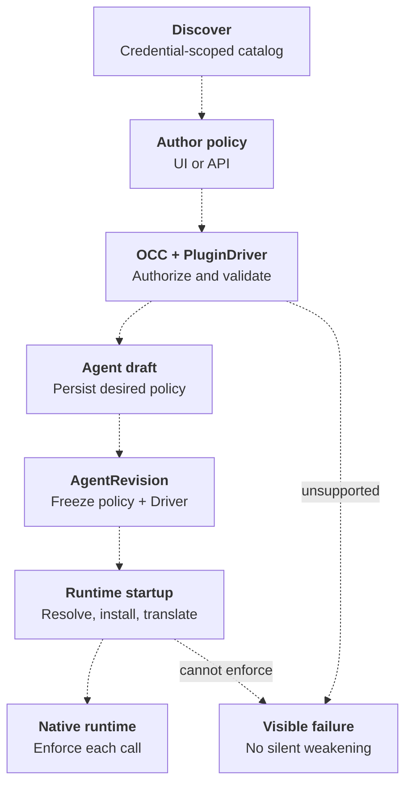

# Plugin policy enforcement

Status: **Proposed for alignment**, 2026-09-24. Draft implementation: [#362](https://github.com/openclaw/openclaw-enterprise/pull/362).
The common policy model below records the agreed direction. Recommendations
explicitly marked for alignment are not settled product decisions. This proposal
does not establish implemented or deployed support.

This feature specification follows the [platform design](../../docs/design.md).
It builds on [Agent plugin drivers](../plans/16-plugin-driver.md), retaining Agent-owned
selections and immutable revision snapshots while proposing new policy vocabulary
and validation before save. When accepted, it replaces the category-policy and
approval-mode proposals in [Native OpenClaw plugin tool policies](0009-native-plugin-tool-policy.md).
Those earlier documents remain historical records. [Console plugin selection](../plans/27-console-agent-plugins.md)
is an earlier proposal for the separate discovery and UI workstream; its API
shape does not define the forthcoming discovery contract.

## Goal and scope

OpenClaw Enterprise (OCE) exposes one understandable plugin policy model across
runtimes. An operator selects plugins, sets tool defaults, and overrides individual
tools. Each PluginDriver advertises and implements the subset its runtime can
enforce. Provider-specific controls remain typed Driver extensions.

This specifies model tool invocation. Installation, authentication, non-tool
plugin surfaces, sandboxing, and platform IAM are separate controls. A tool
approval policy does not sandbox installed plugin code or grant backend access.
Within this contract, disabling a plugin blocks its model-callable tools. Native
plugin disablement can also suppress other surfaces, but this spec makes no
account-wide uninstallation or credential-revocation promise.

## Agreed policy shape

`Agent.plugins` is a map from Driver-issued plugin selection IDs to:

```ts
type Approval = "native" | "prompt" | "approve";
type Reviewer = "human" | "auto";
type ToolPolicy = { enabled?: boolean; approval?: Approval; reviewer?: Reviewer };
type PluginPolicy = {
  enabled: boolean;
  toolDefaults?: ToolPolicy;
  tools?: Record<string, ToolPolicy>;
  driverPolicy?: Record<string, unknown>; // validated against selected Driver schema
};
```

| Field                   | Meaning                                                                                                    |
| ----------------------- | ---------------------------------------------------------------------------------------------------------- |
| `enabled`               | Required plugin master switch. `false` defeats its tool overrides.                                         |
| `toolDefaults.enabled`  | Optional default for tools without an explicit enablement override. Omission delegates to native defaults. |
| `toolDefaults.approval` | Optional default review behavior. Omission means `native`.                                                 |
| `toolDefaults.reviewer` | Optional reviewer default: `human` or `auto`; omission inherits the effective Harness reviewer.            |
| `tools[id].enabled`     | Optional override of tool enablement, independent of approval.                                             |
| `tools[id].approval`    | Optional override of review behavior, independent of enablement.                                           |
| `tools[id].reviewer`    | Optional reviewer override, only when the Driver supports per-tool selection.                              |
| `driverPolicy`          | Flat, typed fields owned by the selected Driver; unknown fields are rejected.                              |

`native` delegates the review trigger to the runtime. `prompt` requires review
for every call. `approve` removes the OCE-requested approval step. Neither
`approve` nor any other policy bypasses independently enforced permissions or
mandatory review. `native` does not imply an AI reviewer.

Omit a field to inherit. Explicit `approval: "native"` overrides an inherited
`prompt` or `approve` with native review behavior. `null` is invalid. An explicit
tool/default object must contain at least one policy field. The common contract
has no `never`, category approval rules, or `override_policy`.

Approval controls **when** review is required; reviewer controls **who** reviews.
Automatic review can deny. Reviewer omission inherits; OCE supplies no universal
`human` or `auto` default. An explicit reviewer does not force review when the
approval mode would skip it, and cannot weaken mandatory native review.

## Resolution rules

Resolve enablement, approval, and reviewer independently before translation:

1. If the plugin is disabled, its tools cannot execute.
2. Otherwise, tool enablement wins over `toolDefaults.enabled`; if both are
   omitted, the Driver uses native enablement, including supported Driver defaults.
3. Tool approval wins over `toolDefaults.approval`; if both are omitted, use
   `native`.
4. A supported tool reviewer overrides `toolDefaults.reviewer`; omission at both
   levels inherits the effective Harness reviewer. Unsupported explicit choices
   fail, even if they equal the default or the tool is disabled.
5. Existing independently enforced denies and mandatory review still apply.
   Approval is evaluated only for enabled calls.

The Driver implements these rules; OCC must not contain Codex/Claude branches.
The precedence is fixed across Drivers. A Driver must reject an unrepresentable
combination, rather than silently applying its runtime's different precedence.

| Plugin   | Tool default      | Tool override         | Outcome before independent native restrictions |
| -------- | ----------------- | --------------------- | ---------------------------------------------- |
| Disabled | Any               | Enabled + approve     | Disabled                                       |
| Enabled  | Disabled + prompt | Enabled + approve     | Enabled, no OCE approval step                  |
| Enabled  | Disabled + prompt | Approval approve only | Disabled                                       |
| Enabled  | Enabled + prompt  | Approval native only  | Enabled, native review behavior                |
| Enabled  | Enabled + approve | Disabled              | Disabled                                       |

For example, with illustrative catalog IDs:

```json
{
  "plugins": {
    "example:calendar": {
      "enabled": true,
      "toolDefaults": { "enabled": false, "approval": "prompt" },
      "tools": {
        "calendar/read_events": { "enabled": true, "approval": "approve" },
        "calendar/create_event": { "enabled": true }
      }
    }
  }
}
```

Only the two named tools are enabled. Reading needs no OCE approval; creating an
event requires review. Changing only the plugin's `enabled` to `false` blocks both.
IDs must come from discovery; these examples are not deployable catalog entries.

## Provider mappings

### Codex

OCE writes app defaults and explicit tool overrides directly. It does not expand
category policies or copy app defaults onto every discovered tool.

| OCE setting                       | Native Codex setting                                                        |
| --------------------------------- | --------------------------------------------------------------------------- |
| Plugin enabled                    | Plugin/bridge selection and mapped app enablement                           |
| Tool enablement default           | `apps.<appId>.default_tools_enabled` when supplied                          |
| Approval default                  | `apps.<appId>.default_tools_approval_mode`                                  |
| Tool override                     | `apps.<appId>.tools.<rawToolName>.enabled` / `approval_mode`                |
| `native`, `prompt`, `approve`     | `auto`, `prompt`, `approve`                                                 |
| `driverPolicy.destructiveEnabled` | `apps.<appId>.destructive_enabled`                                          |
| `toolDefaults.reviewer`           | `apps.<appId>.approvals_reviewer`: `human` → `user`, `auto` → `auto_review` |

Reviewer selects who reviews a call; approval selects when review occurs.
`prompt` with reviewer `auto` requires automatic review, which may deny the call.
Omission retains native reviewer selection. Codex supports reviewer selection
for the app as a whole; its per-tool policy has no reviewer field. Advertise
`toolDefaults.reviewer:["human","auto"]` and `tools.reviewer:[]`; reject explicit
per-tool reviewers without broadening them to the whole app.
Codex routes ordinary automatic review only with session approval `on-request`
or `granular`; startup must verify this requirement. Whether OCE establishes
session constraints remains open; it must not silently substitute human review.

**Enforcement prerequisite:** an app-level `prompt` setting alone is insufficient.
Codex can bypass MCP review when session approval is `never` and the permission
profile is permissive, unless strict review applies. A Driver claiming `prompt`
must establish compatible session settings or reject the request. Preserving app
configuration in the OC bridge does not by itself prove this prerequisite.
[Codex prompt bypass](https://github.com/openai/codex/blob/a83ba61249443a9a0f911d452a8f54e3c7ebb1b8/codex-rs/codex-mcp/src/mcp/mod.rs#L91)
is therefore part of the required runtime check. OC WebSocket defaults can select
`never` and `danger-full-access` when configuration omits overrides. Current OCE
Console and standard-Preset templates supply different settings, so this is not
a confirmed defect in those flows. Validate the effective session combination,
including mode changes. Changing session approval can affect non-plugin tools.

Destructive enablement is an overridable default. Codex treats an unknown
destructive annotation as destructive; OCE must not reclassify it as safe. Explicit tool `enabled:true`
can permit a destructive tool. An explicit `default_tools_enabled` also bypasses
native category filtering. **Recommendation for alignment:** reject simultaneous
`toolDefaults.enabled` and `driverPolicy.destructiveEnabled`, explaining the
conflict, rather than accepting a setting that has no effect. Per-tool enablement
exceptions remain valid. Writes and destructive actions are distinct; write-only
approval and open-world controls are outside this first extension schema.

The OC bridge must preserve native approval/reviewer values on start and resume.
It must not auto-accept a native prompt or turn a category default into an absolute
tool deny. Its runtime version is part of the support check. The draft's bridge
mapping depends on [OC #151260](https://github.com/openclaw/openclaw/pull/151260)
and [#152085](https://github.com/openclaw/openclaw/pull/152085); this is a dependency
requirement, not a statement that the deployed image contains them.

### Native OpenClaw

Start with the curated plugin/tool inventory. Project the plugin master switch
into native plugin enablement. Resolve tool defaults and exceptions before
producing tool allow/deny entries, because a native deny is terminal.

Current Diffs support can implement tool enablement and `native`/`approve`.
Advertise `prompt` only after a trusted runtime review gate exists and is tested.
Diffs has no supported explicit reviewer selection in this slice; advertise
empty reviewer capabilities at both levels and reject explicit choices.

Preserve operator restrictions during installation and configuration composition.
Extend an existing `tools.allow`; otherwise use `tools.alsoAllow`. Never emit
both at the same scope. Installing a package must not erase `plugins.deny` or
silently grant execution. A conflict with required managed configuration must
produce a visible failure.

### Claude

The OCE inheritance contract stays the same. Claude's native rules evaluate
**deny, then ask, then allow**, regardless of specificity. Therefore a blanket
plugin/server ask cannot coexist with a tool allow and implement an exception.
[Claude permission rules](https://code.claude.com/docs/en/permissions#manage-permissions)
document this precedence.

A future Claude Driver must resolve each tool's effective policy and generate
non-overlapping rules, or use an authoritative runtime mechanism with equivalent
semantics. For a default-disabled plugin with one enabled tool, blanket server
deny is invalid. Enumerating the other tools is sufficient only if newly appearing
tools cannot bypass that default. The Driver needs controlled inventory refresh
or a call-time gate; otherwise it must reject that combination. There is no Claude
PluginDriver in this implementation slice, so no capability is advertised yet.

## Identity, discovery, and capabilities

The Driver issues stable selection IDs and opaque tool policy IDs. Display names
are never policy keys. Each tool has `id`, `name`, and native `ownerId`; description
and classifications are optional. `tools:null` means unknown; `tools:[]` means
observed empty for that credential and snapshot, not guaranteed fresh absence.
Missing classifications do not hide tools or prevent explicit policy.

For Codex, identity includes connector/app ID and the raw action name. A proposed
encoding is `encodeURIComponent(appId) + "/" + encodeURIComponent(rawName)`;
the UI treats it as opaque. Preserve remote plugin identity and release-to-app
ownership. Equal action names in different apps must remain distinct. Startup
verifies that explicit tools exist and belong to the selected plugin.

Create Agent needs credential-scoped, paginated catalog/detail reads before an
Agent exists. OCC authorizes the selected Namespace and credential reference;
the Driver performs discovery. Responses include availability with a safe reason,
never credentials or upstream errors. Catalog visibility is not proof that a
credential can invoke a tool. Exact HTTP routes are a separate design handoff;
this spec does not declare an existing endpoint.

The proposed `/installation` capability view identifies the selected Driver and
supported default/tool enablement, approval modes, and reviewer values, plus
`driverPolicySchema`. Each scope has its own `reviewer` array; `[]` means no
explicit reviewer selection. Reviewer availability means that reviewer handles
the selected plugin calls at the advertised scope, not merely that the Harness
has an automatic-review facility.
Schema properties include titles, descriptions, enums, and constraints. The UI
renders supported controls; the server independently validates every request.
Capabilities describe a supported integration/runtime combination, not everything
the upstream product can theoretically express.

## Admission, deployment, and enforcement

This is the target lifecycle; dashed links indicate proposed integration.



1. **Save:** common schema validates shape; selected PluginDriver validates
   supported fields and combinations before create/update/provisioning writes.
   Reject unsupported reviewer values/scopes here when knowable, with a safe error
   identifying the unsupported setting and supported alternatives. This static
   check does not install or authenticate. Discovery can improve
   feedback but cannot guarantee later availability.
2. **Snapshot:** deployment revalidates and freezes the exact desired policy and
   Driver identity in an immutable AgentRevision. Editing the Agent does not
   change an already running revision. PATCH omission preserves `plugins`;
   supplying the map replaces it; `{}` clears selections.
3. **Prepare:** runtime startup resolves release and tool ownership, installs
   required packages, and translates the frozen policy into native configuration.
   OCE owns its managed fields; unrelated operator restrictions remain effective.
4. **Verify:** read back effective configuration before exposing tools. Reject
   unowned/unknown explicit tools, conflicting mappings, unsupported runtime
   versions, and unenforceable policies. Revalidate actual plugin/Harness reviewer
   availability and managed requirements; conflicting or unavailable reviewers
   prevent readiness with a useful error, never silent substitution. An isolated install/auth failure can leave
   the selection disabled with a deployment warning while the Agent deploys; a
   policy/configuration failure must not leave that plugin executing with weaker
   settings.
5. **Execute:** the runtime enforces each call and its native approval flow.
   Start, resume, and reconnect must retain the same policy. An unavailable or
   failed required reviewer cannot silently approve the call.

New tools inherit defaults where the runtime supports them natively. A translator
that enumerates tools must preserve the same behavior when inventory changes.
The frozen policy is desired state, not a promise that remote catalogs never change.

## Remaining alignment decisions

The following recommendations make the contract implementable without hiding
provider differences:

- **Dormant invalid settings:** validate disabled plugins and tools too. Disabling
  execution should not store unsupported policy that fails only on re-enable.
- **Shared native apps:** reject incompatible policies for two selections mapping
  to the same app, including enabled/disabled conflicts. If the runtime cannot
  isolate their grants, report the overlap instead of depending on iteration order.
- **Native inherited settings:** an OCE-owned Codex profile selects app `auto` for
  omitted approval; explicit tool `native` also selects `auto`. OCE owns the
  selected app policy subtree and replaces stale tool/link settings there. Native
  account/link defaults can otherwise outrank app defaults. Detect conflicting
  effective settings rather than promising precedence the runtime does not have.
  Independently managed organizational restrictions remain authoritative.

Together with the destructive-default restriction and session approval settings
above, these need alignment before the draft implementation becomes ready.
The common reviewer model does not resolve the session-constraint decision. No generic
category compiler, permission-order switch, database migration, or legacy policy
shim is proposed.

## Delivery and acceptance

After alignment, implement contracts/capability validation, then translators and
runtime startup, then policy UI integration. Backend policy and Driver translation
belong to the policy workstream. The separate Create Agent workstream owns hosted
catalog discovery, its credential-scoped read routes, and the UI. Discovery may
proceed independently while enforcement remains in draft; it must not depend on
unaccepted policy schemas. The workstreams coordinate shared Driver read contracts.

Primary touchpoints: [contracts](../../packages/contracts/src/index.ts),
[API schemas](../../packages/contracts/src/api/resources.ts),
[OCC lifecycle](../../packages/occ/src/index.ts),
[PluginDrivers](../../apps/controller/src/drivers/plugin/index.ts),
[translator](../../apps/controller/src/drivers/plugin/runtime-translator.ts), and
[runtime startup](../../apps/controller/src/drivers/compute/kubernetes/runtime-entrypoints.ts).
Update the [plugin reference](../../docs/reference/agent-plugins.md),
[Driver reference](../../docs/reference/drivers/plugin.md), and
[source flow](../../docs/flows/agent-plugins.md) when implemented.

Acceptance must cover the resolution table through real admission and persistence;
unknown/foreign tool IDs and shared-app conflicts; installation preserving denies;
start/resume preserving prompt and reviewer; and Claude inventory changes before
advertising that Driver. Demonstrate enabled execution, blocked execution, and
required review with compatible real runtimes. Schema tests, generated config,
and Storybook fixtures do not establish runtime enforcement.

Source evidence: Codex's [policy resolver](https://github.com/openai/codex/blob/a83ba61249443a9a0f911d452a8f54e3c7ebb1b8/codex-rs/connectors/src/app_tool_policy.rs#L169)
establishes native precedence; the inspected [OC WebSocket policy defaults](https://github.com/openclaw/openclaw/blob/41d076f30b32737723a3410af395d43c1b6dd00c/extensions/codex/src/app-server/config-security.ts#L276)
and [effective session settings](https://github.com/openclaw/openclaw/blob/41d076f30b32737723a3410af395d43c1b6dd00c/extensions/codex/src/app-server/config-options.ts#L260)
explain the approval integration requirement. Codex [configuration types](https://github.com/openai/codex/blob/a83ba61249443a9a0f911d452a8f54e3c7ebb1b8/codex-rs/config/src/types.rs)
define supported fields. These were read directly; live deployed enforcement
remains unverified.
