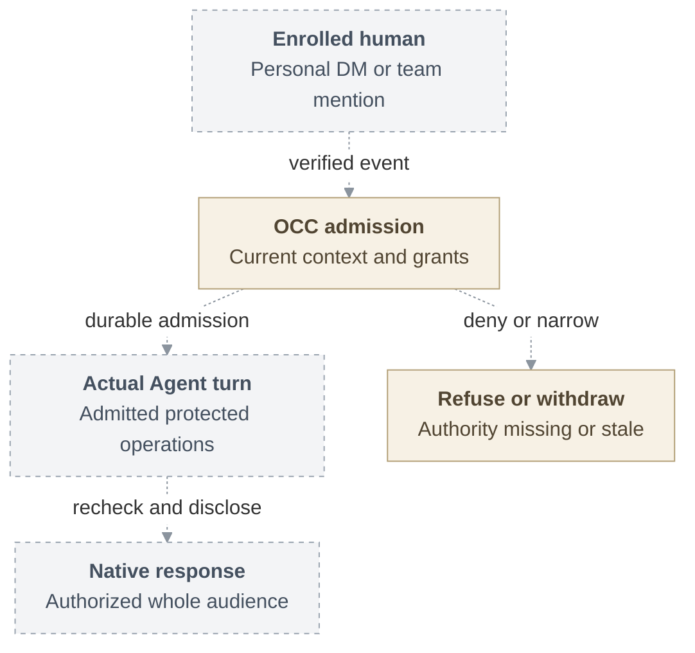

# RFC: Basic RBAC for personal and team Agents

**Date:** 2026-09-18

**Status:** Direction; deferred past 0.x — not an MVP requirement.

The 0.x scope is [Agent access](../36-agent-access.md#delivery-checkpoints) checkpoints 1-2 (share with existing people; enroll without grants); everything in this package is later direction.

**Owner:** OCC authorization and Agent invocation.

**Original source baseline:** `046e12b007bb1b4928bd3f7497a2353714be11a8`.

## Current-source amendment — 2026-09-24

This package preserves the original proposal below and in its linked design pages.
Its references to “selected” scope describe that proposal, not an accepted release
commitment. The [outstanding scope review](https://github.com/openclaw/openclaw-enterprise/pull/245#pullrequestreview-5262687790)
objects to another authorization layer between Agents and channels for 0.x and
calls for using OpenClaw Gateway's existing permission model. The invocation,
audience mediation and protected-turn program here was disputed and is not a 0.x
requirement: this package lands as direction, deferred past 0.x.

[Authorization at the refreshed base](https://github.com/openclaw/openclaw-enterprise/blob/5ebd7305b0876db33276a249934bc82073b63424/docs/reference/authorization.md#manage-namespace-policy)
already supports immutable Namespace Roles with administrator-selected permissions
and exact-resource identity AccessBindings. Creation and deletion use the selected
IAM Driver and commit policy with audit through the existing State transaction.
The API requires Installation `administer`, exact Namespace `read`, and target
`read` for binding creation. Group and broad-target creation are excluded; Roles
and bindings have no update operation. Later requests reload current policy,
while revocation does not stop an Agent or retract delivered bytes.

The twenty fixed roles, Group administration, policy-operation receipts, creation
profiles and active withdrawal below are proposed extensions. They are not the
current Namespace API contract. In particular, “custom roles deferred” describes
the original catalog proposal; it does not remove today's Role creation API.
Any implementation must reconcile these extensions with the
[existing policy flow](https://github.com/openclaw/openclaw-enterprise/blob/5ebd7305b0876db33276a249934bc82073b63424/docs/flows/namespace-iam-policy.md)
and its IAM/State owners before adding writers or changing permissions.

The [native admin UI pilot](https://github.com/openclaw/openclaw-enterprise/blob/5ebd7305b0876db33276a249934bc82073b63424/specs/31-agent-native-admin-ui.md)
is a separate, trusted full-admin entry path. It does not establish the narrow
content or per-operation guarantees proposed here. The remaining diagrams,
milestones and withdrawal bounds are unqualified design requirements, not proof
of current behavior.

## Problem and proposal

People need to create, operate and share Agents without giving every user
administrative access or exposing another person's content. This RFC proposes basic
role-based access control (RBAC) over OpenClaw Enterprise's existing exact-action
identity and access management (IAM): fixed roles, explicit grants to identities or
direct human Groups, and deny Restrictions that override matching grants.
Enrollment alone grants no access.

## Access model

The [twenty fixed roles](interfaces.md#permissions-and-targets)
separate everyday responsibilities. An Agent viewer reads metadata and status;
a collaborator invokes the Agent and reads content; an editor changes configuration
and workspace content; an operator deploys and controls its lifecycle. Repository
and audit permissions are separate. Installation administration implies neither
content nor audit access.

Grants target an exact resource, a matching Agent or Configuration creator
collection in one Namespace, Namespace Agents for audit, or retained exact-Agent
audit. The last two targets permit only audit-reader grants.

An authorized human Installation administrator manages Groups, memberships, grants,
Restrictions and approved creation profiles through the selected IAM Driver.
[Policy administration](interfaces.md#policy-administration) commits
each change with its revision, audit and withdrawal intent in one State transaction,
while preserving a usable local-password administrator and recoverable outcomes.

## Personal and team use

The human remains the requester, distinct from the Agent's ServicePrincipal.
A personal context uses that person's authority. A team context uses its shared
content baseline and admitted service authority, never a member's personal
credentials. The OpenClaw Control Plane (OCC) checks current invocation authority
before dispatch and content permission for the whole audience before replying.

Dashed connections are proposed handoffs. The
[request lifecycle](architecture.md#request-lifecycle) and
[invocation design](invocation-and-content.md) explain execution,
protected credentials and separate dispatch/reply safeguards.

## Delivery and limits

The first usable checkpoint has deployer A and a different requester B use Slack
with a dedicated Codex Agent for a protected model turn and repository HEAD read
under `git-read`. The full selected scope also requires local accounts,
personal and team access, Teams, separately qualified Claude Code, repository
profiles and measured withdrawal.

Enforced admission fails closed without downgrade. Compatibility mode promises
neither verified execution nor bounded withdrawal. The
[security requirements](security.md#withdrawal-and-failure) set
30-second limits for new-work refusal and the last protected bytes, with stricter
scoped limits and separate physical-stop and provider-cleanup outcomes.

[Delivery](delivery.md) defines the increments, unresolved mechanisms
and acceptance evidence. [Human sign-in](https://github.com/openclaw/openclaw-enterprise/pull/246),
[identity](https://github.com/openclaw/openclaw-enterprise/pull/247),
[gVisor](https://github.com/openclaw/openclaw-enterprise/pull/248),
[egress](https://github.com/openclaw/openclaw-enterprise/pull/249) and
[History](https://github.com/openclaw/openclaw-enterprise/pull/250) retain their
separate requirements and acceptance gates. Custom roles, delegated administration,
per-effect authorization, directory synchronization and stronger private
compartments are deferred.
