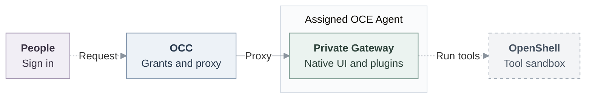

# Agent access (Proposed)

## Decision

An Installation administrator assigns people to separate OpenClaw Enterprise (OCE) Agent deployments. People sign in, discover assigned Agents and open OpenClaw native administration UI. The first release grants **full native administration** on embedded Kubernetes, without a SandboxDriver.

An **OCE Agent** is a managed deployment and Gateway trust domain. Native agent IDs select configurations inside it. OCE grants do not isolate them. Members must trust one another. This is not hostile-user isolation.

## Architecture and reuse

| Owner                              | Responsibility and reuse                                                                                                                                                                                                            |
| ---------------------------------- | ----------------------------------------------------------------------------------------------------------------------------------------------------------------------------------------------------------------------------------- |
| OCE / OpenClaw Control Plane (OCC) | [Central accounts](../../docs/reference/authentication.md), [exact grants](../../docs/reference/authorization.md) and browser proxy in the existing OCC process. Reuse internal IAM Driver, PostgreSQL State/audit and Compute lifecycle. |
| Native OpenClaw                    | Within-Gateway roles, sessions, channels, tools and administration UI.                                                                                                                                                              |
| Optional OpenShell                 | Supported execution/network enforcement through existing boundaries. Independent [runtime proposal #321](https://github.com/openclaw/openclaw-enterprise/pull/321).                                                                 |

Upstream already documents [durable people, named `gateway.roles` and session scopes](https://docs.openclaw.ai/gateway/operator-scopes), [channel controls](https://docs.openclaw.ai/gateway/security/access-control), and [the OpenShell sandbox plugin](https://docs.openclaw.ai/gateway/openshell). The selected [runtime recipe](https://github.com/openclaw/openclaw-enterprise/blob/88a12fdfb410e64df98ef87476db62fcdc5d7622/deploy/runtime/README.md) pins OpenClaw `2765f7a3` (source label `2026.9.5`). Qualify the custom image and upstream capabilities before reuse.

Existing paths are solid. Proposed joins are dashed. OpenShell confines supported execution, not the Gateway or its host plugins.

Compute supplies the private Gateway endpoint through Envoy. Add no second IAM engine, policy store, service, table, lease or account authority. Human Principals remain distinct from Agent ServicePrincipals. OCE retains human/repository authority and credential custody.

## Access contract

| Choice                | Meaning                                                                                                                                                       |
| --------------------- | ------------------------------------------------------------------------------------------------------------------------------------------------------------- |
| Personal              | One named human grantee on a service-owned Agent.                                                                                                             |
| Shared                | Several explicit grantees share conversations, settings, tools and accessible credentials.                                                                    |
| Recipient permissions | Exact Namespace `read` for discovery and exact Agent `read`/`administer`. No implied Installation, Configuration, Deployment, Secret or sibling-Agent grants. |
| Administration        | Only Installation administrators enroll, provision, grant and revoke. Recipients cannot delegate access.                                                      |

The proxy uses shared native identity `occ-workspace-files` with `operator.admin`. OCE attributes humans at admission, without per-command or per-chat human identity. Personal provider inheritance, consent and chat-only privacy are outside this release.

**Setup:** follow the disabled-by-default [native pilot](../plans/31-agent-native-admin-ui.md#contract) and [deployment guide](../../docs/guides/deploy/native-admin.md): compatible Control UI, private routing, wildcard Agent DNS/TLS, explicit shared-cookie domain, exact Origin, trusted-proxy identity and administrator device auto-approval. Enablement grants nothing. OCC strips browser credentials upstream and keeps transport keys server-side.

In the proposed, unmerged Console composition, the administrator opens **Share Agent**, enters an existing human `principalId` and acknowledges full administration. Alice receives discovery then personal/shared Agent grants. Bob receives discovery then shared access. Both sign in and choose **Open native admin UI**. Sibling access is denied. Launch is independent of Configuration/revision reads. Native edits may diverge from managed Configuration/AgentRevision. Redeployment restores managed configuration without erasing persistent storage.

## Delivery checkpoints

Existing-person sharing can precede enrollment and granular native roles. Neither initial checkpoint requires OpenShell.

1. **Share with existing people.** Unmerged source extends existing Namespace IAM Role/AccessBinding routes and writers for human Principals and exact Namespace targets, with Console sharing, policy reload and audit.
2. **Enroll without grants.** Extend `POST /api/auth/accounts`, its helper and validator for explicit zero-grant enrollment, returning the human `principalId`. It currently requires `email`, `password`, `roleId` and optional `name`. The account/State owners must select the new wire shape and authorized result lookup without administrator defaults. Commit account, Principal and audit atomically in the **original State transaction**. Unmerged State enrollment ports lack account/session currentness, last-admin and receipt composition, and public-route connection.
3. **Translate granular native permissions.** Qualify supported native roles/session controls and human identity handoff, then translate OCE restrictions instead of rebuilding native policy. The [broader RBAC direction](https://github.com/openclaw/openclaw-enterprise/pull/245) retains restricted conversation/invocation/content access, personal/team channel authority, named teams, Slack/Teams identity mapping and user-grant/integration use. Self-withdrawal, delegation, self-service creation and SCIM remain later increments.

## Settlement and withdrawal

OCC resolves canonical targets. Selected IAM and original State must retain current administrator/account authority and target validity **through COMMIT** for ordinary grant/remove and enrollment, including deletion races. Ordinary Role and AccessBinding create/delete re-authorize the actor inside the write transaction, under the Namespace lock and a hold on the actor's account that a disable must wait for. The acting session's currentness is not rechecked there, and enrollment still authorizes at admission only. Closing these gaps remains a release obligation, without a waiver. Preserve bootstrap and the last usable local administrator. Zero-grant accounts and unshared Agents are safe.

Each policy mutation/audit is atomic, but separate sharing transactions can leave safe partial grants. Committed policy/audit survives lost COMMIT replies. Refresh establishes current effective access, not historical settlement. The account/State owners must provide a stable operation/account receipt and authorized committed/rejected/unknown result lookup. Never blindly delete accounts or replay uncertain mutations.

Effective revoke denies new admission. Removing one direct binding retains discovery and may leave other authority. Renew browser authorization before its lease exceeds **30 seconds**. Denial, timeout or renewal loss closes the connection, without canceling accepted jobs or retracting disclosures. Separately, future Git/model protection must fully close traffic within **30 seconds** of renewal loss, with selected stricter **five-second** profiles. Browser closure proves no traffic closure. Process termination remains later hardening.

Retain existing tools and authorized administrator/service-key paths. Unsupported enforced profiles fail explicitly without dependency-driven downgrade. Local sign-in has no AgentInvocation, egress, SPIFFE or OpenShell dependency.

## Verification

Use real local sign-in, ordinary account/policy routes and PostgreSQL's limited application role.

1. **Sharing:** prove exact grants/denials, audit/rollback and ordinary grant/remove authority current through COMMIT, including stale-authority/deletion races. Final-source installed embedded Kubernetes, with two controllers where relevant, must prove personal/shared discovery, limited-permission launch, a model turn and shared-human Git/gh. Measure API effective revoke closing Alice's browser within 30 seconds while Bob continues.
2. **Enrollment:** prove zero grants, account/Principal/audit commit/rollback, bootstrap/last-admin protection, current authority through COMMIT and authorized stale/deleted/unknown-settlement recovery.
3. **Native restrictions:** qualify selected-runtime roles, sessions, human identity and retained controls. Verify future Git/model closure separately.

Owners report source/browser/PostgreSQL checks and historical installed evidence. These do not establish final-source installed, live-provider or release readiness. Grant rejection after discovery and a lost committed DELETE response remain untested, nonblocking browser followups.
