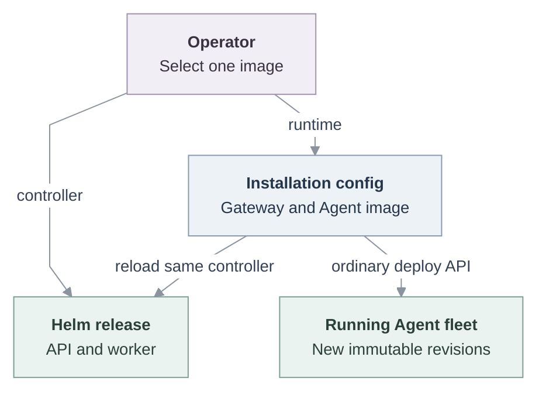

# Independent production image upgrades

Status: Proposed. This specification selects the first production upgrade
workflow for review; it does not describe behavior available on `main`.

## Reviewer summary

OCC and Agent runtimes have different release cadences. This proposal keeps
their existing owners and gives operators one command with two independent
paths:

**Decisions:** `--controller-image` changes only the Helm-owned OCC image and
never requests Agent deployments. `--runtime-image` keeps the controller image,
updates runtime configuration, and redeploys the running fleet through the
existing IAM-audited Agent API. Operators may supply both options when a release
is intentionally coordinated. The workflow never patches tenant workloads or
writes platform tables directly.

**Tradeoffs:** Runtime configuration is loaded at OCC startup, so a runtime
release restarts the API and worker on the same controller version before Agent
fan-out. V1 replaces all running Agents concurrently and has no canary,
automatic rollback, or distributed upgrade lock. In return, controller releases
do not interrupt existing gateways, and each path has one clear configuration
owner and recovery boundary.

**Upgrade checks:** Helm runs the candidate controller's database migration Job
before rolling the OCC API and worker. Agent runtimes use immutable image
replacement rather than `openclaw update`, so they do not inherit that command's
Doctor step. Gateway startup performs its startup-safe migrations before
readiness; after readiness, the upgrade command runs read-only Doctor lint in
each replacement gateway. It never runs `doctor --fix` automatically.

## Outcome

Add one operator command that can upgrade the OpenClaw Control Plane (OCC), all
running Agent runtimes, or both from immutable images.

The command:

1. verifies the target Installation and selected configuration owner;
2. updates the OCC API and worker through Helm when a controller image is
   selected; and
3. when a runtime image is selected, records the running fleet, deploys one new
   revision per Agent, and waits for the revisions and Pods to become ready.

V1 updates the fleet concurrently during an approved interruption window. It
does not provide a canary or rolling deployment.

Helm remains responsible for OCC workloads. The Installation startup Secret
remains responsible for Kubernetes Compute configuration. Agent workloads are
replaced only through the existing Agent deployment API, with its normal IAM and
audit behavior. The command does not patch tenant Deployments, write directly to
platform tables, or add an Amazon EKS-specific path.

## Operator contract

The repository provides `scripts/upgrade-production-images`. The operator runs
it from the checkout containing the installed chart and supplies:

- the kubeconfig, context, namespace, and Helm release;
- protected `values.yaml`, `installation.yaml`, and OCC service-key files;
- the trusted OCC URL and optional CA bundle;
- at least one digest-pinned controller or runtime image from a reviewed commit;
- the selected image's full source SHA; and
- a new private evidence directory.

The runtime image is used for both the gateway and Agent containers. Separate
gateway and Agent runtime images are out of scope for V1.

After production bootstrap, the operator annotates the live Installation Secret
with the Installation ID as `openclaw.dev/installation-id`. Every later upgrade
requires that ID to match the authenticated OCC Installation. This prevents a
valid OCC credential and a valid kubeconfig from targeting different
Installations.

Registry digests do not prove source provenance. Release approval establishes
that relationship from build records; the command stores the supplied source
SHA as evidence.

### First upgrade from an older release

Older controllers do not expose the complete deployment inventory required for
safe runtime fleet selection. The operator first runs the normal controller-only
path, leaving the Installation Secret and Agent runtime images unchanged.

The operator then verifies:

- the API and worker use the candidate controller digest;
- OCC authentication succeeds; and
- `occ installation deployment-inventory` returns a complete inventory.

The operator may then run the runtime-only path. Each operation keeps separate
evidence. A missing inventory operation never becomes an empty fleet or an
automatic fallback.

## Admission and fleet selection

Every release must reject:

- mutable image references or an abbreviated source SHA;
- missing, symbolic-link, unreadable, or non-private protected files;
- an unreachable cluster, Helm release, or OCC endpoint;
- an OCC Installation ID that differs from the live Secret marker;
- protected Helm or Installation inputs that differ from live state outside the
  selected image fields.

A runtime release must also reject:

- incomplete or unauthorized inventory;
- queued or running Agent deployment work;
- a running Agent without an active revision; and
- a running Agent in a Namespace that is not ready.

Controller-only releases require Installation `read` and do not request fleet
inventory or Agent deployment authority. Runtime releases additionally require
Installation `administer`, exact `read` access to every Namespace, Agent, and
selected active revision, plus exact `deploy` access to every eligible running
Agent. Any denial fails the complete request instead of omitting resources. The
operator's revision read grant must also cover new revisions so status polling
can continue. Later deployment requests repeat their normal exact-resource
authorization.

For a runtime release, the command records Agents that are active, request the
`running` state, have an active revision, and belong to a ready Namespace.
Stopped and deleting Agents are not redeployed. An empty target set is valid:
the command may update the saved runtime selection, but it cannot claim that the
runtime image starts.

The command saves the live and protected configuration, fleet inventory, and
workload state before mutation. It also renders the candidate chart and performs
a server-side Helm dry run.

## Upgrade sequence

1. Change only the selected image fields in protected configuration.
2. For a runtime release, hash the candidate Installation document and put that
   checksum on the API and worker Pod templates. This reloads configuration while
   retaining the selected controller image.
3. Replace the Installation Secret only for a runtime release, preserving its
   Installation ID marker.
4. Run `helm upgrade --install --wait`. The pre-upgrade initialization Job runs
   the selected controller image's database migrator with the migration role,
   then bootstrap. Helm does not roll the API and worker unless those hooks
   succeed.
5. Verify both OCC Deployments use the selected controller digest and wait for
   authenticated OCC access to recover. A controller-only release ends here.
6. For a runtime release, submit one ordinary deployment request for every
   recorded running Agent before waiting for individual results.
7. Wait for every durable deployment to succeed. Confirm that each Agent selects
   the returned revision and that its revision Pods are `Running`, `Ready`, and
   use the candidate runtime digest. Embedded Agents require one gateway
   workload; dedicated Agents require both gateway and Agent workloads.
8. Run `openclaw doctor --lint --json --severity-min error` in each replacement
   gateway. This is a read-only post-start check against the mounted Agent state.
   A Doctor error fails the release; repair remains an explicit recovery action.

The command succeeds only after the complete recorded fleet converges and each
replacement gateway passes Doctor lint. It does not claim that a model, channel,
provider, or external integration works; the operator verifies those behaviors
afterward.

## Failure and recovery

Controller recovery is bounded by Helm, migrations, and database compatibility.
A runtime upgrade is not transactional: OCC may be healthy while one or more
Agent deployments fail. The command preserves every known result and does
not replay an Agent request whose outcome is unknown, because a second accepted
request creates another immutable revision.

Prefer a forward fix. Before an image rollback, verify that the previous release
can read state written by the candidate. Restore the previous image selections,
recompute the Installation checksum, replace the Secret, roll out both OCC
Deployments, and deploy the affected running Agents again. Helm rollback alone
does not replace Agent workloads or reverse database migrations and runtime data
changes.

The operator must back up PostgreSQL and Agent volumes when recovery requires
data restoration. PVC names and file hashes show continuity; they are not
backups.

## V1 limits

- All recorded Agent deployments start concurrently. The operator must provide
  capacity for old and candidate revisions to overlap.
- Deployments snapshot current Agent and Configuration drafts, not the previous
  active revision. Operators must review pending drafts before upgrading.
- There is no canary, batch size, automatic compatibility check, automatic
  rollback, or upgrade lock.
- Operators must prevent concurrent Helm changes for every release. Runtime
  releases also require a pause on Agent deployments and draft edits.
- The workflow supports the production Helm and Kubernetes Compute path. It does
  not provision infrastructure, build images, publish images, or take backups.

## Implementation

1. Add a fail-closed Installation deployment inventory owned by platform State
   and authorized through the selected IAM Driver.
2. Add independent controller and runtime modes to the operator script without
   introducing a new upgrade mutation API or Kubernetes special case in platform
   core.
3. Add the operator guide, CLI reference, and source-backed runtime flow.
4. Put the Installation checksum on both OCC Pod templates.
5. Extend the production Kubernetes integration to exercise a controller-only
   release, a runtime-only release, two running Agents, one stopped Agent, and a
   fresh model response.

## Verification

Dependency-independent tests cover argument validation, protected inputs,
controller/runtime ownership, candidate rendering, an empty fleet, and readiness
polling. They complement but do not replace the real deployment proof.

The required integration uses a disposable k3d cluster, PostgreSQL, baseline and
candidate controller/runtime images, and an authorized model credential. It
installs the baseline through Helm, proves a model response, upgrades the
controller without changing Agent revisions, upgrades the runtime without
changing the controller digest, and proves another response from a replacement
revision. It also confirms that the stopped Agent is unchanged.

Pre-mutation cases must cover incomplete authorization, nonterminal deployment
work, a mismatched Installation marker, and stale protected configuration. A
durable deployment result must not complete the command until its Pods are ready.

Owning current documentation after implementation:
[production installation](../../docs/guides/deploy/production-installation.md),
[production Agents](../../docs/guides/deploy/production-agents.md),
[Agent deployment](../../docs/reference/agents/deployment.md), and
[production startup](../../docs/flows/production-startup.md).
