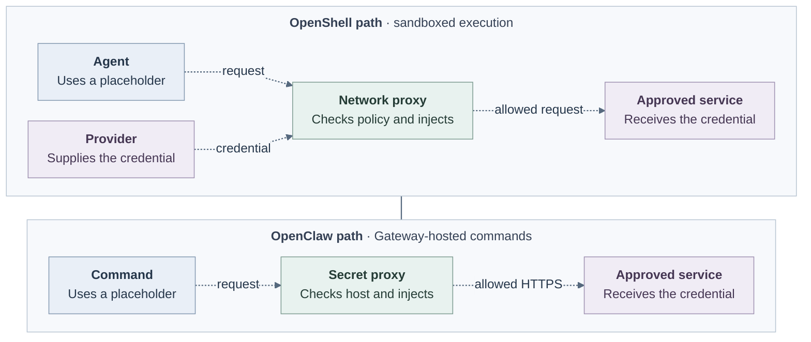

# Agent egress for 0.x

## Problem and decision

Agents need model and tool access without exposing credentials or unrestricted
networking to untrusted commands. For 0.x, **use OpenShell's network and
credential proxy for sandboxed workloads** and defer the custom Enterprise
egress proxy. Verify these protections before release.

OpenShell gives the Agent a placeholder; its network proxy substitutes the real
credential for an allowed HTTP request to a bound destination. The trusted proxy
may hold the credential. OCE's Credential Gateway Driver for OpenShell shipped in #461
([reference](../../../docs/reference/drivers/credential-gateway.md); design proposed
in #452); it is optional,
not selected by production installations, and OpenShell v0.1.0 is not a
supported production runtime. Compute refuses repository credentials when a
SandboxDriver is selected (`validateRepositoryCredentialSupport`), so no combined
GitHub+OpenShell revision exists on main. [OpenShell credential injection](https://github.com/NVIDIA/OpenShell/blob/d1155aa70042d3e2ee49dbfa15346b108b7c1d92/docs/sandboxes/manage-providers.mdx#how-credential-injection-works)
describes the upstream behavior.

Dashed arrows show intended integration, not installed behavior.
[Editable Mermaid source](current-boundaries.mmd).

## Scope and boundaries

- **OpenShell:** Apply network policy and credential injection inside the
  sandbox. Credential binding does not grant network access. Opaque TLS cannot
  support injection and needs a separately qualified path. On main this fence
  is not yet enforced: Compute's additive NetworkPolicies still grant OpenShell
  workload Pods DNS and public TCP/443, and Kubernetes unions them with
  OpenShell's deny-all egress policy. Harness Pods outside OpenShell keep
  public IPv4 TCP/443 except private and link-local ranges until the
  `TODO(model-egress-proxy)` in Compute is resolved.
- **OpenClaw Gateway:** For commands hosted on the Gateway, use OpenClaw's
  [secret proxy](https://docs.openclaw.ai/gateway/secrets/secret-store-and-egress#secret-egress-proxy).
  Direct sockets can bypass its traffic allowlist. Sandboxed and remote tools do
  not automatically inherit this path.
- **Codex:** For commands outside OpenShell, use Codex's
  [sandbox and network controls](https://learn.chatgpt.com/docs/agent-approvals-security#network-access).
  Codex model and authentication traffic is outside its command-network policy.

OCE retains Agent, credential and operation authority. Network permission
neither authorizes operations nor prevents disclosure to allowed destinations.

## Implementation

**TODO:** Integrate OpenShell credential mediation with the Enterprise Agent
lifecycle and OpenClaw tool sandbox. The
[Enterprise adapter](https://github.com/openclaw/openclaw-enterprise/blob/3b58323f762f5742e8b44be3e269af0696ed7cde/docs/reference/drivers/openshell-sandbox.md)
supports dedicated Codex only and rejects embedded OpenClaw. Production Agents
cannot deploy because stock OpenShell lacks required Secret references and
projected workload identity. It disables the inner Codex sandbox, so qualify the outer
policy and complete Kubernetes network-policy union. Privileged OpenShell
components require the documented fail-closed admission restrictions.

A deploy `202` admits an immutable revision, not readiness; check
[status](https://github.com/openclaw/openclaw-enterprise/blob/e387b38cc259ee4a55936ecb848bbce8210bcd68/docs/reference/agents/deployment.md#revisions-and-deployment)
and the workload. Stop records intent; verify routing and execution termination.
Failed replacement can require [repair or redeployment](https://github.com/openclaw/openclaw-enterprise/blob/e387b38cc259ee4a55936ecb848bbce8210bcd68/docs/reference/harness-execution.md#harness-authentication).

## Verification

For each path, prove useful allowed requests and real-child denials, including
direct sockets where confinement is claimed. Verify credential placement and
stop or replacement separately. Pin runtime, configuration and network policy.
Documentation is not installed-runtime or release evidence.

## Open questions

- Which provider, endpoint bindings and credential sources will OCE configure?
- How will OpenClaw tools join OpenShell, and which images are supported?
- Which 0.x requirements block release? Record owners and evidence before
  proposing a new proxy service.

## Historical status

The custom proxy was **accepted for implementation** against
[`046e12b`](https://github.com/openclaw/openclaw-enterprise/commit/046e12b007bb1b4928bd3f7497a2353714be11a8),
then deferred for 0.x. Its [architecture](../../.archive/31-basic-egress-proxy/architecture.md),
[interfaces](../../.archive/31-basic-egress-proxy/interfaces.md),
[protocol](../../.archive/31-basic-egress-proxy/protocol-and-routing.md),
[security](../../.archive/31-basic-egress-proxy/security.md), and
[delivery](../../.archive/31-basic-egress-proxy/delivery.md) retain C0–C3 contracts for reference, not release approval.
